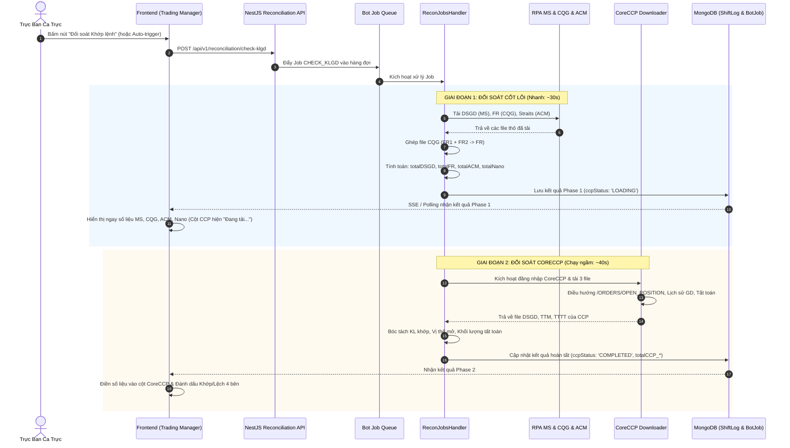

# BẢN THIẾT KẾ CHI TIẾT VÀ ĐẶC TẢ KỸ THUẬT: TÍCH HỢP CỘT CORECCP VÀO BẢNG ĐỐI SOÁT TRADING MANAGER

**Dự án**: MXV Shift Checklist & Trading Manager  
**Mục tiêu**: Bổ sung cột đối soát **CoreCCP** trong Bảng 1 (Giám sát & Đối chiếu Khớp lệnh trong phiên) tại trang `TradingManagerPage`.  
**Phạm vi tài liệu**: Chỉ đặc tả thiết kế kiến trúc, mô hình dữ liệu, thuật toán bóc tách file Excel và kế hoạch kiểm thử (Tuyệt đối không can thiệp sửa mã nguồn code cho đến khi có phê duyệt).  

---

## 1. TỔNG QUAN VÀ BỐI CẢNH NGHIỆP VỤ

### 1.1. Hiện trạng Bảng 1 (Trading Manager)
Hiện tại Bảng 1 trên giao diện `TradingManagerPage` (`frontend/src/app/trading-manager/page.tsx`) phục vụ trực ban giám sát đối chiếu số liệu theo 3 dòng chính:
- **Dòng 1 - KLGD (Khối lượng giao dịch)**: So khớp giữa `M-System (DSGD)` vs `CQG (FR)` vs `ACM (Straits / Nano)`.
- **Dòng 2 - TTM (Trạng thái mở - Open Positions)**: So khớp giữa `M-System (TTM)` vs `CQG (OP)`.
- **Dòng 3 - TTTT (Trạng thái tất toán - Settled/Closed Positions)**: So khớp giữa `M-System (TTTT)` vs `CQG (PS)`.

Các cột hiện có:
1. **Chỉ số / Nghiệp vụ**
2. **M-System** (Hệ thống nội bộ MXV)
3. **CQG** (Sở giao dịch quốc tế)
4. **ACM (Straits)** (Đối tác thanh toán bù trừ quốc tế Straits)
5. **Nano** (Tài khoản Nano bù trừ)
6. **Chênh lệch / Trạng thái**

### 1.2. Mục tiêu Nâng cấp
Bổ sung thêm cột **CoreCCP** ngay sau cột **Nano** để hoàn thiện chu trình kiểm soát 4 bên độc lập:
$$\text{M-System} \longleftrightarrow \text{CQG} \longleftrightarrow \text{ACM/Nano} \longleftrightarrow \text{CoreCCP (VNCLEAR)}$$

- **KLGD CCP**: Tổng khối lượng khớp từ báo cáo *Lịch sử giao dịch* của CoreCCP.
- **TTM CCP**: Tổng vị thế mở từ báo cáo *Trạng thái mở* (`/ORDERS/OPEN_POSITION`) của CoreCCP.
- **TTTT CCP**: Tổng khối lượng tất toán từ báo cáo *Trạng thái tất toán* của CoreCCP.

---

## 2. KẾT QUẢ ĐÁNH GIÁ DỮ LIỆU THỰC TẾ TỪ 3 FILE EXCEL CORECCP

*(Dữ liệu phân tích trực tiếp từ thư mục `backend/src/modules/lot-statistics/Example file ccp/`, bảo đảm không phỏng đoán, đối chiếu chính xác từng ô dữ liệu)*

### 2.1. File `DSGD_14.6.xlsx` (Thống kê Khối lượng khớp lệnh - KLGD)
- **Cấu trúc Sheet**: Sheet duy nhất có tên `Export`.
- **Dòng tiêu đề (Header Row)**: Dòng 0 (index 0), bao gồm 13 cột:
  - Cột 0: `Mã hợp đồng`
  - Cột 1: `Tên khách hàng`
  - Cột 2: `Số tài khoản`
  - Cột 3: `Tài khoản bù trừ`
  - Cột 4: `Số hiệu lệnh`
  - Cột 5: `Mã thành viên`
  - Cột 6: `Thời gian đặt`
  - Cột 7: `Thời gian khớp`
  - Cột 8: `Loại lệnh` (BUY/SELL)
  - Cột 9: `Trạng thái lệnh`
  - Cột 10: `Giá khớp`
  - **Cột 11 (Index 10)**: `KL khớp` $\rightarrow$ **CỘT DỮ LIỆU MỤC TIÊU**
  - Cột 12: `Kênh đặt`
- **Quy tắc trích xuất**:
  $$\text{Total\_KLGD}_{\text{CCP}} = \sum_{i=1}^{N} \text{Row}[i][\text{'KL khớp'}]$$
- **Kết quả kiểm toán trên file mẫu `DSGD_14.6.xlsx`**:
  - Dòng 1: Hợp đồng `KCEZ24`, KL khớp = `1`
  - Dòng 2: Hợp đồng `ZWAU24`, KL khớp = `1`
  - $\implies$ **Tổng KL khớp = 2 lot**.

### 2.2. File `TTM_14.06.xlsx` (Thống kê Trạng thái mở - TTM)
- **Menu/URL**: *Lệnh và vị thế* $\rightarrow$ *Trạng thái mở* (`https://uat-coreccp.mxv.com.vn/ORDERS/OPEN_POSITION`).
- **Cấu trúc Sheet**: Sheet `Export`.
- **Dòng tiêu đề (Header Row)**: Dòng 0, bao gồm 13 cột:
  - Cột 0: `Mã hợp đồng`
  - Cột 1: `Tên khách hàng`
  - Cột 2: `Số tài khoản`
  - Cột 3: `Tài khoản bù trừ`
  - Cột 4: `Mã thành viên`
  - Cột 5: `Giá thực hiện trung bình mua`
  - Cột 6: `Giá thực hiện trung bình bán`
  - Cột 7: `Giá tất toán`
  - Cột 8: `Giá thị trường`
  - **Cột 9 (Index 8)**: `Khối lượng mua` $\rightarrow$ **MỤC TIÊU 1**
  - **Cột 10 (Index 9)**: `Khối lượng bán` $\rightarrow$ **MỤC TIÊU 2**
  - Cột 11: `Lãi/lỗ thực tế`
  - Cột 12: `Lãi/lỗ dự kiến`
- **Quy tắc trích xuất**:
  - Tương tự như quy chuẩn M-System và CQG OP: Tổng trạng thái mở là tổng khối lượng vị thế mở (gồm cả mở Mua và mở Bán).
  $$\text{Total\_TTM}_{\text{CCP}} = \sum_{i=1}^{N} \Big( \text{Row}[i][\text{'Khối lượng mua'}] + \text{Row}[i][\text{'Khối lượng bán'}] \Big)$$
- **Kết quả kiểm toán trên file mẫu `TTM_14.06.xlsx`**:
  - Dòng 1: `Khối lượng mua` = `0`, `Khối lượng bán` = `1`.
  - $\implies$ **Tổng TTM = 1 lot**.

### 2.3. File `TTTT_14.06.xlsx` (Thống kê Trạng thái tất toán - TTTT)
- **Menu/URL**: *Lệnh và vị thế* $\rightarrow$ *Trạng thái tất toán*.
- **Cấu trúc Sheet**: Sheet `Export`.
- **Dòng tiêu đề (Header Row)**: Dòng 0, bao gồm 13 cột:
  - Cột 0: `Mã hợp đồng`
  - Cột 1: `Tên khách hàng`
  - Cột 2: `Số tài khoản`
  - Cột 3: `Tài khoản bù trừ`
  - Cột 4: `Số hiệu lệnh mua`
  - Cột 5: `Số hiệu lệnh bán`
  - Cột 6: `Mã thành viên`
  - Cột 7: `Thời gian khớp`
  - Cột 8: `Giá mua`
  - Cột 9: `Giá bán`
  - Cột 10: `Khối lượng mua`
  - **Cột 11 (Index 10)**: `Khối lượng bán` $\rightarrow$ **CỘT DỮ LIỆU MỤC TIÊU**
  - Cột 12: `Lãi/Lỗ`
- **Quy tắc trích xuất**:
  - Trong nghiệp vụ tất toán vị thế (Close/Offset position), mỗi cặp khớp gồm 1 chân mua và 1 chân bán được ghép với nhau (ví dụ: tất toán 1 lot nghĩa là khớp 1 lot mua đối ứng với 1 lot bán).
  - Tránh tính 2 lần (double-counting), tổng khối lượng tất toán lấy theo chuẩn chân giao dịch (`Khối lượng bán` hoặc `Khối lượng mua`).
  $$\text{Total\_TTTT}_{\text{CCP}} = \sum_{i=1}^{N} \text{Row}[i][\text{'Khối lượng bán'}]$$
- **Kết quả kiểm toán trên file mẫu `TTTT_14.06.xlsx`**:
  - Dòng 1: `Khối lượng mua` = 1, `Khối lượng bán` = 1.
  - $\implies$ **Tổng TTTT = 1 lot**.

---

## 3. THIẾT KẾ KIẾN TRÚC LUỒNG THỰC THI (SEQUENCE ARCHITECTURE)

### 3.1. Lựa chọn Mô hình Thực thi: Kịch bản B (Asynchronous / Progressive Loading)
- **Kịch bản A (Chặn đồng bộ - Sequential Blocking)**: Bắt người dùng chờ tải xong cả MS, CQG, ACM VÀ CoreCCP (mất 2 đến 3 phút) mới hiển thị bảng. Nếu CoreCCP bị bảo trì/lag, cả bảng đối soát bị đóng băng.
- **Kịch bản B (Khuyên dùng - Bất đồng bộ / Cuốn chiếu)**:
  1. Luồng cốt lõi (MS, CQG, ACM) hoàn thành sau 20-40 giây $\rightarrow$ **Hiển thị ngay lập tức** kết quả đối soát trên màn hình để trực ban làm việc. Cột `CoreCCP` hiển thị trạng thái `Đang đồng bộ...` kèm spinner nhẹ.
  2. Luồng CoreCCP chạy ngầm trong nền $\rightarrow$ Khi tải và bóc tách xong, tự động cập nhật số liệu vào cột `CoreCCP` qua WebSocket hoặc API Polling mà không cần tải lại toàn trang.

### 3.2. Sơ đồ Tuần Tự Chi Tiết (Sequence Diagram)



---

## 4. CHI TIẾT ĐẶC TẢ DỮ LIỆU & INTERFACE (DATA CONTRACTS)

### 4.1. Mở rộng Interface `CheckKLGDResult` (`reconciliation.service.ts`)

```typescript
export interface CheckKLGDTotals {
  // Số liệu hiện tại
  totalDSGD: number;      // M-System KLGD
  totalFR: number;        // CQG KLGD
  totalACM: number;       // ACM KLGD
  totalNano: number;      // Nano KLGD
  differ: number;         // Chênh lệch MS vs CQG
  differACM: number;      // Chênh lệch MS vs ACM
  
  // Trạng thái mở (TTM)
  totalTTM_MS?: number;   // M-System TTM
  totalOP_CQG?: number;   // CQG OP
  differTTM?: number;

  // Trạng thái tất toán (TTTT)
  totalTTTT?: number;     // M-System TTTT
  totalPS?: number;       // CQG PS
  differTTTT?: number;

  // BỔ SUNG MỚI CHO CORECCP:
  totalCCP_DSGD?: number; // CoreCCP Khối lượng khớp (DSGD)
  totalCCP_TTM?: number;  // CoreCCP Vị thế mở (TTM)
  totalCCP_TTTT?: number; // CoreCCP Khối lượng tất toán (TTTT)
  differCCP_KLGD?: number;// Chênh lệch MS vs CoreCCP (KLGD)
  differCCP_TTM?: number; // Chênh lệch MS vs CoreCCP (TTM)
  differCCP_TTTT?: number;// Chênh lệch MS vs CoreCCP (TTTT)
  ccpStatus?: 'IDLE' | 'LOADING' | 'COMPLETED' | 'FAILED' | 'SKIPPED';
  ccpErrorMessage?: string;
}
```

### 4.2. Thiết Kế Các Hàm Bóc Tách Độc Lập (Zero Side-Effects)
Trong `reconciliation.service.ts`, xây dựng 3 hàm parser thuần túy (pure functions):

1. **`parseCcpDSGD(buffer: Buffer): number`**:
   - Sử dụng thư viện `xlsx` (`read(buffer, { type: 'buffer' })`).
   - Lấy sheet `Export` (hoặc sheet đầu tiên nếu tên thay đổi linh hoạt).
   - Xác định dòng header chứa cột `KL khớp` (hỗ trợ tìm kiếm theo header name chống lệch index).
   - Lặp qua các dòng, cộng dồn giá trị số ở cột `KL khớp`. Bỏ qua các dòng trống hoặc dòng tổng cộng (nếu có).

2. **`parseCcpTTM(buffer: Buffer): number`**:
   - Tìm cột `Khối lượng mua` và `Khối lượng bán`.
   - Lặp qua các dòng: `sum += (parseNumber(row['Khối lượng mua']) + parseNumber(row['Khối lượng bán']))`.

3. **`parseCcpTTTT(buffer: Buffer): number`**:
   - Tìm cột `Khối lượng bán`.
   - Lặp qua các dòng: `sum += parseNumber(row['Khối lượng bán'])`.

---

## 5. THIẾT KẾ GIAO DIỆN NGƯỜI DÙNG (FRONTEND UI SPECIFICATION)

### 5.1. Bố Cục Bảng 1 Sau Khi Tích Hợp
Vị trí cột mới nằm giữa cột **Nano** và cột **Chênh lệch / Trạng thái**:

| STT | Chỉ Số Đối Soát | M-System | CQG | ACM (Straits) | Nano | **CoreCCP** | Trạng Thái / Chênh Lệch |
| :-: | :--- | :-: | :-: | :-: | :-: | :-: | :-: |
| **1** | **Khối lượng giao dịch (KLGD)** | `1,250` | `1,250` | `0` | `0` | **`1,250`** *(hoặc spinner)* | `KHỚP TUYỆT ĐỐI` |
| **2** | **Trạng thái mở (TTM)** | `320` | `320` | `-` | `-` | **`320`** *(hoặc spinner)* | `KHỚP VỊ THẾ MỞ` |
| **3** | **Trạng thái tất toán (TTTT)**| `85` | `85` | `-` | `-` | **`85`** *(hoặc spinner)* | `KHỚP TẤT TOÁN` |

### 5.2. Nguyên Tắc Thiết Kế Tuân Thủ `AGENTS.md`
1. **Tuyệt đối không dùng Unicode Emoji thô (`📁`, `💡`, `⚡`, ``, `🟢`...)**:
   - Sử dụng icon SVG chuẩn từ thư viện **`lucide-react`**:
     - Header cột CoreCCP: `<ShieldCheck size={15} className="text-purple-500" />`
     - Trạng thái đang tải: `<Loader2 size={14} className="animate-spin text-purple-400" />`
     - Trạng thái hoàn tất khớp: `<CheckCircle2 size={14} className="text-emerald-500" />`
     - Trạng thái lệch: `<AlertTriangle size={14} className="text-amber-500" />`
2. **Quy chuẩn màu sắc nhận diện Enterprise**:
   - M-System: Tone xanh dương (`#2563eb` / Blue)
   - CQG: Tone xanh ngọc / than chì (`#0d9488` / Teal)
   - ACM / Nano: Tone cam đất (`#ea580c` / Orange)
   - **CoreCCP**: Tone tím chuyên biệt (`#8b5cf6` / Purple-600) - tạo điểm nhấn bảo mật và thanh toán bù trừ trung tâm.
3. **Hiển thị linh hoạt theo trạng thái**:
   - Khi `ccpStatus === 'LOADING'`: Hiển thị icon quay kèm text mờ `"Đang tải..."`.
   - Khi `ccpStatus === 'FAILED'`: Hiển thị tooltip cảnh báo `"Không tải được file CoreCCP: [Lý do]"` mà không làm vỡ các cột khác.
   - Khi `ccpStatus === 'COMPLETED'`: Format số chuẩn phân cách hàng nghìn (`1,250 lot`). Nếu lệch so với M-System, highlight nền vàng nhẹ (`bg-amber-500/10 text-amber-400`).

---

## 6. MA TRẬN XỬ LÝ LỖI & PHÒNG NGỪA RỦI RO (FAILURE MODES & RESILIENCE)

| Trường Hợp Sự Cố | Nguyên Nhân | Hành Vi Hệ Thống (Resilience Behavior) |
| :--- | :--- | :--- |
| **Tài khoản CoreCCP hết hạn / Sai mật khẩu** | Mật khẩu bot CoreCCP đổi định kỳ | Không gián đoạn đối soát MS & CQG. Báo cảnh báo nhẹ tại cột CCP: `"Lỗi xác thực CoreCCP"`. |
| **CoreCCP đổi định dạng file hoặc vị trí cột** | Bản nâng cấp web VNCLEAR | Hàm parser tìm cột động theo chuỗi Header Name (`KL khớp`, `Khối lượng mua`), không gán cứng số index. Nếu không tìm thấy, ném cảnh báo rõ ràng. |
| **Mạng CoreCCP UAT/PROD bị ngắt kết nối** | Timeout tải trang > 30s | Cơ chế abort controller ngắt tác vụ CCP sau 45s, trả ccpStatus: 'FAILED', ghi log cảnh báo và tiếp tục cho phép ca trực nghiệm thu ca. |
| **File không có giao dịch trong phiên** | Phiên chưa phát sinh lệnh | File Excel chỉ có dòng header, không có dữ liệu $\rightarrow$ Tự động trả về `0` lot (hợp lệ), không ném lỗi `out of bounds`. |

---

## 7. KẾ HOẠCH KIỂM THỬ VÀ NGHIỆM THU (QUALITY GATE)

Trước khi tiến hành sửa code và bàn giao, quy trình kiểm thử bắt buộc gồm 4 bước:

1. **Bước 1: Kiểm thử Unit Test Parser Độc Lập**:
   - Tạo file script kiểm thử chạy cục bộ với 3 file mẫu có sẵn tại `backend/src/modules/lot-statistics/Example file ccp/`.
   - Kết quả kỳ vọng:
     - `parseCcpDSGD('DSGD_14.6.xlsx') === 2`
     - `parseCcpTTM('TTM_14.06.xlsx') === 1`
     - `parseCcpTTTT('TTTT_14.06.xlsx') === 1`
2. **Bước 2: Kiểm thử Tải RPA CoreCCP**:
   - Chạy kiểm thử module tải file tự động từ web CoreCCP ở chế độ có giao diện (`--headed`) để quan sát việc click vào đúng menu `Lệnh và vị thế` $\rightarrow$ `Lịch sử giao dịch`, `Trạng thái mở` (`/ORDERS/OPEN_POSITION`), `Trạng thái tất toán`.
3. **Bước 3: Kiểm tra Build & Lint Không Lỗi**:
   - Backend: `npm run build` thành công, không phát sinh lỗi TypeScript.
   - Frontend: `npm run build` thành công, không lỗi quy tắc React Hooks.
4. **Bước 4: Cập nhật Nhật Ký Thay Đổi**:
   - Ghi vết đầy đủ vào file `CHANGELOG_AI.md` theo quy định tại `AGENTS.md`.

---
*Tài liệu này được lập để người dùng phê duyệt về mặt thiết kế trước khi thực thi bất kỳ thay đổi nào vào mã nguồn.*
