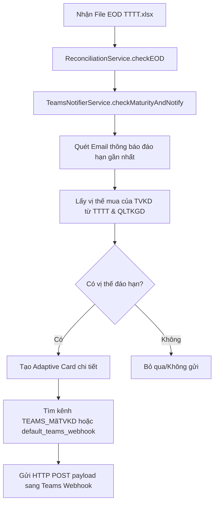

# Tài Liệu Hướng Dẫn Sử Dụng & Các Thay Đổi: Hệ Thống Thông Báo Đáo Hạn Hợp Đồng Tự Động Qua MS Teams

Tài liệu này hướng dẫn chi tiết các thay đổi đã được thực hiện, cách cấu hình và quy trình vận hành hệ thống thông báo tất toán/đáo hạn hợp đồng tự động cho Thành viên Kinh doanh (TVKD) qua Microsoft Teams.

---

## 1. Tổng Quan Hệ Thống

Hệ thống hỗ trợ quét tự động email thông báo tất toán hợp đồng từ Khối Quản lý giao dịch (QLGD), bóc tách danh sách hợp đồng kèm thời hạn đáo hạn, đối chiếu với trạng thái vị thế thực tế của từng TVKD (trong file `TTTT.xlsx` và `QLTKGD.xlsx`), và gửi thông báo trực tiếp qua **Microsoft Teams Webhook** dưới dạng **Adaptive Card** trực quan.

---

## 2. Các Thay Đổi Đã Thực Hiện

### A. Backend (NestJS)
1. **Schema & Cấu hình kênh (`NotificationChannel`):**
   - Bổ dung loại kênh mới `'TEAMS'` vào danh sách enum được phép.
2. **Dịch vụ gửi thông báo (`TeamsNotifierService`):**
   - **Bóc tách Email (`parseMaturityEmail`):** Tự động phân tích bảng dữ liệu HTML từ email để trích xuất: Mã Hợp đồng, Tên hợp đồng, Ngày thông báo đầu tiên, Thời gian tất toán.
   - **Tạo Adaptive Card:** Thiết kế giao diện thẻ thông tin (Adaptive Card) đẹp mắt, có bảng danh sách hợp đồng đáo hạn cụ thể cho từng thành viên kèm mốc thời gian cảnh báo màu đỏ nổi bật.
   - **Phân giải Webhook linh hoạt:** Tự động ưu tiên gửi qua kênh của TVKD cụ thể (`TEAMS_{Mã_TVKD}`) nếu có cấu hình; nếu không sẽ sử dụng cấu hình mặc định toàn hệ thống (`default_teams_webhook`).
3. **Tích hợp Quy trình EOD (`ReconciliationService`):**
   - Đặt hook tự động chạy kiểm tra đáo hạn khi file vị thế cuối ngày (`tttt`) được xử lý trong bước `checkEOD`.

### B. Frontend (NextJS)
1. **Giao diện quản lý kênh (`admin/notifications/page.tsx`):**
   - Hỗ trợ thêm mới / sửa kênh loại **Microsoft Teams Webhook** (`TEAMS`).
   - Form nhập liệu riêng cho trường **Webhook URL** kèm kiểm tra định dạng (`http://` hoặc `https://`).
   - Hiển thị danh sách kênh Teams kèm biểu tượng quả chuông màu xanh đặc trưng và rút gọn hiển thị Webhook URL để bảo mật.

---

## 3. Hướng Dẫn Cấu Hợp (Dành cho Admin/Vận Hành)

### Cách 1: Cấu hình Webhook mặc định (Default Webhook)
Dành cho việc nhận các thông báo chung hoặc khi thành viên chưa cấu hình webhook riêng.
1. Truy cập trang **Cấu hình hệ thống** (System Settings).
2. Thêm hoặc cập nhật tham số:
   - **Key:** `default_teams_webhook`
   - **Value:** URL Webhook nhận tin của Teams (Ví dụ: `https://m365.webhook.office.com/...`).

### Cách 2: Cấu hình Webhook riêng cho từng Thành viên (Member Webhook)
Để gửi đích danh danh sách cảnh báo đáo hạn cho từng TVKD qua phòng riêng của họ:
1. Vào mục **Quản lý kênh thông báo** (Notification Channels).
2. Click **Thêm Kênh Mới** (hoặc Sửa kênh cũ).
3. Chọn Loại kênh: `Microsoft Teams Webhook`.
4. Nhập mã kênh theo định dạng chuẩn: **`TEAMS_{Mã_TVKD}`** (Ví dụ: `TEAMS_079`, `TEAMS_002`).
5. Điền **Webhook URL** tương ứng của nhóm hỗ trợ thành viên đó.
6. Tích chọn **Hoạt động** và nhấn **Lưu Cấu Hình**.

---

## 4. Cơ Chế Vận Hành Tự Động



---

## 5. Hướng Dẫn Kiểm Tra / Chạy Thử (Verify)

Bạn có thể chạy thử nghiệm kịch bản giả lập (Simulation Mode) để kiểm tra luồng hoạt động từ bóc tách email, khớp vị thế đến gửi tin Teams bằng script kiểm tra tự động:

1. Mở terminal tại thư mục `backend`.
2. Chạy lệnh:
   ```bash
   npm.cmd run test:teams-maturity
   ```
3. Kết quả thành công sẽ in log dạng:
   ```text
   [TeamsNotifierService] Successfully sent Teams notification to 079
   Maturity Task status: PASSED
   Found 1 Teams notification logs.
   - Recipient: 079, Status: SENT
   ```
