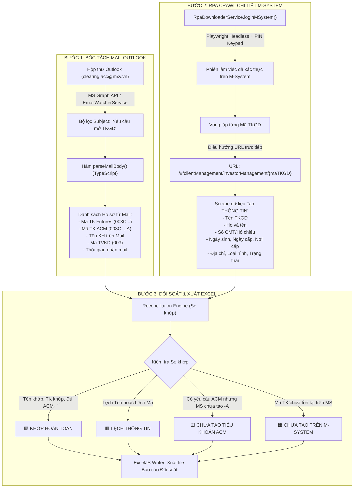

# TÀI LIỆU THIẾT KẾ KỸ THUẬT GIAI ĐOẠN 1
## TỰ ĐỘNG BÓC TÁCH MAIL OUTLOOK & ĐỐI SOÁT CHI TIẾT M-SYSTEM TRÊN NỀN TẢNG NODE.JS / NESTJS

> **Mục tiêu Giai đoạn 1:** Tận dụng 100% mã nguồn có sẵn trên Backend NestJS (Playwright RPA M-System + Microsoft Graph API Mail) để:
> 1. Quét và bóc tách toàn bộ email mở TKGD từ Outlook vào bộ nhớ.
> 2. Đăng nhập M-System và tự động điều hướng vào từng URL Chi tiết TKGD (`/#/clientManagement/investorManagement/{code}`).
> 3. Cào đầy đủ các trường (Họ tên, Số CMT/CCCD, Ngày sinh, Địa chỉ, Ngày cấp, Nơi cấp, Trạng thái).
> 4. Đối soát chéo giữa Dữ liệu Mail ↔ Dữ liệu M-System và xuất file Excel kết quả.
> *(Phần OCR CCCD và bóc tách PDF Hợp đồng sẽ được kích hoạt ở Giai đoạn 2).*

---

## 1. TỔNG QUAN LUỒNG XỬ LÝ GIAI ĐOẠN 1 (WORKFLOW)



---

## 2. TÁI SỬ DỤNG VÀ MỞ RỘNG MÃ NGUỒN CÓ SẴN TRÊN BACKEND

Hệ thống tận dụng trực tiếp 3 service nòng cốt đã chạy ổn định trong thư mục `backend/src/modules/bot-engine/`:

### 2.1. Tái sử dụng `EmailWatcherService` (`email-watcher.service.ts`)
* **Hiện trạng:** Đã có cơ chế lấy OAuth2 Token từ Azure AD (`m365_client_id`, `m365_client_secret`, `m365_tenant_id`) và hàm `fetch` tin nhắn từ Graph API.
* **Bổ sung mới:** Viết thêm phương thức `batchFetchAccountOpeningEmails()`:
  - Lấy tất cả email có Subject chứa `"Yêu cầu mở TKGD"` trong khoảng thời gian chỉ định (hoặc trong ngày).
  - Tách body text (loại bỏ thẻ HTML).
  - Áp dụng các Regex pattern chuẩn đã kiểm thử:
    ```typescript
    const PATTERN_FUTURES = /Mã TKGD\s*:\s*([0-9]{3}[A-Z][0-9]{7})\b(?!\s*-[ALMS])/i;
    const PATTERN_ACM = /Mã TKGD\s*:\s*([0-9]{3}[A-Z][0-9]{7}-[ALMS])\b/i;
    const PATTERN_TEN_TK = /Tên tài khoản\s*:\s*([^\r\n]+)/i;
    ```

---

### 2.2. Tái sử dụng `RpaDownloaderService` (`rpa-downloader.service.ts`)
* **Hiện trạng:** Đã có hàm `loginMSystem(downloadDir, overrideUrl)` xử lý hoàn hảo:
  - Tự động điền username/password.
  - Bấm bàn phím ảo PIN keypad (`div.pincode`).
  - Xử lý anti-bot và lỗi đăng nhập.
* **Bổ sung mới:** Viết thêm hàm `scrapeInvestorDetail(page: Page, investorCode: string)`:
  - Điều hướng thẳng đến URL chi tiết dựa trên file spec [TKGD-Detail.md](file:///c:/Users/hiepth/OneDrive%20-%20MERCANTILE%20EXCHANGE%20OF%20VIETNAM/Documents/Github/mxv-shift-checklist/POC/TKGD-Automation/inputs/msystem-url/TKGD-Detail.md):
    ```typescript
    const detailUrl = `https://msadmin.mxv.com.vn/#/clientManagement/investorManagement/${investorCode}`;
    await page.goto(detailUrl, { waitUntil: 'networkidle', timeout: 30000 });
    ```
  - Bóc tách chính xác các selector trên giao diện (theo ảnh chụp thực tế màn hình M-System của anh):

| Trường Thông Tin | Vị Trí Trên Màn Hình MS | Kỹ Thuật Lấy Bằng Playwright |
| :--- | :--- | :--- |
| **Mã TVKD** | Mục "Mã thành viên" | `locator('.ant-form-item:has-text("Mã thành viên") input, div.ant-select-selection-item')` |
| **Tên TVKD** | Mục "Tên thành viên" | `locator('.ant-form-item:has-text("Tên thành viên") input')` |
| **Mã TKGD** | Mục "Mã TKGD (*)" | `locator('.ant-form-item:has-text("Mã TKGD") input').inputValue()` |
| **Tên TKGD** | Mục "Tên TKGD (*)" | `locator('.ant-form-item:has-text("Tên TKGD") input').inputValue()` |
| **Loại hình** | Mục "Loại hình (*)" | Lấy text trong dropdown (VD: *NĐT cá nhân trong nước*) |
| **Trạng thái** | Mục "Trạng thái (*)" | Lấy text trạng thái (VD: *Hoạt động*, *Chờ duyệt*) |
| **Họ và tên** | Phần "Thông tin cá nhân" $\rightarrow$ "Họ và tên (*)" | `locator('.ant-form-item:has-text("Họ và tên") input').inputValue()` |
| **Ngày sinh** | Phần "Thông tin cá nhân" $\rightarrow$ "Ngày sinh (*)" | `locator('.ant-form-item:has-text("Ngày sinh") input').inputValue()` |
| **Số CMT / Hộ chiếu** | Phần "Thông tin cá nhân" $\rightarrow$ "Số CMT / Hộ chiếu (*)" | `locator('.ant-form-item:has-text("Số CMT") input').inputValue()` |
| **Ngày cấp** | Mục "Ngày cấp (*)" | `locator('.ant-form-item:has-text("Ngày cấp") input').inputValue()` |
| **Nơi cấp** | Mục "Nơi cấp (*)" | `locator('.ant-form-item:has-text("Nơi cấp") input').inputValue()` |
| **Địa chỉ** | Mục "Địa chỉ (*)" | `locator('.ant-form-item:has-text("Địa chỉ") textarea, input').inputValue()` |

---

### 2.3. Bổ sung `AccountReconService` (`account-recon.service.ts`)
Đây là service điều phối logic nghiệp vụ hoàn chỉnh:
1. Gọi `EmailWatcherService` để lấy danh sách mail yêu cầu mở TKGD.
2. Gọi `RpaDownloaderService.loginMSystem()` để lấy trình duyệt `page`.
3. Duyệt danh sách từng tài khoản:
   - Cào chi tiết tài khoản Futures (`003C...`).
   - Nếu mail có yêu cầu mở ACM $\rightarrow$ Cào tiếp tài khoản ACM (`003C...-A`).
4. Chạy bộ so khớp logic (Reconciliation Engine):
   - So khớp Họ tên Mail vs Họ tên M-System (chuẩn hóa không dấu, in hoa).
   - Kiểm tra xem tài khoản ACM đã được tạo trên MS chưa.
5. Sử dụng `ExcelJS` để ghi dữ liệu ra file Template Excel có highlight màu.

---

## 3. THIẾT KẾ CẤU TRÚC FILE EXCEL ĐẦU RA (TEMPLATE ĐỐI SOÁT)

Bảng tính gồm 2 Sheet chính:

### Sheet 1: `TONG_HOP_DOI_SOAT` (Dashboard Tổng quan)
- Tổng số email yêu cầu mở tài khoản nhận được trong ngày.
- Số lượng tài khoản:
  - 🟩 **Khớp hoàn toàn:** Đã tạo đủ Futures + ACM (nếu có), Tên và thông tin khớp 100%.
  - 🟨 **Thiếu tiểu khoản ACM:** Mail yêu cầu mở cả Futures + ACM nhưng trên MS mới chỉ tạo Futures.
  - 🟥 **Lệch tên / thông tin:** Tên trên mail khác tên đăng ký trên M-System.
  - 🟧 **Chưa tạo trên MS:** Chưa tìm thấy mã TKGD trên M-System (cán bộ MS chưa kịp tạo).

### Sheet 2: `CHI_TIET_DOI_SOAT` (Danh sách chi tiết từng dòng)
Các cột dữ liệu tiêu chuẩn:

| Cột | Tên Cột | Nguồn Dữ Liệu | Diễn Giải / Quy Tắc Tô Màu |
| :---: | :--- | :--- | :--- |
| **A** | STT | Tự tăng | 1, 2, 3... |
| **B** | Thời gian nhận mail | Email Outlook | `DD/MM/YYYY HH:mm` |
| **C** | TVKD | Email / Mã TK | `003` (Gia Cát Lợi) |
| **D** | Mã TK Futures (Mail) | Body Mail | `003C0895953` |
| **E** | Mã TK ACM (Mail) | Body Mail | `003C0895953-A` (hoặc *Không yêu cầu*) |
| **F** | Tên KH trên Mail | Body Mail | `Ngô Đức Hải` |
| **G** | Tên KH trên M-System | Scraped từ MS | `NGÔ ĐỨC HẢI` |
| **H** | **Đánh giá Tên** | Tự động tính | 🟩 `KHỚP` hoặc 🟥 `LỆCH TÊN` |
| **I** | Số CMT/CCCD trên MS | Scraped từ MS | `031079015563` *(Sẵn sàng đối soát khi có OCR)* |
| **J** | Ngày sinh trên MS | Scraped từ MS | `13/10/1979` |
| **K** | Địa chỉ trên MS | Scraped từ MS | `186 Miếu Hai Xã, Lê Chân, Hải Phòng` |
| **L** | Trạng thái Futures trên MS | Scraped từ MS | `Hoạt động` / `Chờ duyệt` / `Chưa tạo` |
| **M** | Trạng thái ACM trên MS | Scraped từ MS | `Hoạt động` / `Chờ duyệt` / 🟨 `CHƯA TẠO ACM` |
| **N** | **KẾT LUẬN ĐỐI SOÁT** | Logic Engine | 🟩 `HỢP LỆ` \| 🟨 `THIẾU ACM` \| 🟥 `LỆCH TÊN` \| 🟧 `CHƯA TẠO` |
| **O** | Link M-System | Tự động sinh | Hyperlink click vào là mở thẳng trang chi tiết của TK đó trên MS |

---

## 4. CHI TIẾT CODE MẪU NODE.JS (SẴN SÀNG GHÉP NỐI VÀO BACKEND)

### 4.1. Hàm bóc tách Body Mail (`mail-parser.helper.ts`)

```typescript
export interface AccountEmailData {
  mailId: string;
  receivedTime: string;
  sender: string;
  maTKGDFutures: string | null;
  maTKGDACM: string | null;
  tenTK: string | null;
  maTVKD: string | null;
  hasACMRequest: boolean;
}

export function parseAccountOpeningEmail(
  mailId: string,
  receivedTime: string,
  sender: string,
  bodyContent: string
): AccountEmailData {
  // 1. Mã TK Futures
  const mFutures = bodyContent.match(/Mã TKGD\s*:\s*([0-9]{3}[A-Z][0-9]{7})\b(?!\s*-[ALMS])/i);
  const maTKGDFutures = mFutures ? mFutures[1].trim() : null;

  // 2. Mã TK ACM
  const mACM = bodyContent.match(/Mã TKGD\s*:\s*([0-9]{3}[A-Z][0-9]{7}-[ALMS])\b/i);
  const maTKGDACM = mACM ? mACM[1].trim() : null;

  // 3. Tên tài khoản
  const mTen = bodyContent.match(/Tên tài khoản\s*:\s*([^\r\n]+)/i);
  const tenTK = mTen ? mTen[1].trim() : null;

  // 4. Mã TVKD (3 ký tự đầu)
  const maTVKD = maTKGDFutures ? maTKGDFutures.substring(0, 3) : null;

  // 5. Kiểm tra yêu cầu mở ACM
  const hasACMRequest = /Ti[eê]u kho[aả]n ACM|tài kho[aả]n.*?ACM/i.test(bodyContent) || maTKGDACM !== null;

  return {
    mailId,
    receivedTime,
    sender,
    maTKGDFutures,
    maTKGDACM,
    tenTK,
    maTVKD,
    hasACMRequest,
  };
}
```

---

### 4.2. Hàm Playwright Scrape Chi Tiết M-System (`rpa-downloader.service.ts`)

```typescript
export interface MSystemInvestorDetail {
  maTKGD: string;
  tenTKGD: string;
  hoTen: string;
  soCMND: string;
  ngaySinh: string;
  ngayCap: string;
  noiCap: string;
  diaChi: string;
  loaiHinh: string;
  trangThai: string;
  isExist: boolean;
}

async scrapeInvestorDetail(page: Page, investorCode: string): Promise<MSystemInvestorDetail> {
  const detailUrl = `https://msadmin.mxv.com.vn/#/clientManagement/investorManagement/${investorCode}`;
  this.logger.log(`Navigating to M-System Investor Detail: ${detailUrl}`);

  try {
    await page.goto(detailUrl, { timeout: 30000 });
    // Chờ form hoặc spinner biến mất
    await page.waitForTimeout(2000);

    // Kiểm tra xem tài khoản có tồn tại không (nếu 404 hoặc không có data)
    const notFound = await page.locator('.ant-empty, .ant-result-404').isVisible().catch(() => false);
    if (notFound) {
      return { maTKGD: investorCode, isExist: false } as any;
    }

    // Đảm bảo đang ở tab "THÔNG TIN"
    const tabThongTin = page.locator('div.ant-tabs-tab:has-text("THÔNG TIN")');
    if (await tabThongTin.isVisible()) {
      await tabThongTin.click();
      await page.waitForTimeout(500);
    }

    // Helper lấy giá trị input theo nhãn text
    const getValueByLabel = async (label: string): Promise<string> => {
      try {
        const input = page.locator(`.ant-form-item:has(label:has-text("${label}")) input, .ant-form-item:has(label:has-text("${label}")) textarea`);
        if (await input.count() > 0) {
          return (await input.first().inputValue()).trim();
        }
      } catch {}
      return '';
    };

    const tenTKGD = await getValueByLabel('Tên TKGD');
    const hoTen = await getValueByLabel('Họ và tên');
    const soCMND = await getValueByLabel('Số CMT / Hộ chiếu');
    const ngaySinh = await getValueByLabel('Ngày sinh');
    const ngayCap = await getValueByLabel('Ngày cấp');
    const noiCap = await getValueByLabel('Nơi cấp');
    const diaChi = await getValueByLabel('Địa chỉ');
    const trangThai = await getValueByLabel('Trạng thái');
    const loaiHinh = await getValueByLabel('Loại hình');

    return {
      maTKGD: investorCode,
      tenTKGD,
      hoTen,
      soCMND,
      ngaySinh,
      ngayCap,
      noiCap,
      diaChi,
      loaiHinh,
      trangThai,
      isExist: true,
    };
  } catch (err: any) {
    this.logger.error(`Error scraping investor ${investorCode}: ${err.message}`);
    return { maTKGD: investorCode, isExist: false } as any;
  }
}
```

---

## 5. KẾ HOẠCH BÀN GIAO & CÁC BƯỚC TRIỂN KHAI TIẾP THEO

1. **Bước 1 (Backend Controller & Service):**
   - Ghép hàm bóc tách `parseAccountOpeningEmail` vào `email-watcher.service.ts`.
   - Bổ sung hàm `scrapeInvestorDetail` vào `rpa-downloader.service.ts`.
2. **Bước 2 (Trigger & API Endpoint):**
   - Tạo endpoint: `POST /api/v1/reconciliation/tkgd-check` cho phép người dùng bấm "Quét & Đối soát ngay" từ Web hoặc chạy tự động định kỳ.
3. **Bước 3 (Xuất Excel):**
   - Dùng thư viện `exceljs` có sẵn để render báo cáo ra thư mục `reports/` hoặc trả về dạng stream download trực tiếp trên trình duyệt.
4. **Giai đoạn 2 (Sau khi hoàn thành Giai đoạn 1):**
   - Tích hợp thêm module `gemini_model_manager.py` (đã test thành công 100%) để bổ sung việc đối soát ảnh CCCD và PDF Hợp đồng vào cùng một bảng Excel.
