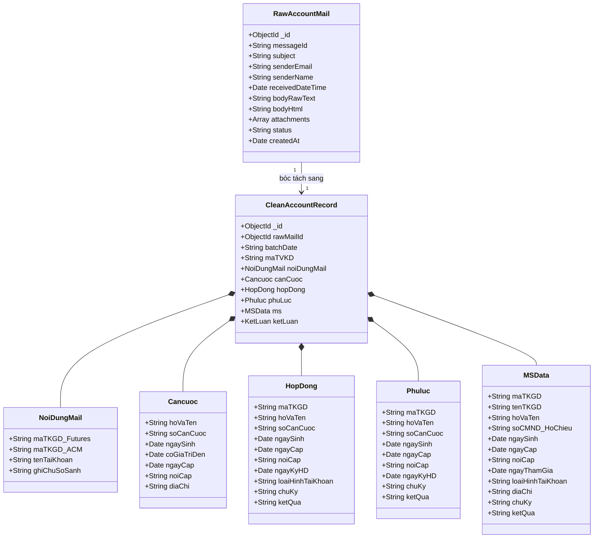

# THIẾT KẾ MONGODB: LƯU TRỮ RAW EMAIL & CLEAN DATA BÓC TÁCH
## THEO CHUẨN CÁC TRƯỜNG TỪ FILE `Auto Data mail.xlsm` (MXV)

> **Mục tiêu:** 
> 1. **Lưu Raw Data:** Lưu toàn vẹn 100% nội dung gốc của Email Outlook (Sender, Subject, Body Text, HTML, Attachments metadata, Raw Payload) để phục vụ tra cứu, audit log và tái xử lý khi cần.
> 2. **Lưu Clean Data (Dữ liệu sạch):** Bóc tách và cấu trúc hóa dữ liệu chuẩn theo đúng **5 Sheet** của file template [`Auto Data mail.xlsm`](file:///c:/Users/hiepth/OneDrive%20-%20MERCANTILE%20EXCHANGE%20OF%20VIETNAM/Documents/Github/mxv-shift-checklist/POC/TKGD-Automation/inputs/excel-templates/Auto%20Data%20mail.xlsm):
>    - `NoiDungMail`
>    - `Cancuoc`
>    - `HopDong`
>    - `Phuluc`
>    - `MS` (Dữ liệu cào từ Chi tiết TKGD trên M-System)
> 3. Tương thích hoàn toàn với kiến trúc NestJS / Mongoose của hệ thống hiện tại (`backend/src/schemas/`).

---

## 1. MAPPING TỔNG THỂ: TỪ FILE EXCEL SANG MONGODB



---

## 2. SCHEMA 1: LƯU RAW EMAIL (`RawAccountMail`)

Collection này lưu toàn bộ dữ liệu thô nhận được từ Microsoft 365 Outlook (hoặc file `.eml` import vào) mà chưa qua xử lý, đảm bảo nguyên vẹn bằng chứng pháp lý.

### File: `backend/src/schemas/raw-account-mail.schema.ts`

```typescript
import { Prop, Schema, SchemaFactory } from '@nestjs/mongoose';
import { Document, Schema as MongooseSchema } from 'mongoose';

export type RawAccountMailDocument = RawAccountMail & Document;

export class AttachmentMeta {
  @Prop({ required: true })
  name: string; // VD: NGO-DUC-HAI-mxv.pdf

  @Prop()
  contentType: string; // application/pdf, image/jpeg

  @Prop()
  size: number; // bytes

  @Prop()
  storagePath: string; // Đường dẫn lưu trữ file trên server

  @Prop({ enum: ['hop_dong', 'pl01', 'cccd_truoc', 'cccd_sau', 'other'], default: 'other' })
  fileType: string;
}

@Schema({ timestamps: true, collection: 'raw_account_mails' })
export class RawAccountMail {
  @Prop({ unique: true, index: true })
  messageId: string; // Graph API Message-ID hoặc hash duy nhất

  @Prop({ required: true })
  subject: string; // Tiêu đề: "Yêu cầu mở TKGD"

  @Prop({ required: true, index: true })
  senderEmail: string; // dautuhanghoa@giacatloi.vn

  @Prop()
  senderName: string; // CÔNG TY CỔ PHẦN GIAO DỊCH HÀNG HÓA GIA CÁT LỢI

  @Prop({ required: true, index: true })
  receivedDateTime: Date; // Thời gian nhận mail

  @Prop({ required: true })
  bodyRawText: string; // Nội dung text thô

  @Prop()
  bodyHtml: string; // HTML gốc của email

  @Prop({ type: [AttachmentMeta], default: [] })
  attachments: AttachmentMeta[];

  @Prop({
    enum: ['PENDING', 'PARSED', 'RECONCILED', 'FAILED'],
    default: 'PENDING',
    index: true,
  })
  status: string;

  @Prop({ type: MongooseSchema.Types.Mixed })
  rawHeaders: any; // Header MIME phục vụ audit khi cần
}

export const RawAccountMailSchema = SchemaFactory.createForClass(RawAccountMail);
```

---

## 3. SCHEMA 2: LƯU DỮ LIỆU SẠCH (`CleanAccountRecord`)
### Map 100% Theo 5 Sheet của `Auto Data mail.xlsm`

### File: `backend/src/schemas/clean-account-record.schema.ts`

```typescript
import { Prop, Schema, SchemaFactory } from '@nestjs/mongoose';
import { Document, Schema as MongooseSchema } from 'mongoose';

export type CleanAccountRecordDocument = CleanAccountRecord & Document;

// ─── KHỐI 1: Tương ứng Sheet "NoiDungMail" ──────────────────────────────
export class NoiDungMailSubDoc {
  @Prop({ index: true })
  maTKGD_Futures: string; // Cột 'Mã TKGD' dòng Futures: 003C2333888

  @Prop({ index: true })
  maTKGD_ACM: string; // Cột 'Mã TKGD' dòng ACM: 003C2333888-A

  @Prop()
  tenTaiKhoan: string; // Cột 'Tên tài khoản': Ngô Đức Hải

  @Prop()
  hasACMRequest: boolean; // Có yêu cầu mở ACM hay không

  @Prop()
  ghiChuSoSanh: string; // Cột 4: 'so sánh mã TKGD với bên HĐ, MS khớp'
}

// ─── KHỐI 2: Tương ứng Sheet "Cancuoc" (OCR / QR Code) ───────────────────
export class CanCuocSubDoc {
  @Prop()
  hoVaTen: string; // Cột 'Họ và tên': Ngô Đức Hải

  @Prop({ index: true })
  soCanCuoc: string; // Cột 'Số căn cước': 031079015563

  @Prop()
  ngaySinh: Date; // Cột 'Ngày sinh': 1979-10-13

  @Prop()
  coGiaTriDen: Date; // Cột 'Có giá trị đến': 2039-10-13

  @Prop()
  ngayCap: Date; // Cột 'Ngày cấp': 2022-08-27

  @Prop()
  noiCap: string; // Cột 'Nơi cấp': Cục Cảnh sát quản lý hành chính về trật tự xã hội

  @Prop()
  diaChiThuongTru: string; // 186 Miếu Hai Xã, Dư Hàng Kênh, Lê Chân, Hải Phòng

  @Prop()
  ocrConfidence: string; // HIGH (QR Code) | HIGH (MRZ) | MEDIUM (Gemini Vision)
}

// ─── KHỐI 3: Tương ứng Sheet "HopDong" (*-mxv.pdf) ────────────────────────
export class HopDongSubDoc {
  @Prop({ index: true })
  maTKGD: string; // Cột 'Mã TKGD': 003C2333888

  @Prop()
  hoVaTen: string; // Cột 'Họ và tên': Ngô Đức Hải

  @Prop()
  soCanCuoc: string; // Cột 'Số căn cước': 031079015563

  @Prop()
  ngaySinh: Date; // Cột 'Ngày sinh'

  @Prop()
  ngayCap: Date; // Cột 'Ngày cấp'

  @Prop()
  noiCap: string; // Cột 'Nơi cấp'

  @Prop()
  ngayKyHD: Date; // Cột 'Ngày ký HĐ': 2026-08-11

  @Prop({ default: 'Cá nhân' })
  loaiHinhTaiKhoan: string; // Cột 'Loại hình tài khoản': Cá nhân / Tổ chức

  @Prop({ default: 'Đã ký' })
  chuKy: string; // Cột 'Chữ ký': Đã ký / Chưa ký

  @Prop()
  ketQua: string; // Cột 'Kết quả': 'So sánh với thông tin với căn cước khớp'
}

// ─── KHỐI 4: Tương ứng Sheet "Phuluc" (*-PL01.pdf) ────────────────────────
export class PhuLucSubDoc {
  @Prop({ index: true })
  maTKGD: string; // Cột 'Mã TKGD': 003C2333888-A

  @Prop()
  hoVaTen: string; // Cột 'Họ và tên': Ngô Đức Hải

  @Prop()
  soCanCuoc: string; // Cột 'Số căn cước': 031079015563

  @Prop()
  ngaySinh: Date; // Cột 'Ngày sinh'

  @Prop()
  ngayCap: Date; // Cột 'Ngày cấp'

  @Prop()
  noiCap: string; // Cột 'Nơi cấp'

  @Prop()
  ngayKyHD: Date; // Cột 'Ngày ký HĐ': 2026-08-11

  @Prop({ default: 'Đã ký' })
  chuKy: string; // Cột 'Chữ ký': Đã ký / Chưa ký

  @Prop()
  ketQua: string; // Cột 'Kết quả': 'So sánh với thông tin với căn cước khớp'
}

// ─── KHỐI 5: Tương ứng Sheet "MS" (Cào từ Chi tiết TKGD M-System) ─────────
export class MSSubDoc {
  @Prop({ index: true })
  maTKGD: string; // Cột 'Mã TKGD': 003C2333888

  @Prop()
  tenTKGD: string; // Cột 'Tên TKGD': Ngô Đức Hải

  @Prop()
  hoVaTen: string; // Cột 'Họ và tên': Ngô Đức Hải

  @Prop({ index: true })
  soCMND_HoChieu: string; // Cột 'Số CMT/ Hộ chiếu': 031079015563

  @Prop()
  ngaySinh: Date; // Cột 'Ngày sinh'

  @Prop()
  ngayCap: Date; // Cột 'Ngày cấp'

  @Prop()
  noiCap: string; // Cột 'Nơi cấp'

  @Prop()
  ngayThamGia: Date; // Cột 'Ngày ký HĐ' / Ngày tham gia

  @Prop({ default: 'Cá nhân' })
  loaiHinhTaiKhoan: string; // Cột 'Loại hình tài khoản': Cá nhân

  @Prop()
  diaChi: string; // Địa chỉ từ chi tiết MS

  @Prop()
  trangThai: string; // Hoạt động / Chờ duyệt / Chưa tạo

  @Prop({ default: 'Đã ký' })
  chuKy: string; // Cột 'Chữ ký'

  @Prop()
  ketQua: string; // Cột 'Kết quả': 'So sánh với thông tin với căn cước khớp'

  @Prop({ default: false })
  isFoundOnMS: boolean; // Đã tìm thấy trên M-System hay chưa
}

// ─── KHỐI TỔNG HỢP: Kết quả đối soát chéo tổng thể ──────────────────────
export class KetLuanDoiSoat {
  @Prop({
    enum: ['KHOP', 'LECH_TEN', 'LECH_CCCD', 'THIEU_ACM', 'CHUA_CO_TREN_MS', 'THIEU_HO_SO'],
    default: 'CHUA_CO_TREN_MS',
    index: true,
  })
  trangThai: string;

  @Prop([String])
  danhSachLoi: string[]; // Danh sách chi tiết các lỗi lệch

  @Prop()
  reconciledAt: Date;
}

// ─── MAIN CLEAN RECORD SCHEMA ───────────────────────────────────────────
@Schema({ timestamps: true, collection: 'clean_account_records' })
export class CleanAccountRecord {
  @Prop({ type: MongooseSchema.Types.ObjectId, ref: 'RawAccountMail', index: true })
  rawMailId: MongooseSchema.Types.ObjectId; // Liên kết tới mail gốc

  @Prop({ required: true, index: true })
  batchDate: string; // YYYY-MM-DD (ngày phiên xử lý)

  @Prop({ required: true, index: true })
  maTVKD: string; // 003, 001...

  @Prop({ type: NoiDungMailSubDoc, required: true })
  noiDungMail: NoiDungMailSubDoc; // Sheet 1: NoiDungMail

  @Prop({ type: CanCuocSubDoc })
  canCuoc: CanCuocSubDoc; // Sheet 2: Cancuoc (Lấy khi chạy OCR)

  @Prop({ type: HopDongSubDoc })
  hopDong: HopDongSubDoc; // Sheet 3: HopDong

  @Prop({ type: PhuLucSubDoc })
  phuLuc: PhuLucSubDoc; // Sheet 4: Phuluc

  @Prop({ type: MSSubDoc })
  ms: MSSubDoc; // Sheet 5: MS (Cào từ Chi tiết M-System)

  @Prop({ type: KetLuanDoiSoat, default: () => ({}) })
  ketLuan: KetLuanDoiSoat;
}

export const CleanAccountRecordSchema = SchemaFactory.createForClass(CleanAccountRecord);
```

---

## 4. CHIẾN LƯỢC ĐỔ DỮ LIỆU VÀO MONGODB & EXCEL THEO 2 GIAI ĐOẠN

### Giai đoạn 1 (Làm ngay với Base Node.js hiện tại):
1. **Lưu `raw_account_mails`:** Lưu 100% email nhận được.
2. **Lưu `clean_account_records`:**
   - Đổ dữ liệu vào khối `noiDungMail` (Mã Futures, Mã ACM, Tên TK).
   - Đổ dữ liệu vào khối `ms` (Cào từ trang `https://msadmin.mxv.com.vn/#/clientManagement/investorManagement/{code}`).
   - Khối `canCuoc`, `hopDong`, `phuLuc` tạm thời để trống (`null`) hoặc copy thông tin cơ bản từ Mail.
   - So khớp giữa `noiDungMail` $\leftrightarrow$ `ms` $\rightarrow$ Kết luận: Khớp tên hay chưa tạo trên MS.
3. **Xuất ra Excel `Auto Data mail.xlsm`:**
   - Sheet `NoiDungMail`: Đổ từ `record.noiDungMail`.
   - Sheet `MS`: Đổ từ `record.ms`.
   - Cán bộ vận hành có thể dùng ngay kết quả này!

### Giai đoạn 2 (Tích hợp thêm OCR & PDF):
- Khi kích hoạt `cccd_ocr.py` (Gemini Vision / QR):
  - Update dữ liệu vào khối `canCuoc` (`clean_account_records.canCuoc`).
  - Update dữ liệu vào khối `hopDong` và `phuLuc`.
  - Tự động điền đầy đủ cả 5 Sheet trong `Auto Data mail.xlsm` mà **không cần thay đổi cấu trúc Database**!
