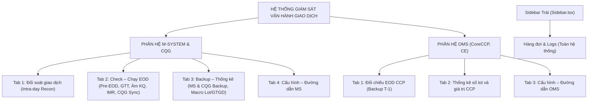
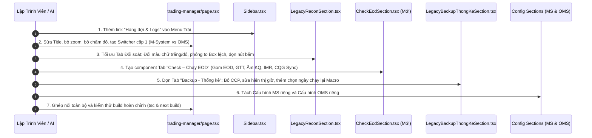

# TÀI LIỆU ĐẶC TẢ KỸ THUẬT & THIẾT KẾ CẢI TIẾN UX/UI
## PHÂN HỆ: HỆ THỐNG GIÁM SÁT VẬN HÀNH GIAO DỊCH (TRADING MANAGER)

> **Mục đích tài liệu**: Chuẩn hóa toàn bộ yêu cầu thay đổi UX/UI, tái cấu trúc cây điều hướng (Information Architecture), phân tách độc lập hai phân hệ **M-System** và **OMS (CoreCCP, CE)**, đồng thời trích dẫn chính xác mã nguồn, dòng code, component và phương án lập trình để thực hiện sửa đổi nhanh chóng, chính xác 100%, không phát sinh lỗi hồi quy.

---

## I. TỔNG QUAN KIẾN TRÚC ĐIỀU HƯỚNG MỚI (INFORMATION ARCHITECTURE)

Hệ thống chuyển từ mô hình 1 thanh Tabs phẳng (Flat Tabs) sang **mô hình phân tầng 2 cấp (Two-Level Hierarchical Navigation)**:
- **Cấp 1 (System Switcher)**: Phân định rạch ròi 2 trụ cột nghiệp vụ:
  1. `[🏢 M-System & CQG]`
  2. `[🏛️ OMS (CoreCCP, CE)]`
- **Cấp 2 (Operational Tabs)**: Mỗi trụ cột sở hữu tập hợp các Tab nghiệp vụ chuyên biệt, đóng gói độc lập.
- **Thanh Menu Trái (`Sidebar.tsx`)**: Đưa mục **"Hàng đợi & Logs"** ra làm Menu độc lập cấp hệ thống.



---

## II. MA TRẬN MÃ NGUỒN CÁC FILE BỊ TÁC ĐỘNG (SOURCE CODE TRACEABILITY)

| STT | Thành phần giao diện / Logic | File mã nguồn Frontend / Backend | Dòng code hiện tại | Trạng thái thay đổi |
| :--- | :--- | :--- | :--- | :--- |
| **1** | Title & Subtitle trang | [page.tsx](file:///c:/Users/hiepth/OneDrive%20-%20MERCANTILE%20EXCHANGE%20OF%20VIETNAM/Documents/Github/mxv-cqg-download-investigation/frontend/src/app/trading-manager/page.tsx) | `L163-L181` | Đổi title thành `"HỆ THỐNG GIÁM SÁT VẬN HÀNH GIAO DỊCH"`, xóa bỏ thẻ `<p>` mô tả nhỏ bên dưới. |
| **2** | Chấm đỏ trạng thái hệ thống | [page.tsx](file:///c:/Users/hiepth/OneDrive%20-%20MERCANTILE%20EXCHANGE%20OF%20VIETNAM/Documents/Github/mxv-cqg-download-investigation/frontend/src/app/trading-manager/page.tsx) | `L185-L225` | Xóa bỏ cụm badge chấm đỏ `animate-ping` / Online. |
| **3** | Nút Zoom In / Out (`[- 100% +]`) | [Header.tsx](file:///c:/Users/hiepth/OneDrive%20-%20MERCANTILE%20EXCHANGE%20OF%20VIETNAM/Documents/Github/mxv-cqg-download-investigation/frontend/src/components/Header.tsx) | `L92-L115`, `L409-L436` | Ẩn/xóa bỏ hoàn toàn cụm nút Zoom +/- trên Header toàn cục. |
| **4** | Điều hướng Dashboard | [page.tsx](file:///c:/Users/hiepth/OneDrive%20-%20MERCANTILE%20EXCHANGE%20OF%20VIETNAM/Documents/Github/mxv-cqg-download-investigation/frontend/src/app/trading-manager/page.tsx) | `L260-L267` | Tối ưu nút điều hướng về `/dashboard` gọn gàng, liền mạch. |
| **5** | Đưa "Hàng đợi & Logs" sang cột trái | [Sidebar.tsx](file:///c:/Users/hiepth/OneDrive%20-%20MERCANTILE%20EXCHANGE%20OF%20VIETNAM/Documents/Github/mxv-cqg-download-investigation/frontend/src/components/Sidebar.tsx) & [page.tsx](file:///c:/Users/hiepth/OneDrive%20-%20MERCANTILE%20EXCHANGE%20OF%20VIETNAM/Documents/Github/mxv-cqg-download-investigation/frontend/src/app/trading-manager/page.tsx) | `Sidebar.tsx#L324-L333`, `page.tsx#L383-L420`, `L450-L457` | Thêm Link Nav item vào Sidebar, gỡ bỏ Tab 5 khỏi Trading Manager. |
| **6** | Bộ chuyển cấp 1: M-System vs OMS | [page.tsx](file:///c:/Users/hiepth/OneDrive%20-%20MERCANTILE%20EXCHANGE%20OF%20VIETNAM/Documents/Github/mxv-cqg-download-investigation/frontend/src/app/trading-manager/page.tsx) | `L271-L421` | Thay thanh tab cũ bằng Segment Control 2 phân hệ `M_SYSTEM` và `OMS`. |
| **7** | Màu số liệu bảng đối soát (Trắng vs Đỏ) | [LegacyReconSection.tsx](file:///c:/Users/hiepth/OneDrive%20-%20MERCANTILE%20EXCHANGE%20OF%20VIETNAM/Documents/Github/mxv-cqg-download-investigation/frontend/src/app/trading-manager/components/legacy-ms-cqg/LegacyReconSection.tsx) | `L1465-L1508`, `L1532-L1558`, `L1580-L1605` | Đổi màu mặc định toàn bộ thành màu trắng `#ffffff`. Chỉ bôi đỏ `#ef4444` ô có chênh lệch (`diff > 0`). |
| **8** | Phóng to Box "Chi tiết giao dịch chênh lệch" | [LegacyReconSection.tsx](file:///c:/Users/hiepth/OneDrive%20-%20MERCANTILE%20EXCHANGE%20OF%20VIETNAM/Documents/Github/mxv-cqg-download-investigation/frontend/src/app/trading-manager/components/legacy-ms-cqg/LegacyReconSection.tsx) | `L1810-L1925` | Tăng chiều cao từ `height: 220px` lên `min-height: 480px` (chiếm trọn không gian bên dưới khi đứng ở Tab riêng). |
| **9** | Dọn dẹp thanh nút dưới & Chuyển Switch Tự động | [LegacyReconSection.tsx](file:///c:/Users/hiepth/OneDrive%20-%20MERCANTILE%20EXCHANGE%20OF%20VIETNAM/Documents/Github/mxv-cqg-download-investigation/frontend/src/app/trading-manager/components/legacy-ms-cqg/LegacyReconSection.tsx) | `L1108-L1156`, `L1627-L1760` | Xóa `Hôm nay`, xóa `Check`, xóa `Âm báo`. Đưa Switch `Tự động: BẬT / ĐÃ DỪNG` lên cạnh `Check định kỳ`. Thanh dưới chỉ giữ lại Date picker & `Check thủ công`. |
| **10** | Tách Tab "Check – Chạy EOD" riêng | [LegacyReconSection.tsx](file:///c:/Users/hiepth/OneDrive%20-%20MERCANTILE%20EXCHANGE%20OF%20VIETNAM/Documents/Github/mxv-cqg-download-investigation/frontend/src/app/trading-manager/components/legacy-ms-cqg/LegacyReconSection.tsx), [LegacyBackupThongKeSection.tsx](file:///c:/Users/hiepth/OneDrive%20-%20MERCANTILE%20EXCHANGE%20OF%20VIETNAM/Documents/Github/mxv-cqg-download-investigation/frontend/src/app/trading-manager/components/legacy-ms-cqg/LegacyBackupThongKeSection.tsx) | `LegacyReconSection.tsx#L1929-L2178`, `LegacyBackupThongKeSection.tsx#L1295-L1388` | Gom cụm: Âm ký quỹ mới, Kết quả EOD, Đồng bộ CQG, Check GTT, IMR 4 boxes, Pre-EOD Diff, T-1 (Pending) vào 1 Component Tab mới. |
| **11** | Tối ưu Tab "Backup – Thống kê" (Chỉ MS & CQG) | [LegacyBackupThongKeSection.tsx](file:///c:/Users/hiepth/OneDrive%20-%20MERCANTILE%20EXCHANGE%20OF%20VIETNAM/Documents/Github/mxv-cqg-download-investigation/frontend/src/app/trading-manager/components/legacy-ms-cqg/LegacyBackupThongKeSection.tsx) | `L1169-L1293` | Gỡ bỏ Cột 3 (Backup CoreCCP 25 file) khỏi Tab này. Đảm bảo thư mục lưu đúng tên phiên làm việc hiện tại. |
| **12** | Sửa lỗi ẩn số giờ cài đặt thời gian | [LegacyBackupThongKeSection.tsx](file:///c:/Users/hiepth/OneDrive%20-%20MERCANTILE%20EXCHANGE%20OF%20VIETNAM/Documents/Github/mxv-cqg-download-investigation/frontend/src/app/trading-manager/components/legacy-ms-cqg/LegacyBackupThongKeSection.tsx) | `L810-L820`, `L839-L849` | Tăng chiều rộng ô `input type="time"` từ `90px` lên `125px`, căn giữa padding hiển thị rõ ràng cả giờ, phút và icon. |
| **13** | Macro ghép file CQG & Thống kê Lot/GTGD có chọn ngày | [LegacyBackupThongKeSection.tsx](file:///c:/Users/hiepth/OneDrive%20-%20MERCANTILE%20EXCHANGE%20OF%20VIETNAM/Documents/Github/mxv-cqg-download-investigation/frontend/src/app/trading-manager/components/legacy-ms-cqg/LegacyBackupThongKeSection.tsx) | `L1390-L1421` | Thêm trường chọn `Ngày thống kê` (Session Date Picker) độc lập để người dùng có thể chạy lại Macro theo ngày folder bất kỳ. |
| **14** | Tách Cấu hình MS và Cấu hình OMS | [TradingManagerConfigSection.tsx](file:///c:/Users/hiepth/OneDrive%20-%20MERCANTILE%20EXCHANGE%20OF%20VIETNAM/Documents/Github/mxv-cqg-download-investigation/frontend/src/app/trading-manager/components/shared/TradingManagerConfigSection.tsx) | `L66-L79`, `L42-L58` | Tách ra thành 2 Component riêng biệt: `MsConfigSection.tsx` (MS/CQG) và `OmsConfigSection.tsx` (CCP/CE). |
| **15** | Phân hệ OMS: EOD CCP, Thống kê CCP, Cấu hình OMS | [CoreCcpBackupSection.tsx](file:///c:/Users/hiepth/OneDrive%20-%20MERCANTILE%20EXCHANGE%20OF%20VIETNAM/Documents/Github/mxv-cqg-download-investigation/frontend/src/app/trading-manager/components/core-ccp/CoreCcpBackupSection.tsx), [CcpLotStatisticsSection.tsx](file:///c:/Users/hiepth/OneDrive%20-%20MERCANTILE%20EXCHANGE%20OF%20VIETNAM/Documents/Github/mxv-cqg-download-investigation/frontend/src/app/trading-manager/components/core-ccp/CcpLotStatisticsSection.tsx) | `CoreCcpBackupSection.tsx#L34-L52` | Đóng gói màn hình OMS thành 3 tab chuẩn: Đối chiếu EOD CCP (T-1), Thống kê số lot và giá trị CCP, Cấu hình đường dẫn OMS. |

---

## III. CHI TIẾT ĐẶC TẢ TỪNG MÀN HÌNH & GIẢI PHÁP KỸ THUẬT

### 1. Phân Vùng Header Toàn Cục & Cột Trái (Global Header & Layout)
#### 1.1. Title & Header Trang (`page.tsx`)
- **Mã nguồn**: [frontend/src/app/trading-manager/page.tsx:L163-L225](file:///c:/Users/hiepth/OneDrive%20-%20MERCANTILE%20EXCHANGE%20OF%20VIETNAM/Documents/Github/mxv-cqg-download-investigation/frontend/src/app/trading-manager/page.tsx#L163-L225)
- **Yêu cầu**:
  - Tiêu đề chính `<h1>`: **`HỆ THỐNG GIÁM SÁT VẬN HÀNH GIAO DỊCH`**.
  - Xóa bỏ dòng phụ bên dưới: `<p>Trung tâm kiểm soát, đối chiếu giao dịch trong phiên & Pre-EOD...</p>`.
  - Bỏ cụm chấm đỏ `animate-ping` / Online badge (L185-L225) gây rối mắt.
  - Tối ưu nút quay về Dashboard: Chuyển vị trí về góc phải header với icon `LayoutDashboard` tinh gọn.

#### 1.2. Bỏ Nút Zoom In/Out (`Header.tsx`)
- **Mã nguồn**: [frontend/src/components/Header.tsx:L409-L436](file:///c:/Users/hiepth/OneDrive%20-%20MERCANTILE%20EXCHANGE%20OF%20VIETNAM/Documents/Github/mxv-cqg-download-investigation/frontend/src/components/Header.tsx#L409-L436)
- **Giải pháp**: Xóa bỏ component điều khiển zoom (`handleZoom('out')`, `handleZoom('in')`, zoom indicator `{zoom}%`). Khóa cứng tỷ lệ mặc định 100% qua biến CSS `--app-zoom: 1`.

#### 1.3. Đưa "Hàng đợi & Logs" sang Cột Trái (`Sidebar.tsx`)
- **Mã nguồn**: [frontend/src/components/Sidebar.tsx:L324-L333](file:///c:/Users/hiepth/OneDrive%20-%20MERCANTILE%20EXCHANGE%20OF%20VIETNAM/Documents/Github/mxv-cqg-download-investigation/frontend/src/components/Sidebar.tsx#L324-L333)
- **Giải pháp**:
  - Thêm 1 Navigation Link mới dưới nhóm **"Giám sát"**:
    ```tsx
    <Link
      href="/admin/bot-jobs" // hoặc /trading-manager/jobs
      onClick={onClose}
      className={`nav-link ${pathname === '/admin/bot-jobs' ? 'active' : ''}`}
      title={isCollapsed ? "Hàng đợi & Logs Robot" : undefined}
    >
      <Terminal size={18} style={{ flexShrink: 0 }} />
      <span>Hàng đợi & Logs</span>
      {activeJobsCount > 0 && (
        <span className="badge-pill-danger animate-pulse">{activeJobsCount}</span>
      )}
    </Link>
    ```
  - Xóa bỏ Tab "Hàng đợi & Logs" (`HANG_DOI_LOGS`) ra khỏi thanh điều hướng của `TradingManager`.

---

### 2. Bộ Chuyển Cấp 1: Phân Hệ M-System & Phân Hệ OMS
Trong [frontend/src/app/trading-manager/page.tsx:L270-L300](file:///c:/Users/hiepth/OneDrive%20-%20MERCANTILE%20EXCHANGE%20OF%20VIETNAM/Documents/Github/mxv-cqg-download-investigation/frontend/src/app/trading-manager/page.tsx#L270-L300), thêm bộ Segmented Switcher hiện đại:
```tsx
const [mainSystem, setMainSystem] = useState<'M_SYSTEM' | 'OMS'>('M_SYSTEM');
```
Giao diện phân hệ hiển thị dạng 2 nút Tab lớn ở vị trí nổi bật:
- 🏢 **M-System & CQG** (Màu chủ đạo: Emerald `#10b981`)
- 🏛️ **OMS (CoreCCP & CE)** (Màu chủ đạo: Blue `#3b82f6`)

Khi chọn phân hệ nào, thanh Sub-tabs cấp 2 tương ứng sẽ hiển thị bên dưới.

---

### 3. Phân Hệ 1: M-System & CQG

Gồm 4 Tab nghiệp vụ:

#### 3.1. Tab 1: Đối Soát Giao Dịch (Intra-day Reconciliation)
Tập trung 100% vào việc kiểm tra độ khớp lệnh và trạng thái trong phiên:
1. **Bảng Đối Soát 4 Bên (KLGD, TTM, TTTT)**:
   - **Mã nguồn**: [LegacyReconSection.tsx:L1445-L1605](file:///c:/Users/hiepth/OneDrive%20-%20MERCANTILE%20EXCHANGE%20OF%20VIETNAM/Documents/Github/mxv-cqg-download-investigation/frontend/src/app/trading-manager/components/legacy-ms-cqg/LegacyReconSection.tsx#L1445-L1605)
   - **Quy tắc hiển thị màu chữ mới**:
     - **Mặc định**: Tất cả số liệu hiển thị chữ màu trắng (`#ffffff` hoặc `var(--text-primary)`). Không dùng chữ xanh, vàng, tím khi số liệu đã khớp.
     - **Cảnh báo Lệch**: Chỉ khi phát hiện lệch giữa các cột so sánh (`differ > 0`), ô số liệu lệch đó mới được bôi đỏ rực rỡ (`color: #ef4444; font-weight: 900; background-color: rgba(239, 68, 68, 0.15);`).
     - Bảng so sánh 3 dòng:
       - Dòng 1: `KLGD` (M-System vs CQG vs ACM vs Nano vs CCP)
       - Dòng 2: `TTM` (Trạng thái mở)
       - Dòng 3: `TTTT` (Trạng thái tất toán)
2. **Khung Chi Tiết Giao Dịch Chênh Lệch (Mở rộng toàn màn hình)**:
   - **Mã nguồn**: [LegacyReconSection.tsx:L1810-L1925](file:///c:/Users/hiepth/OneDrive%20-%20MERCANTILE%20EXCHANGE%20OF%20VIETNAM/Documents/Github/mxv-cqg-download-investigation/frontend/src/app/trading-manager/components/legacy-ms-cqg/LegacyReconSection.tsx#L1810-L1925)
   - Hiện tại: `height: 220px` bị hạn chế, gây khó khăn cho nhân viên khi phải cuộn liên tục.
   - Cải tiến: Mở rộng `minHeight: 480px` (hoặc `height: calc(100vh - 430px)`), tận dụng tối đa chiều dọc do phần EOD đã chuyển sang tab riêng.
   - Chia 2 Sub-tabs nội bộ: `Chi tiết giao dịch chênh lệch (N)` và `Chi tiết TTM chênh lệch (M)`.
3. **Thanh Điều Khiển Hành Động (Action Bar)**:
   - **Mã nguồn**: [LegacyReconSection.tsx:L1108-L1156](file:///c:/Users/hiepth/OneDrive%20-%20MERCANTILE%20EXCHANGE%20OF%20VIETNAM/Documents/Github/mxv-cqg-download-investigation/frontend/src/app/trading-manager/components/legacy-ms-cqg/LegacyReconSection.tsx#L1108-L1156) & [L1625-L1760](file:///c:/Users/hiepth/OneDrive%20-%20MERCANTILE%20EXCHANGE%20OF%20VIETNAM/Documents/Github/mxv-cqg-download-investigation/frontend/src/app/trading-manager/components/legacy-ms-cqg/LegacyReconSection.tsx#L1625-L1760)
   - **Đưa lên trên (Header Bar)**: Chuyển nút bật/tắt Master Switch `Tự động: BẬT / ĐÃ DỪNG` lên đặt ngay cạnh ô cấu hình `Check định kỳ (phút): [ 60 ]`.
   - **Xóa bỏ các nút rác ở thanh dưới**:
     - ❌ Xóa nút `Hôm nay` (L1627-L1642).
     - ❌ Xóa nút `Check` (Refresh) (L1704-L1718).
     - ❌ Xóa nút `Âm báo: Bật/Tắt` (L1721-L1760) vì tính năng âm báo trình duyệt không ổn định và gây nhầm lẫn.
   - **Thanh dưới tinh gọn**: Chỉ giữ lại bộ chọn ngày phiên `Phiên: [ YYYY-MM-DD ]` và nút thực thi duy nhất **`[ ▶ Check thủ công ]`**.

---

#### 3.2. Tab 2: Check – Chạy EOD (Pre-EOD & Giám Sát Chốt Phiên)
Gom toàn bộ các tác vụ đối chiếu cuối ngày của M-System & CQG vào một màn hình độc lập:
1. **Kiểm tra phiên T-1**: Card tính năng đánh dấu trạng thái `[ Đang phát triển / Pending ]`.
2. **Kiểm tra Giá Thanh Toán (GTT)**: Tích hợp trực tiếp component [LegacyGttCheckerSection.tsx](file:///c:/Users/hiepth/OneDrive%20-%20MERCANTILE%20EXCHANGE%20OF%20VIETNAM/Documents/Github/mxv-cqg-download-investigation/frontend/src/app/trading-manager/components/legacy-ms-cqg/LegacyGttCheckerSection.tsx) (Kiểm tra file GTT, tạo file import GTT vào M-System).
3. **Check DSGD trước EOD**: Đánh dấu trạng thái `[ Pending / Đang tích hợp ]` kèm component chi tiết chênh lệch Pre-EOD [LegacyPreEodDiffSection.tsx](file:///c:/Users/hiepth/OneDrive%20-%20MERCANTILE%20EXCHANGE%20OF%20VIETNAM/Documents/Github/mxv-cqg-download-investigation/frontend/src/app/trading-manager/components/legacy-ms-cqg/LegacyPreEodDiffSection.tsx).
4. **Tài Khoản Âm Ký Quỹ Mới (EOD)** & **Kết Quả Chạy EOD**: Khung 2 cột kiểm tra chênh lệch số liệu EOD và phát hiện tài khoản âm ký quỹ mới phát sinh ([LegacyReconSection.tsx:L1929-L2167](file:///c:/Users/hiepth/OneDrive%20-%20MERCANTILE%20EXCHANGE%20OF%20VIETNAM/Documents/Github/mxv-cqg-download-investigation/frontend/src/app/trading-manager/components/legacy-ms-cqg/LegacyReconSection.tsx#L1929-L2167)).
5. **Kết Quả Đồng Bộ Số Dư CQG**: Khung đối chiếu số dư tiền mặt CQG ([LegacyReconSection.tsx:L2168-L2178](file:///c:/Users/hiepth/OneDrive%20-%20MERCANTILE%20EXCHANGE%20OF%20VIETNAM/Documents/Github/mxv-cqg-download-investigation/frontend/src/app/trading-manager/components/legacy-ms-cqg/LegacyReconSection.tsx#L2168-L2178)).
6. **Kiểm Tra Ký Quỹ TKGD (IMR Checker)**: 4 hộp cảnh báo chuẩn C# FormMain ([LegacyBackupThongKeSection.tsx:L1298-L1388](file:///c:/Users/hiepth/OneDrive%20-%20MERCANTILE%20EXCHANGE%20OF%20VIETNAM/Documents/Github/mxv-cqg-download-investigation/frontend/src/app/trading-manager/components/legacy-ms-cqg/LegacyBackupThongKeSection.tsx#L1298-L1388)):
   - *G1: TK có lãi lỗ dự kiến nhưng không có TTM*
   - *G2: TK không có TTM nhưng có KQYC*
   - *G3: TK có KQYCTT <> KQYC*
   - *G4: TK có KQKDTT <> KQKD*

---

#### 3.3. Tab 3: Backup – Thống Kê (Chỉ Dành Riêng MS & CQG)
- **Mã nguồn**: [LegacyBackupThongKeSection.tsx](file:///c:/Users/hiepth/OneDrive%20-%20MERCANTILE%20EXCHANGE%20OF%20VIETNAM/Documents/Github/mxv-cqg-download-investigation/frontend/src/app/trading-manager/components/legacy-ms-cqg/LegacyBackupThongKeSection.tsx)
- **Cải tiến trọng tâm**:
  1. **Lược bỏ hoàn toàn CoreCCP**: Xóa Cột 3 ("Backup CoreCCP 25 báo cáo" tại `L1169-L1293`). Tab này chỉ còn 2 cột: **Cột 1: Backup MS (20 báo cáo)** và **Cột 2: Backup CQG (4 báo cáo FR, PS, OP, OD)**.
  2. **Quản lý Thư mục Backup Động theo Phiên**: Tự động ánh xạ thư mục lưu file vào đúng ngày phiên làm việc hiện tại (`targetDate` / `sessionDate`), tránh việc lưu nhầm sang thư mục phiên trước.
  3. **Sửa Lỗi Hiển Thị Ô Nhập Số Giờ**:
     - Hiện tại: Ô `input type="time"` bị giới hạn width `90px` khiến số giờ bị cắt cụt trên giao diện tối.
     - Sửa thành: `width: 125px; padding: 6px 12px; font-size: 0.88rem;` đảm bảo hiển thị trọn vẹn `HH:mm`.
  4. **Backup CQG & Macro Ghép File**: Bổ sung cờ kích hoạt Macro ghép nối file CQG thô (`FR1+FR2 -> FR`, `PS1+PS2 -> PS`, `OP1+OP2 -> OP`, `OD1+OD2 -> Od`) sau khi tải về. (Có thể đặt cờ pending).
  5. **Thống Kê Số Lot & Giá Trị - Hỗ Trợ Chọn Ngày Chạy Lại**:
     - Bổ sung ô `Input Date Picker` chuyên dụng ngay cạnh 2 nút **"Thống kê số lot"** và **"Thống kê giá trị"**.
     - Cho phép người vận hành chọn ngày bất kỳ trong quá khứ để chạy lại báo cáo Macro thống kê dựa theo tên thư mục ngày đã sao lưu.

---

#### 3.4. Tab 4: Cấu Hình – Đường Dẫn MS
- Tách riêng toàn bộ cấu hình thuộc phạm vi M-System và CQG ra khỏi CoreCCP:
  - 10 đường dẫn thư mục lưu file MS, CQG, ACM, đường dẫn GTT, file Macro Lot, Macro Value, News Team Stat.
  - Tỷ giá thanh toán M-System (USD/VND Bán, Mua, tỷ giá hạch toán).
  - Giờ mở phiên và giờ đóng phiên giao dịch M-System.
  - Danh sách tài khoản giám sát ký quỹ âm riêng của MS.

---

### 4. Phân Hệ 2: OMS (CoreCCP & CE)

Được thiết kế độc lập, đóng gói toàn bộ chức năng liên quan đến hệ thống Thanh toán Bù trừ CoreCCP (VNCLEAR Maker) và Sở Giao dịch CE:

#### 4.1. Tab 1: Đối Chiếu EOD CCP (T-1 Backup Reconciliation)
- **Mã nguồn**: [CoreCcpBackupSection.tsx](file:///c:/Users/hiepth/OneDrive%20-%20MERCANTILE%20EXCHANGE%20OF%20VIETNAM/Documents/Github/mxv-cqg-download-investigation/frontend/src/app/trading-manager/components/core-ccp/CoreCcpBackupSection.tsx)
- Thực hiện đối chiếu toàn bộ 25 báo cáo VNCLEAR Maker của phiên T-1 đã backup:
  - Đối chiếu số dư tài khoản giao dịch, tài khoản tổng thành viên.
  - Kiểm tra tính toán công thức EOD tự động.
  - Phát hiện tài khoản âm số dư và âm ký quỹ IMR của CoreCCP.

#### 4.2. Tab 2: Thống Kê Số Lot Và Giá Trị CCP
- **Mã nguồn**: [CcpLotStatisticsSection.tsx](file:///c:/Users/hiepth/OneDrive%20-%20MERCANTILE%20EXCHANGE%20OF%20VIETNAM/Documents/Github/mxv-cqg-download-investigation/frontend/src/app/trading-manager/components/core-ccp/CcpLotStatisticsSection.tsx)
- Thống kê chi tiết khối lượng lot và giá trị bù trừ giao dịch CCP theo thành viên kinh doanh và mã hàng hóa.
- Tự động bóc tách số liệu từ các file Excel VNCLEAR đã tải về.

#### 4.3. Tab 3: Cấu Hình – Đường Dẫn OMS
- Tách riêng toàn bộ cấu hình hạ tầng cho CoreCCP & CE:
  - Đường dẫn thư mục Backup CoreCCP (VNCLEAR).
  - Đường dẫn thư mục Backup Sở CE.
  - Ma trận tỷ giá đa đồng tiền động của CoreCCP (USD, EUR, GBP, JPY, VND...).
  - Thông số kết nối bot crawler / RPA tài khoản VNCLEAR.

---

## IV. BẢNG SO SÁNH TRỰC QUAN GIAO DIỆN CŨ VS MỚI

| Tiêu chí | Giao diện Hiện tại (Legacy) | Giao diện Mới Đề Xuất (Target) | Lợi ích nghiệp vụ |
| :--- | :--- | :--- | :--- |
| **Tiêu đề chính** | `Trading Manager — Bàn Giám Sát Đối Soát Nghiệp Vụ` kèm chữ nhỏ | `HỆ THỐNG GIÁM SÁT VẬN HÀNH GIAO DỊCH` (Gọn, chuẩn MXV) | Đúng chuẩn nhận diện của dự án |
| **Cấu trúc Tab** | 5 Tab ngang nằm lẫn lộn cả MS, CQG, CCP, Logs | 2 Phân hệ lớn Cấp 1 (`M-System` & `OMS`), bên trong có 3-4 Tab nghiệp vụ rõ ràng | Tách biệt hoàn toàn luồng việc, mở rộng thêm tool không bị rối |
| **Màu chữ bảng đối soát** | Nhiều màu (xanh, vàng, cam, tím) dù số liệu đã khớp hoàn toàn | Mặc định **100% chữ màu trắng**, chỉ **bôi đỏ rực rỡ** khi phát hiện lệch | Giảm mỏi mắt, nhân viên liếc nhìn là biết ngay phiên có lệch hay không |
| **Box Chi tiết chênh lệch** | Bị giới hạn chiều cao `220px`, phải cuộn liên tục | Mở rộng **toàn màn hình (`min-height: 480px`)** ở tab riêng | Dễ dàng soi mã lệnh, khối lượng, giá khớp bị lệch |
| **Thanh nút bấm thao tác** | Rối rắm: Nút `Hôm nay`, nút `Check`, nút `Âm báo` không kêu, switch tự động nằm dưới | Đưa `Switch Tự động` lên cạnh `Check định kỳ`. Dưới chỉ còn Date picker & nút `Check thủ công` | Giao diện chuyên nghiệp (Clean UI), loại bỏ nút bấm thừa |
| **Phần EOD** | Nằm chung một trang với Đối soát trong phiên | Gom thành Tab riêng **"Check – Chạy EOD"** đầy đủ GTT, Âm KQ, EOD, IMR, CQG Sync | Tập trung hóa quy trình chốt phiên cuối ngày |
| **Quản lý Hàng đợi & Logs** | Nằm trong Tab của Trading Manager | Đưa ra **Menu Cột Trái (`Sidebar.tsx`)** | Theo dõi trạng thái Bot của toàn hệ thống ở mọi trang |

---

## V. KẾ HOẠCH TRIỂN KHAI THEO TỪNG BƯỚC (STEP-BY-STEP IMPLEMENTATION ROADMAP)



### Bước 1: Điều hướng & Cột Trái (Sidebar & Header)
1. Thêm route và item **"Hàng đợi & Logs"** vào [Sidebar.tsx](file:///c:/Users/hiepth/OneDrive%20-%20MERCANTILE%20EXCHANGE%20OF%20VIETNAM/Documents/Github/mxv-cqg-download-investigation/frontend/src/components/Sidebar.tsx).
2. Xóa bỏ nút Zoom `[- 100% +]` khỏi [Header.tsx](file:///c:/Users/hiepth/OneDrive%20-%20MERCANTILE%20EXCHANGE%20OF%20VIETNAM/Documents/Github/mxv-cqg-download-investigation/frontend/src/components/Header.tsx).
3. Sửa Title tại [page.tsx](file:///c:/Users/hiepth/OneDrive%20-%20MERCANTILE%20EXCHANGE%20OF%20VIETNAM/Documents/Github/mxv-cqg-download-investigation/frontend/src/app/trading-manager/page.tsx), bỏ chữ nhỏ, bỏ chấm đỏ ping.

### Bước 2: Thiết lập Bộ Chuyển Cấp 1 (System Switcher)
1. Trong [page.tsx](file:///c:/Users/hiepth/OneDrive%20-%20MERCANTILE%20EXCHANGE%20OF%20VIETNAM/Documents/Github/mxv-cqg-download-investigation/frontend/src/app/trading-manager/page.tsx), tạo state `mainSystem` (`'M_SYSTEM' | 'OMS'`).
2. Định nghĩa hệ thống sub-tab tương ứng:
   - `M_SYSTEM`: `DOI_SOAT_GD`, `CHECK_CHAY_EOD`, `BACKUP_THONG_KE`, `CAU_HINH_MS`.
   - `OMS`: `DOI_CHIEU_EOD_CCP`, `THONG_KE_LOT_CCP`, `CAU_HINH_OMS`.

### Bước 3: Sửa đổi Giao diện Đối Soát Giao Dịch
1. Trong [LegacyReconSection.tsx](file:///c:/Users/hiepth/OneDrive%20-%20MERCANTILE%20EXCHANGE%20OF%20VIETNAM/Documents/Github/mxv-cqg-download-investigation/frontend/src/app/trading-manager/components/legacy-ms-cqg/LegacyReconSection.tsx):
   - Thay đổi styling ô dữ liệu số liệu: `color: '#ffffff'`, chỉ chuyển sang `#ef4444` khi có độ lệch.
   - Chuyển `Master Switch: Tự động` lên trên cạnh `Check định kỳ (phút): 60`.
   - Xóa bỏ nút `Hôm nay`, nút `Check`, nút `Âm báo`.
   - Phóng to Box `Chi tiết giao dịch chênh lệch` lên chiều cao thoải mái (`min-height: 480px`).

### Bước 4: Tạo Component Tab "Check – Chạy EOD"
1. Tạo component mới [LegacyCheckEodSection.tsx](file:///c:/Users/hiepth/OneDrive%20-%20MERCANTILE%20EXCHANGE%20OF%20VIETNAM/Documents/Github/mxv-cqg-download-investigation/frontend/src/app/trading-manager/components/legacy-ms-cqg/LegacyCheckEodSection.tsx).
2. Di chuyển các phần từ `LegacyReconSection.tsx` và `LegacyBackupThongKeSection.tsx` sang:
   - Kiểm tra phiên T-1 (Badge pending)
   - Kiểm tra giá thanh toán (GTT)
   - Check DSGD trước EOD & Chi tiết lệch Pre-EOD
   - Tài khoản âm ký quỹ mới (EOD)
   - Kết quả chạy EOD
   - Kết quả đồng bộ số dư CQG
   - Kiểm tra ký quỹ TKGD (IMR 4 boxes)

### Bước 5: Hoàn Thiện Tab Backup – Thống Kê & Cấu Hình
1. Trong [LegacyBackupThongKeSection.tsx](file:///c:/Users/hiepth/OneDrive%20-%20MERCANTILE%20EXCHANGE%20OF%20VIETNAM/Documents/Github/mxv-cqg-download-investigation/frontend/src/app/trading-manager/components/legacy-ms-cqg/LegacyBackupThongKeSection.tsx):
   - Xóa Cột Backup CoreCCP.
   - Sửa chiều rộng ô input time `backupTime` và `statTime` lên `125px`.
   - Thêm bộ chọn ngày cạnh 2 nút chạy Thống kê số lot và Thống kê giá trị.
2. Tách [TradingManagerConfigSection.tsx](file:///c:/Users/hiepth/OneDrive%20-%20MERCANTILE%20EXCHANGE%20OF%20VIETNAM/Documents/Github/mxv-cqg-download-investigation/frontend/src/app/trading-manager/components/shared/TradingManagerConfigSection.tsx) thành 2 component chuyên biệt cho MS và OMS.
3. Kiểm tra toàn bộ mã nguồn với `npx tsc --noEmit` để đảm bảo 100% không phát sinh lỗi biên dịch.
