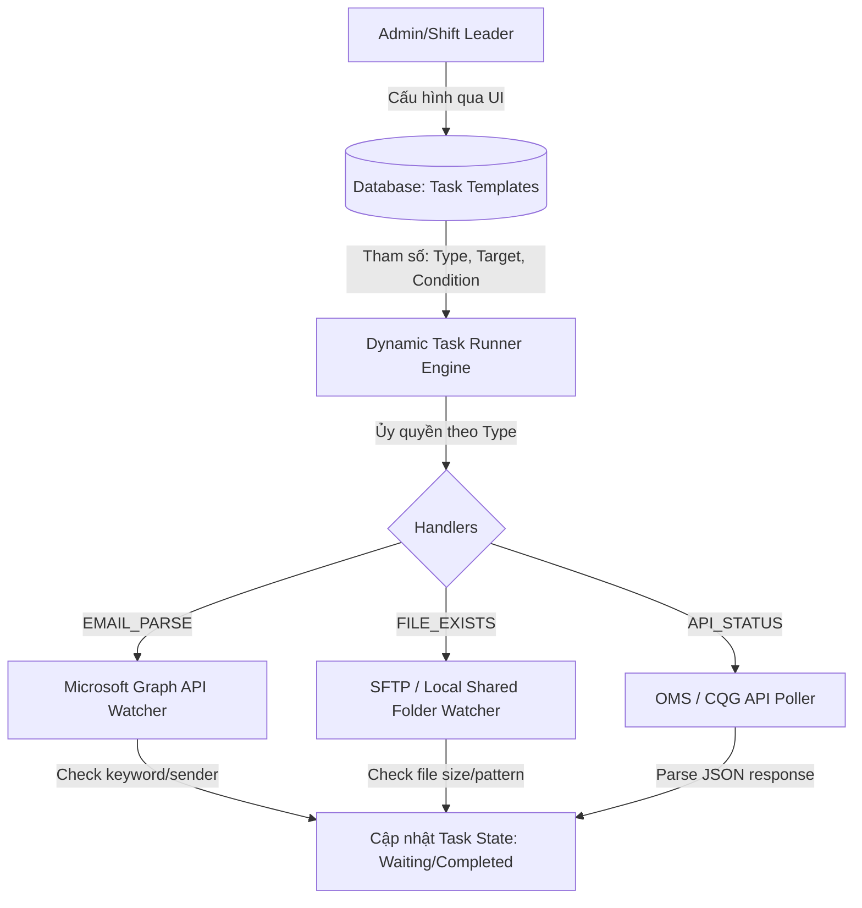

# BÁO CÁO PHÂN TÍCH & ĐÁNH GIÁ KIẾN TRÚC MÁY LƯU CHUYỂN CÔNG VIỆC (WORKFLOW ENGINE)

Báo cáo này sử dụng **Thuật toán Đánh giá Ma trận Quyết định có Trọng số (Weighted Decision Matrix)** để phân tích và lựa chọn kiến trúc tối ưu nhất cho hệ thống checklist trực ca **MXV Shift Checklist**, giải quyết triệt để các bài toán tích hợp hệ thống WinForms cũ và tối ưu hóa quản lý luồng công việc ca trực.

---

## 1. Kết Quả Thuật Toán Đánh Giá (Decision Matrix)

Thuật toán đã thực hiện chấm điểm từ 1 đến 10 cho 3 phương án kiến trúc dựa trên 5 tiêu chí nghiệp vụ thực tế của MXV. Kết quả tổng hợp điểm số có trọng số cụ thể như sau:

| Tiêu chí | Trọng số | Phương án A: Hardcoded | Phương án B: Dedicated Engine (Temporal/Airflow) | Phương án C: Decoupled Parameterized (Khuyên dùng) |
| :--- | :---: | :---: | :---: | :---: |
| **Khả năng bảo trì khi nghiệp vụ thay đổi (Maintainability)** | 25% | 2 (0.50) | **9 (2.25)** | **9 (2.25)** |
| **Thời gian & Độ phức tạp triển khai (Time to Market)** | 20% | **9 (1.80)** | 3 (0.60) | 8 (1.60) |
| **Tích hợp Legacy WinForms không xâm lấn (Legacy Integration)** | 20% | 4 (0.80) | 6 (1.20) | **9 (1.80)** |
| **Khả năng Audit & Theo dõi Trạng thái (Observability)** | 15% | 5 (0.75) | **10 (1.50)** | 9 (1.35) |
| **Chi phí vận hành & Tài nguyên hệ thống (Resource Overhead)** | 20% | 8 (1.60) | 3 (0.60) | **9 (1.80)** |
| **TỔNG ĐIỂM (WEIGHTED SCORE)** | **100%** | **5.45** | **6.15** | **8.80** |

> [!IMPORTANT]
> **Kết luận từ Thuật toán:** **Phương án C - Decoupled Parameterized Workflow Engine** là giải pháp tối ưu nhất cho MXV với điểm số vượt trội (**8.80/10**), cân bằng hoàn hảo giữa khả năng bảo trì lâu dài, tốc độ bàn giao và khả năng tích hợp không xâm lấn với các công cụ WinForms hiện tại.

---

## 2. Chi Tiết Các Phương Án Kiến Trúc

### Phương án A: Hardcoded Services (Viết Code Cứng Từng Task)
* **Cách hoạt động:** Viết trực tiếp logic kiểm tra bằng code cứng (hardcode) trong NestJS cho từng tác vụ (ví dụ: hàm `checkJobSnapshotEmail()`, `checkEodReportFile()`).
* **Ưu điểm:**
  * Dễ viết, nhanh có sản phẩm chạy thử (MVP) ngay lập tức.
* **Nhược điểm:**
  * **Cực kỳ khó bảo trì:** Khi IT thay đổi tiêu đề email, đường dẫn thư mục, hoặc khi nghiệp vụ bổ sung tác vụ mới (như Task 6.1), bạn bắt buộc phải sửa code backend, build lại và deploy lại hệ thống.
  * Phình to mã nguồn (Spaghetti code) và dễ xảy ra lỗi ngoài ý muốn khi sửa đổi các task cũ.

### Phương án B: Dedicated Workflow Engine (Sử dụng Airflow, Temporal, Camunda)
* **Cách hoạt động:** Cài đặt một hệ thống quản lý luồng chuyên dụng bên ngoài độc lập, định nghĩa các task dưới dạng DAGs (Directed Acyclic Graphs).
* **Ưu điểm:**
  * Khả năng giám sát cực tốt, xử lý lỗi, retry tự động rất mạnh mẽ.
* **Nhược điểm:**
  * **Quá tải hệ thống (Overkill):** Yêu cầu dựng thêm cụm Server/Worker riêng (ví dụ: chạy Python/Go engine), làm tăng độ phức tạp hạ tầng mạng nội bộ MXV (vấn đề network, bảo mật).
  * Thời gian học và tích hợp rất dài, không phù hợp với nguồn lực phát triển hiện tại.

### Phương án C: Decoupled Parameterized Workflow Engine (Kiến trúc động hóa qua Parameter)
* **Cách hoạt động:** 
  * Tách biệt hoàn toàn phần **"Định nghĩa tham số" (Cấu hình)** lưu trong Database và phần **"Thực thi" (Core Engine/Handlers)** chạy trong Backend.
  * Backend chỉ viết một số ít các **General Handlers** (Bộ xử lý chung) như: `EMAIL_PARSE` (đọc email), `FILE_EXISTS` (quét file), `API_STATUS` (kiểm tra API), `DATA_COMPARE` (đối chiếu dữ liệu).
  * Mỗi tác vụ checklist sẽ được gán các tham số cấu hình động (`botCheckType`, `botCheckTarget`, `botSuccessCondition`, `botFailureAction`).
* **Ưu điểm:**
  * **Thay đổi không cần sửa code:** Khi tiêu đề email, đường dẫn thư mục backup, hoặc tham số đối chiếu thay đổi, Trực ca hoặc Admin chỉ cần vào màn hình **Admin Templates UI** trên giao diện Web để cập nhật thông số cấu hình. Hệ thống sẽ tự động áp dụng cấu hình mới ngay lập tức mà không cần deploy lại code.
  * Tận dụng tối đa tài nguyên sẵn có của NestJS + MongoDB mà không cần cài thêm công cụ cồng kềnh.

---

## 3. Cách Áp Dụng Thực Tế Vào 24 Tác Vụ Của MXV

Kiến trúc **Decoupled Parameterized** giải quyết các nghiệp vụ đặc thù của 24 tác vụ ca trực MXV bằng cách ánh xạ các tham số cấu hình động như sau:

### Các Tham Số Cấu Hình Chi Tiết:

1. **`botCheckType` (Loại kiểm tra):**
   * `EMAIL_PARSE`: Quét email (Graph API).
   * `FILE_EXISTS`: Kiểm tra sự tồn tại và thông tin tệp tin trong thư mục backup (Local/SFTP shared folder).
   * `API_STATUS`: Kiểm tra trạng thái hệ thống qua HTTP API.
   * `MANUAL_VERIFY`: Chờ người trực ca xác nhận thủ công (Maker-Checker).

2. **`botCheckTarget` (Đối tượng kiểm tra):**
   * Với `EMAIL_PARSE`: JSON chứa thông tin filter email (ví dụ: `{"sender": "anhdao@mxv.vn", "subject": "Job Snapshot"}`).
   * Với `FILE_EXISTS`: Đường dẫn hoặc mẫu tên file (ví dụ: `\\shared-folder\backup\EOD_${yyyy}${mm}${dd}_TTM.csv`).
   * Với `API_STATUS`: URL API cần gọi và phương thức (ví dụ: `GET http://oms.mxv.vn/api/v1/eod-status`).

3. **`botSuccessCondition` (Điều kiện thành công):**
   * Với `EMAIL_PARSE`: Từ khóa kiểm tra trong nội dung mail (ví dụ: `"thành công"` hoặc `"SUCCESS"`).
   * Với `FILE_EXISTS`: Điều kiện về kích thước file hoặc định dạng (ví dụ: `{"minSizeKb": 10}`).
   * Với `API_STATUS`: Giá trị JSON mong đợi (ví dụ: `{"status": "COMPLETED", "errorCode": 0}`).

---

## 4. Kế Hoạch Hiện Thực Hóa (Implementation Roadmap)

Chúng ta đã đi được 70% chặng đường của Sprint này bằng cách:
* [x] Thiết lập Schema Mongoose cho `botCheckType`, `botCheckTarget`, `botSuccessCondition`, `botFailureAction` trong template và shift logs.
* [x] Phát triển màn hình cấu hình dynamic bot cho Admin trên Frontend.
* [x] Tạo dữ liệu mẫu (seed database) cho 24 tác vụ QLGD với đầy đủ tham số cấu hình động.

**Các bước còn lại để hoàn tất hệ thống:**
1. Hoàn thiện service `EmailWatcher` tích hợp Microsoft Graph API để xử lý các task dạng `EMAIL_PARSE`.
2. Hoàn thiện service `FileWatcher` giám sát các tệp tin xuất ra từ tool IT nội bộ của MXV trong thư mục shared.
3. Liên kết các sự kiện phát ra từ Watchers với máy trạng thái (State Machine) của Checklist để tự động cập nhật trạng thái tác vụ ca trực theo thời gian thực (Realtime WebSockets).
