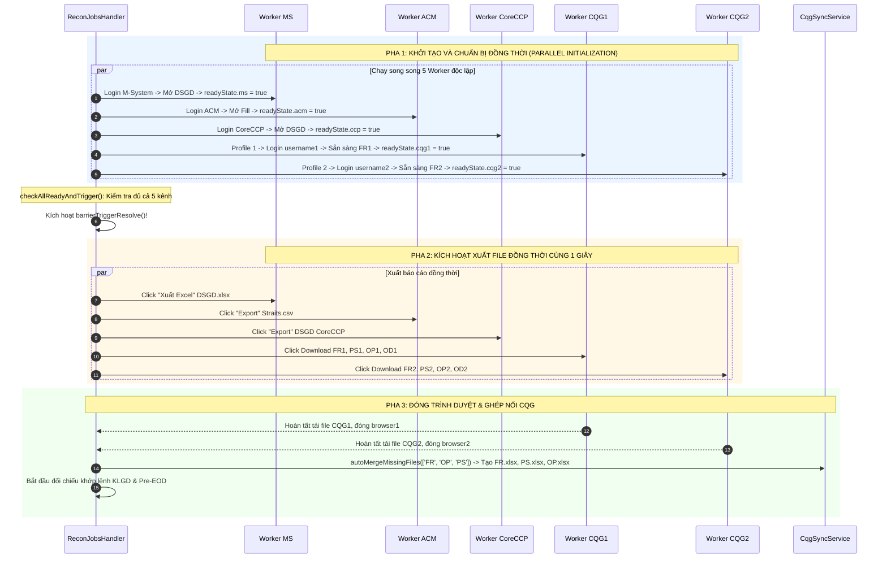

# TÀI LIỆU THIẾT KẾ TRIỂN KHAI KỸ THUẬT: TỐI ƯU HÓA TẢI SONG SONG 2 TÀI KHOẢN CQG (CQG1 & CQG2)

---

## 1. MỤC TIÊU & BỐI CẢNH DỰ ÁN

### 1.1. Mục tiêu
1. **Rút ngắn thời gian tải báo cáo CQG**: Giảm tổng thời gian tải các báo cáo CQG (`FR1, PS1, OP1, OD1, AS` và `FR2, PS2, OP2, OD2, AS`) từ **~2 phút 28 giây (148s)** xuống còn **~60 – 70 giây** (giảm hơn 50% thời gian chờ đợi).
2. **Triệt tiêu độ lệch pha thời gian (Time-skew Elimination)**: Đảm bảo cả hai tài khoản CQG1 và CQG2 xuất file báo cáo tại **cùng một giây** với M-System, CoreCCP và ACM, ngăn ngừa hoàn toàn các trường hợp lệch giả khớp lệnh (False Positive Mismatch) do lệnh mới phát sinh trong thời gian chờ giữa 2 tài khoản CQG.
3. **Tuân thủ kiến trúc chuẩn C# gốc**: Đưa kiến trúc NestJS/Playwright về đúng thiết kế gốc của Tool C# IT Tool ([TransactionCheckingService.cs#L78-L87](file:///C:/Users/hiepth/OneDrive%20-%20MERCANTILE%20EXCHANGE%20OF%20VIETNAM/Documents/Github/mxv-shift-checklist/it-tool-src/operate-transaction-app/Services/TransactionCheckingService.cs#L78-L87)).

---

## 2. ĐỐI CHIẾU HIỆN TRẠNG MÃ NGUỒN (AS-IS CODE AUDIT)

### 2.1. Tool C# gốc (`operate-transaction-app`)
* **Chức năng Đối Chiếu (`CheckKLGD`)**:
  - Mã nguồn: [TransactionCheckingService.cs#L78-L87](file:///C:/Users/hiepth/OneDrive%20-%20MERCANTILE%20EXCHANGE%20OF%20VIETNAM/Documents/Github/mxv-shift-checklist/it-tool-src/operate-transaction-app/Services/TransactionCheckingService.cs#L78-L87)
  ```csharp
  _fileUtils.DeleteAllFilesInDirectory(Path.Combine(AppDomain.CurrentDomain.BaseDirectory, "reports"));
  _fileUtils.DeleteAllFilesInDirectory(Path.Combine(AppDomain.CurrentDomain.BaseDirectory, "reports_cqg1"));
  _fileUtils.DeleteAllFilesInDirectory(Path.Combine(AppDomain.CurrentDomain.BaseDirectory, "reports_cqg2"));

  var taskMS = _chromeBot.DownloadTradingFileMS(TradingFiles);
  var taskCQG1 = _chromeBot.DownloadTradingFileCQG1(TradingFiles, "reports_cqg1");
  var taskCQG2 = _chromeBot.DownloadTradingFileCQG2(TradingFiles, "reports_cqg2");

  await Task.WhenAll(taskMS, taskCQG1, taskCQG2);
  ```
  - **Đặc điểm**: C# khởi chạy 2 instance Selenium WebDriver độc lập (`ChromeBot.cs#L1223` cho CQG1 và `#L1343` cho CQG2), tải vào 2 thư mục riêng biệt (`reports_cqg1`, `reports_cqg2`) và chạy **song song 100%** qua `Task.WhenAll`.

* **Chức năng Sao Lưu Riêng Lẻ (`RunBackup`)**:
  - Mã nguồn: [ChromeBot.cs#L516-L650](file:///C:/Users/hiepth/OneDrive%20-%20MERCANTILE%20EXCHANGE%20OF%20VIETNAM/Documents/Github/mxv-shift-checklist/it-tool-src/operate-transaction-app/Services/ChromeBot.cs#L516-L650)
  - C# viết tuần tự: `if (isBackupCQG1)` đóng trình duyệt rồi mới sang `if (isBackupCQG2)`.

---

### 2.2. Hệ thống NestJS Hiện Tại
Hệ thống NestJS hiện đang bị phân tách bất đối xứng giữa Job Handler và Service:

1. **Tầng Job Handler** ([recon-jobs.handler.ts#L633-L639](file:///c:/Users/hiepth/OneDrive%20-%20MERCANTILE%20EXCHANGE%20OF%20VIETNAM/Documents/Github/mxv-cqg-download-investigation/backend/src/modules/bot-engine/handlers/recon-jobs.handler.ts#L633-L639)):
   - Đã song song hóa 4 Worker bên ngoài qua `Promise.allSettled`: `runWorkerMs()`, `runWorkerAcm()`, `runWorkerCcp()`, `runWorkerCqg()`.
2. **Tầng RPA Downloader** ([rpa-downloader.service.ts#L4530-L4735](file:///c:/Users/hiepth/OneDrive%20-%20MERCANTILE%20EXCHANGE%20OF%20VIETNAM/Documents/Github/mxv-cqg-download-investigation/backend/src/modules/bot-engine/rpa-downloader.service.ts#L4530-L4735)):
   - Hàm `downloadCqgBackup` được bóc tách từ logic `RunBackup` của C# (vốn chạy tuần tự).
   - **CQG1** ([L4530-L4639](file:///c:/Users/hiepth/OneDrive%20-%20MERCANTILE%20EXCHANGE%20OF%20VIETNAM/Documents/Github/mxv-cqg-download-investigation/backend/src/modules/bot-engine/rpa-downloader.service.ts#L4530-L4639)): Mở `browser1`, đăng nhập `username1`, phát tín hiệu `onReadyBarrier()` tại dòng [L4571](file:///c:/Users/hiepth/OneDrive%20-%20MERCANTILE%20EXCHANGE%20OF%20VIETNAM/Documents/Github/mxv-cqg-download-investigation/backend/src/modules/bot-engine/rpa-downloader.service.ts#L4571), tải `FR1, PS1, OP1, OD1, AS1`, đóng browser1, nghỉ 3 giây ([L4637](file:///c:/Users/hiepth/OneDrive%20-%20MERCANTILE%20EXCHANGE%20OF%20VIETNAM/Documents/Github/mxv-cqg-download-investigation/backend/src/modules/bot-engine/rpa-downloader.service.ts#L4637)).
   - **CQG2** ([L4642-L4732](file:///c:/Users/hiepth/OneDrive%20-%20MERCANTILE%20EXCHANGE%20OF%20VIETNAM/Documents/Github/mxv-cqg-download-investigation/backend/src/modules/bot-engine/rpa-downloader.service.ts#L4642-L4732)): Mở `browser2`, đăng nhập `username2`, tải `FR2, PS2, OP2, OD2, AS2` mà **hoàn toàn không có rào cản đồng bộ** (không có `onReadyBarrier`).
   - **Hậu quả**:
     - Tổng thời gian bị cộng dồn: $70\text{s} + 3\text{s} + 75\text{s} = \mathbf{2\text{m}28\text{s}}$.
     - `FR1` được xuất tại giây thứ 52 (`08:07:52`), trong khi `FR2` được xuất tại giây `08:08:50` (chậm hơn 1 phút).

---

## 3. ĐÁNH GIÁ SÂU CÁC YẾU TỐ KỸ THUẬT (TECHNICAL FEASIBILITY)

### 3.1. Cô Lập Thư Mục Hồ Sơ & File Lock (Profile Isolation & SingletonLock)
- Hệ thống đã phân tách độc lập 2 thư mục profile tại [rpa-downloader.service.ts#L4382-L4386](file:///c:/Users/hiepth/OneDrive%20-%20MERCANTILE%20EXCHANGE%20OF%20VIETNAM/Documents/Github/mxv-cqg-download-investigation/backend/src/modules/bot-engine/rpa-downloader.service.ts#L4382-L4386):
  - CQG1: `temp/cqg_profile_1`
  - CQG2: `temp/cqg_profile_2`
- Cơ chế dọn dẹp file lock tự động trước khi launch ([L4391-L4402](file:///c:/Users/hiepth/OneDrive%20-%20MERCANTILE%20EXCHANGE%20OF%20VIETNAM/Documents/Github/mxv-cqg-download-investigation/backend/src/modules/bot-engine/rpa-downloader.service.ts#L4391-L4402)):
  ```typescript
  const lockFiles = ['SingletonLock', 'SingletonCookie', 'SingletonSocket'];
  for (const file of lockFiles) {
    const lockPath = path.join(profileDir, file);
    if (fs.existsSync(lockPath)) fs.unlinkSync(lockPath);
  }
  ```
- **Kết luận**: Đảm bảo an toàn 100%, không xảy ra xung đột `SingletonLock` khi mở đồng thời 2 trình duyệt Playwright.

### 3.2. Tiêu Thụ Tài Nguyên Hệ Thống (RAM & CPU)
- Khi chạy đồng thời 5 trình duyệt Chromium Headless:
  - 1 Chromium cho M-System: ~180MB RAM
  - 1 Chromium cho ACM: ~200MB RAM
  - 1 Chromium cho CoreCCP: ~190MB RAM
  - 2 Chromium cho CQG (CQG1 & CQG2): ~220MB * 2 = ~440MB RAM
  - **Tổng RAM tiêu thụ**: ~1.01GB RAM.
- Cấu hình server Ubuntu Production đã nâng trần PM2 `max_memory_restart: '2500M'` ([CHANGELOG_AI.md#L3573](file:///c:/Users/hiepth/OneDrive%20-%20MERCANTILE%20EXCHANGE%20OF%20VIETNAM/Documents/Github/mxv-cqg-download-investigation/CHANGELOG_AI.md#L3573)) $\implies$ Dư thừa an toàn > 1.4GB RAM.

### 3.3. Tên Tệp Xuất Ra & Không Gian Đĩa
- Bộ file tải của CQG1 và CQG2 là các tập hợp rời rạc hoàn toàn (Disjoint sets):
  - CQG1: `FR1.xlsx`, `PS1.xlsx`, `OP1.xlsx`, `OD1.xlsx`, `AS1.xlsx`
  - CQG2: `FR2.xlsx`, `PS2.xlsx`, `OP2.xlsx`, `OD2.xlsx`, `AS2.xlsx`
- **Kết luận**: Ghi đồng thời vào cùng thư mục `cqgDailyPath` mà không có bất kỳ xung đột file nào.

---

## 4. THIẾT KẾ KIẾN TRÚC MỚI (TO-BE ARCHITECTURE)

### 4.1. Rào Cản Đồng Bộ 5 Kênh (5-Channel Barrier Synchronization)



---

## 5. THIẾT KẾ MÃ NGUỒN CHI TIẾT (IMPLEMENTATION CODE)

### 5.1. Thay đổi trong `rpa-downloader.service.ts`

Chữ ký hàm và logic thực thi chuyển sang song song:

```typescript
async downloadCqgBackup(
  reports: Partial<
    Record<
      'FR1' | 'PS1' | 'OP1' | 'OD1' | 'FR2' | 'PS2' | 'OP2' | 'OD2' | 'AS',
      boolean
    >
  > & { cleanOnly?: boolean },
  destDir: string,
  onReadyBarrierCqg1?: () => Promise<void>,
  onReadyBarrierCqg2?: () => Promise<void>,
): Promise<{ errors: string[]; downloaded: string[] }> {
  const errors: string[] = [];
  const downloaded: string[] = [];
  if (!fs.existsSync(destDir)) fs.mkdirSync(destDir, { recursive: true });

  const credRaw = await this.settingsService.getSetting('bot_credentials_cqg', '');
  if (!credRaw) throw new Error('Chưa cấu hình tài khoản CQG (bot_credentials_cqg).');
  const creds = JSON.parse(decrypt(credRaw));

  // ── WORKER CON 1: XỬ LÝ TÀI KHOẢN CQG1 ──────────────────────────────────────
  const runCqg1 = async () => {
    const needCqg1 = reports.FR1 || reports.PS1 || reports.OP1 || reports.OD1 || reports.AS;
    if (!needCqg1) return;
    const username1 = creds.username1 || creds.usernameCQG1;
    const password1 = creds.password1 || creds.passwordCQG1;
    if (!username1 || !password1) {
      errors.push('Thiếu tài khoản CQG1 Trade (username1/password1)');
      return;
    }

    let browser1: any = null;
    let page1: Page | null = null;
    try {
      const session = await loginCqgAccount(username1, password1, '1');
      browser1 = session.browser;
      page1 = session.page;
      await new Promise((r) => setTimeout(r, 5000));

      if (onReadyBarrierCqg1) {
        this.logger.log('[CQG1] Đã sẵn sàng tại màn hình FR1. Kích hoạt rào cản...');
        await onReadyBarrierCqg1();
      }

      if (reports.FR1) {
        await this.downloadCqgFR(page1, path.join(destDir, 'FR1.xlsx'), ensureSessionActive1);
        downloaded.push('FR1.xlsx');
      }
      if (reports.PS1) {
        await this.downloadCqgPS(page1, path.join(destDir, 'PS1.xlsx'), ensureSessionActive1);
        downloaded.push('PS1.xlsx');
      }
      if (reports.OP1) {
        await this.downloadCqgOP(page1, path.join(destDir, 'OP1.xlsx'), ensureSessionActive1);
        downloaded.push('OP1.xlsx');
      }
      if (reports.OD1) {
        await this.downloadCqgOD(page1, path.join(destDir, 'OD1.xlsx'), ensureSessionActive1);
        downloaded.push('OD1.xlsx');
      }
      if (reports.AS) {
        await this.downloadCqgAS(page1, path.join(destDir, 'AS1.xlsx'));
        downloaded.push('AS1.xlsx');
      }
    } catch (e: any) {
      errors.push(`CQG1 lỗi: ${e.message}`);
      throw e;
    } finally {
      if (page1) await this.logoutCqg(page1).catch(() => {});
      if (browser1) await browser1.close().catch(() => {});
      this.logger.log('[CQG1] Đã đóng trình duyệt CQG1.');
    }
  };

  // ── WORKER CON 2: XỬ LÝ TÀI KHOẢN CQG2 ──────────────────────────────────────
  const runCqg2 = async () => {
    const needCqg2 = reports.FR2 || reports.PS2 || reports.OP2 || reports.OD2 || reports.AS;
    if (!needCqg2) return;
    const username2 = creds.username2 || creds.usernameCQG2;
    const password2 = creds.password2 || creds.passwordCQG2;
    if (!username2 || !password2) {
      errors.push('Thiếu tài khoản CQG2/CQG3 Trade (username2/password2)');
      return;
    }

    let browser2: any = null;
    let page2: Page | null = null;
    try {
      const session = await loginCqgAccount(username2, password2, '2');
      browser2 = session.browser;
      page2 = session.page;
      await new Promise((r) => setTimeout(r, 5000));

      if (onReadyBarrierCqg2) {
        this.logger.log('[CQG2] Đã sẵn sàng tại màn hình FR2. Kích hoạt rào cản...');
        await onReadyBarrierCqg2();
      }

      if (reports.FR2) {
        await this.downloadCqgFR(page2, path.join(destDir, 'FR2.xlsx'), ensureSessionActive2);
        downloaded.push('FR2.xlsx');
      }
      if (reports.PS2) {
        await this.downloadCqgPS(page2, path.join(destDir, 'PS2.xlsx'), ensureSessionActive2);
        downloaded.push('PS2.xlsx');
      }
      if (reports.OP2) {
        await this.downloadCqgOP(page2, path.join(destDir, 'OP2.xlsx'), ensureSessionActive2);
        downloaded.push('OP2.xlsx');
      }
      if (reports.OD2) {
        await this.downloadCqgOD(page2, path.join(destDir, 'OD2.xlsx'), ensureSessionActive2);
        downloaded.push('OD2.xlsx');
      }
      if (reports.AS) {
        await this.downloadCqgAS(page2, path.join(destDir, 'AS2.xlsx'));
        downloaded.push('AS2.xlsx');
      }
    } catch (e: any) {
      errors.push(`CQG2 lỗi: ${e.message}`);
      throw e;
    } finally {
      if (page2) await this.logoutCqg(page2).catch(() => {});
      if (browser2) await browser2.close().catch(() => {});
      this.logger.log('[CQG2] Đã đóng trình duyệt CQG2.');
    }
  };

  // KÍCH HOẠT CHẠY SONG SONG CẢ 2 TÀI KHOẢN ĐỒNG THỜI
  await Promise.allSettled([runCqg1(), runCqg2()]);
  return { errors, downloaded };
}
```

---

### 5.2. Thay đổi trong `recon-jobs.handler.ts`

```typescript
// 1. Mở rộng rào cản 5 kênh
const readyState = {
  ms: false,
  acm: false,
  ccp: false,
  cqg1: false,
  cqg2: false,
};

const checkAllReadyAndTrigger = () => {
  if (barrierAborted) return;
  if (readyState.ms && readyState.acm && readyState.ccp && readyState.cqg1 && readyState.cqg2) {
    if (!barrierAnnounced) {
      barrierAnnounced = true;
      log('🎯 Tất cả 5 kênh (MS, ACM, CoreCCP, CQG1, CQG2) đều đã sẵn sàng! KÍCH HOẠT XUẤT FILE ĐỒNG THỜI.');
    }
    triggerBarrierResolve();
  }
};

// 2. Định nghĩa callback riêng biệt cho CQG1 và CQG2
const onReadyBarrierCqg1 = async () => {
  readyState.cqg1 = true;
  log('CQG1 🟢 CQG1 đã đăng nhập và sẵn sàng xuất FR1. Chờ rào cản đồng bộ...');
  checkAllReadyAndTrigger();
  await barrierTriggerPromise;
  log('CQG1 🚀 [Pha 2] Kích hoạt xuất FR1.xlsx...');
};

const onReadyBarrierCqg2 = async () => {
  readyState.cqg2 = true;
  log('CQG2 🟢 CQG2 đã đăng nhập và sẵn sàng xuất FR2. Chờ rào cản đồng bộ...');
  checkAllReadyAndTrigger();
  await barrierTriggerPromise;
  log('CQG2 🚀 [Pha 2] Kích hoạt xuất FR2.xlsx...');
};

const result = await this.rpaDownloaderService.downloadCqgBackup(
  filesToDownload,
  cqgDailyPath,
  onReadyBarrierCqg1,
  onReadyBarrierCqg2,
);
```

---

## 6. KẾ HOẠCH KIỂM THỬ & TIÊU CHÍ NGHIỆM THU (TEST PLAN)

### 6.1. Script Kiểm Thử Song Song Độc Lập (USER Tự Chạy theo Rule 8)
- Tạo file script: `backend/src/scripts/test_cqg_parallel_live.ts`
- Lệnh chạy:
  ```bash
  npx ts-node -r tsconfig-paths/register backend/src/scripts/test_cqg_parallel_live.ts
  ```

### 6.2. Tiêu Chí Nghiệm Thu (Acceptance Criteria)

| STT | Hạng mục kiểm thử | Tiêu chí đạt (Pass Criteria) |
| :--- | :--- | :--- |
| **AC-1** | **Thời gian hoàn tất tải** | Tổng thời gian tải cả 2 tài khoản CQG1 và CQG2 **dưới 70 giây** (trước đây 148 giây). |
| **AC-2** | **Đồng bộ thời điểm xuất** | `FR1.xlsx` và `FR2.xlsx` có `mtime` (modified timestamp) chênh lệch **không quá 2 giây**. |
| **AC-3** | **Tính toàn vẹn tệp tin** | Cả `FR1.xlsx` và `FR2.xlsx` tải về có dung lượng > 0 bytes, mở được bằng Excel, không lỗi file format. |
| **AC-4** | **Tự động ghép nối** | Hàm `cqgSyncService.autoMergeMissingFiles` ghép thành công `FR.xlsx` có số dòng bằng tổng dòng của `FR1` và `FR2`. |
| **AC-5** | **Khả năng cách ly lỗi** | Nếu CQG2 cố tình cấu hình sai pass, CQG1 vẫn tải xong `FR1.xlsx` và thông báo lỗi rõ ràng của CQG2 mà không làm sập tiến trình chung. |

---

*Tài liệu được khởi tạo và lưu trữ chính thức tại*: [backend/docs/THIET_KE_TRIEN_KHAI_TAI_SONG_SONG_CQG.md](file:///c:/Users/hiepth/OneDrive%20-%20MERCANTILE%20EXCHANGE%20OF%20VIETNAM/Documents/Github/mxv-cqg-download-investigation/backend/docs/THIET_KE_TRIEN_KHAI_TAI_SONG_SONG_CQG.md)
