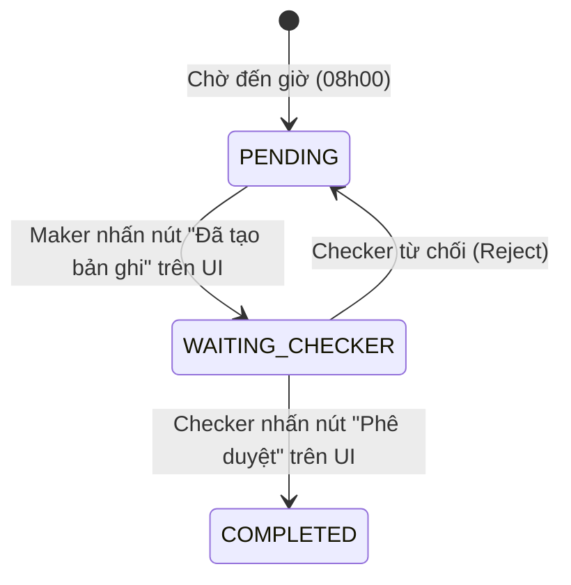

# BÁO CÁO PHÂN TÍCH TÍNH KHẢ THI & PHƯƠNG ÁN TÍCH HỢP BOT THỰC TẾ (MXV CHECKLIST)

Báo cáo này phân tích sâu về kỹ thuật, trả lời câu hỏi: **"Việc tạo Bot có khó không? Tính khả thi thế nào khi đối mặt với 3 kịch bản tích hợp thực tế tại MXV?"**

---

## 1. Đánh Giá Tổng Quan: Việc Tạo Bot Có Khó Không?

* **Về mặt lập trình (Code Logic): KHÔNG KHÓ.**
  * Các tác vụ của Bot thực chất chỉ là các đoạn mã ngắn (Scripts) thực hiện: đọc email (qua Graph API), đọc/ghi file Excel, gọi HTTP API, hoặc truy vấn database.
* **Về mặt vận hành hệ thống (Security & Infrastructure): KHÓ.**
  * Rào cản lớn nhất khi làm bot vận hành trong ngành tài chính/giao dịch là **Chính sách bảo mật (Security Policy) và Mạng (Networking)**. Để bot chạy được, bạn cần phòng IT mở cổng Firewall, cấp tài khoản Service Account có quyền đọc SFTP, cấp quyền App Registration trên Azure AD để đọc mail.

---

## 2. Giải Pháp Thực Tế Cho 3 Kịch Bản Tích Hợp Đặc Thù

### KỊCH BẢN 1: Đọc kết quả từ Tool đối chiếu có sẵn của IT (Tool-to-Bot)
* **Thực tế:** Tool đối chiếu số dư do IT thiết kế đã chạy ngầm và có sẵn logic nghiệp vụ riêng. Làm thế nào Bot của Checklist biết được kết quả?

#### Giải pháp khả thi nhất: Cơ chế Webhook (Push) hoặc Quét Email/DB (Pull)
* **Cách 1 (Khuyên dùng - Webhook):** Bạn đề xuất đội IT thêm một dòng lệnh nhỏ ở cuối Tool đối chiếu của họ. Khi Tool chạy xong, nó sẽ gửi một HTTP POST request (gọi là Webhook) sang API của hệ thống Checklist để cập nhật trạng thái tác vụ.
  * *Code minh họa phía Backend Checklist:*
    ```typescript
    @Post('webhook/it-reconciliation')
    async handleItToolResult(@Body() dto: { status: 'SUCCESS' | 'FAILED'; errorDetails?: string }) {
      const taskId = "TASK_009"; // ID của Tác vụ 9
      await this.taskService.updateStatusFromBot(taskId, dto.status, dto.errorDetails);
      if (dto.status === 'FAILED') {
         await this.telegramService.sendAlert(`[Cảnh báo] Phát hiện lệch số liệu MS vs CQG! Chi tiết: ${dto.errorDetails}`);
      }
      return { received: true };
    }
    ```
* **Cách 2 (Quét Email):** Nếu không thể sửa code Tool IT, ta dùng Bot quét email cảnh báo lệch gửi về hòm thư ca trực (như câu trả lời Q25).

---

### KỊCH BẢN 2: Gọi API trực tiếp hoặc kiểm tra điều kiện hệ thống
* **Thực tế:** Kiểm tra trạng thái EOD của CCP/CE qua API, kiểm tra CQG reset.

#### Giải pháp khả thi nhất: Polling Job (Cron-job quét tuần tự)
* Hệ thống Checklist sẽ chạy một tiến trình ngầm (Cron-job) cứ mỗi 1 hoặc 5 phút để gọi API của hệ thống đích và tự động cập nhật trạng thái khi thỏa mãn điều kiện.
* *Ví dụ luồng kiểm tra CQG Reset:*
  ```javascript
  // Cron-job chạy mỗi 5 phút từ 05h00 đến 06h00 sáng
  async checkCqgResetJob() {
    const isReset = await this.cqgService.checkResetStatus(); // Gọi API CQG Cast hoặc đọc file Excel giao dịch
    if (isReset) {
      await this.taskService.updateStatus("TASK_005_PRECONDITION", "READY");
      await this.telegramService.sendNotification("CQG đã reset xong! Sẵn sàng thực hiện SOD.");
    }
  }
  ```

---

### KỊCH BẢN 3: Chờ con người thực hiện (Maker-Checker / Human-in-the-loop)
* **Thực tế:** Tác vụ 8 (Thay đổi ký quỹ) ca 1 tạo (Maker), ca 2 duyệt (Checker). Hoặc Tác vụ 5 (SOD) bắt buộc người bấm nút trên MS rồi hệ thống mới chạy tiếp.

#### Giải pháp khả thi nhất: State Machine (Máy trạng thái luồng phối hợp)
* Tác vụ không chỉ có 2 trạng thái (Chưa làm / Đã làm) mà có một vòng đời (State Lifecycle) được quản lý chặt chẽ:



* **Quy trình hoạt động:**
  1. Đến 08h00, Tác vụ 8 chuyển sang `PENDING`. UI hiển thị nút **[Khai báo thay đổi]** dành riêng cho tài khoản có role Maker.
  2. Maker bấm nút và điền mã phê duyệt. Task chuyển sang `WAITING_CHECKER`.
  3. Hệ thống tự động bắn tin nhắn Telegram tới nhóm quản lý: *"Bản ghi ký quỹ mới đang chờ phê duyệt"*. UI hiển thị nút **[Phê duyệt]** dành riêng cho tài khoản Checker.
  4. Checker nhấn duyệt -> Task hoàn thành (`COMPLETED`).

---

## 3. Lộ Trình Phát Triển Thực Tế Cho MXV (Roadmap)

Để đạt tính thực thi cao nhất, tránh quá tải cho đội phát triển, bạn nên chia làm **3 giai đoạn**:

* **Giai đoạn 1 (Lấy con người làm gốc):** Xây dựng giao diện Checklist hoàn chỉnh. Các tác vụ tạm thời là **100% thủ công** (người tự check tự bấm nút). Giai đoạn này giúp nhân viên quen với quy trình số hóa và tích lũy dữ liệu log ca trực.
* **Giai đoạn 2 (Bán tự động hóa - Quick Wins):** Phát triển các Bot dễ trước: Bot quét email Job Snapshot (Tác vụ 1), Bot nhận email cảnh báo lệch từ Tool IT (Tác vụ 9), Bot tự soạn báo cáo Ban giám sát (Tác vụ 13).
* **Giai đoạn 3 (Tự động hóa sâu):** Viết API kết nối trực tiếp database đối chiếu chéo (Tác vụ 6.1), gọi API OMS, tự động kiểm tra thư mục backup.
