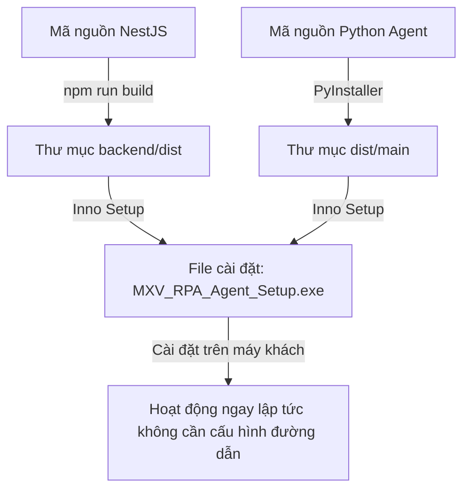

# Hướng dẫn Đóng gói Gộp (Bundle Packaging Guide) — MXV RPA Agent

Tài liệu này hướng dẫn chi tiết cách đóng gói **MXV RPA Agent (Python/PyQt6)** và **Backend (NestJS/Node.js)** thành một bộ cài đặt duy nhất (`.exe` installer) bằng **Inno Setup**. 

Sau khi cài đặt bằng file này trên máy tính khác, Agent sẽ **tự động nhận diện** thư mục Backend đi kèm để chạy trực tiếp mà không cần người dùng phải cấu hình đường dẫn thủ công.

---

## 📌 Tổng quan luồng đóng gói


---

## 🛠 Bước 1: Build phần Backend NestJS
Trên máy phát triển, hãy biên dịch mã nguồn NestJS thành Javascript dạng production (nằm trong thư mục `dist`).

1. Mở terminal tại thư mục `backend`:
   ```powershell
   cd d:\sontayweb\mxv-shift-checklist\backend
   ```
2. Cài đặt các thư viện phụ thuộc:
   ```powershell
   npm install
   ```
3. Biên dịch dự án:
   ```powershell
   npm run build
   ```
   *Kết quả: Thư mục `backend/dist` sẽ được tạo ra chứa mã chạy production.*

---

## 🐍 Bước 2: Build phần Python Agent (PyInstaller)
Chúng ta sẽ biên dịch phần giao diện Python thành tệp thực thi độc lập (`.exe`).

1. Di chuyển tới thư mục `rpa-agent`:
   ```powershell
   cd d:\sontayweb\mxv-shift-checklist\deployment\rpa-agent
   ```
2. Cài đặt thư viện `pyinstaller` trong môi trường ảo:
   ```powershell
   .\venv\Scripts\pip install pyinstaller
   ```
3. Chạy lệnh biên dịch dưới dạng thư mục (`--onedir`) để dễ dàng tích hợp thư mục con:
   ```powershell
   .\venv\Scripts\pyinstaller --noconfirm --onedir --windowed --add-data "app/assets;app/assets" --icon "app/assets/icon.ico" --name "MXV_RPA_Agent" app/main.py
   ```
   *Kết quả: Một thư mục chứa ứng dụng hoàn chỉnh sẽ xuất hiện tại `deployment/rpa-agent/dist/MXV_RPA_Agent/`.*

---

## 📦 Bước 3: Tạo File Cài Đặt Gộp bằng Inno Setup
Chúng ta sẽ viết tập lệnh Inno Setup để gộp ứng dụng Python, mã build NestJS, tệp cấu hình và thư mục thư viện thành một bộ cài đặt Windows chuyên nghiệp.

1. Tải và cài đặt **Inno Setup** (bản mới nhất) tại: https://jrsoftware.org/isdl.php
2. Tạo một tệp tập lệnh đặt tên là `setup.iss` nằm tại thư mục `deployment/rpa-agent/setup.iss` với nội dung sau:

```ini
; Script tạo bộ cài đặt MXV RPA Agent gộp Backend NestJS
#define MyAppName "MXV RPA Agent"
#define MyAppVersion "1.0.0"
#define MyAppPublisher "MXV"
#define MyAppExeName "MXV_RPA_Agent.exe"

[Setup]
AppId={{C3E96D9C-B6D7-4B29-873F-F012AB4CE8D3}
AppName={#MyAppName}
AppVersion={#MyAppVersion}
AppPublisher={#MyAppPublisher}
DefaultDirName={userpf}\{#MyAppName}
DefaultGroupName={#MyAppName}
DisableProgramGroupPage=yes
OutputDir=.\installer_output
OutputBaseFilename=MXV_RPA_Agent_Setup
SetupIconFile=.\app\assets\icon.ico
Compression=lzma
SolidCompression=yes
ArchitecturesInstallIn64BitMode=x64

[Languages]
Name: "english"; MessagesFile: "compiler:Default.isl"

[Tasks]
Name: "desktopicon"; Description: "{cm:CreateDesktopIcon}"; GroupDescription: "{cm:AdditionalIcons}"; Flags: unchecked

[Files]
; 1. Copy toàn bộ thư mục Python Agent đã build
Source: ".\dist\MXV_RPA_Agent\*"; DestDir: "{app}"; Flags: ignoreversion recursesubdirs createallsubdirs

; 2. Copy toàn bộ thư mục Backend NestJS đã build (chỉ copy dist, node_modules và package.json)
Source: "..\..\backend\dist\*"; DestDir: "{app}\backend\dist"; Flags: ignoreversion recursesubdirs createallsubdirs
Source: "..\..\backend\package.json"; DestDir: "{app}\backend"; Flags: ignoreversion
Source: "..\..\backend\node_modules\*"; DestDir: "{app}\backend\node_modules"; Flags: ignoreversion recursesubdirs createallsubdirs

; 3. Tạo file config.json mẫu (bỏ trống workspace_path để tự động nhận diện)
Source: ".\config.json"; DestDir: "{app}"; Flags: ignoreversion

[Icons]
Name: "{group}\{#MyAppName}"; Filename: "{app}\{#MyAppExeName}"
Name: "{autodesktop}\{#MyAppName}"; Filename: "{app}\{#MyAppExeName}"; Tasks: desktopicon

[Run]
Filename: "{app}\{#MyAppExeName}"; Description: "{cm:LaunchProgram,{#StringChange(MyAppName, '&', '&&')}}"; Flags: nowait postinstall skipifsilent
```

3. Mở phần mềm **Inno Setup Compiler**, nạp tệp `setup.iss` vừa tạo và chọn **Build -> Compile** (hoặc ấn `F9`).
   * *Kết quả: Tệp cài đặt gộp `MXV_RPA_Agent_Setup.exe` sẽ được xuất ra trong thư mục `deployment/rpa-agent/installer_output/`.*

---

## 🚀 Cách thức hoạt động tự động sau khi cài đặt
Chúng tôi đã tích hợp cơ chế **tự động quét đường dẫn** trong nhân của Agent (`agent_core.py`). Khi người dùng mở ứng dụng trên máy mới:

1. Agent đọc tệp `config.json`. Nếu trường `workspace_path` trống (do không cấu hình thủ công).
2. Agent sẽ tự động kiểm tra xem có thư mục con tên là `backend` nằm ngay cạnh tệp thực thi `MXV_RPA_Agent.exe` hay không.
3. Vì bộ cài Inno Setup đã tự động đặt thư mục `backend` vào đúng vị trí này, Agent sẽ **nhận diện được ngay lập tức** và gọi Node.js chạy các tiến trình đối chiếu báo cáo ngầm mà không phát sinh lỗi đường dẫn.

---
*Lưu ý: Máy cài đặt cần được cài đặt sẵn Node.js (được thêm vào biến môi trường PATH) để thực thi lệnh gọi NestJS CLI.*
