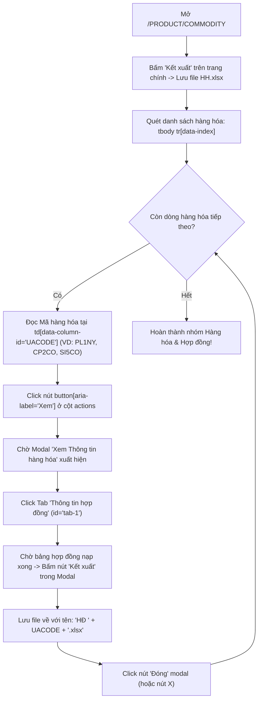

# THIẾT KẾ CHI TIẾT: PHÂN HỆ BACKUP CORECCP (VNCLEAR)
## Hoàn thiện Bot Tự Động Tải Trọn Bộ 25 File Thực Tế Hàng Ngày Của Maker

> **Phiên bản**: v2.1 (Ground Truth Confirmed with DOM & UI Screenshots) | **Ngày cập nhật**: 17/09/2026  
> **Trạng thái**: Bản thiết kế kỹ thuật chuẩn xác 100% — Đã xác thực DOM, Selector và Chỉ đạo trực tiếp từ USER  
>
> **Bằng chứng mặt đất (Proof of Ground Truth)**:
> - Thư mục mẫu Maker tải hàng ngày: [`Backup CCP`](file:///c:/Users/hiepth/OneDrive%20-%20MERCANTILE%20EXCHANGE%20OF%20VIETNAM/Documents/Github/mxv-cqg-download-investigation/Backup%20CCP) (Chính xác 25 file `.xlsx`)
> - DOM HTML thực tế & Ảnh chụp thao tác VNCLEAR do USER cung cấp ngày 17/09/2026:
>   + Màn hình Quản lý hàng hóa, hợp đồng: [`/PRODUCT/COMMODITY`](https://coreccp.vnclear.vn/PRODUCT/COMMODITY)
>   + Nút Xem chi tiết: `button[aria-label="Xem"]`
>   + Modal Tab: `#tab-1` ("Thông tin hợp đồng") $\rightarrow$ Nút `Kết xuất` trong Modal
> - Từ điển Menu & Schema VNCLEAR đã cào thực tế: [`core_ccp_catalog.json`](file:///c:/Users/hiepth/OneDrive%20-%20MERCANTILE%20EXCHANGE%20OF%20VIETNAM/Documents/Github/mxv-cqg-download-investigation/backend/src/scripts/output/core_ccp_catalog.json)
> - Script benchmark Playwright đã kiểm thử: [`test_ccp_download_benchmark.js`](file:///c:/Users/hiepth/OneDrive%20-%20MERCANTILE%20EXCHANGE%20OF%20VIETNAM/Documents/Github/mxv-cqg-download-investigation/backend/src/scripts/test_ccp_download_benchmark.js)

---

## 1. TỔNG QUAN PHẠM VI & 25 FILE THỰC TẾ CỦA MAKER

Maker vận hành hàng ngày tải chính xác **25 file Excel** từ CoreCCP VNCLEAR chia làm **6 nhóm nghiệp vụ chính** và **2 thời điểm tải**:

```
Tổng cộng: 25 File
├── [1] Nhóm Lệnh & Giao Dịch Thường (5 file):     DSL, DSLDK, DSLCK, DSLDH, DSGD
├── [2] Nhóm Lệnh & Giao Dịch MM (5 file):        DSL MM, DSLDK MM, DSLCK MM, DSLDH MM, DSGD MM
├── [3] Nhóm Vị Thế & Lãi Lỗ (3 file):            TTM truoc 4h20, TTM CCP, TTTT
├── [4] Nhóm Quản Lý Rủi Ro & Ký Quỹ (5 file):    QL TT TKGD truoc 4h20, QL TT TKGD, QL TT TVKD, DSQLKQ TKGD, DSQLKQ TVKD
├── [5] Nhóm Nộp Rút Tiền & Tài Khoản (2 file):   NR, DSTKGD ACM
└── [6] Nhóm Danh Mục Hàng Hóa & Giá (5 file):    HH, HĐ CP2CO, HĐ PL1NY, HĐ SI5CO, GTT CCP
```

### 1.1. Phân định 2 Đợt Tải Trong Ngày

| Đợt | Thời Điểm | Mục Đích Nghiệp Vụ | Số Lượng File | Danh Sách File Tải |
| :---: | :---: | :--- | :---: | :--- |
| **Đợt 1** | **Trước 16h20**<br>(~16:10 – 16:15) | Giám sát trạng thái ký quỹ & vị thế mở trước phiên chiều / chuyển phiên | **2 file** | 1. `QL TT TKGD truoc 4h20.xlsx`<br>2. `TTM truoc 4h20.xlsx` |
| **Đợt 2** | **Cuối ngày (EOD)**<br>(Sau 23h00 hoặc sáng sớm hôm sau) | Lưu trữ vĩnh viễn (Backup) toàn bộ sổ lệnh, giao dịch, ký quỹ, danh mục hợp đồng & giá thanh toán | **23 file** | Toàn bộ 23 file còn lại (Bộ 10 file Lệnh & MM, TTM cuối ngày, TTTT, QL TT TKGD, QL TT TVKD, DSQLKQ TKGD, DSQLKQ TVKD, NR, DSTKGD ACM, HH, các file HĐ, GTT CCP) |

---

## 2. BẢNG MA TRẬN ÁNH XẠ CHI TIẾT (MAPPING MATRIX 25 FILE)

| STT | Tên File Chuẩn Xuất Ra | Nhóm Menu Cha (VNCLEAR) | Menu Con / Màn Hình | URL Route | Thao Tác (Tab / Lọc / Modal) | Số Cột & Header Đặc Trưng |
| :---: | :--- | :--- | :--- | :--- | :--- | :---: |
| **1** | `DSL CCP.xlsx` | Lệnh và vị thế | Tra cứu tổng hợp > Danh sách lệnh | `/ORDERS/ORDERBOOK` | Tab: **Tất cả** | 26 cột (`Mã lệnh`, `Mã KH`, `Mã TKGD`, `Trạng thái`...) |
| **2** | `DSLDK CCP.xlsx` | Lệnh và vị thế | Tra cứu tổng hợp > Danh sách lệnh | `/ORDERS/ORDERBOOK` | Tab: **Lệnh đã khớp** | 25 cột (`Mã lệnh`, `Mã KH`, `Mã TKGD`, `Giá khớp`...) |
| **3** | `DSLCK CCP.xlsx` | Lệnh và vị thế | Tra cứu tổng hợp > Danh sách lệnh | `/ORDERS/ORDERBOOK` | Tab: **Lệnh chờ khớp** | 25 cột (`Mã lệnh`, `Mã KH`, `Mã TKGD`...) |
| **4** | `DSLDH CCP.xlsx` | Lệnh và vị thế | Tra cứu tổng hợp > Danh sách lệnh | `/ORDERS/ORDERBOOK` | Tab: **Lệnh đã hủy** | 25 cột (`Mã lệnh`, `Mã KH`, `Mã TKGD`, `Lý do hủy`...) |
| **5** | `DSGD CCP.xlsx` | Lệnh và vị thế | Tra cứu tổng hợp > Danh sách giao dịch | `/ORDERS/ORDERMATCH_DETAIL` | Lọc: `(Từ) Ngày phiên` $\rightarrow$ `(Đến) Ngày phiên` | 24 cột (`Mã giao dịch OMS/EX`, `Giá`, `KL`...) |
| **6** | `DSL MM CCP.xlsx` | Lệnh và vị thế | Tra cứu tổng hợp > Danh sách lệnh MM | `/ORDERS/ORDERBOOK_MM` | Tab: **Tất cả** | 26 cột (Sổ lệnh Market Maker) |
| **7** | `DSLDK MM CCP.xlsx`| Lệnh và vị thế | Tra cứu tổng hợp > Danh sách lệnh MM | `/ORDERS/ORDERBOOK_MM` | Tab: **Lệnh đã khớp** | 25 cột |
| **8** | `DSLCK MM CCP.xlsx`| Lệnh và vị thế | Tra cứu tổng hợp > Danh sách lệnh MM | `/ORDERS/ORDERBOOK_MM` | Tab: **Lệnh chờ khớp** | 25 cột |
| **9** | `DSLDH MM CCP.xlsx`| Lệnh và vị thế | Tra cứu tổng hợp > Danh sách lệnh MM | `/ORDERS/ORDERBOOK_MM` | Tab: **Lệnh đã hủy** | 25 cột |
| **10**| `DSGD MM CCP.xlsx` | Lệnh và vị thế | Tra cứu tổng hợp > Danh sách giao dịch MM | `/ORDERS/ORDERBOOK_ALL_MM` | Màn hình Khớp lệnh MM | 25 cột |
| **11**| `TTM truoc 4h20.xlsx` | Lệnh và vị thế | Tra cứu tổng hợp > Trạng thái mở | `/ORDERS/OPEN_POSITION` | Tải lúc **16h15** | 24 cột (`Mã TKGD`, `Giá TT`, `KL Mua/Bán`...) |
| **12**| `TTM CCP.xlsx` | Lệnh và vị thế | Tra cứu tổng hợp > Trạng thái mở | `/ORDERS/OPEN_POSITION` | Tải lúc **Cuối ngày EOD** | 24 cột |
| **13**| `TTTT.xlsx` | Lệnh và vị thế | Tra cứu tổng hợp > Trạng thái tất toán | `/ORDERS/PNL_EXECUTED` | Tab: **Lịch sử tất toán** | 31 cột (`Mã TKGD`, `Lãi lỗ thực tế (VND)`...) |
| **14**| `QL TT TKGD truoc 4h20.xlsx` | Quản lý rủi ro | Quản lý trạng thái TKGD | `/RISKMNG/ACCTMARGIN_ALL` | Tab: **Danh sách trạng thái TKGD** (Tải lúc **16h15**) | 50 cột (`Tỷ lệ ký quỹ`, `Số dư TKKQ`...) |
| **15**| `QL TT TKGD.xlsx` | Quản lý rủi ro | Quản lý trạng thái TKGD | `/RISKMNG/ACCTMARGIN_ALL` | Tab: **Danh sách trạng thái TKGD** (Tải lúc **Cuối ngày EOD**) | 50 cột |
| **16**| `QL TT TVKD.xlsx` | Quản lý rủi ro | Quản lý trạng thái TKGD | `/RISKMNG/ACCTMARGIN_ALL` | Tab: **Danh sách trạng thái TKTVKD** | 48 cột (`Mã TVKD`, `Tỷ lệ ký quỹ`...) |
| **17**| `DSQLKQ TKGD.xlsx` | Quản lý rủi ro | Quản lý ký quỹ TKGD | `/RISKMNG/MARGIN_MNG` | Tab: **Quản lý ký quỹ TKGD** *(Tên file chuẩn, không có chuỗi ngoặc đơn theo USER chỉ đạo)* | 49 cột |
| **18**| `DSQLKQ TVKD.xlsx` | Quản lý rủi ro | Quản lý ký quỹ TKGD | `/RISKMNG/MARGIN_MNG` | Tab: **Quản lý ký quỹ TVKD** *(Tên file chuẩn, không có chuỗi ngoặc đơn)* | 48 cột |
| **19**| `NR.xlsx` | Nộp rút tiền | Lịch sử Nộp/ Rút tiền | `/CASHTRANFER/CASHTRANFER_HIST` | Lọc: `(Từ) Ngày yêu cầu` $\rightarrow$ `(Đến) Ngày yêu cầu` | 15 cột (`Ngày yêu cầu`, `Số TKGD`, `Số tiền`...) |
| **20**| `DSTKGD ACM.xlsx` | Quản lý tài khoản | Danh sách tài khoản giao dịch | `/ACCOUNTMNG/ACCOUNTS_INFO` | Xuất toàn bộ tài khoản *(không cần filter dropdown theo USER chỉ đạo)* | 16 cột (`Mã KH`, `Số TKGD`, `Tên KH`...) |
| **21**| `GTT CCP.xlsx` | Quản lý sản phẩm | Quản lý giá thanh toán | `/PRODUCT/SETTLEMENT` | Màn hình Giá thanh toán | 15 cột (`Giá thanh toán`, `Mã hàng hóa`...) |
| **22**| `HH.xlsx` | Quản lý sản phẩm | Quản lý hàng hóa, hợp đồng | `/PRODUCT/COMMODITY` | Nút **Kết xuất** trên bảng Hàng hóa chính | 35 cột (`Trạng thái`, `Mã hàng hóa`, `Độ lớn HĐ`...) |
| **23**| `HĐ CP2CO.xlsx` | Quản lý sản phẩm | Quản lý hàng hóa, hợp đồng | `/PRODUCT/COMMODITY` | Dòng `CP2CO` $\rightarrow$ Nút **Xem** $\rightarrow$ Tab **Thông tin hợp đồng** $\rightarrow$ **Kết xuất** | 29 cột (23 dòng HĐ Đồng Nano ACM) |
| **24**| `HĐ PL1NY.xlsx` | Quản lý sản phẩm | Quản lý hàng hóa, hợp đồng | `/PRODUCT/COMMODITY` | Dòng `PL1NY` $\rightarrow$ Nút **Xem** $\rightarrow$ Tab **Thông tin hợp đồng** $\rightarrow$ **Kết xuất** | 29 cột (11 dòng HĐ Bạch kim Nano ACM) |
| **25**| `HĐ SI5CO.xlsx` | Quản lý sản phẩm | Quản lý hàng hóa, hợp đồng | `/PRODUCT/COMMODITY` | Dòng `SI5CO` $\rightarrow$ Nút **Xem** $\rightarrow$ Tab **Thông tin hợp đồng** $\rightarrow$ **Kết xuất** | 29 cột (14 dòng HĐ Bạc Nano ACM) |

---

## 3. THIẾT KẾ CHI TIẾT LOGIC TẢI HÀNG HÓA & HỢP ĐỒNG (GROUND TRUTH DOM)

Dựa trên DOM HTML thực tế do USER cung cấp, bot sẽ triển khai logic duyệt động **100% Zero-Hardcode**:



### Các Selector Playwright Chuẩn Xác (Đã Khớp Với DOM Thực Tế):
1. **Dòng trong bảng hàng hóa**: `xpath=//tbody[contains(@class, 'MuiTableBody-root')]//tr[@data-index]`
2. **Mã hàng hóa (UACODE)**: `xpath=.//td[@data-column-id='UACODE']` $\rightarrow$ text: `PL1NY`, `CP2CO`, `SI5CO`...
3. **Nút "Xem" chi tiết**: `xpath=.//td[@data-column-id='actions']//button[@aria-label='Xem']`
4. **Tab "Thông tin hợp đồng" trong Modal**: `xpath=//button[@id='tab-1' and contains(., 'Thông tin hợp đồng')]`
5. **Nút "Kết xuất" trong Modal**: `xpath=//div[contains(@class, 'MuiBox-root')]//button[contains(., 'Kết xuất')]`
6. **Nút "Đóng" Modal**: `xpath=//button[contains(., 'Đóng')] | //button[@aria-label='close']`

> [!TIP]
> **Khả năng tự động thích ứng tương lai (Zero-Hardcode)**:  
> Thuật toán này đọc động từ bảng hàng hóa. Khi MXV niêm yết thêm hàng hóa Nano thứ 4, thứ 5 (ví dụ: Vàng Nano, Dầu Nano), bot sẽ tự động đọc được dòng mới, bấm "Xem" và xuất file `HĐ <Mã mới>.xlsx` một cách trơn tru 100% mà không cần phải vào sửa code!

---

## 4. CHIẾN LƯỢC TỐI ƯU BATCHING PLAYWRIGHT & BỘ LỌC NGÀY LINH HOẠT

### 4.1. Chiến Lược Bộ Lọc Ngày 2 Chế Độ (Dual-Mode Date Strategy)

Theo chỉ đạo của USER: **Mặc định khi mở bất kỳ màn hình nào, VNCLEAR đã tự động gán sẵn ngày phiên hiện tại (Current Trading Session Date)**. Vì vậy:

1. **Chế độ 1: Tải Hàng Ngày Tự Động (`DAILY_CURRENT_SESSION`) — MẶC ĐỊNH**:
   - Áp dụng khi bot chạy theo Scheduler ca trực (16h15 và cuối ngày EOD) hoặc khi User bấm "Tải ngay" trên Web mà không chỉ định ngày quá khứ.
   - **Hành động của Bot**: **BỎ QUA HOÀN TOÀN** việc can thiệp vào các ô nhập ngày (Từ ngày / Đến ngày / Ngày hệ thống).
   - **Lợi ích**:
     + **Tăng tốc đột phá**: Không mất thời gian định vị input, xóa ký tự và gõ từng chữ số (`pressSequentially`) $\rightarrow$ giảm thời gian mỗi trang xuống còn ~1.5 - 2s!
     + **Triệt tiêu 100% lỗi định dạng**: Tránh hoàn toàn lỗi lệch định dạng `dd/MM/yyyy` vs `MM/dd/yyyy` của Material-UI DatePicker trên các phiên bản React khác nhau.
     + **Quy trình tối giản**: Mở trang (hoặc chuyển Tab) $\rightarrow$ Chờ bảng nạp xong (spinner biến mất) $\rightarrow$ Bấm thẳng nút **"Kết xuất"**!

2. **Chế độ 2: Tra Cứu & Tải Bù Quá Khứ (`HISTORIC_BACKFILL`) — KHI CÓ YÊU CẦU**:
   - Chỉ kích hoạt khi Người dùng truyền tham số ngày cụ thể trong quá khứ (ví dụ: `--date 12/09/2026` hoặc chọn ngày quá khứ trên giao diện Web UI).
   - **Hành động của Bot**: Định vị 2 ô Từ ngày / Đến ngày $\rightarrow$ Điền ngày cần tra cứu $\rightarrow$ Bấm nút "Tìm kiếm" $\rightarrow$ Chờ nạp dữ liệu $\rightarrow$ Bấm nút "Kết xuất".

### 4.2. Gom Cụm Chuyển Tab Nội Bộ (In-Page Tab Switching)

Để tải trọn vẹn **25 file** trong thời gian nhanh nhất:
1. **Cụm 1: `/ORDERS/ORDERBOOK` (Lệnh thường)**: Mở 1 lần $\rightarrow$ Click 4 Tab (`Tất cả`, `Đã khớp`, `Chờ khớp`, `Đã hủy`) $\rightarrow$ Xuất 4 file (`DSL`, `DSLDK`, `DSLCK`, `DSLDH`).
2. **Cụm 2: `/ORDERS/ORDERBOOK_MM` (Lệnh MM)**: Mở 1 lần $\rightarrow$ Click 4 Tab tương tự $\rightarrow$ Xuất 4 file MM (`DSL MM`, `DSLDK MM`, `DSLCK MM`, `DSLDH MM`).
3. **Cụm 3: `/RISKMNG/ACCTMARGIN_ALL` (Trạng thái)**: Click Tab TKGD $\rightarrow$ Xuất `QL TT TKGD`, Click Tab TVKD $\rightarrow$ Xuất `QL TT TVKD`.
4. **Cụm 4: `/RISKMNG/MARGIN_MNG` (Ký quỹ)**: Click 2 Tab $\rightarrow$ Xuất `DSQLKQ TKGD` và `DSQLKQ TVKD`.
5. **Cụm 5: `/PRODUCT/COMMODITY` (Hàng hóa & Hợp đồng)**: Xuất `HH.xlsx` + Duyệt modal xuất các file `HĐ <UACODE>.xlsx`.
6. **Các màn hình độc lập còn lại**: `/ORDERS/ORDERMATCH_DETAIL` (`DSGD`), `/ORDERS/ORDERBOOK_ALL_MM` (`DSGD MM`), `/ORDERS/OPEN_POSITION` (`TTM`), `/ORDERS/PNL_EXECUTED` (`TTTT`), `/CASHTRANFER/CASHTRANFER_HIST` (`NR`), `/ACCOUNTMNG/ACCOUNTS_INFO` (`DSTKGD ACM`), `/PRODUCT/SETTLEMENT` (`GTT CCP`).

---

## 5. QUY TẮC ĐẶT TÊN FILE & ĐƯỜNG DẪN LƯU TRỮ

```
<BACKUP_ROOT_DIR>/
└── <YYYY-MM-DD>/
    ├── CCP/
    │   ├── Truoc_16h20/
    │   │   ├── QL TT TKGD truoc 4h20.xlsx
    │   │   └── TTM truoc 4h20.xlsx
    │   └── EOD/
    │       ├── DSGD CCP.xlsx
    │       ├── DSGD MM CCP.xlsx
    │       ├── DSL CCP.xlsx
    │       ├── DSL MM CCP.xlsx
    │       ├── DSLCK CCP.xlsx
    │       ├── DSLCK MM CCP.xlsx
    │       ├── DSLDH CCP.xlsx
    │       ├── DSLDH MM CCP.xlsx
    │       ├── DSLDK CCP.xlsx
    │       ├── DSLDK MM CCP.xlsx
    │       ├── DSQLKQ TKGD.xlsx
    │       ├── DSQLKQ TVKD.xlsx
    │       ├── DSTKGD ACM.xlsx
    │       ├── GTT CCP.xlsx
    │       ├── HH.xlsx
    │       ├── HĐ CP2CO.xlsx
    │       ├── HĐ PL1NY.xlsx
    │       ├── HĐ SI5CO.xlsx
    │       ├── NR.xlsx
    │       ├── QL TT TKGD.xlsx
    │       ├── QL TT TVKD.xlsx
    │       ├── TTM CCP.xlsx
    │       └── TTTT.xlsx
```

---

## 6. KẾ HOẠCH TRIỂN KHAI MÃ NGUỒN

1. **Bước 1**: Cập nhật danh mục 25 cấu hình trong [`ccp-ce-downloader.service.ts`](file:///c:/Users/hiepth/OneDrive%20-%20MERCANTILE%20EXCHANGE%20OF%20VIETNAM/Documents/Github/mxv-cqg-download-investigation/backend/src/modules/bot-engine/ccp-ce-downloader.service.ts).
2. **Bước 2**: Viết phương thức chuyên biệt `downloadCommodityAndContractReports(page)` xử lý vòng lặp Modal "Xem" $\rightarrow$ Tab "Thông tin hợp đồng" $\rightarrow$ "Kết xuất".
3. **Bước 3**: Viết script kiểm thử độc lập [`test_ccp_download_benchmark.js`](file:///c:/Users/hiepth/OneDrive%20-%20MERCANTILE%20EXCHANGE%20OF%20VIETNAM/Documents/Github/mxv-cqg-download-investigation/backend/src/scripts/test_ccp_download_benchmark.js) để USER tự chạy `--headed` quan sát bot tự động thực hiện trọn vẹn toàn bộ thao tác.
