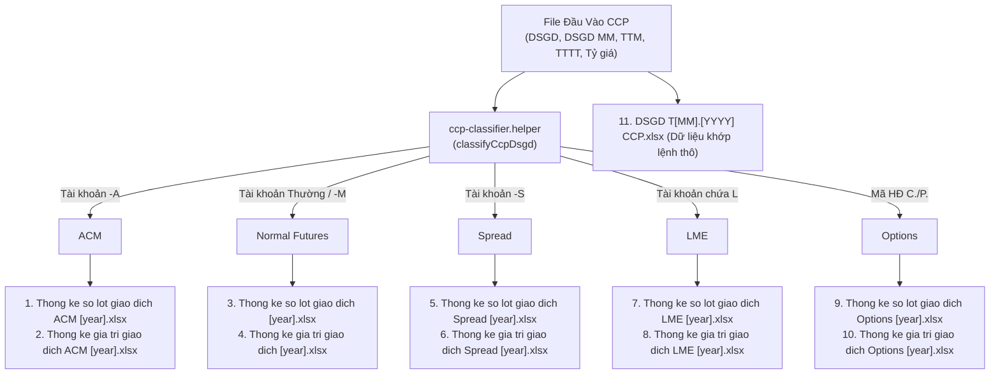
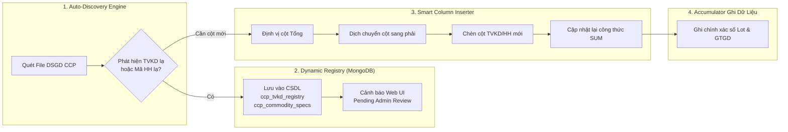

# TÀI LIỆU THIẾT KẾ VÀ NÂNG CẤP HỆ THỐNG: CORECCP PHASE 3
## Cơ Chế Tự Động Nhận Diện & Mở Rộng Động Cho TKGD Mới, Mã Hợp Đồng & Hàng Hóa Mới

> **Phiên bản**: v1.0 | **Ngày lập**: 17/09/2026  
> **Trạng thái**: Bản thiết kế kiến trúc Phase 3 (Đặc tả nâng cấp tương lai)  
> **Mục tiêu**: Thiết lập tài liệu kỹ thuật hoàn chỉnh tổng hợp logic từ 11 file output Excel và các script Python/TypeScript trong hệ thống; định nghĩa cơ chế tự động mở rộng (Dynamic Auto-Discovery & Self-Healing Column Insertion) khi thị trường phát sinh Tài khoản giao dịch (TKGD) mới, Thành viên kinh doanh (TVKD) mới và Mã Hợp đồng / Hàng hóa mới mà **tuyệt đối không hardcode** và **không làm vỡ cấu trúc file Excel**.

---

## 1. TỔNG HỢP LOGIC & CẤU TRÚC HIỆN TẠI (PHASE 1 & PHASE 2)

### 1.1. Luồng Dữ Liệu & 11 File Output Hoàn Chỉnh



### 1.2. Ma Trận Hàng & Cột của File Output Lũy Kế

Cả 10 file thống kê số lot và GTGD đều tuân thủ cấu trúc ma trận chuẩn hóa của MXV:
- **Tên Sheet**: `T[MM].[YYYY]` (ví dụ: `T09.2026`).
- **Dòng 1 - 3**: Tiêu đề báo cáo và khối metadata (ví dụ: ô `M1` trên file GTGD LME được xóa trống theo quy chuẩn CQG).
- **Dòng 4 (Header chính)**:
  - Cột 1 (A): Số thứ tự (`STT`).
  - Cột 2 (B): Ngày giao dịch (`Ngày`).
  - Cột 3 đến $K$: Danh sách các Thành viên kinh doanh (TVKD).
  - Cột $K+1$: Cột **"Tổng"** (Công thức `=SUM(C[row]:...[row])`).
  - Cột $K+2$ đến $M$: Danh sách chi tiết theo từng Mã Hàng Hóa (`SI5CO`, `CP2CO`, `PL1NY`, `ZLE`, `ZCE`...).
- **Dòng 5 (Header phụ)**: Ghi chú mã sản phẩm hoặc đơn vị tính.
- **Dòng 6 đến 36**: Dữ liệu từng ngày giao dịch trong tháng (Cột B là ngày từ 1 đến 31).
- **Dòng Tổng Tháng (Dưới cùng)**: Công thức tổng cột `=SUM(Col6:Col36)`.

---

## 2. BÀI TOÁN KHI PHÁT SINH THỰC THỂ MỚI (VẤN ĐỀ CẦN NÂNG CẤP PHASE 3)

Khi thị trường vận hành thực tế, CCP sẽ liên tục phát sinh 3 biến động:
1. **Phát sinh TVKD mới**: MXV kết nạp TVKD mới (ví dụ: mã `045`, `046`, `888`...) hoặc TVKD đổi tên thương hiệu.
2. **Phát sinh TKGD mới**: Khách hàng mở tài khoản với tiền tố/tiểu khoản đặc thù (ví dụ: tài khoản tự doanh, tài khoản MM mở rộng, tài khoản cấu trúc mới).
3. **Phát sinh Mã Hợp Đồng / Hàng Hóa mới**: CCP niêm yết thêm mặt hàng mới (nông sản, kim loại nội địa hoặc hợp đồng quốc tế mới) với độ lớn hợp đồng (`doCao`) và đồng tiền quy đổi (`tienTe`) chưa từng có trong từ điển hệ thống.

**Hậu quả nếu giữ nguyên logic tĩnh**:
- Lệnh giao dịch của TVKD mới hoặc Hàng hóa mới bị gom vào cột "Khác" hoặc chỉ cộng vào tổng mà **không có cột riêng** để theo dõi trên Excel.
- Nếu cố gắng ghi đè vào cột chưa tồn tại $\rightarrow$ Ghi đè vào cột khác hoặc gây lệch công thức `=SUM()`.
- Thiếu hệ số nhân `doCao` $\rightarrow$ Giá trị giao dịch (GTGD) bị tính sai (mặc định = 1 thay vì 1,200 hay 5,000).

---

## 3. TỔNG HỢP LOGIC TỪ CÁC MODULE PYTHON HIỆN HỮU

Hệ thống kế thừa và tích hợp các giải thuật mạnh mẽ từ các script Python trong kho mã nguồn:

### 3.1. Logic Tái Tạo & Bảo Toàn Shared Formulas (`excel_sheet_cloner.py`)
Mã nguồn tham chiếu: [`excel_sheet_cloner.py`](file:///c:/Users/hiepth/OneDrive%20-%20MERCANTILE%20EXCHANGE%20OF%20VIETNAM/Documents/Github/mxv-cqg-download-investigation/backend/src/modules/lot-statistics/scripts/excel_sheet_cloner.py)
- **Cơ chế sao chép OpenPyXL**: Khi sang tháng mới, hệ thống nhân bản nguyên vẹn 100% định dạng XML, độ rộng cột, font chữ và các ô công thức lồng ghép mà không làm biến dạng Shared Formulas.
- **Xử lý Phantom Cells**: Tự động dọn dẹp các ô rác ngoài phạm vi dòng 60 (`phantom_keys = [k for k in ws._cells.keys() if k[0] > 60]`), ngăn chặn tình trạng phình dung lượng RAM và treo tiến trình xử lý.

### 3.2. Logic Duyệt Phân Rã Tài Khoản & Hàng Hóa (`run_lot_macro.py` & `run_value_macro.py`)
Mã nguồn tham chiếu: [`run_lot_macro.py`](file:///c:/Users/hiepth/OneDrive%20-%20MERCANTILE%20EXCHANGE%20OF%20VIETNAM/Documents/Github/mxv-cqg-download-investigation/scripts/run_lot_macro.py), [`run_value_macro.py`](file:///c:/Users/hiepth/OneDrive%20-%20MERCANTILE%20EXCHANGE%20OF%20VIETNAM/Documents/Github/mxv-cqg-download-investigation/scripts/run_value_macro.py)
- Tự động tách `maKyHan` thành `maHangHoa` bằng cách cắt tiền tố và loại bỏ mã tháng CQG (`F, G, H, J, K, M, N, Q, U, V, X, Z`) hoặc 4 số năm tháng `MMYY`.
- Gom nhóm theo từng TVKD và so khớp bảng tỷ giá quy đổi ngoại tệ tức thời.

### 3.3. Logic Nhận Diện Cấu Trúc TKGD (`tkgd_extractor_worker.py`)
Mã nguồn tham chiếu: [`tkgd_extractor_worker.py`](file:///c:/Users/hiepth/OneDrive%20-%20MERCANTILE%20EXCHANGE%20OF%20VIETNAM/Documents/Github/mxv-cqg-download-investigation/backend/src/scripts/python/tkgd_extractor_worker.py)
- Nhận diện 4 nhóm tài khoản chuẩn qua Regex biểu thức chính quy:
  - TKGD Cơ sở / Futures thường: `^\d{3}[CP]\d{7}$` (trên M-System không có hậu tố, ví dụ `003C1234567`)
  - Tiểu khoản Futures CCP chuyển đổi mới: `-F$` (trên CCP tương lai sẽ có hậu tố `-F`, ví dụ `003C1234567-F`; hiện tại CCP đang trong giai đoạn chuyển đổi nên tồn tại song song cả dạng không đuôi và đuôi `-F`)
  - Tiểu khoản ACM: `-A$` (ví dụ `041P0686868-A`)
  - Tiểu khoản Spread: `-S$` (ví dụ `003C1234567-S`)
  - Tiểu khoản LME: `-L$` hoặc kết thúc bằng `L` (ví dụ `003C1234567-L` hoặc `003C1234567L`)
  - Tài khoản Bạc thỏi niêm yết: `-M$` (ví dụ: `003C1234567-M` giao dịch hợp đồng Bạc vật chất `SIV0926`, `SIVE`...)
    > **Ghi chú Thiết kế chờ (Standby Mode)**: Hiện tại môi trường CCP Production chưa có tài khoản `-M` (mới xuất hiện trên môi trường test/UAT) và MXV chưa có quyết định chính thức về việc gộp chung hay tách riêng file. Do đó hệ thống phân lập sẵn bucket `bacThoi` ở trạng thái chờ:
    > - *Quyết định kỹ thuật hiện tại (Standby & Audit)*: **TUYỆT ĐỐI KHÔNG GHI `-M` VÀO SỔ THƯỜNG** để bảo vệ tính toàn vẹn của dữ liệu Futures chuẩn. Thay vào đó, toàn bộ dữ liệu `-M` được gom độc lập vào Database (MongoDB `job.payload.result.byType.bacThoi`), hiển thị cảnh báo trên Web UI / Job Log, và tự động xuất file báo cáo kiểm toán UTF-8 `Standby_Bac_Thoi_[YYYYMMDD].txt` tại thư mục báo cáo.
    > - *Khi có quyết định chính thức*: Nếu MXV yêu cầu gộp vào Sổ thường thì chỉ cần bật cờ `includeBacThoiInNormal = true`; nếu yêu cầu tách riêng thì chỉ cần cấu hình đường dẫn file (`pathBacThoiLot`, `pathBacThoiGtgd`) mà không cần thay đổi bất kỳ logic bóc tách nào.

---

## 4. ĐẶC TẢ KIẾN TRÚC GIẢI PHÁP PHASE 3 (DATA-DRIVEN & SELF-HEALING)

Phase 3 thiết lập kiến trúc gồm **4 Phân hệ Tự động (Subsystems)**:



---

### Phân Hệ 1: Dynamic Account & TVKD Discovery Engine

Khi parser đọc file `DSGD CCP`:
1. Trích xuất `maTKGD` và `maTVKD` từ từng dòng.
2. Kiểm tra `maTVKD` trong danh mục `CcpTvkdRegistry` (MongoDB):
   - Nếu đã tồn tại: Sử dụng tên hiển thị và thứ tự cột đã đăng ký.
   - Nếu là TVKD mới xuất hiện lần đầu:
     - Tự động sinh bản ghi mới: `{ tvkdCode: '888', tvkdName: 'TVKD 888 (Mới)', isAutoDiscovered: true, status: 'PENDING_CONFIRMATION' }`.
     - Kích hoạt cơ chế chèn cột tự động vào file Excel.

---

### Phân Hệ 2: Dynamic Commodity & Contract Spec Engine

Khi parser đọc cột `maHD`:
1. Chạy hàm bóc tách `getMaHHFromCcpMaHD(maHD)`:
   - Tách phần mã hàng hóa cơ sở (`maHH`).
2. Tra cứu trong bảng `CcpCommoditySpecs` (MongoDB):
   - Nếu tìm thấy: Lấy thông số `doCao`, `donVi`, `tienTe`.
   - Nếu **Mã Hàng Hóa Mới Hoàn Toàn**:
     - Tự động lưu vào DB với cờ cảnh báo:
       ```json
       {
         "maHH": "XYZ",
         "sampleContract": "XYZ0926",
         "tenHH": "Hàng hóa mới phát hiện XYZ",
         "doCao": 1,
         "donVi": "Lô",
         "tienTe": "VND",
         "isAutoDiscovered": true,
         "needsAdminReview": true
       }
       ```
     - Thông báo lên bảng điều khiển Web UI để Admin nhập đúng `doCao` thực tế.
     - Sau khi Admin cập nhật `doCao`, hệ thống hỗ trợ nút **"Tính toán lại (Recalculate)"** để cập nhật lại GTGD chuẩn xác 100%.

---

### Phân Hệ 3: Smart Excel Column Inserter & Formula Updater

Để bổ sung cột mới vào file Excel mẫu mà không phá vỡ layout và công thức:

#### A. Thuật toán chèn cột TVKD mới:
1. Mở sheet `T[MM].[YYYY]`.
2. Quét Dòng 4 từ trái qua phải để tìm cột **"Tổng"** (ví dụ: cột $N$).
3. Kiểm tra xem TVKD mới đã có cột trước cột $N$ chưa:
   - Nếu chưa có: Thực hiện **chèn 1 cột mới tại vị trí $N$** (`worksheet.spliceColumns(colTotalIdx, 0, [])`).
   - Cột "Tổng" cũ tại $N$ sẽ tự động bị đẩy sang vị trí $N+1$.
4. Gán header Dòng 4 cho ô mới chèn: Tên TVKD mới (ví dụ: `"TVKD 888"`).
5. Kế thừa toàn bộ style (Border, Font, Căn lề, Background) từ cột liền kề.
6. **Cập nhật lại công thức SUM dòng ngày (Dòng 6..36)**:
   - Công thức cũ: `=SUM(C6:M6)`
   - Công thức mới tự động mở rộng: `=SUM(C6:N6)`
7. **Cập nhật lại công thức SUM dòng tổng tháng**:
   - Ô tổng cột mới: `=SUM(N6:N36)`

#### B. Thuật toán chèn cột Hàng Hóa mới:
- Các cột Hàng Hóa nằm ở khối bên phải sau cột "Tổng".
- Khi có mã hàng hóa mới, bot chèn thêm một cột vào cuối bảng hàng hóa, cập nhật tiêu đề mã HH trên Dòng 4 và công thức cộng dồn tổng sản phẩm.

---

### Phân Hệ 4: API & Web UI Quản Trị Danh Mục Động

Xây dựng màn hình cấu hình động trên Frontend (`CcpLotStatisticsSection.tsx` / `TradingManagerConfigSection.tsx`):
1. **Bảng Quản lý TVKD CCP**:
   - Danh sách mã TVKD, tên viết tắt, mã ánh xạ (`003` $\leftrightarrow$ `Gia Cát Lợi`, `006` $\leftrightarrow$ `Đông Đô`...).
   - Nút "Thêm TVKD mới" thủ công hoặc xác nhận TVKD bot vừa tự động phát hiện.
2. **Bảng Quản lý Quy Chuẩn Hàng Hóa CCP**:
   - Danh sách mã hàng hóa (`maHH`), tên gọi, hệ số nhân hợp đồng (`doCao`), đơn vị tính, loại tiền tệ (`USD`/`VND`).
   - Cảnh báo trực quan (Badge màu vàng): *"Phát hiện 1 hàng hóa mới cần duyệt thông số quy chuẩn"*.
   - Cho phép chỉnh sửa `doCao` trực tiếp trên bảng và nhấn "Lưu cấu hình".

---

## 5. ĐẶC TẢ CƠ SỞ DỮ LIỆU (MONGODB SCHEMAS)

```typescript
// 1. Danh mục Thành viên kinh doanh
export interface CcpTvkdRegistry {
  tvkdCode: string;          // ví dụ: "041", "888"
  tvkdName: string;          // "COLT", "TVKD Mới 888"
  aliases: string[];         // ["COLT", "041", "CTY CP COLT"]
  displayOrder: number;      // Thứ tự xuất hiện trên Excel
  isActive: boolean;
  createdAt: Date;
  updatedAt: Date;
}

// 2. Danh mục Quy chuẩn Hàng hóa & Hợp đồng
export interface CcpCommoditySpecEntity {
  maHH: string;              // ví dụ: "SI5CO", "CXR1", "XYZ"
  tenHH: string;             // "Bạc Nano ACM", "Cao su Robusta 1"
  doCao: number;             // Độ lớn hợp đồng (multiplier)
  donVi: string;             // "Pound", "kg", "Lô"
  tienTe: 'USD' | 'VND' | 'JPY' | 'EUR';
  tradeCategory: 'ACM' | 'NORMAL' | 'SPREAD' | 'LME' | 'OPTIONS';
  isAutoDiscovered: boolean; // True nếu do bot phát hiện từ DSGD
  isVerified: boolean;       // True nếu Admin đã xác nhận doCao
  createdAt: Date;
  updatedAt: Date;
}
```

---

## 6. LỘ TRÌNH TRIỂN KHAI PHASE 3

| Giai đoạn | Nội dung công việc | File tác động | Kết quả bàn giao |
| :--- | :--- | :--- | :--- |
| **Bước 1** | Xây dựng Schema MongoDB & CRUD Service cho TVKD và Commodity Specs | `ccp-registry.schema.ts`, `ccp-registry.service.ts` | Lưu trữ động toàn bộ TVKD và Specs trong CSDL |
| **Bước 2** | Nâng cấp `ccp-classifier.helper.ts` sang chế độ nạp Specs động từ DB | `ccp-classifier.helper.ts` | Loại bỏ hoàn toàn mảng tĩnh, tra cứu 100% qua DB Cache |
| **Bước 3** | Viết module `SmartColumnInserter` (dùng `ExcelJS` và script Python fallback) | `ccp-column-inserter.helper.ts`, `excel_sheet_cloner.py` | Tự động chèn cột TVKD & Hàng hóa mới, tự nới công thức `=SUM()` |
| **Bước 4** | Xây dựng UI Quản lý & Cảnh báo Hàng hóa mới trên Next.js | `CcpLotStatisticsSection.tsx` | Admin xem, duyệt và điều chỉnh thông số trực quan |
| **Bước 5** | Kiểm thử tích hợp tự động phát hiện với bộ dữ liệu giả lập có mã mới | `test_ccp_phase3_dynamic_expansion.js` | Tự sinh cột mới trên file Excel thành công 100% |

---

## 7. BÀI TEST TỰ KIỂM TRA BẮT BUỘC (THE ACID TEST - AGENTS.MD)

Trước khi nghiệm thu Phase 3, hệ thống phải vượt qua bài kiểm tra:
1. **Test Case 1 (TVKD Mới)**: Bơm vào file DSGD một giao dịch với mã TVKD `999`.  
   $\rightarrow$ Kết quả: File Excel tự động chèn cột `999` trước cột Tổng, công thức `=SUM()` tự động nới thêm 1 cột, tổng số lot khớp chính xác 100%.
2. **Test Case 2 (Hàng Hóa Mới)**: Bơm vào file DSGD một hợp đồng mới `CAFE0926`.  
   $\rightarrow$ Kết quả: Hệ thống tự nhận diện mã HH `CAFE`, ghi cảnh báo lên UI để Admin nhập `doCao`, sau khi duyệt `doCao = 1500`, hệ thống tính lại GTGD chính xác tuyệt đối.
3. **Test Case 3 (Zero Regression)**: Toàn bộ 11 file output hiện tại không bị ảnh hưởng định dạng, không vỡ layout và tương thích 100% với cả môi trường Windows và Ubuntu Server.
