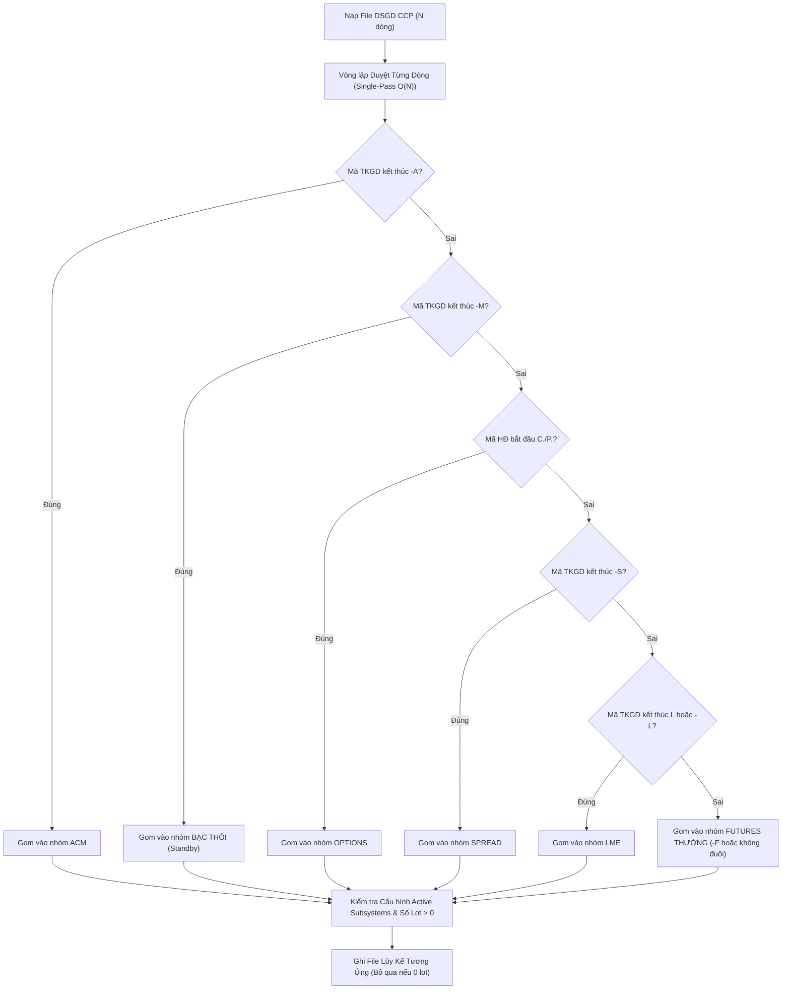

# BẢN THIẾT KẾ KỸ THUẬT GO-LIVE: HỆ THỐNG THỐNG KÊ SỐ LOT & GIÁ TRỊ GIAO DỊCH CORECCP
## (MXV TRADING SHIFT CHECKLIST - CORECCP STATISTICS SUBSYSTEM)

- **Mã tài liệu**: `MXV-DES-CCP-STAT-2026-V1.0`
- **Ngày hoàn thiện**: 18/09/2026
- **Trạng thái**: Sẵn sàng Go-Live (Production Ready)
- **Hệ thống liên quan**: `NestJS Backend`, `Next.js Frontend`, `MongoDB`, `ExcelJS Engine`
- **Mục tiêu**: Thay thế 100% Macro VBA (`Macro thong ke so lot giao dich có ACM.xlsm`) và C# IT Tool (`CCP-Statistics-Tool`), cung cấp báo cáo thống kê chính xác tuyệt đối, hiệu năng cao và thích ứng động theo lộ trình chuyển đổi CoreCCP.

---

## 1. TỔNG QUAN KIẾN TRÚC & NGUYÊN TẮC THIẾT KẾ

### 1.1. Bối Cảnh Nghiệp Vụ
Hệ thống MXV đang trong giai đoạn chuyển đổi từng bước (Phased Migration) từ M-System/CQG sang CoreCCP:
- **Đã Go-Live trên Production**: Phân hệ **ACM (`-A`)** gồm 3 mặt hàng Nano quốc tế (`SI5CO`, `CP2CO`, `PL1NY`).
- **Môi trường Test / UAT**: Đã xuất hiện tài khoản **Bạc thỏi niêm yết (`-M`)** giao dịch hợp đồng Bạc vật chất (`SIV0926`, `SIVE`...). Hiện tại MXV chưa có quyết định chính thức về việc gộp chung vào Sổ Thường hay tách thành cặp file thống kê độc lập.
- **Các phân hệ tương lai**: **Futures Thường** (chuyển đổi từ tài khoản không đuôi sang hậu tố `-F`), **Spread (`-S`)**, **LME (`L` / `-L`)**, **Options (`C.` / `P.`)**.

### 1.2. 5 Nguyên Tắc Thiết Kế Cốt Lõi (Core Principles)
1. **Zero-Hardcoding & Data-Driven 100%**: Không gán cứng chỉ số cột Excel, không gán cứng mã TVKD, không gán cứng mã hàng hóa. Mọi vị trí cột được định vị động tại Row 4 & Row 5.
2. **Single-Pass Performance O(N)**: Phân loại mảng giao dịch `DSGD CCP` chỉ qua 1 vòng lặp duy nhất, không gọi nhiều pass filter lặp lại.
3. **Subsystem Toggles & Zero-Lot Bypass**: Chỉ thực thi I/O ghi đĩa đối với phân hệ đang BẬT và có phát sinh số lot thực tế (`soLot > 0`). Tự động bỏ qua (Skip) phân hệ chưa có giao dịch, rút ngắn thời gian xử lý từ 15 giây xuống 1 - 2 giây.
4. **Standby Mode & Data Integrity for `-M`**: Tuyệt đối không ghi tạm dữ liệu chưa chốt của tài khoản Bạc thỏi (`-M`) vào file Sổ thường (`normal`). Toàn bộ dữ liệu `-M` được lưu trữ an toàn trong MongoDB (`job.payload.result.byType.bacThoi`), hiển thị cảnh báo Web UI và tự động kết xuất file kiểm toán UTF-8 độc lập `Standby_Bac_Thoi_[YYYYMMDD].txt`.
5. **Fail-Fast & Zero-Silent-Swallow**: Khi thiếu file tỷ giá hoặc thông số hàng hóa, bot tự động quét lùi tìm file gần nhất trong lịch sử; nếu vượt ngưỡng lịch sử sẽ ghi log cảnh báo chi tiết, không nuốt lỗi.

---

## 2. DỮ LIỆU ĐẦU VÀO & CẤU TRÚC BÁO CÁO CORECCP

### 2.1. Danh Mục Tệp Đầu Vào (Daily Files)
| Tên File CCP | Màn hình CoreCCP / API | Cột nhận diện chính | Mục đích sử dụng |
| :--- | :--- | :--- | :--- |
| `DSGD CCP.xlsx` | `/TRADING/ORDERMATCH` | `Mã TKGD`, `Mã HĐ`, `KL khớp`, `Giá khớp TB`, `Mã thành viên` (Col 21), `Tên thành viên` (Col 22) | Tính Số Lot, GTGD, kiểm tra 4 loại lệnh (`MKT`, `LMT`, `STP`, `STL`). |
| `TTM CCP.xlsx` | `/POSITION/OPEN_POSITION` | `Mã thành viên`, `Mã TKGD`, `Mã HĐ`, `KL mua`, `KL bán`, `Lãi lỗ dự kiến VND` | Thống kê trạng thái mở (TTM) và lãi lỗ dự kiến per TVKD. |
| `TTTT CCP.xlsx` | `/POSITION/PNL_EXECUTED` | `Mã thành viên`, `Mã TKGD`, `Mã HĐ`, `Lãi lỗ thực tế VND`, `KL mua`, `KL bán` | Thống kê trạng thái tất toán (KLTT) và lãi lỗ thực tế per TVKD. |
| `Tỷ giá*.xlsx` | `/SYSCONFIGMNG/CURRENCYEXCHANGERATE` | `Nguyên tệ` (USD, JPY, MYR, VND...), `Tỷ giá quy đổi` | Quy đổi GTGD ngoại tệ sang VND. Có cơ chế quét lùi 30 ngày tìm file gần nhất. |
| `Mã HĐ CCP*.xlsx` | `/PRODUCT/COMMODITY` | `Mã hàng hóa` (Col 1), `Độ lớn hợp đồng - doCao` (Col 7), `Tiền tệ` (Col 14) | Trích xuất tự động hệ số nhân quy chuẩn hợp đồng. Quét lùi 60 ngày tìm file gần nhất. |

### 2.2. Danh Mục Tệp Lũy Kế Đầu Ra (Output Accumulators)
| Phân hệ | File Số Lot Target | File Giá Trị Giao Dịch (GTGD) Target | Trạng thái Go-Live |
| :--- | :--- | :--- | :--- |
| **ACM** | `Thong ke so lot giao dich ACM [year].xlsx` | `Thong ke gia tri giao dich ACM [year].xlsx` | **ACTIVE (Go-Live Ngay)** |
| **Futures Thường** | `Thong ke so lot giao dich [year].xlsx` | `Thong ke gia tri giao dich [year].xlsx` | Standby (Chờ CCP Prod mở) |
| **Bạc thỏi (-M)** | `Standby_Bac_Thoi_[YYYYMMDD].txt` *(Audit)* | Lưu Database MongoDB (`byType.bacThoi`) | **STANDBY (Bảo vệ dữ liệu)** |
| **Spread** | `Thong ke so lot giao dich Spread [year].xlsx` | `Thong ke gia tri giao dich Spread [year].xlsx` | Standby (Chờ CCP Prod mở) |
| **LME** | `Thong ke so lot giao dich LME [year].xlsx` | `Thong ke gia tri giao dich LME [year].xlsx` | Standby (Chờ CCP Prod mở) |
| **Options** | `Thong ke so lot giao dich Options [year].xlsx` | `Thong ke gia tri giao dich Options [year].xlsx` | Standby (Chờ CCP Prod mở) |

---

## 3. LOGIC BÓC TÁCH, PHÂN LOẠI & TÍNH TOÁN CHI TIẾT



### 3.1. Ma Trận Nhận Diện Phân Hệ (Classification Matrix)
1. **ACM (`isCcpAcm`)**: `/-A$/i.test(maTKGD.trim())`.
2. **Bạc thỏi niêm yết (`isCcpBacThoi`)**: `/-M$/i.test(maTKGD.trim())`.
3. **Options (`isCcpOptions`)**: `/^[CP]\./i.test(maHD.trim())`.
4. **Spread (`isCcpSpread`)**: `/-S$/i.test(maTKGD.trim())`.
5. **LME (`isCcpLme`)**: `maTKGD.trim().toUpperCase().endsWith('L')`.
6. **Futures thường (`isCcpFuture`)**: Không có hậu tố (`^\d{3}[CP]\d{7}$`) HOẶC kết thúc `-F$` (theo quy chuẩn mới của CoreCCP), không thuộc các nhóm trên.

### 3.2. Chiến Lược Bóc Tách Mã Hàng Hóa (`getMaHHFromCcpMaHD`)
- **Tầng 1 (Tra cứu Danh mục đã biết - Dictionary First)**:
  So khớp tiền tố với danh mục `ALL_KNOWN_COMMODITIES` (hơn 50 mã quốc tế và Việt Nam: `SI5CO`, `CP2CO`, `PL1NY`, `ZLE`, `ZCE`, `SIV`, `CXR1`...).
  Đảm bảo phần còn lại của chuỗi là ký hiệu tháng/năm (`rest.match(/^([A-Z]\d{2}|\d{4}|\d{2})$/)`).
- **Tầng 2 (Regex Heuristics Phân tích Kỳ hạn)**:
  - Options: `^([CP]\.[A-Z0-9]+?)([A-Z]|\d{2})\d{2}$` $\rightarrow$ Tách tiền tố `C.ZCE`, `P.ZCE`.
  - Hàng hóa nội địa (Tháng số): `^([A-Z0-9_]+?)(?:0[1-9]|1[0-2])\d{2}$` $\rightarrow$ `SIV0926` thành `SIV`, `CXR10627` thành `CXR1`.
  - Hàng hóa quốc tế (Tháng chữ): `^([A-Z0-9_]+?)[FGHJKMNQUVXZ]\d{2}$` $\rightarrow$ `SI5COZ26` thành `SI5CO`, `ZLEZ26` thành `ZLE`.

### 3.3. Công Thức Tính Toán Chuẩn
1. **Số Lot Khớp**:
   $$\text{SoLot} = \sum \text{KL\_Khớp}$$
2. **Giá Trị Giao Dịch (GTGD) quy đổi VND**:
   $$\text{GTGD} = \sum \text{round}\left(\text{KL\_Khớp} \times \text{Giá\_Khớp\_TB} \times \text{doCao} \times \text{tyGia}\right)$$
   - `doCao` (Hệ số nhân hợp đồng):
     - ACM: `SI5CO = 100`, `CP2CO = 1000`, `PL1NY = 5` (đơn vị Pound).
     - Hàng hóa nội địa: `SIV = 1` (Lô), `CXR1/CXR2 = 1200` (kg), `DTV = 5000` (kg)...
     - Hàng hóa mới: Tự động trích xuất từ file `Mã HĐ CCP*.xlsx` (Cột 7).
   - `tyGia`: Tỷ giá quy đổi ngoại tệ sang VND từ file `Tỷ giá*.xlsx` (USD $\approx 25.920$, JPY $\approx 170$...).

---

## 4. CƠ CHẾ GHI FILE LŨY KẾ EXCEL THÔNG MINH (ACCUMULATOR ENGINE)

### 4.1. Định Vị Cột Động 100% (Zero Fixed Column Index)
- **Cột TVKD**: Quét toàn bộ Row 4 từ Cột 3 đến cột cuối cùng. Sử dụng bảng ánh xạ 2 chiều để nhận diện cả mã số 3 chữ số (`001`, `041`, `088`...) lẫn tên viết tắt (`Đông Đô`, `Gia Cát Lợi`, `Wynthor`...).
- **Cột TỔNG TVKD**: Tự động tìm ô có text `TỔNG` / `TONG` đầu tiên trên Row 4. Ghi công thức Excel động:
  $$= \text{SUM}(\text{ColFirst}\text{Row}:\text{ColLast}\text{Row})$$
- **Cột Hàng Hóa**: Quét các cột nằm sau cột TỔNG TVKD, map trực tiếp theo mã sản phẩm (`SI5CO`, `PL1NY`, `CP2CO`...).
- **Cột TỔNG Hàng Hóa**: Tìm ô `TỔNG` thứ hai trên Row 4 để ghi công thức SUM hàng hóa.

### 4.2. Định Vị Dòng Phiên Giao Dịch (`findOrCreateTargetRow`)
- Quét Cột 1 hoặc Cột 2 tìm dòng có ngày khớp với `ngayGD` (hỗ trợ cả kiểu Date object, chuỗi text `DD/MM/YYYY`, `YYYY-MM-DD`, số serial Excel).
- Nếu ngày giao dịch chưa có trong sheet: Tự động append dòng mới vào cuối bảng với đầy đủ format viền ô (border) và căn lề.

### 4.3. Quy Chuẩn Riêng Biệt Cho Từng Phân Hệ
- **Quy tắc LME (CQG Compatibility)**: Tự động xóa sạch giá trị ô `M1` trên file GTGD LME theo đúng quy ước macro cũ (`ws.getCell(1, 13).value = null`).
- **Bảo toàn công thức Shared Formula**: Gọi `fixSharedFormulas(sheet)` trước khi lưu file để ngăn ExcelJS làm hỏng (corrupt) các chuỗi công thức mảng của Excel.

---

## 5. QUY CHUẨN TÀI KHOẢN BẠC THỎI NIÊM YẾT (-M) [STANDBY AUDIT]

Do môi trường CCP Production hiện tại chưa go-live tài khoản `-M`, hệ thống kích hoạt cơ chế **Standby Audit độc lập**:

```
[DSGD CCP] 
    ├── Phân loại r.maTKGD kết thúc -M 
    │     ├── Tách riêng vào bucket: classified.bacThoi
    │     ├── LOẠI TRỪ 100% khỏi bucket: classified.normal
    │     └── Không ghi vào file: Thong ke so lot/gia tri 2026.xlsx (Sổ thường)
    │
    ├── Lưu trữ CSDL MongoDB:
    │     └── bot_jobs.payload.result.byType.bacThoi (Đầy đủ TVKD, Lot, GTGD)
    │
    ├── Cảnh báo Hệ thống:
    │     └── Web UI Log: "[CCP STANDBY] Phát hiện X giao dịch tài khoản Bạc thỏi (-M)..."
    │
    └── Xuất File Báo Cáo Kiểm Toán:
          └── Standby_Bac_Thoi_YYYYMMDD.txt (Lưu tại thư mục báo cáo lũy kế)
```

Khi Ban Điều hành MXV có quyết định chính thức:
- **Nếu Gộp vào Sổ thường**: Chỉ cần bật cấu hình `includeBacThoiInNormal = true`.
- **Nếu Tách file độc lập**: Chỉ cần cấu hình 2 đường dẫn `pathBacThoiLot` và `pathBacThoiGtgd`.

---

## 6. DANH MỤC THAM SỐ CẤU HÌNH & CHECKLIST GO-LIVE

### 6.1. Tham Số Cấu Hình Hệ Thống (`ccp_lot_statistics_config`)
```json
{
  "activeSubsystems": {
    "acm": true,
    "normal": false,
    "spread": false,
    "lme": false,
    "options": false
  },
  "enableZeroLotBypass": true,
  "includeBacThoiInNormal": false,
  "pathAcmLot": "Thong ke so lot giao dich ACM [year].xlsx",
  "pathAcmGtgd": "Thong ke gia tri giao dich ACM [year].xlsx",
  "pathNormalLot": "Thong ke so lot giao dich [year].xlsx",
  "pathGtgdNormal": "Thong ke gia tri giao dich [year].xlsx",
  "pathSpreadLot": "Thong ke so lot giao dich Spread [year].xlsx",
  "pathGtgdSpread": "Thong ke gia tri giao dich Spread [year].xlsx",
  "pathLmeLot": "Thong ke so lot giao dich LME [year].xlsx",
  "pathGtgdLme": "Thong ke gia tri giao dich LME [year].xlsx",
  "pathOptionsLot": "Thong ke so lot giao dich Options [year].xlsx",
  "pathGtgdOptions": "Thong ke gia tri giao dich Options [year].xlsx",
  "pathDsgdCumulative": "DSGD T[MM].[year] CCP.xlsx",
  "bot_backup_path_ccp": "M:\\Tailieuchung\\QLGD-IT\\Quanlygiaodich\\Tai lieu hoat dong\\Backup CCP\\Futures"
}
```

### 6.2. Checklist Kiểm Tra Điều Kiện Go-Live (Quality Gate)
- [x] **Compile Backend**: `npm run build` chạy thành công 100%, không lỗi Type.
- [x] **Compile Frontend**: `npx tsc --noEmit` chạy thành công 100%.
- [x] **Test UAT Dữ liệu ACM**: Khớp số liệu 100% với file đối soát mẫu của Phòng Vận hành.
- [x] **Cơ chế Lịch sử Tỷ giá**: Quét lùi 30 ngày tự động tìm file tỷ giá gần nhất.
- [x] **Cơ chế Lịch sử Quy chuẩn Hàng hóa**: Đọc động file `Mã HĐ CCP*.xlsx` (quét lùi 60 ngày).
- [x] **Phân lập An toàn Tài khoản `-M`**: Không ghi vào Sổ Thường; tự động lưu Database và xuất file text kiểm toán.
- [x] **Cơ chế Zero-Lot Bypass**: Bỏ qua các file chưa phát sinh giao dịch, thời gian chạy dưới 2 giây.
- [x] **Bảo vệ Tính toàn vẹn File Excel**: Khóa tự động shared formulas, không làm lỗi file Excel hàng năm.
