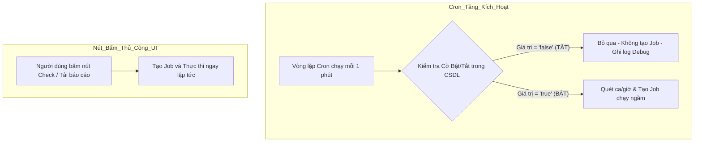

# BẢN THIẾT KẾ TRIỂN KHAI: CƠ CHẾ MASTER SWITCH TẮT/BẬT TỰ ĐỘNG CHO TRADING MANAGER

- **Dự án**: MXV Shift Checklist & Trading Manager System
- **Hệ thống áp dụng**: Màn hình Trading Manager (`https://10.0.0.26/trading-manager`)
- **Ngày lập**: 18/09/2026
- **Mục tiêu**: Cho phép Người giám sát ca trực bật/tắt hoàn toàn chế độ tự động chạy của Bot trực tiếp trên giao diện của từng Tab mà không cần phải truy cập vào trang cấu hình nội bộ (`/bot-config`).

---

## I. Hiện trạng & Căn cứ Mã Nguồn (Proof of Ground Truth)

### 1. Phân hệ 1: Check GD – EOD – Sync (Tab 1)
* **Vòng lặp ngầm ở Backend**:
  - File: [`backend/src/modules/bot-engine/bot-engine.service.ts`](file:///c:/Users/hiepth/OneDrive%20-%20MERCANTILE%20EXCHANGE%20OF%20VIETNAM/Documents/Github/mxv-cqg-download-investigation/backend/src/modules/bot-engine/bot-engine.service.ts#L48-L62)
  - Phương thức: `@Cron('* * * * *', { name: 'automated-bot-checklist-runner' })` chạy mỗi 1 phút một lần.
  - Hành vi: Quét các ca trực mở (`status: 'PENDING'`), tìm các tác vụ có cấu hình `isBotCheckSnapshot = true` và `frequencyMinutesSnapshot > 0` (như tác vụ `CHECK_KLGD`) để tự động tạo Job đối chiếu đưa vào hàng đợi.
* **Giao diện hiện tại**:
  - File: [`frontend/src/app/trading-manager/components/legacy-ms-cqg/LegacyReconSection.tsx`](file:///c:/Users/hiepth/OneDrive%20-%20MERCANTILE%20EXCHANGE%20OF%20VIETNAM/Documents/Github/mxv-cqg-download-investigation/frontend/src/app/trading-manager/components/legacy-ms-cqg/LegacyReconSection.tsx#L50-L55)
  - Trạng thái `checkPeriodic` mới chỉ là state nội bộ `useState<boolean>(true)`, chưa được kết nối API để ra lệnh tạm dừng tiến trình Cron ngầm ở Backend.

### 2. Phân hệ 2: Backup – Thống kê – GTT (Tab 2)
* **Vòng lặp ngầm ở Backend**:
  - File: [`backend/src/modules/bot-engine/scheduler.service.ts`](file:///c:/Users/hiepth/OneDrive%20-%20MERCANTILE%20EXCHANGE%20OF%20VIETNAM/Documents/Github/mxv-cqg-download-investigation/backend/src/modules/bot-engine/scheduler.service.ts#L199-L235)
  - Phương thức: `@Cron('* * * * *', { name: 'dynamic-bot-scheduler' })` chạy mỗi 1 phút một lần.
  - Hành vi: Đọc cấu hình `bot_scheduler_config` từ MongoDB để kích hoạt các tác vụ theo giờ định sẵn (ví dụ `04:30` tải báo cáo MS, `07:00` tải số dư CAST, `07:05` check SOD...).
* **Giao diện hiện tại**:
  - File: [`frontend/src/app/trading-manager/components/legacy-ms-cqg/LegacyBackupThongKeSection.tsx`](file:///c:/Users/hiepth/OneDrive%20-%20MERCANTILE%20EXCHANGE%20OF%20VIETNAM/Documents/Github/mxv-cqg-download-investigation/frontend/src/app/trading-manager/components/legacy-ms-cqg/LegacyBackupThongKeSection.tsx#L34-L39)
  - Các ô `Backup định kỳ (phút)`, `Thời điểm backup`, `Thời điểm tạo thống kê` chỉ là `useState` cục bộ chưa kết nối xuống Scheduler.

### 3. Hạ tầng API Cấu hình Đã Có Sẵn
* Hệ thống đã có sẵn Model và Controller cấu hình dùng chung:
  - File: [`backend/src/modules/system-settings/system-settings.controller.ts`](file:///c:/Users/hiepth/OneDrive%20-%20MERCANTILE%20EXCHANGE%20OF%20VIETNAM/Documents/Github/mxv-cqg-download-investigation/backend/src/modules/system-settings/system-settings.controller.ts#L8-L34)
  - `GET /api/v1/system-settings/:key`: Lấy giá trị cấu hình theo key.
  - `POST /api/v1/system-settings`: Cập nhật cấu hình `{ key: string, value: string }` lưu trực tiếp vào collection `system_settings` trong MongoDB.

---

## II. Nguyên Lý Thiết Kế: Cầu Dao Kích Hoạt (Circuit Breaker)



### Điểm mấu chốt:
1. **Zero Impact to Core Logic**: Không sửa đổi bất kỳ logic bóc tách số liệu, tính toán chênh lệch hay kịch bản tải Playwright nào.
2. **Manual Override**: Khi tắt chế độ tự động, các nút bấm thủ công của người dùng (**Check**, **Check thủ công**, **Tải Báo Cáo Đã Chọn**, **Tải Báo Cáo CQG**...) **vẫn hoạt động 100% bình thường**.
3. **Persisted State**: Giá trị được lưu trong MongoDB, do đó khi tải lại trang (F5) hay mở từ máy tính khác, hệ thống vẫn duy trì đúng trạng thái đã được cấu hình.

---

## III. Định Danh Cấu Hình Trong CSDL (MongoDB `system_settings`)

| Tên Cấu Hình (`key`) | Phân hệ áp dụng | Giá trị mặc định | Diễn giải nghiệp vụ |
| :--- | :--- | :--- | :--- |
| `bot_auto_recon_enabled` | Tab 1: *Check GD – EOD – Sync* | `"true"` | - `"true"`: Tự động chạy đối chiếu định kỳ trong ca.<br>- `"false"`: Tạm dừng toàn bộ đối chiếu tự động trong ca. |
| `bot_auto_backup_enabled` | Tab 2: *Backup – Thống kê – GTT* | `"true"` | - `"true"`: Tự động tải báo cáo theo giờ/chu kỳ.<br>- `"false"`: Tạm dừng toàn bộ việc tự động tải và chạy thống kê. |

---

## IV. Danh Sách File & Chi Tiết Thay Đổi

### 1. Phía Backend

#### 1.1. [`backend/src/modules/bot-engine/bot-engine.service.ts`](file:///c:/Users/hiepth/OneDrive%20-%20MERCANTILE%20EXCHANGE%20OF%20VIETNAM/Documents/Github/mxv-cqg-download-investigation/backend/src/modules/bot-engine/bot-engine.service.ts)
* **Vị trí**: Phương thức `handleBotChecks()`, ngay sau khối kiểm tra `isProcessing` (dòng 62).
* **Code triển khai**:
  ```typescript
  const autoReconSetting = await this.settingsService.getSetting('bot_auto_recon_enabled', 'true');
  if (autoReconSetting === 'false') {
    this.logger.debug('Automated checklist bot runner is paused by user switch (bot_auto_recon_enabled=false).');
    this.isProcessing = false;
    return;
  }
  ```

#### 1.2. [`backend/src/modules/bot-engine/scheduler.service.ts`](file:///c:/Users/hiepth/OneDrive%20-%20MERCANTILE%20EXCHANGE%20OF%20VIETNAM/Documents/Github/mxv-cqg-download-investigation/backend/src/modules/bot-engine/scheduler.service.ts)
* **Vị trí**: Phương thức `checkSchedule()`, ngay đầu hàm (dòng 204).
* **Code triển khai**:
  ```typescript
  const autoBackupSetting = await this.settingsService.getSetting('bot_auto_backup_enabled', 'true');
  if (autoBackupSetting === 'false') {
    this.logger.debug('Dynamic bot scheduler is paused by user switch (bot_auto_backup_enabled=false).');
    return;
  }
  ```

---

### 2. Phía Frontend

#### 2.1. [`frontend/src/app/trading-manager/components/legacy-ms-cqg/LegacyReconSection.tsx`](file:///c:/Users/hiepth/OneDrive%20-%20MERCANTILE%20EXCHANGE%20OF%20VIETNAM/Documents/Github/mxv-cqg-download-investigation/frontend/src/app/trading-manager/components/legacy-ms-cqg/LegacyReconSection.tsx)
* **Vị trí UI**: Thanh công cụ điều khiển phía trên bảng đối chiếu (cạnh nút chọn Phiên ngày & nút Check).
* **Hành vi**:
  - `useEffect`: Đọc giá trị `GET /api/v1/system-settings/bot_auto_recon_enabled`.
  - Hiển thị nút Toggle dạng Badge trạng thái trực quan:
    - Trạng thái BẬT: Nền xanh lá mờ, viền xanh `#10b981`, chữ *"Tự động giám sát: BẬT"*.
    - Trạng thái TẮT: Nền cam/xám mờ, viền cam `#f59e0b`, chữ *"Tự động giám sát: ĐÃ DỪNG"*.
  - `onClick`: Gọi `POST /api/v1/system-settings` lưu ngay xuống CSDL, hiện Toast phản hồi.

#### 2.2. [`frontend/src/app/trading-manager/components/legacy-ms-cqg/LegacyBackupThongKeSection.tsx`](file:///c:/Users/hiepth/OneDrive%20-%20MERCANTILE%20EXCHANGE%20OF%20VIETNAM/Documents/Github/mxv-cqg-download-investigation/frontend/src/app/trading-manager/components/legacy-ms-cqg/LegacyBackupThongKeSection.tsx)
* **Vị trí UI**: Header Bar của Tab 2 (ngay góc phải cạnh các ô Thời điểm backup).
* **Hành vi**:
  - `useEffect`: Đọc giá trị `GET /api/v1/system-settings/bot_auto_backup_enabled`.
  - Hiển thị nút Toggle Badge trạng thái:
    - BẬT: *"Tự động Backup: BẬT"*.
    - TẮT: *"Tự động Backup: ĐÃ DỪNG"*.
  - `onClick`: Cập nhật trực tiếp xuống CSDL.

---

## V. Kế Hoạch Kiểm Thử & Nghiệm Thu (Verification Plan)

| Bước | Hành động | Kết quả mong đợi |
| :---: | :--- | :--- |
| **1** | Kiểm tra TypeScript Build | Chạy `npx tsc --noEmit` ở Backend và `next build` ở Frontend đạt Exit code 0, không lỗi lint/type. |
| **2** | Test Tắt tự động Tab 1 | Gạt nút sang "ĐÃ DỪNG" trên Tab 1 $\rightarrow$ Backend ghi log debug pause, không sinh thêm job `CHECK_KLGD` nào sau 1-5 phút. |
| **3** | Test Nút thủ công Tab 1 | Bấm nút "Check" hoặc "Check thủ công" $\rightarrow$ Bot vẫn chạy đối chiếu và cập nhật bảng số liệu bình thường. |
| **4** | Test Tắt tự động Tab 2 | Gạt nút sang "ĐÃ DỪNG" trên Tab 2 $\rightarrow$ Đến giờ hẹn bot không tự tải file. |
| **5** | Test Nút thủ công Tab 2 | Bấm "Tải Báo Cáo Đã Chọn" $\rightarrow$ Bot vẫn tải và copy file vào folder bình thường. |
| **6** | Test Lưu trạng thái | F5 reload trình duyệt $\rightarrow$ Trạng thái các nút switch vẫn giữ nguyên như vừa cấu hình. |
