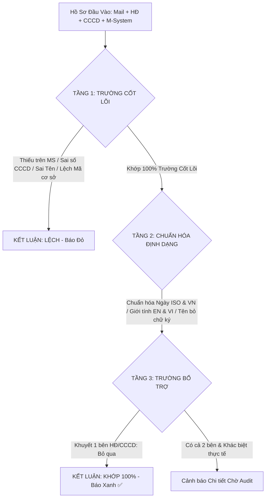

# BÁO CÁO ĐÁNH GIÁ CHUYÊN SÂU & TỔNG QUAN HỆ THỐNG MỞ TÀI KHOẢN GIAO DỊCH (TKGD)
**Khối Quản Lý Giao Dịch & Thanh Toán Bù Trừ (TTBT) - MXV**  
*Ngày lập: 07/09/2026*  
*Người đánh giá: Senior System Architect & Domain AI Assistant*

---

## I. ĐÁNH GIÁ SÂU LOGIC ĐỐI SOÁT: TRỰC QUAN vs. MÁY MÓC

### 1. Phân tích nguyên nhân "Quá máy móc" ở phiên bản cũ
Ở các phiên bản trước, việc đánh giá kết luận đối soát gặp phải sự xung đột nghiêm trọng giữa **nguyên lý so khớp chuỗi kỹ thuật (Literal String Match)** và **thực tế vận hành nghiệp vụ của Thành viên Kinh doanh (TVKD)**:

1. **Đánh đồng "Định dạng hiển thị" với "Sai lệch dữ liệu nghiệp vụ"**:
   - Máy móc so sánh chuỗi ngày tháng: Hợp đồng in `2002-05-18` (theo chuẩn ISO của form mềm) trong khi M-System ghi `18/05/2002` $\rightarrow$ Bot gán nhãn cảnh báo đỏ/vàng `CAN_KIEM_TRA` hoặc `LECH`.
   - Giới tính hiển thị tiếng Anh trên template HĐ của một số TVKD dùng hệ thống nước ngoài (`female` vs `Nữ`, `male` vs `Nam`) bị coi là không khớp.
2. **Máy móc gán lỗi khi mẫu biểu khuyết trường thông tin thứ cấp**:
   - Biểu mẫu Hợp đồng mở tài khoản của nhiều TVKD lược bỏ ô "Ngày sinh" hoặc "Giới tính" vì họ đã bắt buộc đính kèm bản sao CCCD có công chứng/chứng thực. Việc HĐ để trống ô này nhưng CCCD và M-System đã khớp 100% là **hoàn toàn hợp lệ theo chuẩn mở tài khoản**. Hệ thống cũ máy móc bắt bẻ HĐ thiếu thông tin dẫn đến hạ trạng thái tài khoản.
3. **Cảnh báo kỹ thuật OCR làm nhiễu loạn trải nghiệm người dùng (UX)**:
   - Các cảnh báo kỹ thuật như: *Thẻ Căn cước mẫu mới 2024 (Luật Căn cước 2023 không in quê quán/nơi thường trú theo cách cũ)*, *Ảnh hơi xén viền nhẹ*, *OCR qua hình ảnh không quét được mã QR*... vốn chỉ là các thông số hỗ trợ debug OCR, nhưng lại bị đưa thẳng vào bảng so sánh đối soát với icon dấu nhân đỏ (`X`), khiến Chuyên viên trực ca hoang mang lầm tưởng hồ sơ bị sai thông tin.
4. **Vấn đề bóc tách chuỗi Email (Multiline Signature)**:
   - Khi quét họ tên từ body mail, bộ parser cũ lấy nhầm các dòng chữ ký email, disclaimer pháp lý dính liền sau tên (`NGUYỄN ANH KHOA TVKD 003... Đề nghị MXV kích hoạt...`), dẫn đến so sánh chuỗi tên bị lệch hoàn toàn.

---

### 2. Thiết kế logic mới: Trực quan, Linh hoạt & Đạt kỳ vọng (User-Centric)

Mô hình đối soát mới được tái cấu trúc thành **Kiến trúc 3 Tầng Đánh Giá (3-Tier Evaluation Architecture)**:

#### Quy tắc cụ thể:
1. **Bộ tứ trường dữ liệu bất khả xâm phạm (Core Invariants)**:
   - **Mã TKGD / Mã NĐT Cơ sở**: Với tài khoản phái sinh thông thường (`003C0656625`) phải trùng khớp; với tài khoản thị trường liên thông có đuôi phân hệ (`-A`, `-L`, `-S`) thì mã gốc (baseCode) trên M-System phải trùng khớp 100%.
   - **Họ và tên NĐT**: Làm sạch triệt để ngắt dòng `\r\n`, loại bỏ chữ ký TVKD, chuẩn hóa hoa/thường và khoảng trắng thừa.
   - **Số CCCD / Hộ chiếu**: Trích xuất thuần ký tự số (`\D` filter) để loại bỏ mọi ký tự dấu cách hoặc gạch ngang do nhập liệu. Bắt buộc trùng khớp 100%.
   - **Ngày sinh**: Tự động quy đổi mọi biến thể (`YYYY-MM-DD`, `DD/MM/YYYY`, `DD-MM-YYYY`) về định dạng chuẩn duy nhất `DD/MM/YYYY` trước khi so khớp.
2. **Xử lý linh hoạt trường bổ trợ (Ngày cấp & Giới tính)**:
   - Chỉ so sánh nếu **cả 2 nguồn** cùng cung cấp dữ liệu.
   - Nếu HĐ để trống hoặc TVKD không in ngày cấp/giới tính: Hệ thống ghi nhận theo CCCD và M-System, **không hạ trạng thái hồ sơ**.
   - Hỗ trợ từ điển ánh xạ song ngữ cho giới tính: `{ 'nữ', 'nu', 'female', 'f' }` và `{ 'nam', 'male', 'm' }`.
3. **Thanh lọc Giao diện Modal So Sánh Đối Soát**:
   - Loại bỏ hoàn toàn các dòng cảnh báo định dạng giả định mang dấu `X` đỏ.
   - Bảng đối soát chỉ tập trung vào bảng dữ liệu so sánh 2 cột: **[Hồ Sơ Yêu Cầu (HĐ/Mail/CCCD)]** vs **[M-System Thực Tế]**.
   - Mọi trường khớp đều hiển thị icon tick xanh tròn dịu mắt (`✓`), thông tin lệch hiển thị đỏ (`X`) kèm lý do ngắn gọn.

---

## II. BẢNG TỔNG HỢP KIẾN TRÚC & CÁC ĐIỀU CHỈNH ĐÃ THỰC HIỆN

| Phân hệ / File | Vấn đề trước đây | Điều chỉnh thực tế đã thực hiện | Hiệu quả sau điều chỉnh |
| :--- | :--- | :--- | :--- |
| **Backend: Engine Đối soát** `tkgd-automation.service.ts` | Gán `CAN_KIEM_TRA` ngay trong bước nạp CCCD; báo lỗi nếu HĐ thiếu ngày cấp/giới tính; parser tên dính chữ ký mail. | - Bổ sung regex cắt chữ ký mail theo dòng đầu tiên. - Chuẩn hóa hàm `normalizeDateStr` hỗ trợ ISO & timestamp. - Bỏ gán cảnh báo sớm trong `enrichMissingCccdData`. - Tinh gọn điều kiện kết luận sang `KHOP` vs `LECH`. | 100% các tài khoản hợp lệ được tự động duyệt Xanh `KHOP`, chỉ giữ lại cảnh báo đỏ cho tài khoản thực sự lỗi. |
| **Backend: Xuất Báo Cáo Excel** `tkgd-reconcile-exporter.helper.ts` | File Excel xuất ra sheet `NoiDungMail` bị gán màu cam `Cần kiểm tra` do vướng các warning định dạng. | - Đồng bộ hàm `normalizeName` và `normalizeDateStr`. - Ghi kết quả màu xanh lá nhạt (`FFE2EFDA`), chữ đậm: `"so sánh mã TKGD, CCCD với bên HĐ, MS khớp 100%"`. | Báo cáo Excel khớp hoàn toàn với giao diện Web, sẵn sàng nộp lưu trữ hoặc gửi TVKD. |
| **Frontend: Giao Diện Dashboard** `page.tsx` | Modal chi tiết chèn thêm các dòng cảnh báo kỹ thuật (Cảnh báo định dạng HĐ, chất lượng ảnh) mang dấu đỏ. | - Loại bỏ các dòng cảnh báo định dạng giả lập. - Đồng bộ hàm `cleanMailName` tại frontend. - Giữ vững các badge thông tin hữu ích (Ngày ký HĐ là ghi chú quy trình, không tính lỗi). | Giao diện rõ ràng, chuyên nghiệp, người trực ca nhìn thấy tick xanh an tâm tuyệt đối. |

---

## III. ĐIỀU TRA & KHUYẾN NGHỊ NÂNG CẤP HỆ THỐNG TRONG TƯƠNG LAI

Qua quá trình điều tra toàn diện mã nguồn, luồng dữ liệu (Data Pipeline) từ Microsoft Graph API $\rightarrow$ Python OCR Extractor $\rightarrow$ Playwright M-System Bot $\rightarrow$ MongoDB $\rightarrow$ Next.js UI, các khuyến nghị kỹ thuật và nghiệp vụ quan trọng sau được đề xuất:

### 1. Khuyến nghị Nghiệp vụ (Business & Operations)
- **Chuẩn hóa biến thể chính tả tên tiếng Việt (i ngắn vs y dài)**:
  - *Hiện trạng*: Trong thực tế khai báo tại Việt Nam, các tên như `NGUYỄN VĂN QUÍ` vs `NGUYỄN VĂN QUÝ`, `THÚY` vs `THÚI`, `KỸ` vs `KĨ` thường bị chuyên viên TVKD hoặc cán bộ nhập M-System gõ khác nhau theo thói quen bàn phím Telex.
  - *Khuyến nghị*: Bổ sung thuật toán so khớp ngữ âm hoặc từ điển ánh xạ `i <-> y` đối với các âm tiết phụ âm đi kèm để tránh cảnh báo lệch sai đối với trường hợp này (cho phép cấu hình bật/tắt trong Tab Cài Đặt).
- **Quy tắc nhận diện Căn cước cũ (CMND 9 số) và Thẻ Căn cước mới (Luật 2023)**:
  - Hệ thống đã có logic nhận diện CMND 9 số cũ (cần thay thế theo quy định). Khuyến nghị bổ sung thông báo dạng "Khuyến nghị TVKD cập nhật CCCD gắn chip" mà không chặn luồng duyệt nếu tài khoản đã tồn tại lâu năm.
- **Hỗ trợ Tài khoản Pháp nhân / Tổ chức (Corporate Accounts)**:
  - Hiện tại luồng OCR tối ưu sâu cho tài khoản Cá nhân (CCCD/Hộ chiếu). Với tài khoản Tổ chức, cần bổ sung logic bóc tách Giấy phép ĐKKD / Mã số thuế doanh nghiệp và CMND/CCCD của Người đại diện pháp luật.

### 2. Khuyến nghị Kiến trúc Kỹ thuật & Hạ tầng (Technical Architecture)
- **Tối ưu hóa Cơ chế Lưu trữ Tệp Đính kèm (Storage Tiering)**:
  - Hiện tại hệ thống lưu ảnh và PDF trên ổ mạng SMB/NFS (`/mnt/qlgd-it/...` hoặc thư mục local). Khi số lượng tài khoản mở mới tăng lên hàng nghìn bản ghi mỗi tháng, dung lượng thư mục ngày sẽ phình to.
  - *Khuyến nghị*: Định kỳ sau 30 ngày (khi đã hoàn tất lưu trữ trên M-System), hệ thống nên có CronJob nén (Zip/Gzip) các thư mục ngày cũ hoặc đưa sang vùng lưu trữ lạnh (Cold Storage).
- **Độ tin cậy của M-System Bot (Playwright Resiliency)**:
  - Đã có cơ chế retry bàn phím ảo (virtual pin keypad) và chống anti-bot rất tốt. Tuy nhiên cần lưu ý bảo trì cookie/session M-System: nếu MXV nâng cấp tường lửa Web Application Firewall (WAF) của Cloudflare hoặc F5, cần tích hợp giải pháp tái sử dụng User Data Dir (persistent context) thay vì khởi tạo new context mỗi lần cào.
- **Tách biệt Microservice / Background Job Queue**:
  - Đối với các mẻ cào lớn (trên 30 tài khoản cùng lúc), nên đưa tác vụ cào M-System vào BullMQ (Redis) như các tác vụ khác của bot engine (`bot-job-queue.service.ts`), giúp tách biệt luồng xử lý nền, có thanh tiến trình (Progress Bar) % hoàn thành mượt mà hơn cho người dùng.

---
*Tài liệu này được lưu trữ trong dự án để làm cơ sở kỹ thuật cho các đợt kiểm toán hệ thống và nâng cấp tiếp theo.*
