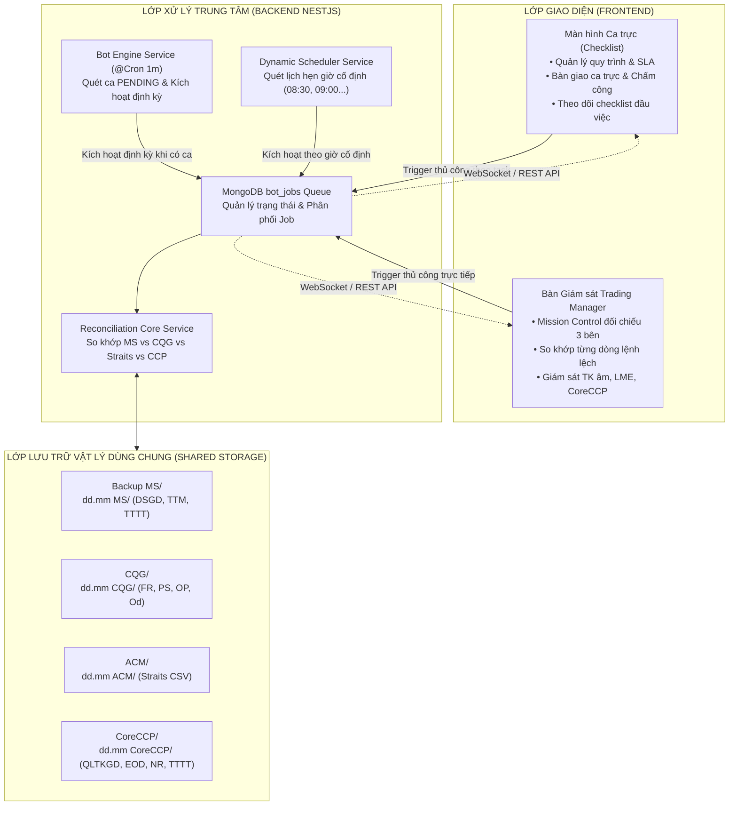
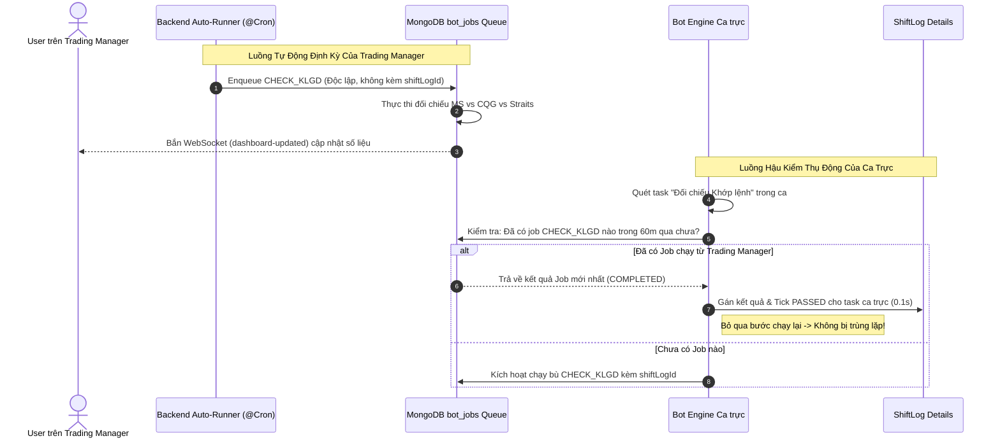

# BÁO CÁO ĐÁNH GIÁ KIẾN TRÚC LUỒNG VẬN HÀNH: TỰ ĐỘNG HÓA TRADING MANAGER & MỐI TƯƠNG QUAN VỚI HỆ THỐNG CA TRỰC (CHECKLIST)

> **Tài liệu Kỹ thuật, Đánh giá Kiến trúc & Chiến lược Chuyển đổi Vận hành**  
> **Người lập**: Antigravity (AI Assistant)  
> **Dự án**: MXV Shift Checklist & Trading Manager Automation  
> **Mục tiêu**: Đánh giá chi tiết cơ chế chạy tự động của Trading Manager, giải pháp Ca trực Tinh Gọn (Flat Task) cho UAT, cơ chế Hậu kiểm Thụ động (Passive Verification) và chiến lược dài hạn đưa Trading Manager thành Màn hình Trung tâm.

---

## 1. TỔNG QUAN VẤN ĐỀ & BỐI CẢNH UAT

Trong quá trình chuẩn bị cho người dùng vận hành (Ban Quản lý Giao dịch / IT Support) tiến hành **Kiểm thử Tiếp nhận Người dùng (User Acceptance Testing - UAT)** và xây dựng lộ trình vận hành dài hạn, các bài toán thực tế được đặt ra:

1. **Giai đoạn UAT**: Người dùng muốn **chỉ mở duy nhất giao diện Trading Manager** (`/trading-manager`) để giám sát đối chiếu 3 bên (M-System, CQG, CoreCCP), bật chế độ tự động quét trong phiên (`bot_auto_recon_enabled = true`).
2. **Vấn đề đặt ra**: Liệu có thể tạm thời không kích hoạt các task vụ phức tạp theo timeline (bao gồm hàng chục task con) trong ca trực cũ, mà **tạo các ca trực mới chỉ chứa các task bot độc lập (không truyền task con)** để cấp nhịp tự động cho Trading Manager hay không?
3. **Chiến lược dài hạn**: Sau này, **Trading Manager sẽ là Màn hình Trung tâm (Primary Operation Hub)**. Các bot nghiệp vụ nặng (đối chiếu, tải báo cáo, chạy macro) sẽ được gỡ khỏi ca trực để tránh xung đột hoặc chạy lặp lại. Ca trực sẽ chỉ đóng vai trò kiểm tra kết quả (Hậu kiểm), ghi nhận biên bản và thực hiện các nghiệp vụ hành chính/hỗ trợ.
4. **Đánh giá mức độ tác động**: Liệu việc chuyển đổi này có đòi hỏi phải đập đi xây lại hoặc chỉnh sửa mã nguồn nhiều không?

---

## 2. KẾT QUẢ KIỂM CHỨNG MÃ NGUỒN THỰC TẾ (CODE-FIRST GROUNDING)

Toàn bộ các nhận định kỹ thuật dưới đây đều được trích dẫn trực tiếp từ mã nguồn đang hoạt động trong repository:

### 2.1. Vòng lặp quét tự động trong Backend (`bot-engine.service.ts`)

Nhịp đập tự động quét tác vụ ca trực chạy định kỳ mỗi phút một lần thông qua decorator `@Cron('* * * * *')`:

- **Đường dẫn**: [`backend/src/modules/bot-engine/bot-engine.service.ts#L48-L87`](file:///c:/Users/hiepth/OneDrive%20-%20MERCANTILE%20EXCHANGE%20OF%20VIETNAM/Documents/Github/mxv-cqg-download-investigation/backend/src/modules/bot-engine/bot-engine.service.ts#L48-L87)
- **Logic kiểm tra**:

  ```typescript
  @Cron('* * * * *', {
    name: 'automated-checklist-bot-runner',
    timeZone: 'Asia/Saigon',
  })
  async handleBotChecks() {
    ...
    // 1. Kiểm tra Master Switch: bot_auto_recon_enabled (L62-L73)
    const autoReconSetting = await this.settingsService.getSetting('bot_auto_recon_enabled', 'true');
    if (autoReconSetting === 'false') {
      return; // Dừng nếu người dùng tắt nút Tự động
    }

    // 2. Lấy danh sách ca trực đang hoạt động (L79-L87)
    const activeLogs = await this.shiftLogModel
      .find({ status: 'PENDING' })
      .populate('shiftSlotId')
      .populate('templateId')
      .exec();

    // ⛔ ĐIỀU KIỆN TIÊN QUYẾT:
    if (activeLogs.length === 0) {
      return; // DỪNG NGAY NẾU KHÔNG CÓ CA TRỰC NÀO ĐANG MỞ!
    }
    ...
  ```

- **Hệ quả thực tế**:
  - Tác vụ đối chiếu khớp lệnh định kỳ (`CHECK_KLGD`) và đối chiếu Pre-EOD (`CHECK_PRE_EOD`) được kích hoạt bởi vòng lặp duyệt qua `activeLogs` ([`bot-engine.service.ts#L689-L705`](file:///c:/Users/hiepth/OneDrive%20-%20MERCANTILE%20EXCHANGE%20OF%20VIETNAM/Documents/Github/mxv-cqg-download-investigation/backend/src/modules/bot-engine/bot-engine.service.ts#L689-L705)).
  - **Nếu toàn bộ ca trực bị đóng (không có bản ghi `shift_logs` nào có `status: 'PENDING'`) $\rightarrow$ Backend sẽ dừng ngay ở dòng 85 và KHÔNG sinh bất kỳ Job đối chiếu định kỳ nào.**

### 2.2. Cơ chế đếm ngược và kích hoạt trên Frontend Trading Manager

- **Đường dẫn**: [`frontend/src/app/trading-manager/components/legacy-ms-cqg/LegacyReconSection.tsx#L357-L383`](file:///c:/Users/hiepth/OneDrive%20-%20MERCANTILE%20EXCHANGE%20OF%20VIETNAM/Documents/Github/mxv-cqg-download-investigation/frontend/src/app/trading-manager/components/legacy-ms-cqg/LegacyReconSection.tsx#L357-L383)
- **Logic hiển thị đồng hồ đếm ngược**:

  ```typescript
  // Countdown Timer: Nhận số giây từ server (shiftInfo.nextScanInSeconds)
  useEffect(() => {
    const serverNextScan = summaryData?.shiftInfo?.nextScanInSeconds;
    if (serverNextScan !== undefined && serverNextScan > 0) {
      setCountdownSeconds(serverNextScan);
      return;
    }
    ...
  }, [summaryData, intervalMinutes, runs]);

  // Bộ đếm nhịp 1 giây giảm dần trên giao diện UI (L377-L383)
  useEffect(() => {
    const timer = setInterval(() => {
      setCountdownSeconds((prev) => (prev > 0 ? prev - 1 : 0));
    }, 1000);
    return () => clearInterval(timer);
  }, []);
  ```

- **Hành vi thực tế của UI**:
  - Đồng hồ đếm ngược `countdownSeconds` trên giao diện Trading Manager **chỉ mang tính chất hiển thị (Visual Indicator)** cho người dùng biết khoảng bao lâu nữa bot backend sẽ chạy.
  - Giao diện **không** tự động gửi request `POST /trigger-console-run` khi số giây đếm về `00:00`.
  - Toàn bộ việc sinh job tự động đều do Backend `@Cron` chủ động đẩy vào hàng đợi `bot_jobs`, sau đó Backend phát WebSocket event `job-status-updated` và `dashboard-updated` về UI ([`LegacyReconSection.tsx#L528-L569`](file:///c:/Users/hiepth/OneDrive%20-%20MERCANTILE%20EXCHANGE%20OF%20VIETNAM/Documents/Github/mxv-cqg-download-investigation/frontend/src/app/trading-manager/components/legacy-ms-cqg/LegacyReconSection.tsx#L528-L569)).

### 2.3. Cơ chế kích hoạt thủ công (Manual Trigger)

- **Đường dẫn**: [`LegacyReconSection.tsx#L583-L605`](file:///c:/Users/hiepth/OneDrive%20-%20MERCANTILE%20EXCHANGE%20OF%20VIETNAM/Documents/Github/mxv-cqg-download-investigation/frontend/src/app/trading-manager/components/legacy-ms-cqg/LegacyReconSection.tsx#L583-L605)
- Khi người dùng bấm các nút: **"Check" (Đối chiếu Khớp lệnh)**, **"Kiểm tra ngay" (Scan TK âm EOD)**, **"Đồng bộ CQG" (Ghép file thô)**, **"Tải báo cáo" (RPA M-System / CoreCCP)**:
  - Frontend gọi API `POST /api/v1/reconciliation/trigger-console-run`.
  - API này trực tiếp đẩy Job vào MongoDB `bot_jobs` với cờ `bypassCooldown: true` mà **không phụ thuộc vào việc có ca trực nào đang mở hay không**.

---

## 3. MỐI TƯƠNG QUAN DỮ LIỆU & TÁC VỤ HIỆN TẠI

Hệ thống được thiết kế theo mô hình **Tách biệt Trách nhiệm (Separation of Concerns)** nhưng **Chia sẻ Dữ liệu Chung (Shared Data & Queue Engine)**:



### 3.1. Cơ chế Tái Sử Dụng File Thông Minh (Zero-Duplicate File Reuse)

Khi Trading Manager tải file về (hoặc người dùng tải thủ công), các file được lưu vào đúng cấu trúc thư mục chuẩn (`dd.mm MS`, `dd.mm CQG`, `dd.mm CoreCCP`):

- Khi bot trong Ca trực chạy đến một tác vụ (ví dụ: `FILE_AUDIT_MS`, `DOWNLOAD_CQG_BACKUP`, `DOWNLOAD_CCP_REPORT`):
  - Bot sẽ **kiểm tra sự tồn tại và tính hợp lệ của file trong thư mục ngày hôm đó trước** ([`bot-engine.service.ts#L887-L925`](file:///c:/Users/hiepth/OneDrive%20-%20MERCANTILE%20EXCHANGE%20OF%20VIETNAM/Documents/Github/mxv-cqg-download-investigation/backend/src/modules/bot-engine/bot-engine.service.ts#L887-L925)).
  - **Nếu file đã có sẵn**: Bot ca trực **không tải lại**, mà chuyển ngay sang bước thẩm định, tính toán và tự động cập nhật trạng thái `PASSED` cho task trong Checklist ([`bot-engine.service.ts#L1382-L1395`](file:///c:/Users/hiepth/OneDrive%20-%20MERCANTILE%20EXCHANGE%20OF%20VIETNAM/Documents/Github/mxv-cqg-download-investigation/backend/src/modules/bot-engine/bot-engine.service.ts#L1382-L1395)).
  - **Chỉ khi file thực sự còn thiếu**: Bot ca trực mới khởi tạo RPA để đăng nhập và tải file về.

---

## 4. ĐÁNH GIÁ PHƯƠNG ÁN: TẠO CA TRỰC MỚI KHÔNG TRUYỀN TASK CON (FLAT TASK) CHO UAT

### 4.1. Khả thi về mặt Kỹ thuật: 100% Hoạt Động Hoàn Hảo

Hệ thống Backend hoàn toàn **không bắt buộc** task phải nằm trong cây quan hệ Cha - Con (`parentTaskIdSnapshot`):

1. **Tìm kiếm động theo năng lực (Capability-Driven)**:
   - Tại [`bot-task-registry.ts#L106-L128`](file:///c:/Users/hiepth/OneDrive%20-%20MERCANTILE%20EXCHANGE%20OF%20VIETNAM/Documents/Github/mxv-cqg-download-investigation/backend/src/modules/bot-engine/constants/bot-task-registry.ts#L106-L128), hàm `findBotTasksInShift` tìm kiếm task mục tiêu **trực tiếp qua thuộc tính `botCheckType`**.
   - Nếu task đứng độc lập không có `parentTaskIdSnapshot`, hàm vẫn trả về `subTask` bình thường và gán `parentTask = null`.
   - Màn hình Trading Manager ([`recon-console-summary.service.ts#L520-L540`](file:///c:/Users/hiepth/OneDrive%20-%20MERCANTILE%20EXCHANGE%20OF%20VIETNAM/Documents/Github/mxv-cqg-download-investigation/backend/src/modules/reconciliation/services/recon-console-summary.service.ts#L520-L540)) đọc `taskKlgd = subTask || parentTask` $\rightarrow$ Nhận diện ngay và hiển thị chu kỳ đếm ngược chính xác.
2. **Vòng lặp quét Bot Engine ([`bot-engine.service.ts#L167-L175`](file:///c:/Users/hiepth/OneDrive%20-%20MERCANTILE%20EXCHANGE%20OF%20VIETNAM/Documents/Github/mxv-cqg-download-investigation/backend/src/modules/bot-engine/bot-engine.service.ts#L167-L175))**:
   - Bot duyệt qua từng phần tử trong `log.details`. Chỉ cần thỏa mãn `isBotCheckSnapshot === true`, `status === 'PENDING'`, bot lập tức enqueue job và chạy định kỳ theo `frequencyMinutes`.
3. **Cập nhật trạng thái trực tiếp ([`shifts.service.ts#L455-L463`](file:///c:/Users/hiepth/OneDrive%20-%20MERCANTILE%20EXCHANGE%20OF%20VIETNAM/Documents/Github/mxv-cqg-download-investigation/backend/src/modules/shifts/shifts.service.ts#L455-L463))**:
   - Nếu task không có task con, nó là một **Task độc lập (Leaf task)**, bot cập nhật trạng thái `PASSED` / `FAILED` trực tiếp mà không cần chờ đợi rollup tỷ lệ % của task con.

### 4.2. Các Lợi Thế Vượt Trội Cho Đợt UAT

| Tiêu chí                  | Dùng Template Cũ (Đầy đủ Timeline & Task con)                                               | Dùng Template UAT Tinh Gọn (Flat Task)                                                                 |
| :------------------------ | :------------------------------------------------------------------------------------------ | :----------------------------------------------------------------------------------------------------- |
| **Độ phức tạp UI**        | Cồng kềnh, hàng chục task con chi tiết khiến người dùng bị phân tâm.                        | **Gọn nhẹ, chỉ có 3 - 4 task bot cốt lõi**, cực kỳ trực quan.                                          |
| **Cảnh báo trễ SLA ảo**   | Các task thủ công do con người làm nếu không bấm sẽ bị báo trễ hạn (đỏ lòm trên Dashboard). | **Không bị trễ SLA ảo**, vì không có task con thủ công nào bị bỏ sót.                                  |
| **Bảo toàn cấu hình gốc** | Nếu sửa trực tiếp trên Template cũ thì sau này muốn dùng lại phải cấu hình lại từ đầu.      | **Bảo toàn 100% Template chuẩn cũ** trong CSDL, sau này đưa vào vận hành chỉ việc chọn lại.            |
| **Vai trò vận hành**      | Ca trực vô tình tạo áp lực theo dõi quy trình hành chính.                                   | Ca trực đóng vai trò như một **"Background Bot Worker"** chuyên cấp nhịp sinh job cho Trading Manager. |

### 4.3. Bảng Cấu Hình Mẫu Cho Template Ca Trực UAT Tinh Gọn (Zero-Code)

Trên giao diện Web (Admin), tạo Template mới tên là _"Template UAT Trading Manager"_ với các task phẳng độc lập:

|  STT  | Tên Tác vụ                                             | Loại Bot (`botCheckType`) | Tần suất (`frequencyMinutes`) | Giờ chạy cố định (`botTriggerTime`) | Phụ thuộc (`dependsOn`) | Ghi chú                                                     |
| :---: | :----------------------------------------------------- | :-----------------------: | :---------------------------: | :---------------------------------: | :---------------------: | :---------------------------------------------------------- |
| **1** | Đối chiếu Khớp lệnh trong phiên (MS vs CQG vs Straits) |       `CHECK_KLGD`        |       `60` _(hoặc 30)_        |             _Để trống_              |         _Rỗng_          | Tự động quét và đối chiếu khớp lệnh định kỳ cả phiên.       |
| **2** | Đối chiếu chốt sổ cuối ngày Pre-EOD                    |      `CHECK_PRE_EOD`      |          _Để trống_           |      `21:30` _(hoặc giờ chốt)_      |         _Rỗng_          | Tự động so khớp số dư, vị thế và quét âm ký quỹ cuối ngày.  |
| **3** | Tự động tải backup M-System                            |      `RPA_DOWNLOAD`       |          _Để trống_           |               `08:30`               |         _Rỗng_          | Bot RPA tự động đăng nhập web M-System tải DSGD, TTM, TTTT. |
| **4** | Thống kê Báo cáo CCP (Số Lot & GTGD)                   |      `RUN_LOT_MACRO`      |          _Để trống_           |               `09:00`               |         _Rỗng_          | Tự động chạy Macro kết xuất báo cáo thống kê hàng ngày.     |

> 💡 **Quy tắc cấu hình**: Tích chọn `isBotCheck: true`, để trống `parentTaskId` và để rỗng `dependsOnTaskIds`.

---

## 5. ĐỊNH HƯỚNG DÀI HẠN: TRADING MANAGER LÀ PRIMARY HUB & CA TRỰC LÀ HẬU KIỂM THỤ ĐỘNG

### 5.1. Định hướng Kiến trúc Vận hành Mới

- **Trading Manager = Bàn Điều Khiển Chính (Primary Automation Hub)**:
  - Tự động quét đối chiếu trong phiên theo chu kỳ (24/5) mà không phụ thuộc ca trực mở hay đóng.
  - Chuyên sâu hóa nghiệp vụ: Bóc tách từng lệnh lệch, xử lý tài khoản âm, đối chiếu LME, backup & thống kê CoreCCP.
- **Ca trực (Checklist) = Công cụ Hậu kiểm Thụ động & Quản trị Quy trình (Passive Governance & Audit Log)**:
  - Chỉ tập trung vào việc con người: Giao ca, nhận ca, chấm công, kiểm tra an toàn hệ thống, ghi nhận sự cố, ký duyệt bàn giao.
  - Đối với các đầu việc liên quan đến đối chiếu: Ca trực chuyển sang **Hậu kiểm Thụ động (Passive Verification)**, không tự phát động chạy lặp lại.

### 5.2. Cơ chế "Hậu Kiểm Thụ Động" (Passive Verification / Link-to-Latest)

Để loại bỏ triệt để nguy cơ **xung đột job** hoặc **chạy lặp lại vô ích** giữa 2 màn hình:

1. Khi Ca trực quét đến task đối chiếu: Bot ca trực **không chủ động enqueue một job mới**, mà truy vấn nhanh vào CSDL:
   _"Trong vòng 60 phút qua, Trading Manager đã có lượt chạy `CHECK_KLGD` nào thành công chưa?"_
2. **Nếu ĐÃ CÓ**:
   - Bot ca trực **lấy ngay kết quả của lượt chạy gần nhất đó**, tự động gán vào task của ca trực và đánh dấu `PASSED` (hoặc `NEEDS_ATTENTION` nếu lệch) ([`bot-job-queue.service.ts#L689-L723`](file:///c:/Users/hiepth/OneDrive%20-%20MERCANTILE%20EXCHANGE%20OF%20VIETNAM/Documents/Github/mxv-cqg-download-investigation/backend/src/modules/bot-engine/bot-job-queue.service.ts#L689-L723)).
   - Quá trình này diễn ra tức thì (< 0.1 giây), không tốn CPU, không gọi bot crawler và không tranh chấp file Excel.
3. **Nếu CHƯA CÓ**:
   - Lúc này bot ca trực mới kích hoạt chạy bù để đảm bảo tính toàn vẹn dữ liệu của ca.



---

## 6. ĐÁNH GIÁ MỨC ĐỘ THAY ĐỔI HỆ THỐNG: CÓ CẦN CHỈNH SỬA NHIỀU KHÔNG?

👉 **KẾT LUẬN: KHÔNG CẦN CHỈNH SỬA NHIỀU. HỆ THỐNG HIỆN TẠI ĐÃ SẴN SÀNG 85 – 90% CHO MÔ HÌNH NÀY!**

### 6.1. Vì sao chỉ cần sửa rất ít?

1. **Trading Manager đã hoàn toàn phi tập trung (Decoupled)**:
   - Các service đối chiếu (`KlgdReconService`, `PreEodReconService`, `CcpReconService`, `CcpExcelParser`) đều là Stateless Services, không gắn chặt với thực thể Ca trực.
   - Frontend Trading Manager đọc dữ liệu trực tiếp từ `botJobModel` của MongoDB, hiển thị độc lập không phụ thuộc vào `shiftLogId`.
2. **Hàng đợi `bot_jobs` đã hỗ trợ chạy độc lập**:
   - Tại [`bot-job-queue.service.ts#L645-L745`](file:///c:/Users/hiepth/OneDrive%20-%20MERCANTILE%20EXCHANGE%20OF%20VIETNAM/Documents/Github/mxv-cqg-download-investigation/backend/src/modules/bot-engine/bot-job-queue.service.ts#L645-L745): Nếu job không có `shiftLogId`, bot vẫn chạy, lưu kết quả và phát socket bình thường.
3. **Kho file dùng chung (Shared Storage)**:
   - Cả 2 bên đều dùng chung đường dẫn cấu hình chuẩn trong `system_settings` (`Backup MS/`, `CQG/`, `ACM/`, `CoreCCP/`).

### 6.2. Danh mục các điểm kỹ thuật cần tinh chỉnh (Chỉ ~100 – 150 dòng code Backend)

| Điểm tinh chỉnh                                   | Vị trí file                                                                                                                                                                                                                              | Nội dung thay đổi                                                                                                                                                                           |            Mức độ phức tạp             |
| :------------------------------------------------ | :--------------------------------------------------------------------------------------------------------------------------------------------------------------------------------------------------------------------------------------- | :------------------------------------------------------------------------------------------------------------------------------------------------------------------------------------------ | :------------------------------------: |
| **1. Tách Standalone Runner cho Trading Manager** | [`scheduler.service.ts`](file:///c:/Users/hiepth/OneDrive%20-%20MERCANTILE%20EXCHANGE%20OF%20VIETNAM/Documents/Github/mxv-cqg-download-investigation/backend/src/modules/bot-engine/scheduler.service.ts)                                | Bổ sung hàm `@Cron('*/1 * * * *')` tự động enqueue `CHECK_KLGD` định kỳ theo `bot_periodic_check_frequency` mà không phụ thuộc `activeLogs.length > 0`.                                     |     **Rất nhẹ** (~30-50 dòng code)     |
| **2. Cơ chế Link-to-Latest cho Bot Ca trực**      | [`bot-engine.service.ts`](file:///c:/Users/hiepth/OneDrive%20-%20MERCANTILE%20EXCHANGE%20OF%20VIETNAM/Documents/Github/mxv-cqg-download-investigation/backend/src/modules/bot-engine/bot-engine.service.ts#L689-L710)                    | Trước khi sinh job `CHECK_KLGD` / `CHECK_PRE_EOD` mới, kiểm tra xem đã có job tương ứng chạy trong khoảng thời gian hiệu lực chưa; nếu có thì tái sử dụng kết quả để cập nhật task ca trực. | **Trung bình thấp** (~50-80 dòng code) |
| **3. Tinh giản Template Ca trực**                 | Giao diện Web Admin                                                                                                                                                                                                                      | Tạo/chỉnh sửa Template ca trực thực tế trên UI: Gỡ bỏ task bot trùng, giữ lại task quy trình con người.                                                                                     |   **0 dòng code** (Cấu hình trên UI)   |
| **4. Frontend Trading Manager**                   | [`LegacyReconSection.tsx`](file:///c:/Users/hiepth/OneDrive%20-%20MERCANTILE%20EXCHANGE%20OF%20VIETNAM/Documents/Github/mxv-cqg-download-investigation/frontend/src/app/trading-manager/components/legacy-ms-cqg/LegacyReconSection.tsx) | Đã hoàn thiện 100%, không cần chỉnh sửa bất kỳ dòng code nào.                                                                                                                               |            **0 dòng code**             |

---

## 7. LỘ TRÌNH THỰC HIỆN KHUYẾN NGHỊ

### 🟢 Giai đoạn 1: Triển khai UAT Ngay Lập Tức (Zero Code Change)

1. **Thao tác**: Tạo 1 Template ca trực mới tên _"Template UAT Trading"_ trên giao diện Admin với 4 Flat Task bot như bảng ở Mục 4.3 (không có task con).
2. **Kích hoạt**: Bấm "Bắt đầu ca" cho ca UAT này để bản ghi `shift_logs` có trạng thái `PENDING`.
3. **Vận hành**: Người dùng UAT mở duy nhất màn hình **Trading Manager**, bật `[Tự động: BẬT]` và tiến hành kiểm thử toàn bộ tính năng. Hệ thống tự động quét ngầm định kỳ đều đặn mà không cần bất kỳ sự can thiệp nào vào code.

### 🔵 Giai đoạn 2: Chuẩn Hóa Kiến Trúc Trước Khi Go-Live

1. Triển khai 2 tinh chỉnh nhỏ ở Backend (Standalone Runner và Link-to-Latest).
2. Tách bạch hoàn toàn: Trading Manager tự chạy độc lập 100% không cần bất kỳ ca trực nào mở.
3. Chuyển đổi Template Ca trực chính thức thành Checklist kiểm soát quy trình hành chính và hậu kiểm an toàn.


---
*Tài liệu được cập nhật toàn diện và lưu trữ tại [docs/DANH_GIA_LUONG_TU_DONG_TRADING_MANAGER_VA_TUONG_QUAN_CA_TRUC.md](file:///c:/Users/hiepth/OneDrive%20-%20MERCANTILE%20EXCHANGE%20OF%20VIETNAM/Documents/Github/mxv-cqg-download-investigation/docs/DANH_GIA_LUONG_TU_DONG_TRADING_MANAGER_VA_TUONG_QUAN_CA_TRUC.md).*
