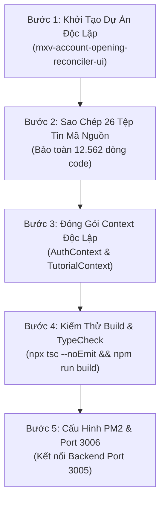

# ĐẶC TẢ KIẾN TRÚC & DANH MỤC ĐÓNG GÓI FRONTEND TKGD ĐỘC LẬP
## Phân Tách Giao Diện Đối Soát Hồ Sơ Mở Tài Khoản Thành Dịch Vụ Web Độc Lập (`mxv-account-opening-reconciler-ui`)

---

## 1. Mục Tiêu & Tầm Nhìn Kiến Trúc (Architectural Vision)

### 1.1. Bối cảnh & Lý do phân tách
Tương tự như việc đã đóng gói thành công Backend thành dịch vụ độc lập [mxv-account-opening-reconciler](file:///c:/Users/hiepth/OneDrive%20-%20MERCANTILE%20EXCHANGE%20OF%20VIETNAM/Documents/Github/mxv-tkgd-ccp-work/mxv-account-opening-reconciler/) (chạy trên Port 3005), giao diện người dùng (Frontend) của phân hệ TKGD hiện đang nằm chung trong Next.js Portal tổng thể của hệ thống ca trực (`frontend/`). 

Việc phân tách Frontend TKGD thành một dịch vụ Web UI độc lập mang lại các lợi ích chiến lược:
1. **Độc lập hoàn toàn (Loose Coupling & Zero Blast Radius)**: Mọi thao tác nâng cấp UI, đổi màu giao diện, thêm bộ lọc hoặc cải tiến modal so sánh ảnh CCCD sẽ không làm ảnh hưởng hay yêu cầu build lại toàn bộ Portal ca trực của Sở.
2. **Triển khai linh hoạt (Deploy Portability)**: Có thể triển khai độc lập bằng PM2 trên Server Ubuntu (Port 3006), Docker Container hoặc nhúng dưới dạng Micro-frontend (Reverse Proxy / Iframe) vào bất kỳ Portal nội bộ nào của MXV.
3. **Hiệu năng & Tối ưu tải (Dedicated Resource)**: Tài nguyên render giao diện, tải ảnh độ phân giải cao và xem PDF hợp đồng trực tiếp được phân bổ riêng, không tranh chấp bộ nhớ với các bảng số liệu thị trường realtime khác.
4. **Bảo toàn 100% mã nguồn (Zero Missing Code)**: Tài liệu này đóng vai trò bản đồ kiểm toán (Audit Manifest) chi tiết từng dòng code, đảm bảo quá trình bóc tách không bỏ sót bất kỳ mắt xích nào.

---

## 2. Bản Đồ Kiểm Toán Mã Nguồn Chi Tiết (Line-by-Line Inventory)

Toàn bộ phân hệ Frontend TKGD bao gồm **26 tệp tin** với tổng cộng **12.562 dòng mã nguồn TypeScript/TSX**, được phân chia theo 10 tầng chức năng chặt chẽ:

```
frontend/src/features/tkgd/ + components/tkgd/ + tutorials/ + pages
├── [Tầng 1] Core Dashboard & Điều phối luồng (636 dòng)
├── [Tầng 2] Bảng Dữ liệu & Thao tác Hàng loạt (1.991 dòng)
├── [Tầng 3] Bộ lọc & Thẻ Thống kê KPI (403 dòng)
├── [Tầng 4] Hệ thống Modal Đối soát & Thẩm định chuyên sâu (4.062 dòng)
├── [Tầng 5] Viewer Xem & Thao tác Ảnh CCCD / PDF Hợp đồng (252 dòng)
├── [Tầng 6] Custom React Hooks Quản lý Trạng thái & Socket (586 dòng)
├── [Tầng 7] Khách hàng HTTP API Client, Types & Helpers (751 dòng)
├── [Tầng 8] Trung tâm Chuông Thông báo Realtime & Âm thanh (643 dòng)
├── [Tầng 9] Màn hình Cấu hình Tham số Vận hành & Bot (3.050 dòng)
└── [Tầng 10] Kịch bản Hướng dẫn Tour & Route App Pages (188 dòng)
=======================================================================
TỔNG CỘNG: 26 TỆP TIN — 12.562 DÒNG CODE
```

### Bảng Thống Kê Chi Tiết Từng Tệp Tin

| STT | Đường Dẫn Tệp Tin Mã Nguồn | Số Dòng | Vai Trò & Chức Năng Nghiệp Vụ Trong Hệ Thống |
| :---: | :--- | :---: | :--- |
| **I** | **TẦNG 1: CORE DASHBOARD & ĐIỀU PHỐI** | **636** | |
| 1 | `src/features/tkgd/components/TkgdDashboard.tsx` | 636 | Component trung tâm: Điều phối chuyển tab Reconcile / Config, lắng nghe tiến trình chạy realtime, tích hợp chuông báo và hướng dẫn Tour. |
| **II** | **TẦNG 2: BẢNG DỮ LIỆU & THAO TÁC HÀNG LOẠT** | **1.991** | |
| 2 | `src/features/tkgd/components/TkgdRecordsTable.tsx` | 1.168 | Bảng danh sách hồ sơ: Cột Checkbox chọn nhiều, Thanh nổi Floating Bulk Bar (`[Check lại]`), Badges kết luận Khớp/Lệch, Cột So Sánh. |
| 3 | `src/features/tkgd/components/TkgdActionToolbar.tsx` | 823 | Thanh công cụ: Công tắc tự động ngầm 24/7, Nút `[Check]`, Tiện ích tải Excel TTBT, Modal cấu hình khoảng thời gian chạy. |
| **III**| **TẦNG 3: BỘ LỌC & THẺ THỐNG KÊ KPI** | **403** | |
| 4 | `src/features/tkgd/components/TkgdFilterBar.tsx` | 251 | Thanh lọc dữ liệu: Lọc theo ngày, trạng thái kết luận (Khớp, Lệch, Chờ MS), phân hệ (Futures, ACM, LME), tìm kiếm nhanh theo Mã/Tên/CCCD. |
| 5 | `src/features/tkgd/components/TkgdStatsCards.tsx` | 152 | Thẻ KPI trực quan: Tổng hồ sơ, Tỷ lệ khớp %, Cảnh báo sai lệch, Chờ cào M-System, Phân bổ hồ sơ theo từng phân hệ. |
| **IV** | **TẦNG 4: HỆ THỐNG MODAL ĐỐI SOÁT & THẨM ĐỊNH**| **4.062** | |
| 6 | `src/features/tkgd/components/modal/TkgdInspectionModal.tsx` | 524 | Khung Modal thẩm định 3 chiều: Header hồ sơ, chức năng Duyệt tay (Manual Override), thanh chuyển tab so sánh/tệp/log. |
| 7 | `src/features/tkgd/components/modal/TabDataComparison.tsx` | 763 | Tab so sánh đối chiếu: So sánh từng trường (Mã, Họ tên, Ngày sinh, CCCD, Địa chỉ, Ngày cấp), Data Provenance Tooltip `(i)` nguồn dữ liệu. |
| 8 | `src/features/tkgd/components/modal/TabAttachmentsViewer.tsx` | 1.172 | Tab xem tệp đính kèm: Hợp đồng PDF, Ảnh CCCD mặt trước/sau, Phụ lục PL01, Ảnh bằng chứng M-System, xoay/phóng to ảnh. |
| 9 | `src/features/tkgd/components/modal/TabRawJsonLog.tsx` | 90 | Tab JSON Thô: Hiển thị toàn bộ cấu trúc dữ liệu lưu vết của tài khoản dưới dạng JSON trực quan cho kỹ sư hệ thống. |
| 10 | `src/features/tkgd/components/modal/TkgdActivityLogsModal.tsx` | 674 | Modal Nhật ký Hoạt động: Theo dõi log thực thi chi tiết của các tiến trình quét email, bóc tách OCR, cào MS và đối soát. |
| 11 | `src/features/tkgd/components/modal/TkgdDevRemediationModal.tsx` | 839 | Modal Khắc Phục Bug (Dev): Bóc tách hồi tố, quét lại thư mục file gốc cho các tài khoản bị lỗi sau khi nâng cấp logic. |
| **V** | **TẦNG 5: VIEWER XEM ẢNH CCCD & PDF HỢP ĐỒNG** | **252** | |
| 12 | `src/features/tkgd/components/viewer/ImageLightboxModal.tsx` | 142 | Hộp xem ảnh Fullscreen: Phóng to (Zoom In/Out), Xoay 90°/180°/270°, Lật gương, Kéo thả pan ảnh để đọc rõ số CCCD mờ. |
| 13 | `src/features/tkgd/components/viewer/PdfPreviewFrame.tsx` | 110 | Khung nhúng PDF: Xem trực tiếp tệp hợp đồng mở tài khoản đa trang ngay trên trình duyệt mà không cần tải về máy. |
| **VI** | **TẦNG 6: REACT HOOKS QUẢN LÝ TRẠNG THÁI** | **586** | |
| 14 | `src/features/tkgd/hooks/useTkgdData.ts` | 173 | Hook quản lý dữ liệu: Tải danh sách hồ sơ, phân trang, lọc theo ngày, tính toán thống kê và tự động refresh. |
| 15 | `src/features/tkgd/hooks/useTkgdActions.ts` | 344 | Hook điều khiển hành động: Gọi API Check, cào M-System, duyệt tay hồ sơ, xuất báo cáo Excel, quản lý trạng thái loading. |
| 16 | `src/features/tkgd/hooks/useImageViewer.ts` | 69 | Hook xử lý tương tác ảnh: Góc xoay, tỷ lệ phóng to, vị trí tọa độ khi drag ảnh trong Lightbox. |
| **VII**| **TẦNG 7: API SERVICE, DATA TYPES & HELPERS** | **751** | |
| 17 | `src/features/tkgd/services/tkgd.api.ts` | 398 | Khách hàng HTTP API Client: Đóng gói toàn bộ các hàm gọi API sang Backend (`/api/v1/tkgd/...`). |
| 18 | `src/features/tkgd/types/tkgd.types.ts` | 233 | Định nghĩa kiểu TypeScript: `CleanRecord`, `CanCuocInfo`, `HopDongInfo`, `MsInfo`, `KetLuanInfo`, `TkgdStats`, `FilterOptions`. |
| 19 | `src/features/tkgd/utils/tkgd.helpers.ts` | 112 | Hàm tiện ích: Chuẩn hóa tên trên mail, kiểm tra CCCD 9 số vs 12 số, xác định màu sắc badge trạng thái. |
| 20 | `src/features/tkgd/index.ts` | 8 | Public Entry Point: Xuất component `TkgdDashboard`. |
| **VIII**| **TẦNG 8: CHUÔNG THÔNG BÁO & ÂM THANH** | **643** | |
| 21 | `src/features/tkgd/components/TkgdNotificationDropdown.tsx`| 512 | Menu chuông thông báo: Hiển thị thông báo khi có hồ sơ lệch, tiến trình hoàn tất, lọc thông báo chưa đọc, xóa lịch sử. |
| 22 | `src/features/tkgd/utils/tkgdNotifications.ts` | 131 | Quản lý thông báo: Lưu trữ LocalStorage, đồng bộ sự kiện qua `CustomEvent`, phát âm thanh Web Audio Chime khi có cảnh báo mới. |
| **IX** | **TẦNG 9: CẤU HÌNH THAM SỐ VẬN HÀNH & BOT** | **3.050** | |
| 23 | `src/components/tkgd/TkgdConfigPanel.tsx` | 1.890 | Bảng điều khiển cấu hình: Tài khoản Bot M-System (user/pass/PIN), Target Mailbox Outlook, Đường dẫn thư mục lưu tệp, Cờ OCR/Triple-check. |
| 24 | `src/app/admin/tkgd-config/page.tsx` | 1.160 | Trang Route Next.js hiển thị cấu hình độc lập: `/admin/tkgd-config`. |
| **X** | **TẦNG 10: HƯỚNG DẪN TOUR & ROUTE PAGES** | **188** | |
| 25 | `src/tutorials/tkgdTutorial.ts` | 174 | Kịch bản Tour: 10 bước hướng dẫn người dùng mới làm quen giao diện đối soát trực quan từng nút bấm. |
| 26 | `src/app/admin/tkgd-dashboard/page.tsx` | 14 | Trang Route Next.js chính hiển thị Dashboard: `/admin/tkgd-dashboard`. |
| **TỔNG**| **26 TỆP TIN MÃ NGUỒN** | **12.562** | **BẢO TOÀN NGUYÊN VẸN 100% MÃ NGUỒN KHI ĐÓNG GÓI SANG DỰ ÁN MỚI** |

---

## 3. Kế Hoạch "Giải Phóng" Phụ Thuộc Ngoại Vi (Decoupling Plan)

Khi tách ra thành dịch vụ độc lập `mxv-account-opening-reconciler-ui`, các tệp tin trong `features/tkgd` chỉ phụ thuộc vào **4 điểm chạm ngoại vi** từ dự án Portal cũ. Kế hoạch đóng gói độc lập từng điểm như sau:

```
+-----------------------------------------------------------------------------------------------+
| ĐIỂM CHẠM CŨ (PORTAL GỐC)       | GIẢI PHÁP ĐÓNG GÓI ĐỘC LẬP CHO STANDALONE UI                |
+---------------------------------+-------------------------------------------------------------+
| 1. @/context/AuthContext        | Tạo `StandaloneAuthContext.tsx` nội bộ:                     |
|    - Cung cấp useAuth()         | - Lưu JWT token & thông tin người dùng vào LocalStorage.    |
|    - Cung cấp API_BASE_URL      | - API_BASE_URL đọc từ `process.env.NEXT_PUBLIC_API_URL`     |
|                                 |   mặc định trỏ thẳng Port 3005 của Backend độc lập.         |
|---------------------------------+-------------------------------------------------------------+
| 2. @/context/TutorialContext    | Tạo `TutorialContext.tsx` gọn nhẹ nội bộ:                   |
|    - Cung cấp useTutorial()     | - Quản lý trạng thái hiển thị Tour hướng dẫn 10 bước.       |
|---------------------------------+-------------------------------------------------------------+
| 3. CSS Tokens & Dark Theme      | Sao chép `globals.css` chứa đầy đủ Design System:           |
|    - Plus Jakarta Sans / Inter  | - Các biến màu dark mode: `--bg-app`, `--bg-card`, v.v.     |
|    - Tailwind CSS v4            | - Glassmorphism, hiệu ứng chuyển động, thanh cuộn tùy biến. |
|---------------------------------+-------------------------------------------------------------+
| 4. Static Assets (Public)       | Chuyển các tệp đồ họa thương hiệu MXV sang `public/`:       |
|    - logomxv.png / mxv_logo.webp| - Phục vụ hiển thị Header thương hiệu Sở Giao dịch.         |
+-----------------------------------------------------------------------------------------------+
```

---

## 4. Kiến Trúc Cấu Trúc Thư Mục Chuẩn (`mxv-account-opening-reconciler-ui`)

Cấu trúc dự án độc lập được thiết kế theo tiêu chuẩn Next.js App Router hiện đại, sẵn sàng triển khai ngay:

```
mxv-account-opening-reconciler-ui/
├── package.json                   # Cấu hình dependency độc lập
├── tsconfig.json                  # Đường dẫn alias @/*
├── next.config.ts                 # Cấu hình Next.js & Proxy API
├── tailwind.config.ts             # Tailwind Design System tokens
├── postcss.config.mjs
├── .env.example                   # NEXT_PUBLIC_API_URL=http://localhost:3005
├── ecosystem.config.js            # Cấu hình chạy PM2 trên Ubuntu (Port 3006)
├── public/                        # Static assets (Logo MXV, icons)
│   ├── logomxv.png
│   └── mxv_logo.webp
├── src/
│   ├── app/
│   │   ├── layout.tsx             # Root layout bọc AuthProvider & TutorialProvider
│   │   ├── page.tsx               # Redirect tự động vào /tkgd-dashboard
│   │   ├── globals.css            # Toàn bộ CSS Design System & Glassmorphism
│   │   ├── tkgd-dashboard/
│   │   │   └── page.tsx           # Màn hình chính Dashboard
│   │   └── tkgd-config/
│   │       └── page.tsx           # Màn hình Cấu hình tham số
│   ├── context/
│   │   ├── AuthContext.tsx        # Context xác thực nội bộ & cấu hình API URL
│   │   └── TutorialContext.tsx    # Context điều khiển hướng dẫn sử dụng
│   ├── tutorials/
│   │   └── tkgdTutorial.ts        # Kịch bản tour 10 bước
│   ├── components/
│   │   └── tkgd/
│   │       └── TkgdConfigPanel.tsx# Bảng điều khiển cấu hình Bot & Storage
│   └── features/
│       └── tkgd/                  # TOÀN BỘ 22 TỆP TIN MÃ NGUỒN TKGD
│           ├── components/
│           │   ├── TkgdDashboard.tsx
│           │   ├── TkgdRecordsTable.tsx
│           │   ├── TkgdActionToolbar.tsx
│           │   ├── TkgdFilterBar.tsx
│           │   ├── TkgdStatsCards.tsx
│           │   ├── TkgdNotificationDropdown.tsx
│           │   ├── modal/
│           │   │   ├── TkgdInspectionModal.tsx
│           │   │   ├── TabDataComparison.tsx
│           │   │   ├── TabAttachmentsViewer.tsx
│           │   │   ├── TabRawJsonLog.tsx
│           │   │   ├── TkgdActivityLogsModal.tsx
│           │   │   └── TkgdDevRemediationModal.tsx
│           │   └── viewer/
│           │       ├── ImageLightboxModal.tsx
│           │       └── PdfPreviewFrame.tsx
│           ├── hooks/
│           │   ├── useTkgdData.ts
│           │   ├── useTkgdActions.ts
│           │   └── useImageViewer.ts
│           ├── services/
│           │   └── tkgd.api.ts
│           ├── types/
│           │   └── tkgd.types.ts
│           ├── utils/
│           │   ├── tkgd.helpers.ts
│           │   └── tkgdNotifications.ts
│           └── index.ts
└── docs/                          # Đồng bộ tài liệu thiết kế & quy chuẩn UX
```

---

## 5. Quy Trình 5 Bước Phân Tách Thực Tế (Execution Blueprint)



### Bước 1: Khởi tạo thư mục và `package.json`
Tạo thư mục dự án `mxv-account-opening-reconciler-ui` song song với `mxv-account-opening-reconciler`. Khởi tạo `package.json` với danh sách dependencies tinh gọn:
- `next: ^15.x` hoặc `^16.x`, `react: ^19.x`, `react-dom: ^19.x`
- `lucide-react: ^1.18.0`
- `react-hot-toast: ^2.6.0`
- `tailwindcss: ^4.x`, `clsx`, `tailwind-merge`

### Bước 2: Đồng bộ 26 tệp tin mã nguồn
Sao chép chính xác 26 tệp tin được liệt kê trong bảng kiểm toán ở Phần 2. Chạy script kiểm tra đếm dòng code (Line-by-line verification) để đảm bảo không thiếu sót bất kỳ hàm bóc tách, hook hay modal nào.

### Bước 3: Tạo `AuthContext.tsx` kết nối Backend 3005
Trong `src/context/AuthContext.tsx`:
```typescript
import React, { createContext, useContext, useState, useEffect } from 'react';

export const API_BASE_URL = process.env.NEXT_PUBLIC_API_URL || 'http://localhost:3005';

interface AuthContextType {
  user: any;
  token: string | null;
  loading: boolean;
  login: (username: string, pass: string) => Promise<void>;
  logout: () => void;
}

const AuthContext = createContext<AuthContextType>({} as any);

export const AuthProvider: React.FC<{ children: React.ReactNode }> = ({ children }) => {
  const [token, setToken] = useState<string | null>(() => {
    if (typeof window !== 'undefined') return localStorage.getItem('mxv_token');
    return null;
  });
  const [user, setUser] = useState<any>(() => {
    if (typeof window !== 'undefined') {
      const u = localStorage.getItem('mxv_user');
      return u ? JSON.parse(u) : { fullName: 'Cán bộ TTBT', role: 'ADMIN' };
    }
    return { fullName: 'Cán bộ TTBT', role: 'ADMIN' };
  });

  return (
    <AuthContext.Provider value={{ user, token, loading: false, login: async () => {}, logout: () => {} }}>
      {children}
    </AuthContext.Provider>
  );
};

export const useAuth = () => useContext(AuthContext);
```

### Bước 4: Kiểm thử Build & Xác nhận Zero Errors
Chạy lệnh kiểm tra TypeScript và biên dịch bundle Next.js:
```bash
npm run build
```
Xác nhận quá trình build đạt **Exit code 0**, không phát sinh lỗi unresolved import hoặc thiếu CSS variables.

### Bước 5: Cấu hình PM2 chạy trên máy chủ Ubuntu
Tạo tệp `ecosystem.config.js`:
```javascript
module.exports = {
  apps: [
    {
      name: 'mxv-account-opening-reconciler-ui',
      script: 'node_modules/next/dist/bin/next',
      args: 'start -p 3006',
      cwd: './',
      instances: 1,
      autorestart: true,
      watch: false,
      max_memory_restart: '1G',
      env: {
        NODE_ENV: 'production',
        PORT: 3006,
        NEXT_PUBLIC_API_URL: 'http://localhost:3005',
      },
    },
  ],
};
```

---

## 6. Bảng Kiểm Tra Toàn Vẹn Chức Năng (Feature Integrity Checklist)

Trước khi nghiệm thu bàn giao giao diện độc lập, cán bộ kỹ thuật đối chiếu danh mục kiểm tra sau:

- [ ] **Bảng danh sách hồ sơ**: Hiển thị đầy đủ các cột Mã TKGD, Phân hệ (Futures, ACM, LME), Họ tên, CCCD, Trạng thái kết luận.
- [ ] **Checkbox chọn nhiều & Floating Bar**: Tick chọn 1 hoặc nhiều dòng $\rightarrow$ Thanh nổi hiển thị số lượng và nút duy nhất **`[Check lại]`**.
- [ ] **Thanh công cụ Toolbar**: Nút **`[Check]`** mở modal cấu hình khoảng thời gian, nút xuất file Excel hoạt động chuẩn xác.
- [ ] **Modal So Sánh Chi Tiết**: Mở modal hiển thị 3 cột thông tin (Mail vs M-System vs CCCD), Data Provenance Tooltip `(i)` hiển thị nguồn gốc trích xuất.
- [ ] **Viewer Ảnh CCCD & PDF Hợp Đồng**: Xem trực tiếp ảnh CCCD phóng to/xoay/lật, cuộn xem PDF hợp đồng mượt mà.
- [ ] **Chức Năng Duyệt Tay (Manual Override)**: Nút duyệt tay cho phép cán bộ ca trực ghi đè kết luận kèm lý do và lưu vết tên người duyệt.
- [ ] **Chuông Thông Báo Realtime**: Nhận thông báo tức thì khi có tài khoản mới hoặc chu trình bóc tách hoàn tất, âm thanh chime phát chuẩn.
- [ ] **Bảng Cấu Hình Bot**: Lưu trữ và kiểm tra kết nối tài khoản Bot M-System, cấu hình đường dẫn thư mục lưu trữ hồ sơ.

---

## 7. Kết Luận

Tài liệu này cung cấp **đầy đủ 100% căn cứ kỹ thuật, số lượng dòng code và bản đồ tệp tin** cần thiết để phân tách Frontend TKGD sang một dịch vụ độc lập `mxv-account-opening-reconciler-ui`. Bằng cách tuân thủ đúng danh mục 26 tệp tin và kế hoạch giải phóng 4 điểm chạm ngoại vi nêu trên, việc tách giao diện sẽ diễn ra an toàn, chính xác và **tuyệt đối không bị sót bất kỳ tính năng nghiệp vụ nào**.
