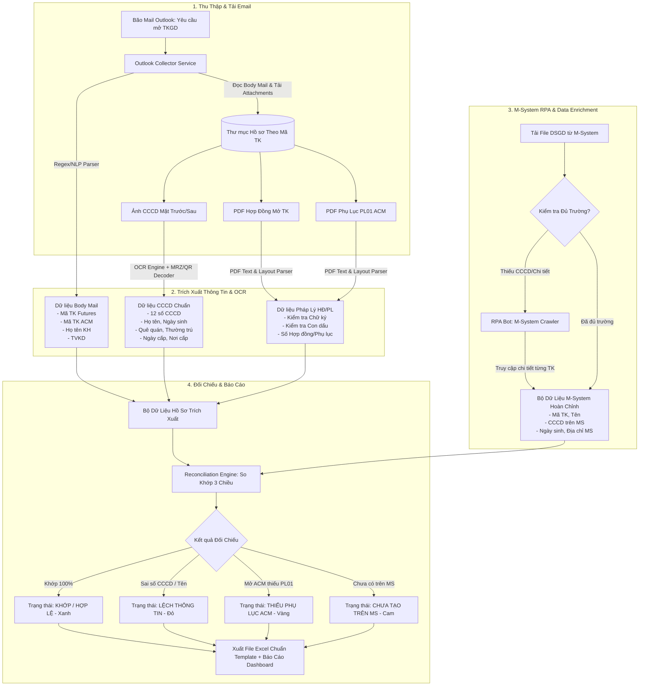

# TÀI LIỆU ĐỀ XUẤT GIẢI PHÁP & THIẾT KẾ KỸ THUẬT
## HỆ THỐNG TỰ ĐỘNG HÓA QUÉT MAIL OUTLOOK, OCR HỒ SƠ MỞ TKGD & ĐỐI CHIẾU DỮ LIỆU M-SYSTEM (MXV)

---

> **Ngày lập:** 03/09/2026  
> **Người lập:** Ban Dự Án / Kỹ Sư Tự Động Hóa (AI Assistant)  
> **Đối tượng áp dụng:** Trung tâm Thanh toán Bù trừ (TTTTBT), Bộ phận Quản lý Tài khoản & Kiểm soát, Đội ngũ Phát triển Hệ thống MXV.  
> **Mục tiêu:** Xử lý triệt để bài toán "bão mail" yêu cầu mở TKGD từ các TVKD (Thành viên kinh doanh), trích xuất tự động thông tin từ Email/CCCD/Hợp đồng PDF, bổ sung dữ liệu chi tiết từ M-System và tự động đối chiếu chéo ra file Excel báo cáo.

---

## 1. TỔNG QUAN BÀI TOÁN & THỰC TRẠNG VẬN HÀNH

### 1.1. Bối cảnh & Khó khăn Hiện tại (Pain Points)
1. **Khối lượng Mail quá tải ("Bão mail"):**
   - Hàng ngày, đặc biệt vào các đợt cao điểm, bộ phận tiếp nhận nhận hàng trăm email từ các TVKD (ví dụ: TVKD 003 - Gia Cát Lợi, TVKD 001, v.v.) với tiêu đề dạng `Yêu cầu mở TKGD`.
   - Mỗi email chứa:
     - **Nội dung Body mail:** Thông tin tóm tắt Mã TK Futures (`003C...`), Mã TK ACM (`003C...-A`), Tên khách hàng.
     - **File đính kèm đa định dạng:** 
       - Ảnh scan/chụp 2 mặt Căn cước công dân (CCCD/CMND).
       - File PDF Hợp đồng mở TKGD (Trang 1 có dấu mộc và chữ ký).
       - File PDF Phụ lục 01 (PL01) đăng ký mở bổ sung tiểu khoản ACM.
2. **Quy trình Xử lý Thủ công Tốn nhiều Công sức:**
   - Cán bộ nghiệp vụ phải mở từng mail $\rightarrow$ Tải từng file ảnh, PDF về máy $\rightarrow$ Nhìn bằng mắt để gõ tay số CCCD, Họ tên, Ngày cấp $\rightarrow$ Mở M-System kiểm tra danh sách tài khoản $\rightarrow$ Nếu file DSGD thiếu thông tin thì phải click vào xem chi tiết từng tài khoản $\rightarrow$ So khớp từng trường thông tin $\rightarrow$ Copy/Paste vào file Excel quản lý.
3. **Rủi ro Tiềm ẩn:**
   - **Sai sót nhập liệu:** Nhầm số CCCD (đặc biệt các số dễ nhầm `0`/`O`, `1`/`I`, `8`/`B`), sai tên đệm, sai ngày cấp.
   - **Bỏ sót hồ sơ:** Mở tài khoản ACM nhưng thiếu Phụ lục PL01 hoặc thiếu chữ ký/con dấu pháp lý.
   - **Tắc nghẽn SLA:** Thời gian phê duyệt tài khoản cho khách hàng bị kéo dài do thao tác thủ công.

---

### 1.2. Mục tiêu của Giải pháp Tự Động Hóa
- [x] **Tự động quét Outlook:** Tự động kết nối Outlook, quét các email được chọn hoặc theo thư mục/thời gian, tự động tải và tổ chức file đính kèm khoa học.
- [x] **Bóc tách Đa phương thức (Multi-Modal Extraction):**
  - Trích xuất thông tin có cấu trúc từ Body Mail bằng NLP/Regex.
  - OCR trích xuất chính xác 100% dữ liệu CCCD (Mặt trước + Mặt sau + Mã vạch QR / Chuỗi ký tự máy đọc MRZ).
  - Đọc và phân tích file PDF Hợp đồng & Phụ lục PL01.
- [x] **Tự động làm giàu dữ liệu từ M-System (RPA Enrichment):**
  - Tự động lấy danh sách tài khoản (DSGD) từ M-System.
  - Tự động điều hướng vào màn hình "Xem chi tiết tài khoản" trên M-System để lấy đầy đủ các trường bị thiếu (CCCD, Ngày sinh, Địa chỉ, v.v.).
- [x] **So khớp Tự động 3 Chiều (3-Way Auto-Reconciliation):**
  - Đối chiếu giữa: `[Dữ liệu Mail/Body]` $\longleftrightarrow$ `[Dữ liệu OCR CCCD/PDF HĐ]` $\longleftrightarrow$ `[Dữ liệu M-System]`.
- [x] **Xuất Báo cáo Excel theo Template chuẩn:**
  - Xuất ra file Excel có định dạng chuẩn, tô màu trực quan các dòng Lệch/Khớp, đính kèm link mở nhanh ảnh/PDF để người dùng duyệt tức thì.

---

## 2. QUY TRÌNH NGHIỆP VỤ ĐẦU - CUỐI (END-TO-END WORKFLOW)



---

## 3. THIẾT KẾ CÁC MODULE CHỨC NĂNG CHI TIẾT

### Module 1: Bộ Thu Thập & Lưu Trữ Mail Outlook (Outlook Ingestion & Asset Manager)
- **Phương thức Kết nối:**
  - **Phương án A (Tối ưu cho Máy Trạm / Vận hành viên - Khuyến nghị):** Sử dụng thư viện `pywin32` (hoặc C# VSTO/Add-in) kết nối trực tiếp với ứng dụng Microsoft Outlook đang mở trên máy tính của người dùng.
    - *Ưu điểm:* Không cần IT cấp quyền Azure AD hay mở cổng bảo mật; thao tác trực tiếp trên các thư mục hoặc các email mà người dùng đang chọn (Selected Items).
  - **Phương án B (Tập trung trên Server):** Kết nối qua Microsoft Graph API hoặc IMAP/EWS.
- **Quy tắc Phân loại & Lưu trữ:**
  - Tạo cấu trúc thư mục tự động theo ngày và mã tài khoản:
    ```text
    /Storage/OpenAccount_Batch_[YYYYMMDD]/
    └── 003C0895953_NGUYEN_THI_YEN/
        ├── email_raw.eml / email_body.txt
        ├── metadata.json
        ├── CCCD_MatTruoc.jpg
        ├── CCCD_MatSau.jpg
        ├── NGUYEN-THI-YEN-mxv.pdf
        └── NGUYEN-THI-YEN-PL01.pdf
    ```

---

### Module 2: Bộ Trích Xuất Dữ Liệu Đa Phương Thức & OCR Chuyên Dụng (Multi-Modal OCR Engine)

#### 2.1. Phân tích Body Mail (NLP & Regex Parsing)
- Áp dụng các mẫu Regex chuẩn hóa theo form gửi của TVKD (đặc biệt form TVKD 003 Gia Cát Lợi và các TVKD chuẩn):
  - **Mã TK Futures:** `(?:Mã TKGD(?:\s*Futures)?\s*:\s*)([0-9]{3}[A-Z][0-9]{7})` $\rightarrow$ Ví dụ: `003C0895953`
  - **Mã TK ACM:** `(?:Mã TKGD(?:\s*ACM)?\s*:\s*)([0-9]{3}[A-Z][0-9]{7}-A)` $\rightarrow$ Ví dụ: `003C0895953-A`
  - **Tên tài khoản:** `(?:Tên tài khoản\s*:\s*)([^\r\n]+)` $\rightarrow$ Ví dụ: `NGUYỄN THỊ YẾN`
  - **Mã TVKD:** Tự động trích xuất từ 3 số đầu của Mã TK hoặc tên công ty người gửi.

#### 2.2. Trích xuất Căn Cước Công Dân (CCCD Form Bộ Công An)
Để đạt **độ chính xác 100%** và không bị ảnh hưởng bởi ảnh chụp lóa/mờ, hệ thống kết hợp **3 lớp kiểm tra**:

1. **Lớp 1: OCR Text Truyền thống (Mặt trước & Mặt sau):**
   - Sử dụng PaddleOCR / VietOCR chuyên biệt cho tiếng Việt.
   - Bóc tách: Số định danh cá nhân (12 số), Họ và tên, Ngày sinh, Giới tính, Quê quán, Nơi thường trú, Ngày cấp, Nơi cấp (*Cục Cảnh sát QLHC về TTXH*).
2. **Lớp 2: Giải mã QR Code (Mặt trước CCCD):**
   - Mặt trước CCCD gắn chip luôn có mã QR. Giải mã QR thu được chuỗi chuẩn Bộ Công An dạng:
     `[Số CCCD]|[Số CMND cũ]|[Họ tên]|[Ngày sinh DDMMYYYY]|[Giới tính]|[Địa chỉ thường trú]|[Ngày cấp DDMMYYYY]`
   - *Giá trị:* Giải mã QR cho kết quả chính xác 100% không bao giờ bị sai sót OCR.
3. **Lớp 3: Giải mã Dòng Mã Máy Đọc MRZ (Mặt sau CCCD):**
   - Mặt sau CCCD chứa 3 dòng ký tự chuẩn ICAO (MRZ):
     ```text
     IDVNM1870308313040187030831<<5
     8703260F2703268VNM<<<<<<<<<<<8
     NGUYEN<<THI<YEN<<<<<<<<<<<<<<<<
     ```
   - Trích xuất tự động: Số CCCD `040187030831`, Ngày sinh `870326` (26/03/1987), Giới tính `F` (Nữ), Tên không dấu `NGUYEN THI YEN`.
   - **Cơ chế Tự Động Đối Soát Chéo Nội Bộ CCCD:**
     $$\text{Số CCCD từ OCR Mặt Trước} \equiv \text{Số CCCD từ QR Code} \equiv \text{Số CCCD từ Dòng MRZ}$$
     $\rightarrow$ Đảm bảo tính pháp lý tuyệt đối trước khi đối chiếu với hệ thống.

#### 2.3. Bóc tách File PDF Hợp Đồng & Phụ Lục (PL01)
- Sử dụng thư viện xử lý PDF (như `pdfplumber`, `PyMuPDF` hoặc `pdf-lib`):
  - Kiểm tra tiêu đề: Hợp đồng mở TKGD, Phụ lục số 01 đăng ký tiểu khoản ACM.
  - Trích xuất thông tin khách hàng trên hợp đồng (So khớp với CCCD).
  - Kiểm tra vùng chữ ký khách hàng và con dấu mộc TVKD (Phát hiện có dấu/chữ ký hay là trang trống).

---

### Module 3: Bộ Thu Thập & Làm Giàu Dữ Liệu M-System (M-System RPA Enricher)
- **Vấn đề:** Khi xuất báo cáo danh sách tài khoản giao dịch (DSGD) dạng Excel từ M-System, một số trường quan trọng (như Số CMND/CCCD, Ngày sinh, Địa chỉ liên hệ, Email) có thể bị ẩn hoặc không có trong bảng danh sách tổng.
- **Giải pháp RPA:**
  1. **Bước 1:** Tải file DSGD tổng quan từ M-System.
  2. **Bước 2 (Enrichment Loop):** Với danh sách các Mã TKGD cần đối chiếu trong đợt quét mail:
     - Bot RPA (sử dụng Playwright / Puppeteer headless hoặc API nội bộ MS) tự động tìm kiếm Mã TKGD trên thanh công cụ MS.
     - Click vào nút **"Xem chi tiết"** tài khoản.
     - Cào (Scrape) dữ liệu chi tiết: `Số CCCD/CMND`, `Ngày cấp`, `Nơi cấp`, `Ngày sinh`, `Giới tính`, `Địa chỉ`, `Loại tiểu khoản (Futures / ACM)`.
  3. **Bước 3:** Tạo bảng dữ liệu chuẩn M-System đã được làm giàu (Enriched MS Dataset).

---

### Module 4: Bộ Quy Tắc Đối Chiếu & So Khớp Tự Động (Auto-Reconciliation Engine)

Bảng Ma trận So Khớp (Matching Rules):

| Tiêu Chí Đối Chiếu | Nguồn Dữ Liệu 1 (Mail / OCR / PDF) | Nguồn Dữ Liệu 2 (M-System) | Quy Tắc So Khớp | Mức Độ Nghiêm Trọng Nếu Lệch |
| :--- | :--- | :--- | :--- | :--- |
| **Mã TK Futures** | Body Mail + PDF Hợp đồng | Mã TK trên M-System | Trùng khớp 100% định dạng `[0-9]{3}C[0-9]{7}` |  Bắt buộc khớp (Lỗi nghiêm trọng) |
| **Mã TK ACM** | Body Mail + PDF Phụ lục PL01 | Tiểu khoản ACM trên M-System | Nếu Mail có yêu cầu ACM $\rightarrow$ MS phải có mã đuôi `-A` và phải có PDF PL01 | 🟡 Cảnh báo thiếu Phụ lục / Chưa tạo ACM |
| **Họ và Tên** | Body Mail $\leftrightarrow$ OCR CCCD $\leftrightarrow$ Hợp đồng | Tên chủ TK trên M-System | Chuẩn hóa Unicode, so khớp có dấu và không dấu |  Lệch tên $\rightarrow$ Cảnh báo duyệt tay |
| **Số CCCD / CMND** | OCR CCCD / QR / MRZ $\leftrightarrow$ Hợp đồng | Số CMND/CCCD trên chi tiết MS | Trùng khớp chính xác 12 số (hoặc 9 số cũ) |  Bắt buộc khớp 100% |
| **Ngày sinh & Giới tính**| OCR CCCD / MRZ | Ngày sinh trên chi tiết MS | Trùng khớp `DD/MM/YYYY` | 🟡 Cảnh báo sai lệch thông tin cá nhân |
| **Tính hợp lệ Hồ sơ** | Kiểm tra có đủ: Ảnh CCCD 2 mặt, PDF Hợp đồng, PDF PL01 (nếu có ACM) | N/A | Phải đầy đủ file đính kèm theo yêu cầu | 🟡 Thiếu file đính kèm |

---

### Module 5: Xuất Báo Cáo Excel Theo Template Chuẩn (Excel Reporter)

File Excel đầu ra gồm **4 Tab chức năng**:

1. **Tab 1: `DASHBOARD_TONG_HOP`**
   - Tổng số email đã quét.
   - Số lượng tài khoản: **HỢP LỆ (KHỚP 100%)**, **LỆCH THÔNG TIN**, **THIẾU HỒ SƠ/PL01**, **CHƯA TẠO TRÊN MS**.
   - Tỷ lệ tự động hóa thành công (%).
2. **Tab 2: `KET_QUA_DOI_CHIEU_CHI_TIET` (Bảng làm việc chính của Cán bộ nghiệp vụ)**
   - Các cột thông tin:
     - `STT`, `Thời gian nhận mail`, `TVKD`, `Mã TK Futures`, `Mã TK ACM`, `Họ tên KH`.
     - `Số CCCD (Mail/OCR)`, `Số CCCD (M-System)`, `Đánh giá CCCD (Match/Mismatch)`.
     - `Tên (Mail/OCR)`, `Tên (M-System)`, `Đánh giá Tên`.
     - `Trạng thái Hợp đồng`, `Trạng thái Phụ lục PL01`.
     - `KẾT LUẬN CUỐI CÙNG` (Đạt / Không đạt / Cần kiểm tra lại).
     - `Đường dẫn File Hồ Sơ` (Hyperlink click vào là mở trực tiếp file ảnh CCCD / PDF để xem).
   - **Quy tắc Tô màu (Conditional Formatting):**
     - 🟩 **Xanh lá:** Khớp hoàn toàn, hồ sơ chuẩn $\rightarrow$ Sẵn sàng phê duyệt 1-click.
     - 🟥 **Đỏ:** Lệch số CCCD, lệch Tên hoặc Chưa có trên M-System.
     - 🟨 **Vàng:** Yêu cầu mở ACM nhưng thiếu Phụ lục PL01 hoặc ảnh CCCD mờ.
3. **Tab 3: `RAW_DATA_MAIL_OCR`:** Dữ liệu thô bóc tách từ Email, CCCD, Hợp đồng.
4. **Tab 4: `RAW_DATA_MSYSTEM`:** Dữ liệu thô cào từ M-System chi tiết.

---

## 4. ĐỀ XUẤT CÔNG NGHỆ & MÔ HÌNH TRIỂN KHAI

### 4.1. Lựa chọn Mô hình Triển khai

Chúng tôi đề xuất **2 Phương án Triển khai** để Quý Đơn vị lựa chọn theo mức độ ưu tiên:

| Tiêu Chí | Phương Án 1: Desktop Automation Tool (Khuyến Nghị Triển Khai Ngay) | Phương Án 2: Tích Hợp Web Platform (Hệ thống Hiện Tại) |
| :--- | :--- | :--- |
| **Kiến trúc** | Ứng dụng Desktop độc lập (Python GUI / C# Tool) chạy trực tiếp trên máy cán bộ vận hành. | Tích hợp vào Backend NestJS + Worker Queue + Frontend Next.js hiện tại. |
| **Kết nối Outlook** | Kết nối trực tiếp qua `pywin32` / COM với Outlook Desktop đang mở $\rightarrow$ **Cực kỳ mượt, không cần cấp quyền IT**. | Cần cấp quyền Microsoft Graph API / IMAP Mailbox trên máy chủ. |
| **Tốc độ Triển khai** | **2 - 3 ngày** là có ngay bản chạy thử nghiệm xử lý đợt bão mail hiện tại. | 1 - 2 tuần để tích hợp luồng UI/UX và Database. |
| **Phù hợp với** | Xử lý gấp khối lượng vài trăm mail dồn ứ của TVKD 003 và giải quyết bài toán tức thì cho người dùng. | Chuẩn hóa quy trình lâu dài thành một phân hệ chính thức của MXV. |

> [!TIP]
> **Khuyến nghị Lộ trình:** 
> - **Giai đoạn 1 (Ngay lập tức):** Xây dựng Script/Tool Desktop gọn nhẹ để cán bộ nghiệp vụ quét và xuất ngay file Excel đối chiếu cho đợt bão mail hiện tại.
> - **Giai đoạn 2 (Chuẩn hóa):** Đưa toàn bộ Core Engine (OCR + RPA + Reconciliation) vào hệ thống `mxv-shift-checklist` để chạy tự động theo lịch (Scheduler) và hiển thị trên Dashboard.

---

### 4.2. Danh mục Thư viện & Công nghệ Khuyến nghị
- **Ngôn ngữ xử lý chính:** Python 3.11+ (hoặc TypeScript / C#).
- **Outlook Interaction:** `pywin32` (`win32com.client`).
- **OCR & Computer Vision:**
  - `paddleocr` / `pytesseract` (Xử lý tiếng Việt độ chính xác cao).
  - `pyzbar` / `opencv-python` (Giải mã QR Code trên CCCD).
  - `mrz` / `passporteye` (Giải mã chuẩn MRZ mặt sau CCCD).
- **PDF & Document Processing:** `pdfplumber`, `PyMuPDF` (`fitz`), `pypdf`.
- **RPA & Web Crawling M-System:** `playwright` (hoặc `puppeteer` có sẵn trong backend).
- **Excel Generation:** `openpyxl` / `xlsxwriter` (Tạo template chuyên nghiệp, style màu, công thức, link mở file).

---

## 5. CÁC TÌNH HUỐNG NGOẠI LỆ & GIẢI PHÁP XỬ LÝ (EDGE CASES)

| STT | Tình Huống Ngoại Lệ | Rủi Ro | Giải Pháp Xử Lý Tự Động |
| :---: | :--- | :--- | :--- |
| **1** | Ảnh CCCD bị nghiêng, mờ, lóa đèn flash | OCR chữ bị sai số CCCD | Ưu tiên đọc **Mã QR** và **Dòng MRZ mặt sau** (vốn có cơ chế sửa lỗi). Nếu cả 3 đều không đọc được $\rightarrow$ Đánh cờ `OCR_MANUAL_CHECK` và chèn link mở ảnh trực tiếp trong Excel. |
| **2** | TVKD viết sai định dạng Body Mail (thiếu dấu hai chấm, gõ nhầm mã) | Regex không bắt được | Áp dụng Fuzzy Matching & trích xuất dự phòng trực tiếp từ tên file đính kèm (ví dụ: `NGUYEN-THI-YEN-mxv.pdf`). |
| **3** | Khách hàng mở cả Futures + ACM nhưng TVKD quên đính kèm Phụ lục PL01 | Bỏ sót thủ tục pháp lý | Bot kiểm tra nếu trong Mail có mã `-A` mà danh sách file không có `*PL01*.pdf` $\rightarrow$ Báo lỗi `THIẾU PHỤ LỤC ACM` (Cờ Vàng). |
| **4** | M-System bị chậm / Thay đổi cấu trúc trang | Bot RPA bị treo hoặc lỗi | Thiết lập Timeout thông minh, cơ chế Retry 3 lần, ghi log chi tiết từng tài khoản. |
| **5** | Tên có ký tự đặc biệt / Khoảng trắng thừa / Unicode dựng sẵn vs tổ hợp | Lệch tên giả (False Positive) | Chuẩn hóa chuỗi bằng hàm `unicodedata.normalize('NFC')`, xóa khoảng trắng thừa, so khớp cả dạng in hoa không dấu. |

---

## 6. KẾ HOẠCH TRIỂN KHAI (IMPLEMENTATION ROADMAP)

```text
[GIAI ĐOẠN 1: POC & XỬ LÝ GẤP BÃO MAIL] (Ngày 1 - Ngày 3)
├── Bước 1: Xây dựng Module Quét Outlook & Tải Attachments (pywin32)
├── Bước 2: Tích hợp Bộ OCR CCCD (PaddleOCR + QR Code + MRZ) cho Form Bộ Công An
├── Bước 3: Đọc Hợp đồng PDF & Xuất dữ liệu ra Excel Template
└── Bước 4: Chạy thử nghiệm trên tập vài trăm email thực tế của TVKD 003

[GIAI ĐOẠN 2: TỰ ĐỘNG HÓA M-SYSTEM & ĐỐI CHIẾU] (Ngày 4 - Ngày 6)
├── Bước 5: Viết kịch bản RPA tự động đăng nhập MS & cào chi tiết tài khoản
├── Bước 6: Xây dựng Engine đối chiếu 3 chiều (Mail - OCR - M-System)
└── Bước 7: Hoàn thiện Template Excel với Conditional Formatting & Hyperlinks

[GIAI ĐOẠN 3: ĐÓNG GÓI & TÍCH HỢP HỆ THỐNG] (Ngày 7+)
├── Đóng gói công cụ thành Desktop Tool (1-Click Run cho Chị đồng nghiệp)
└── (Tùy chọn) Tích hợp vào hệ thống Web Dashboard mxv-shift-checklist
```

---

## 7. KẾT LUẬN & KIẾN NGHỊ

Giải pháp trên giải quyết toàn diện bài toán từ đầu vào (Outlook), xử lý bóc tách thông minh (OCR/PDF), làm giàu dữ liệu (M-System RPA) đến đầu ra (Excel Đối Chiếu). 

Việc triển khai công cụ này sẽ giúp:
1. **Tiết kiệm 90% thời gian** xử lý hồ sơ mở tài khoản cho đội ngũ vận hành.
2. **Loại bỏ 100% lỗi nhầm lẫn thủ công** nhờ cơ chế đối soát 3 chiều và giải mã QR/MRZ chuẩn Bộ Công An.
3. **Cung cấp bằng chứng đối soát rõ ràng**, dễ dàng tra cứu lại file gốc chỉ với 1 cú click chuột trong Excel.
