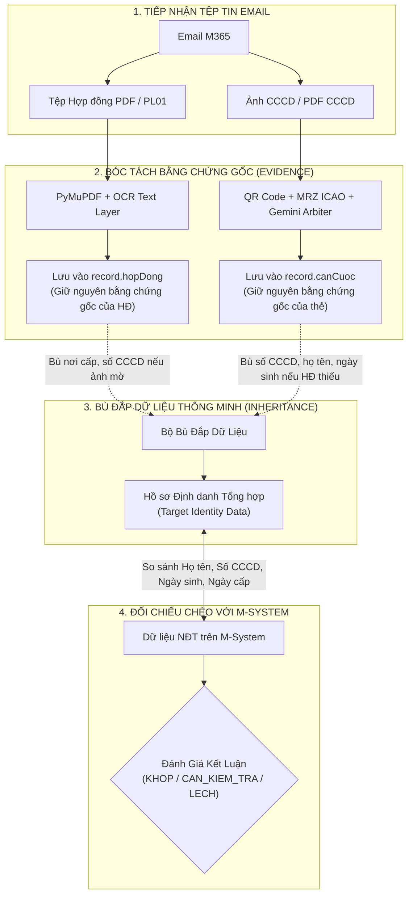

# 📑 BÁO CÁO PHÂN TÍCH CHUYÊN SÂU: LUỒNG BÓC TÁCH HỢP ĐỒNG, CƠ CHẾ BÙ ĐẮP DỮ LIỆU & QUY TRÌNH ĐỐI SOÁT CA TRỰC

> **Mã tài liệu**: `ANALYSIS-TKGD-CONTRACT-FALLBACK-01`  
> **Trạng thái**: 🟡 **TẠM HOLD - LƯU TRỮ PHÂN TÍCH NGHIỆP VỤ & KỸ THUẬT**  
> **Đơn vị phân tích**: Bộ phận Phát triển Hệ thống Giám sát & Quản lý Giao dịch (MXV)  
> **Căn cứ thực tế**: Sở Giao dịch Hàng hóa Việt Nam hiện chưa ban hành văn bản quy chuẩn định dạng bắt buộc cho Hợp đồng mở TKGD của các TVKD.

---

## 1. BỐI CẢNH THỰC TẾ & LÝ DO TẠM HOLD

1. **Thực trạng mẫu biểu Hợp đồng từ các TVKD**:
   - Hiện nay, hơn 30 Thành viên Kinh doanh (TVKD: 003 Gia Cát Lợi, 012 Sài Gòn Futures, 036 HCT, 007 An Lộc...) đang sử dụng các mẫu Hợp đồng mở tài khoản giao dịch (HĐMTK) và Phụ lục (PL01) mang định dạng và bố cục trình bày khác nhau.
   - Nhiều TVKD sử dụng mẫu scan đen trắng, scan nghiêng, thiếu trường nơi cấp, ngày ký hoặc đặt các trường thông tin ở vị trí không đồng nhất.
2. **Quyết định nghiệp vụ**:
   - **TẠM HOLD (Chưa siết chặt quy chuẩn HĐ trong code)**: Không áp dụng các điều kiện chặn cứng (Hard Validation) đối với cấu trúc Hợp đồng để tránh làm gián đoạn dòng chảy mở tài khoản của khách hàng khi Sở chưa có văn bản hướng dẫn chính thức.
   - **Lưu trữ tài liệu phân tích**: Ghi nhận toàn bộ nguyên lý vận hành, so sánh giữa người thật và bot, cùng lộ trình chuẩn hóa sẵn sàng kích hoạt ngay khi Sở ban hành quy chuẩn HĐ.

---

## 2. KIỂM CHỨNG MÃ NGUỒN: CƠ CHẾ BÓC TÁCH & BÙ ĐẮP THÔNG TIN HIỆN TẠI

Hệ thống xử lý hồ sơ mở TKGD hiện đang vận hành theo cơ chế **2 tầng độc lập**:



### Các dòng code chứng minh cơ chế bù đắp trong hệ thống:
1. **Kế thừa Nơi cấp giữa HĐ và CCCD**:
   - [tkgd_extractor_worker.py#L2361-L2364](file:///c:/Users/hiepth/OneDrive%20-%20MERCANTILE%20EXCHANGE%20OF%20VIETNAM/Documents/Github/mxv-tkgd-ccp-work/mxv-account-opening-reconciler/src/python/tkgd_extractor_worker.py#L2361-L2364):
     ```python
     # Nếu ảnh CCCD không đọc được nơi cấp (mặt sau mờ) mà HĐ có ghi rõ -> Kế thừa từ HĐ
     if not cccd_data.get('noiCap') and result.get('hopDong', {}).get('noiCap'):
         cccd_data['noiCap'] = result['hopDong']['noiCap']
     ```
2. **Kế thừa Số CCCD, Họ tên, Ngày sinh, Ngày cấp**:
   - [tkgd-mail-ingest.service.ts#L461-L470](file:///c:/Users/hiepth/OneDrive%20-%20MERCANTILE%20EXCHANGE%20OF%20VIETNAM/Documents/Github/mxv-tkgd-ccp-work/mxv-account-opening-reconciler/src/modules/tkgd-automation/services/tkgd-mail-ingest.service.ts#L461-L470):
     ```typescript
     cccdData = {
       soCanCuoc: pythonRes.canCuoc.soCCCD || hopDongData?.soCanCuoc,
       hoVaTen: pythonRes.canCuoc.hoTen || group.tenTaiKhoan || hopDongData?.hoVaTen,
       ngaySinh: parseDate(pythonRes.canCuoc.ngaySinh) || hopDongData?.ngaySinh,
       ngayCap: parseDate(pythonRes.canCuoc.ngayCap) || hopDongData?.ngayCap,
       gioiTinh: pythonRes.canCuoc.gioiTinh || hopDongData?.gioiTinh,
       noiCap: pythonRes.canCuoc.noiCap || hopDongData?.noiCap,
     };
     ```
3. **Tự suy luận Giới tính & Năm sinh từ 12 số định danh CCCD**:
   - [tkgd-mail-ingest.service.ts#L485-L505](file:///c:/Users/hiepth/OneDrive%20-%20MERCANTILE%20EXCHANGE%20OF%20VIETNAM/Documents/Github/mxv-tkgd-ccp-work/mxv-account-opening-reconciler/src/modules/tkgd-automation/services/tkgd-mail-ingest.service.ts#L485-L505):
     - Giải mã chữ số thứ 4 của 12 số CCCD để suy ra Thế kỷ và Giới tính.
     - Hai chữ số tiếp theo suy ra Năm sinh để bù đắp khi hồ sơ bị mờ.

---

## 3. SO SÁNH QUY TRÌNH: NGƯỜI THẬT THỦ CÔNG VS. BOT TỰ ĐỘNG

| Tình huống thực tế | Cán bộ Ca trực (Người thật) xử lý | Hệ thống Bot tự động xử lý | Đánh giá & Rủi ro |
| :--- | :--- | :--- | :--- |
| **1. Hợp đồng thiếu số CCCD** *(nhưng ảnh CCCD gửi kèm có số)* | • Liếc sang ảnh CCCD để biết khách hàng là ai.<br/>• **KHÔNG DUYỆT NGAY**, yêu cầu TVKD nộp lại HĐ có đầy đủ số CCCD để đảm bảo tính pháp lý. | • Lấy số từ ảnh CCCD đắp sang HĐ để mang đi so sánh với M-System. | ⚠️ **Cần kiểm soát**: Nếu sau khi đắp mà đánh `KHOP` xanh là sai. Phải giữ cảnh báo để người thật quyết định. |
| **2. Lệch Ngày cấp giữa CCCD và M-System** | • Mắt người kiểm tra: Tên đúng, 12 số CCCD đúng, Ngày sinh đúng.<br/>• Hiểu ngay TVKD gõ nhầm ngày cấp CMND cũ lên MS.<br/>• Người thật linh động duyệt hoặc nhắc TVKD sửa MS. | • Động cơ đối soát có thể tự lành hoặc đưa vào danh sách cảnh báo. | 🟢 **Chuẩn hóa**: Đưa về `CAN_KIEM_TRA` (Vàng) để ca trực bấm nút [Duyệt thủ công], không tự ý xóa lỗi. |
| **3. Ảnh CCCD chụp mờ, lóa đèn** | • Não người tự phóng to, nhìn nghiêng và luận chữ theo ngữ cảnh. | • Tesseract OCR thất bại $\rightarrow$ Kích hoạt **Gemini Vision Arbiter** làm trọng tài thẩm định lại ảnh. | 🟢 **Rất tương đồng**: Gemini đóng vai trò như mắt và não người để cứu các ảnh chụp chất lượng kém. |
| **4. HĐ thiếu ngày ký** | • HĐ không ngày ký là chưa có hiệu lực pháp lý $\rightarrow$ Bắt buộc bổ sung. | • Bóc tách `ngayKyHD`, nếu thiếu thì ghi lỗi `dinhDangLoi`. | 🟢 **Khớp 100%** với yêu cầu pháp lý. |

---

## 4. MA TRẬN 3 TRẠNG THÁI ENUM ĐỀ XUẤT ÁP DỤNG KHI CÓ QUY CHUẨN

Nhằm đảm bảo an toàn pháp lý tuyệt đối cho Sở Giao dịch theo đúng chỉ đạo của Lãnh đạo ("Phải khớp hết mới đánh Khớp, có lệch dù ít hay nhiều phải đưa về Lệch hoặc Cần kiểm tra lại"):

```
                         ┌──────────────────────────────────────────────┐
                         │   BẢN GHI HỒ SƠ SAU ĐỐI CHIẾU 3 BÊN          │
                         └──────────────────────┬───────────────────────┘
                                                │
                 ┌──────────────────────────────┴──────────────────────────────┐
                 ▼                                                             ▼
     [Khớp Tuyệt Đối 100%]                                             [Có Sai Lệch Bất Kỳ]
  • 0 lỗi, 0 cảnh báo                                                          │
  • Cả HĐ và CCCD đều có đủ thông tin                                          │
  • Khớp tuyệt đối với M-System                                                │
                 │                                              ┌──────────────┴──────────────┐
                 ▼                                              ▼                             ▼
       🟢 TRẠNG THÁI: KHOP                         [Lệch Nhân Thân Cốt Lõi]        [Lệch Kỹ Thuật / Nghi Vấn]
    (Tự động thông qua ca trực)                     • Lệch Mã TKGD                  • Nghi lệch Ngày cấp (MS gõ CMND cũ)
                                                    • Lệch Họ tên                   • Ảnh CCCD mờ OCR không nét
                                                    • Lệch 12 số CCCD               • HĐ thiếu nơi cấp / phải mượn CCCD
                                                    • Lệch Năm sinh                 • HĐ thiếu ngày ký
                                                    • Nghi vấn CCCD giả                           │
                                                                │                                 ▼
                                                                ▼                    🟡 TRẠNG THÁI: CAN_KIEM_TRA
                                                      🔴 TRẠNG THÁI: LECH            (Ca trực xem nhanh 3 giây &
                                                    (Từ chối duyệt / Báo TVKD)         bấm [Duyệt Thủ Công])
```

---

## 5. KẾT LUẬN & KẾ HOẠCH HÀNH ĐỘNG KHI TÁI KHỞI ĐỘNG

1. **Giai đoạn hiện tại (Hold)**:
   - Giữ nguyên luồng bóc tách linh hoạt và cơ chế fallback hiện tại để bảo đảm 100% hồ sơ mở tài khoản hàng ngày không bị gián đoạn.
   - Lưu trữ bản phân tích này làm kim chỉ nam nghiệp vụ.
2. **Khi Sở Giao dịch ban hành Quy chuẩn Hợp đồng**:
   - Kích hoạt quy tắc kiểm tra định dạng Hợp đồng bắt buộc.
   - Áp dụng ma trận 3 trạng thái Enum chặt chẽ, loại bỏ hoàn toàn việc "tự lành âm thầm về trạng thái KHOP", chuyển toàn bộ các trường hợp có khiếm khuyết văn bản sang `CAN_KIEM_TRA` để Cán bộ ca trực phê duyệt thủ công có lưu vết người duyệt.
