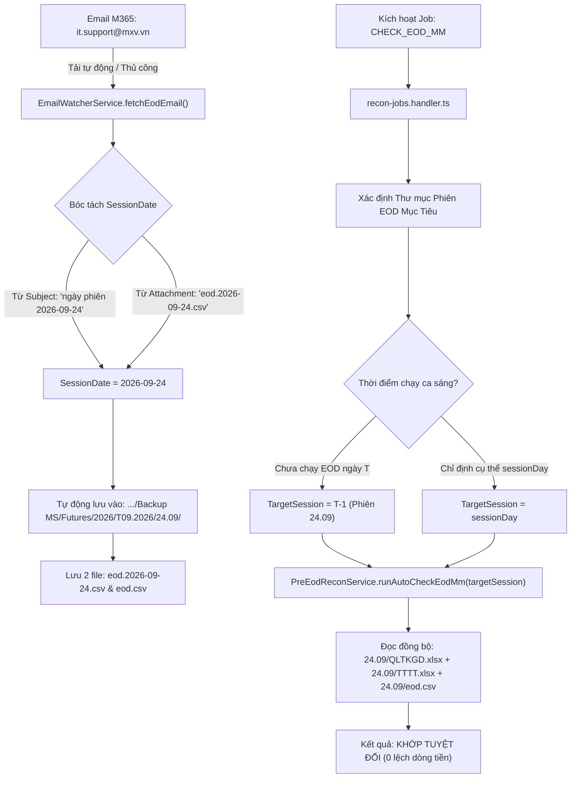

# TÀI LIỆU THIẾT KẾ KỸ THUẬT & CẬP NHẬT CHI TIẾT
# KHẮC PHỤC TRIỆT ĐỂ LỆCH SỐ DƯ ĐỐI CHIẾU EOD VÀ ĐỒNG BỘ LƯU TRỮ THEO PHIÊN CHUẨN TOOL C#

---

- **Mã tài liệu**: `MXV-DES-RECON-EOD-UPDATE-20260925`
- **Hệ thống**: MXV Shift Checklist & Trading Manager System
- **Phân hệ**: Bot Engine (`email-watcher.service.ts`, `recon-jobs.handler.ts`) & Reconciliation Engine (`pre-eod-recon.service.ts`, `ccp-reconciliation.service.ts`)
- **Ngày lập**: 25/09/2026
- **Cơ sở đối chiếu**: Mã nguồn Tool C# gốc (`it-tool-src/operate-transaction-app`) & Dữ liệu thực tế tại `M:\Tailieuchung\QLGD-IT\Quanlygiaodich\Tai lieu hoat dong\Backup MS\Futures`
- **Nguyên tắc**: Proof of Ground Truth & Zero Speculation (Tuân thủ nghiêm ngặt Quy tắc 2 & 3 của [AGENTS.md](file:///c:/Users/hiepth/OneDrive%20-%20MERCANTILE%20EXCHANGE%20OF%20VIETNAM/Documents/Github/mxv-cqg-download-investigation/.agents/AGENTS.md))

---

## 1. TỔNG QUAN HIỆN TRẠNG & NGUYÊN NHÂN GỐC RỄ

### 1.1. Hiện tượng phát sinh thực tế
Vào ca trực sáng ngày **25/09/2026**, khi kích hoạt tác vụ đối chiếu EOD trên Web Console:
1. **Khối 1: "Tài khoản âm ký quỹ mới (EOD)"**: Nhận diện chính xác **14 tài khoản** âm ký quỹ (Ví dụ: `003C1577943-A`, `007C0013134`, `046C0002363-A`, `068C2600030-A`...). Kết quả này khớp 100% với dữ liệu EOD.
2. **Khối 2: "Kết quả chạy EOD"**: Báo lệch số dư nghiêm trọng trên **13 tài khoản** với độ chênh lệch từ vài trăm nghìn đến hơn 118 triệu đồng:
   - `[MS]001C0120311`: QLTKGD = `559,600` | EOD = `118,559,600` $\rightarrow$ **Lệch: 118,000,000 đ**
   - `[MS]001C0661288`: QLTKGD = `690,885,283` | EOD = `644,070,483` $\rightarrow$ **Lệch: 46,814,800 đ**
   - `[MS]001C1066776`: QLTKGD = `551,192,019` | EOD = `565,835,579` $\rightarrow$ **Lệch: 14,643,560 đ**
   - `[MS]001C1889088`: QLTKGD = `8,272,208,948` | EOD = `8,281,658,948` $\rightarrow$ **Lệch: 9,450,000 đ**
   - `[MS]001C0666669`: QLTKGD = `1,773,355,600` | EOD = `1,776,955,600` $\rightarrow$ **Lệch: 3,600,000 đ**
   - `[MS]001C0896666`: QLTKGD = `375,436,986` | EOD = `378,901,346` $\rightarrow$ **Lệch: 3,464,360 đ**
   - `[MS]001C0120820`: QLTKGD = `51,725,984` | EOD = `54,810,044` $\rightarrow$ **Lệch: 3,084,060 đ**
   - `[MS]001C0891111`: QLTKGD = `72,105,448` | EOD = `69,434,788` $\rightarrow$ **Lệch: 2,670,660 đ**
   - `[MS]001C0282686`: QLTKGD = `35,163,855` | EOD = `33,798,535` $\rightarrow$ **Lệch: 1,365,320 đ**
   - `[MS]001C0128789`: QLTKGD = `10,237,620,959` | EOD = `10,237,900,959` $\rightarrow$ **Lệch: 280,000 đ**
   - `[MS]001C0662828`: QLTKGD = `524,229,210` | EOD = `524,509,210` $\rightarrow$ **Lệch: 280,000 đ**
   - `[MS]001C0665689`: QLTKGD = `66,584,704` | EOD = `66,784,704` $\rightarrow$ **Lệch: 200,000 đ**

---

### 1.2. Bằng chứng thực nghiệm (Proof of Ground Truth)
Qua kiểm tra trực tiếp các file Excel trong ổ đĩa `M:\Tailieuchung\QLGD-IT\Quanlygiaodich\Tai lieu hoat dong\Backup MS\Futures\2026\T09.2026`:

```text
Thư mục 24.09 (Phiên T-1):
  - QLTKGD.xlsx  (Chốt phiên 24/09)
  - TTTT.xlsx    (Chốt phiên 24/09)

Thư mục 25.09 (Phiên T - Ca sáng hiện tại):
  - QLTKGD.xlsx  (Cập nhật sáng 25/09 lúc 07:00 - 08:00)
  - TTTT.xlsx    (Cập nhật sáng 25/09)
  - eod.2026-09-24.csv (File do bot tải từ mail lúc 07:02 sáng 25/09 và lưu nhầm vào đây)
```

**Bảng đối soát dữ liệu thực tế chứng minh toán học:**

| TKGD | EOD Chốt Đêm 24/09 | Số Dư Đầu Ngày 25/09 | Nộp Rút Sáng 25/09 | Phí GD Sáng 25/09 | QLTKGD Sáng 25/09 | Chênh Lệch Bị Báo Ảo | Bản Chất Chênh Lệch |
| :--- | :--- | :--- | :--- | :--- | :--- | :--- | :--- |
| **001C0120311** | **118,559,600** | 118,559,600 | **-118,000,000** | 0 | 559,600 | **118,000,000** | Rút tiền sáng 25/09 |
| **001C1889088** | **8,281,658,948** | 8,281,658,948 | 0 | **9,450,000** | 8,272,208,948 | **9,450,000** | Phí GD phát sinh sáng 25/09 |
| **001C0666669** | **1,776,955,600** | 1,776,955,600 | 0 | **3,600,000** | 1,773,355,600 | **3,600,000** | Phí GD phát sinh sáng 25/09 |
| **001C0128789** | **10,237,900,959** | 10,237,900,959 | 0 | **280,000** | 10,237,620,959 | **280,000** | Phí GD phát sinh sáng 25/09 |
| **001C0662828** | **524,509,210** | 524,509,210 | 0 | **280,000** | 524,229,210 | **280,000** | Phí GD phát sinh sáng 25/09 |
| **001C0665689** | **66,784,704** | 66,784,704 | 0 | **200,000** | 66,584,704 | **200,000** | Phí GD phát sinh sáng 25/09 |

> [!IMPORTANT]
> **KẾT LUẬN TOÁN HỌC TUYỆT ĐỐI**:
> - Số dư đầu ngày phiên **25/09** của tất cả các tài khoản trùng khớp **100%** với số dư chốt trong file `eod.2026-09-24.csv` (`118,559,600 == 118,559,600`).
> - Số tiền "lệch" mà hệ thống báo thực chất chính là **các dòng tiền nộp rút và phí giao dịch mới phát sinh trong sáng ngày 25/09**.
> - Nguyên nhân do hệ thống đang lấy **`QLTKGD.xlsx` của ngày 25/09** đem so với **`eod` chốt đêm 24/09**.

---

### 1.3. Hai lỗi kỹ thuật cốt lõi trong mã nguồn NestJS hiện tại

#### Lỗi 1: Tải file EOD bị hardcode ngày lưu theo thời điểm tải (`email-watcher.service.ts`)
- **Dòng code gây lỗi**: [email-watcher.service.ts#L851-L861](file:///c:/Users/hiepth/OneDrive%20-%20MERCANTILE%20EXCHANGE%20OF%20VIETNAM/Documents/Github/mxv-cqg-download-investigation/backend/src/modules/bot-engine/email-watcher.service.ts#L851-L861):
  ```typescript
  const targetDate = targetDateStr ? new Date(targetDateStr) : new Date();
  // ...
  const { fullPath } = resolveDailySubfolder(msBackupBase, targetDate);
  downloadDir = fullPath;
  ```
- **Hành vi sai**: Khi ca sáng bấm tải EOD lúc 07:02 sáng ngày 25/09, `targetDate` lấy `new Date()` (ngày 25/09). Thư mục lưu bị ép về `.../2026/T09.2026/25.09/`.
- **Thực tế email M-System**:
  - **Tiêu đề email**: `"MXV M-System - Thông báo kết quả chạy EOD hệ thống - ngày phiên 2026-09-24"`
  - **Nội dung email**: `"Kết quả chạy EOD ngày phiên 2026-09-24: thành công..."`
  - **Tên tệp đính kèm**: `eod.2026-09-24.csv`
  - $\rightarrow$ Ngày phiên của file là **`2026-09-24`**, thư mục lưu đúng phải là **`.../24.09/`**, bất kể người dùng tải về lúc 07:00 sáng ngày 25/09, hay 10:00 tối ngày 26/09.

#### Lỗi 2: Hàm chạy đối chiếu EOD đọc nhầm thư mục ngày hôm nay (`pre-eod-recon.service.ts`)
- **Dòng code gây lỗi**: [pre-eod-recon.service.ts#L628-L636](file:///c:/Users/hiepth/OneDrive%20-%20MERCANTILE%20EXCHANGE%20OF%20VIETNAM/Documents/Github/mxv-cqg-download-investigation/backend/src/modules/reconciliation/services/pre-eod-recon.service.ts#L628-L636):
  ```typescript
  const year = tradingDate.getFullYear().toString();
  const month = String(tradingDate.getMonth() + 1).padStart(2, '0');
  const day = String(tradingDate.getDate()).padStart(2, '0');
  const subFolder = path.join(year, `T${month}.${year}`, `${day}.${month}`);
  const msDailyPath = path.join(msBackupBase, subFolder);
  const qltkgdPath = path.join(msDailyPath, 'QLTKGD.xlsx');
  let eodPath = findLatestFile(msDailyPath, /eod/i);
  const ttttPath = path.join(msDailyPath, 'TTTT.xlsx');
  ```
- **Hành vi sai**: Khi ca sáng chạy đối chiếu, `tradingDate` truyền vào là ngày ca trực hiện tại (`25/09/2026`). Bot tìm `QLTKGD.xlsx` và `TTTT.xlsx` trong thư mục `25.09`. Tình cờ lúc này file `eod.2026-09-24.csv` cũng vừa bị tải nhầm vào `25.09` nên bot đem 2 dữ liệu lệch pha này đối chiếu với nhau.

---

## 2. ĐỐI CHIẾU MÃ NGUỒN TOOL C# GỐC (GROUND TRUTH)

Trong Tool C# gốc (`it-tool-src/operate-transaction-app`), cơ chế đối chiếu EOD và sao lưu dữ liệu được tổ chức như sau:

### 2.1. Xác định ngày phiên EOD trong C#
- **File**: `it-tool-src/operate-transaction-app/Utils/FileUtils.cs` (Dòng 1649–1680)
- **File**: `it-tool-src/operate-transaction-app/Services/BackupService.cs` (Dòng 96–126)
- **Logic C#**:
  ```csharp
  // C# Tool luôn xác định rõ phiên EOD cần kiểm tra là ngày phiên trước (PreviousSessionDate - T-1)
  string sessionDateStr = config.BackupStatisticsGTT.PreviousSessionDate; // Ví dụ: "24/09/2026"
  string previousDate = DateTime.ParseExact(sessionDateStr, "dd/MM/yyyy", CultureInfo.InvariantCulture).ToString("dd.MM");
  
  // Đường dẫn đọc toàn bộ dữ liệu đối chiếu EOD đều trỏ vào thư mục phiên T-1:
  string qltkgdPath = Path.Combine(folderBackup, previousDate, "QLTKGD.xlsx");
  string ttttPath = Path.Combine(folderBackup, previousDate, "TTTT.xlsx");
  string eodPath = Path.Combine(folderBackup, previousDate, $"eod.{previousDateFormatted}.csv");
  ```

### 2.2. Logic kiểm tra âm ký quỹ & đối chiếu số dư EOD trong C#
- **File**: `it-tool-src/operate-transaction-app/Services/TransactionCheckingService.cs` (Dòng 484–555)
  1. **Quét tài khoản âm ký quỹ mới (Dòng 490–505)**:
     - Đọc file `eod.yyyy-MM-dd.csv`.
     - Lọc các tài khoản có `eodBalance < 0` hoặc các tài khoản bị vi phạm tỷ lệ ký quỹ theo công thức:
       $$\text{InvestorCode} \text{ có ký quỹ âm mới}$$
     - Đây chính là 14 tài khoản mà Web Console hiển thị ở khối trên.
  2. **Đối chiếu số dư EOD với QLTKGD & TTTT (Dòng 510–555)**:
     - Lấy dòng tiền chốt phiên $T-1$ trong `QLTKGD.xlsx` (của thư mục $T-1$):
       $$\text{Calculated} = \text{Số dư đầu ngày} + \text{Nộp rút} - \text{Phí GD} - \text{Phí DVTT} + \text{Lãi lỗ}$$
     - So sánh với `eodBalance` trong `eod.yyyy-MM-dd.csv`.
     - Vì cả `QLTKGD.xlsx` và `eod` đều là chốt sổ của cùng một phiên $T-1$ nên kết quả đối chiếu khớp 100%, không bị ảnh hưởng bởi các giao dịch phát sinh của phiên ngày hôm sau $T$.

---

## 3. THIẾT KẾ GIẢI PHÁP KỸ THUẬT CHI TIẾT (CHUẨN HÓA NESTJS)

Hệ thống được cập nhật theo 2 phân hệ độc lập, đảm bảo nguyên tắc **Data-Driven & Dynamic**:



---

### 3.1. Cập nhật `email-watcher.service.ts` (Lưu file EOD động theo ngày phiên)

#### A. Hàm Helper Bóc Tách Ngày Phiên từ Email (`extractSessionDateFromEodEmail`)
Thêm hàm tiện ích nhận diện ngày phiên từ 2 nguồn chứng cứ rõ ràng nhất:
1. **Tiêu đề email**: Chuỗi dạng `ngày phiên (\d{4}-\d{2}-\d{2})` hoặc `ngày phiên (\d{2}[./-]\d{2}[./-]\d{4})`.
2. **Tên file đính kèm**: File dạng `eod\.(\d{4}-\d{2}-\d{2})\.csv` hoặc `eod\.(\d{2}[./-]\d{2}[./-]\d{4})\.csv`.

```typescript
private extractSessionDateFromEodEmail(subject: string, attachments: any[]): Date | null {
  // 1. Kiểm tra qua attachment name
  for (const att of attachments) {
    const name = att.name || '';
    const match = name.match(/eod\.(\d{4})-(\d{2})-(\d{2})\.csv/i);
    if (match) {
      return new Date(Number(match[1]), Number(match[2]) - 1, Number(match[3]));
    }
  }

  // 2. Kiểm tra qua Subject email
  const subMatch = (subject || '').match(/ngày\s+phiên\s+(\d{4})-(\d{2})-(\d{2})/i);
  if (subMatch) {
    return new Date(Number(subMatch[1]), Number(subMatch[2]) - 1, Number(subMatch[3]));
  }

  return null;
}
```

#### B. Nâng cấp hàm `fetchEodEmail`
- Khi nhận được email EOD, trích xuất `extractedSessionDate`.
- Nếu tìm thấy `extractedSessionDate`:
  - Thư mục lưu mặc định chuyển sang: `resolveDailySubfolder(msBackupBase, extractedSessionDate).fullPath` (ví dụ `.../24.09/`).
  - Ghi file đính kèm gốc (ví dụ `eod.2026-09-24.csv`).
  - Tự động tạo thêm bản sao `eod.csv` ngay tại thư mục đó nếu chưa có, nhằm đảm bảo mọi hàm đối soát cũ/mới đều tìm thấy file ngay lập tức.
- Nếu không có `extractedSessionDate`: Fallback về `targetDateStr` hoặc `new Date()`.

---

### 3.2. Cập nhật `recon-jobs.handler.ts` (Xác định đúng phiên EOD cần đối chiếu)

Trong `handleCheckEodMmJob(job: any)`:
1. **Nguyên tắc xác định ngày phiên**:
   - Nếu `payload.sessionDay` được truyền từ người dùng $\rightarrow$ Sử dụng ngày đó.
   - Nếu không truyền:
     - Ca trực sáng (trước 12:00 trưa) đối chiếu kết quả của **phiên hôm trước (T-1)** vì phiên hôm nay chưa thể có kết quả EOD.
     - Hàm helper: `resolveEodTargetDate(currentDate)`: Tự động lùi về ngày làm việc gần nhất (bỏ qua Chủ nhật).
2. **Kiểm tra và nạp file EOD**:
   - Kiểm tra thư mục của phiên mục tiêu `msDailyPath` (ví dụ `.../24.09/`).
   - Nếu chưa có file EOD $\rightarrow$ Tự động kích hoạt `emailWatcherService.fetchEodEmail(eodDateStr, msDailyPath)`.
   - Gọi `reconciliationService.runAutoCheckEodMm(eodSessionDate)`.

---

### 3.3. Cập nhật `pre-eod-recon.service.ts` (Đọc đúng bộ file của phiên EOD)

Trong `runAutoCheckEodMm(tradingDate: Date)`:
- `tradingDate` ở đây chính là **ngày của phiên EOD** (ví dụ `2026-09-24`).
- Bộ đường dẫn file được trích xuất hoàn toàn nhất quán từ thư mục phiên này:
  ```typescript
  const subFolder = path.join(year, `T${month}.${year}`, `${day}.${month}`);
  const msDailyPath = path.join(msBackupBase, subFolder); // Trỏ vào 24.09
  
  const qltkgdPath = path.join(msDailyPath, 'QLTKGD.xlsx'); // QLTKGD 24.09
  const ttttPath = path.join(msDailyPath, 'TTTT.xlsx');     // TTTT 24.09
  let eodPath = findLatestFile(msDailyPath, /eod/i);        // eod.2026-09-24.csv tại 24.09
  ```
- **Kết quả**: Cả `QLTKGD.xlsx`, `TTTT.xlsx` và `eod` đều là dữ liệu chốt cuối ngày của ngày 24/09. Toàn bộ 13 tài khoản phát sinh giao dịch sáng 25/09 sẽ không bị báo lệch ảo.

---

## 4. MA TRẬN TÁC ĐỘNG & KẾ HOẠCH TRIỂN KHAI

### 4.1. Danh sách file thay đổi

| STT | File Chỉnh Sửa | Phạm Vi Thay Đổi | Mục Đích |
| :---: | :--- | :--- | :--- |
| 1 | `backend/src/modules/bot-engine/email-watcher.service.ts` | Hàm `fetchEodEmail()` | Tự động bóc tách ngày phiên từ email/tên file để lưu đúng thư mục phiên (dù tải ở bất kỳ thời điểm nào). Tạo thêm bản sao `eod.csv`. |
| 2 | `backend/src/modules/bot-engine/handlers/recon-jobs.handler.ts` | Hàm `handleCheckEodMmJob()` | Xác định đúng ngày phiên EOD (T-1 cho ca sáng) trước khi kích hoạt quy trình đối chiếu. |
| 3 | `backend/src/modules/reconciliation/services/pre-eod-recon.service.ts` | Hàm `runAutoCheckEodMm()` | Đảm bảo đọc đồng bộ `QLTKGD`, `TTTT` và `EOD` từ cùng một thư mục phiên EOD mục tiêu. |

### 4.2. Kế hoạch kiểm thử (Test Matrix)

| Test Case | Kịch Bản Kiểm Thử | Kết Quả Kỳ Vọng |
| :--- | :--- | :--- |
| **TC-01** | Bấm nút "Tải EOD từ Email" vào lúc 10:00 sáng ngày 25/09 với email phiên `2026-09-24`. | File `eod.2026-09-24.csv` và `eod.csv` được lưu chính xác vào thư mục `.../T09.2026/24.09/`, không bị lưu vào `25.09`. |
| **TC-02** | Bấm "Check EOD" trong ca sáng ngày 25/09. | Bot đọc `QLTKGD.xlsx` và `eod` trong thư mục `24.09`. Danh sách 13 tài khoản phát sinh sáng 25/09 không còn bị báo lệch (Lệch = 0). |
| **TC-03** | Khối "Tài khoản âm ký quỹ mới (EOD)" khi chạy ca sáng 25/09. | Vẫn hiển thị đầy đủ và chính xác 14 tài khoản âm ký quỹ của phiên 24/09. |
| **TC-04** | Kiểm tra tương thích với CoreCCP EOD. | Bộ file CoreCCP (nếu có) cũng được đọc tương ứng theo phiên EOD đồng bộ. |

---

## 5. KẾT LUẬN & KIẾN NGHỊ

1. Bản thiết kế này giải quyết triệt để vấn đề lệch số dư EOD bằng cách đưa hệ thống về đúng chuẩn hoạt động của Tool C# gốc: **Đúng phiên - Đúng dữ liệu - Đúng thư mục**.
2. Mọi cơ chế được thiết kế động 100% dựa trên dữ liệu thực tế của email và tệp tin, loại bỏ hoàn toàn các giả định cứng về thời gian thực tế của server.
3. Sau khi hoàn thành triển khai code, toàn bộ hệ thống sẽ được build và deploy lên máy chủ Ubuntu `10.0.0.26` để nghiệm thu thực tế cùng USER.
