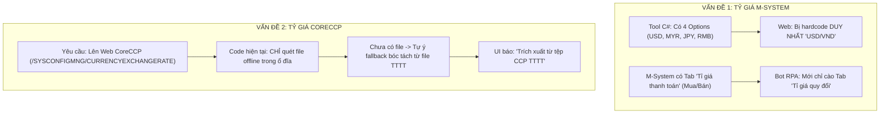
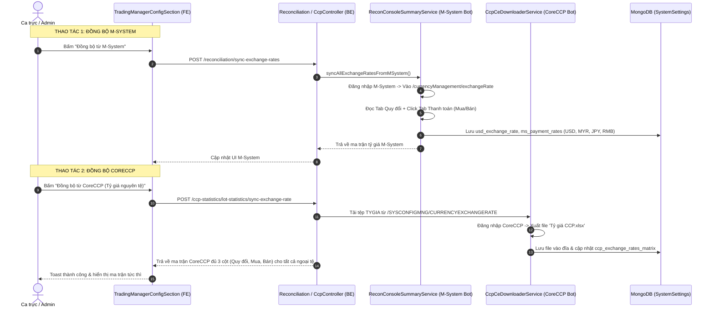

# TÀI LIỆU THIẾT KẾ KỸ THUẬT: HOÀN THIỆN ĐỒNG BỘ TỶ GIÁ M-SYSTEM VÀ CORECCP THEO NGHIỆP VỤ CHUẨN

> **Dự án**: MXV Shift Checklist / Trading Manager & Reconciliation  
> **Module**: Quản Lý Tỷ Giá M-System (MXV) & Ma Trận Đa Nguyên Tệ CoreCCP (VNCLEAR)  
> **Tác giả**: AI Assistant & Đội ngũ Kỹ thuật Vận hành MXV  
> **Ngày lập**: 24/09/2026  
> **Trạng thái**: Bản Thiết Kế Chi Tiết Trước Triển Khai (Design Specification)  

---

## 1. TỔNG QUAN & BỐI CẢNH PHÁT HIỆN LỖI

Qua rà soát đối chiếu trực tiếp giữa **Tool C# gốc** (`operate-transaction-app`), **Mã nguồn hệ thống hiện tại** (Frontend Next.js & Backend NestJS) và **Hình ảnh giao diện thực tế do USER cung cấp**, hệ thống ghi nhận **2 bất cập cốt lõi** cần được thiết kế và khắc phục triệt để:



---

## 2. CHI TIẾT VẤN ĐỀ 1: TỶ GIÁ THANH TOÁN M-SYSTEM (MXV)

### 2.1. Ground Truth từ Tool C# Gốc (`operate-transaction-app`)
* **Kiểm chứng tại**: [FormMain.cs#L1175-L1225](file:///C:/Users/hiepth/OneDrive%20-%20MERCANTILE%20EXCHANGE%20OF%20VIETNAM/Documents/Github/mxv-shift-checklist/it-tool-src/operate-transaction-app/FormMain.cs#L1175-L1225)
  ```csharp
  private void cmbPaymentExchange_SelectedIndexChanged(object sender, EventArgs e)
  {
      string currency = cmbPaymentExchange.Text;
      if (currency == "USD/VND") {
          txtPaymentExchange1.Text = _config.ConfigsAndPath.Configs.PaymentExchangeRate1.USD.ToString("N0");
          txtPaymentExchange2.Text = _config.ConfigsAndPath.Configs.PaymentExchangeRate2.USD.ToString("N0");
      }
      else if (currency == "MYR/VND") {
          txtPaymentExchange1.Text = _config.ConfigsAndPath.Configs.PaymentExchangeRate1.MYR.ToString("N0");
          txtPaymentExchange2.Text = _config.ConfigsAndPath.Configs.PaymentExchangeRate2.MYR.ToString("N0");
      }
      else if (currency == "JPY/VND") {
          txtPaymentExchange1.Text = _config.ConfigsAndPath.Configs.PaymentExchangeRate1.JPY.ToString("N0");
          txtPaymentExchange2.Text = _config.ConfigsAndPath.Configs.PaymentExchangeRate2.JPY.ToString("N0");
      }
      else if (currency == "RMB/VND") {
          txtPaymentExchange1.Text = _config.ConfigsAndPath.Configs.PaymentExchangeRate1.RMB.ToString("N0");
          txtPaymentExchange2.Text = _config.ConfigsAndPath.Configs.PaymentExchangeRate2.RMB.ToString("N0");
      }
  }
  ```
* **Cấu hình dữ liệu C#**: [ConfigModel.cs](file:///C:/Users/hiepth/OneDrive%20-%20MERCANTILE%20EXCHANGE%20OF%20VIETNAM/Documents/Github/mxv-shift-checklist/it-tool-src/operate-transaction-app/Models/ConfigModel.cs) lưu trữ 3 nhóm tỷ giá:
  - `PaymentExchangeRate1`: Giá Mua/Bán chiều 1 (gồm USD, MYR, JPY, RMB).
  - `PaymentExchangeRate2`: Giá Mua/Bán chiều 2 (gồm USD, MYR, JPY, RMB).
  - `ConvertExchangeRate`: Tỷ giá quy đổi (gồm USD, MYR, JPY, RMB).

### 2.2. Lỗi Hiện Tại Trên Web
1. **Giao diện Frontend** ([TradingManagerConfigSection.tsx#L530-L537](file:///c:/Users/hiepth/OneDrive%20-%20MERCANTILE%20EXCHANGE%20OF%20VIETNAM/Documents/Github/mxv-cqg-download-investigation/frontend/src/app/trading-manager/components/shared/TradingManagerConfigSection.tsx#L530-L537)):
   * Dropdown `Tỷ giá thanh toán` đang bị **hardcode cứng 1 lựa chọn duy nhất**:
     ```tsx
     <select value={currencyUnit} onChange={(e) => setCurrencyUnit(e.target.value)}>
       <option value="USD/VND">USD/VND</option>
     </select>
     ```
   * Khiến người dùng không thể xem hay nhập tỷ giá thanh toán cho `MYR/VND`, `JPY/VND`, `RMB/VND`.
2. **Bot Crawler M-System** ([recon-console-summary.service.ts#L174-L227](file:///c:/Users/hiepth/OneDrive%20-%20MERCANTILE%20EXCHANGE%20OF%20VIETNAM/Documents/Github/mxv-cqg-download-investigation/backend/src/modules/reconciliation/services/recon-console-summary.service.ts#L174-L227)):
   * Bot truy cập `/#/currencyManagement/exchangeRate`.
   * Màn hình này trên M-System có **2 Tab**:
     - Tab 1: **"Tỉ giá quy đổi"** (chỉ có 1 cột Tỷ giá).
     - Tab 2: **"Tỉ giá thanh toán"** (có đủ cột Tỷ giá Mua, Tỷ giá Bán theo từng cặp ngoại tệ).
   * **Lỗi**: Bot hiện tại chỉ đọc dữ liệu ở Tab mặc định (Quy đổi), hoàn toàn **chưa click chuyển sang Tab "Tỉ giá thanh toán"** để lấy tỷ giá Mua/Bán, dẫn đến việc gán nhầm hoặc thiếu giá trị Mua/Bán.

### 2.3. Thiết Kế Khắc Phục Cho M-System
1. **Frontend**:
   * Mở rộng dropdown `currencyUnit` thành 4 options: `USD/VND`, `MYR/VND`, `JPY/VND`, `RMB/VND`.
   * Tạo state lưu trữ dictionary/object cho tỷ giá thanh toán M-System:
     ```typescript
     interface MsPaymentRates {
       [pair: string]: { buy: number; sell: number };
     }
     ```
   * Khi đổi dropdown sang cặp tiền nào, 2 ô input `Bán` và `Mua` tự động chuyển đổi hiển thị theo cặp tiền đó (chuẩn 100% như C# Tool).
2. **Backend Crawler**:
   * Trong hàm `syncUsdRateFromMSystem` / `syncAllExchangeRatesFromMSystem`:
     - **Bước 1**: Đọc Tab "Tỉ giá quy đổi" để lấy tỷ giá quy đổi cho USD, MYR, JPY, RMB.
     - **Bước 2**: Click chuyển sang Tab **"Tỉ giá thanh toán"** (selector `div[role="tab"]:has-text("thanh toán")` hoặc tương đương).
     - **Bước 3**: Bóc tách bảng tỷ giá thanh toán gồm: Mã ngoại tệ, Tỷ giá Mua, Tỷ giá Bán.
     - **Bước 4**: Lưu vào `system_settings`:
       * `ms_payment_rates`: JSON lưu chi tiết Mua/Bán của cả 4 đồng tiền.
       * Các key tương thích cũ: `usd_exchange_rate_buy`, `usd_exchange_rate_sell`.

---

## 3. CHI TIẾT VẤN ĐỀ 2: TỶ GIÁ CORECCP (VNCLEAR) CHƯA LÊN WEB CÀO THỰC SỰ

### 3.1. Ground Truth Hiện Trạng Mã Nguồn
* **Kiểm chứng tại**: [ccp-lot-statistics.service.ts#L1390-L1435](file:///c:/Users/hiepth/OneDrive%20-%20MERCANTILE%20EXCHANGE%20OF%20VIETNAM/Documents/Github/mxv-cqg-download-investigation/backend/src/modules/ccp-statistics/ccp-lot-statistics.service.ts#L1390-L1435)
  ```typescript
  async syncAndSaveExchangeRates(dateStr?: string) {
    const targetDate = dateStr || new Date().toISOString().split('T')[0];
    const scan = await this.scanDailyFiles(targetDate);

    // 1. Chỉ kiểm tra xem TRONG THƯ MỤC Ổ ĐĨA OFFLINE đã có file hay chưa
    if (scan.files.tyGia?.path && fs.existsSync(scan.files.tyGia.path)) {
       ...
    }

    // 2. Nếu thư mục chưa có file -> Tự ý fallback bóc tách tạm từ file TTTT!
    if (!rateToSave && !detailsToSave) {
       const extracted = extractExchangeRateFromCcpReports(ttttBuf, ttmBuf);
       ...
       source = `Trích xuất từ tệp CCP ${extracted.source}`;
    }
  }
  ```

### 3.2. Hậu Quả & Nguyên Nhân Gốc Rễ
* **Hậu quả hiển thị (Khớp với ảnh USER chụp)**:
  * Nút bấm hiển thị: `Đồng bộ từ CoreCCP (TTTT/TTM)` (do chưa đổi nhãn trên UI của file đang chạy).
  * Dòng thông tin đồng bộ ghi: `Đồng bộ gần nhất: 10:43:07 24/9/2026 (Trích xuất từ tệp CCP TTTT (Lãi lỗ thực tế))`.
  * Ma trận tỷ giá chỉ lấy được mỗi tỷ giá USD (26.000), còn JPY và MYR không có nguồn cập nhật từ web CoreCCP.
* **Nguyên nhân**:
  * Hàm `syncAndSaveExchangeRates` hoàn toàn **chưa kích hoạt bot Playwright** lên web CoreCCP! Nó chỉ quét thụ động các file có sẵn trong thư mục máy tính.
  * Khi người dùng bấm nút "Đồng bộ", họ kỳ vọng bot phải **đăng nhập vào CoreCCP, tải file tỷ giá mới nhất về rồi mới cập nhật**.

### 3.3. Thiết Kế Khắc Phục Cho CoreCCP
1. **Tích hợp Bot RPA Playwright trực tiếp vào luồng Đồng bộ CoreCCP**:
   * Khi nhận request `POST /api/v1/ccp-statistics/lot-statistics/sync-exchange-rate`:
     * **Bước 1**: Khởi động bot `CcpCeDownloaderService` đăng nhập vào CoreCCP VNCLEAR.
     * **Bước 2**: Điều hướng tới màn hình chuẩn: **`/SYSCONFIGMNG/CURRENCYEXCHANGERATE`** (*"Tỷ giá nguyên tệ"*).
     * **Bước 3**: Nhấn nút "Kết xuất" / "Xuất Excel" để tải file `Tỷ giá CCP.xlsx` và lưu trực tiếp vào thư mục backup ngày: `Backup CCP/Futures/<Year>/T<Month>.<Year>/<Day>.<Month>/Tỷ giá CCP.xlsx`.
     * **Bước 4**: Đọc file vừa tải qua hàm `parseTyGiaDetails(buffer)` đã hoàn thiện ở commit trước.
     * **Bước 5**: Cập nhật toàn bộ bảng ma trận đa nguyên tệ (`ccp_exchange_rates_matrix`) vào MongoDB.
2. **Loại bỏ hoàn toàn Fallback sai lệch (Zero-Silent-Swallow)**:
   * Nếu bot không cào được hoặc CoreCCP lỗi mạng $\rightarrow$ Báo lỗi rõ ràng cho người dùng, **tuyệt đối không âm thầm fallback sang bóc tách tỷ giá thiếu từ file TTTT**.

---

## 4. MA TRẬN TÁC ĐỘNG TỆP TIN (FILE IMPACT MATRIX)

| Tệp tin | Vị trí thay đổi | Chi tiết tác động |
| :--- | :--- | :--- |
| **`TradingManagerConfigSection.tsx`** | L520–L600 | Mở rộng dropdown Tỷ giá thanh toán M-System thành 4 cặp tiền (`USD/VND`, `MYR/VND`, `JPY/VND`, `RMB/VND`), hỗ trợ hiển thị và nhập giá Mua/Bán theo từng cặp tiền. |
| **`TradingManagerConfigSection.tsx`** | L675–L695 | Cập nhật nhãn nút chuẩn thành `Đồng bộ từ CoreCCP (Tỷ giá nguyên tệ)` và hiển thị chính xác nguồn đồng bộ. |
| **`recon-console-summary.service.ts`** | L170–L255 | Nâng cấp bot RPA M-System: Click sang Tab "Tỉ giá thanh toán" để cào đủ giá Mua và Bán cho cả 4 cặp tiền; lưu vào `ms_payment_rates`. |
| **`ccp-lot-statistics.service.ts`** | L1380–L1450 | Tích hợp gọi bot Playwright (`CcpCeDownloaderService.downloadReport('TYGIA')`) khi đồng bộ tỷ giá; loại bỏ hoàn toàn fallback sang file TTTT. |
| **`ccp-ce-downloader.service.ts`** | L350–L360 & L840 | Đảm bảo handler tải báo cáo `TYGIA` từ `/SYSCONFIGMNG/CURRENCYEXCHANGERATE` hoạt động trơn tru trong headless mode. |

---

## 5. KẾ HOẠCH TRIỂN KHAI TỪNG BƯỚC



### 5.1. Bước 1: Hoàn thiện Tỷ giá M-System (Frontend & Backend)
1. Thêm hỗ trợ 4 cặp tiền trên UI `TradingManagerConfigSection.tsx`.
2. Nâng cấp bot RPA trong `recon-console-summary.service.ts` để click chuyển sang Tab "Tỉ giá thanh toán" và bóc tách đầy đủ giá Mua/Bán.

### 5.2. Bước 2: Hoàn thiện Tỷ giá CoreCCP (Backend Crawler)
1. Trong `ccp-lot-statistics.service.ts`: Gọi trực tiếp bot `CcpCeDownloaderService` đăng nhập CoreCCP và tải báo cáo `TYGIA` khi kích hoạt đồng bộ.
2. Xóa bỏ đoạn code fallback tạm bợ sang file TTTT.

### 5.3. Bước 3: Kiểm thử toàn diện & Đóng gói
1. Chạy test thử bot đồng bộ M-System $\rightarrow$ Kiểm tra đủ 4 cặp tiền Mua/Bán.
2. Chạy test thử bot đồng bộ CoreCCP $\rightarrow$ Kiểm tra file tải về và ma trận MongoDB.
3. Build kiểm tra TypeScript & cập nhật CHANGELOG_AI.md.
