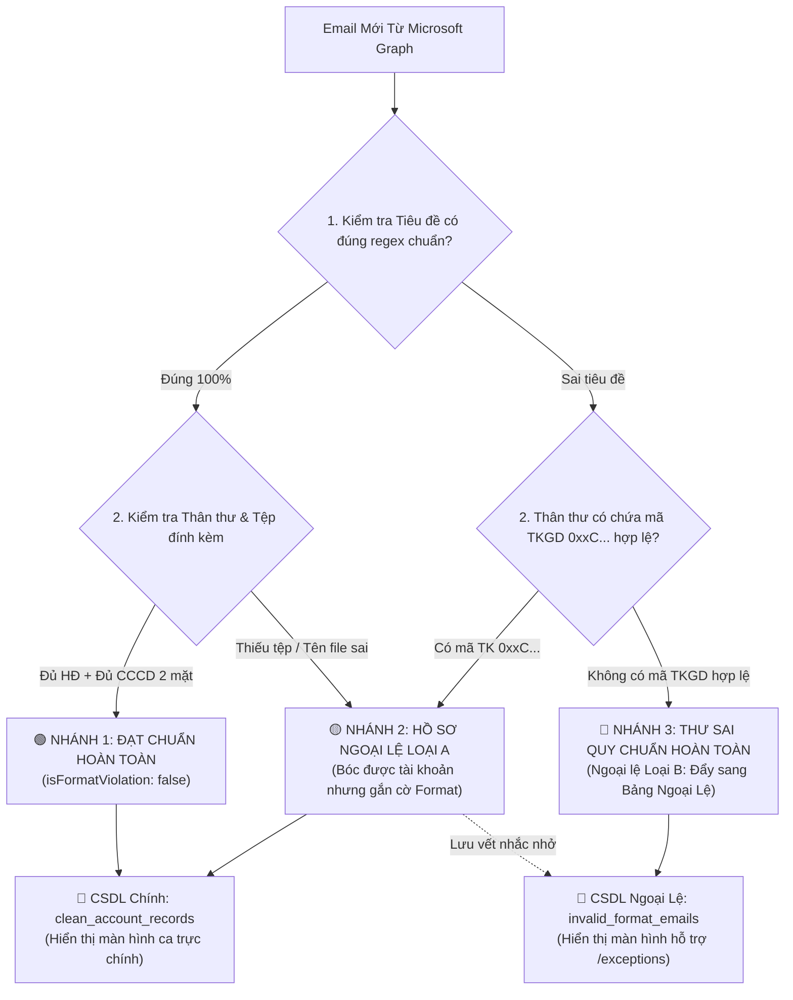

# BẢN ĐẶC TẢ THIẾT KẾ: ĐỘNG CƠ BÓC TÁCH & PHÂN LOẠI EMAIL SAI FORMAT (KHI CÓ QUY CHUẨN CHÍNH THỨC)

> **Mã tài liệu**: `SPEC-TKGD-FORMAT-VALIDATOR-01`  
> **Dự án**: MXV Account Opening Reconciler (`mxv-account-opening-reconciler`)  
> **Mục tiêu**: Đặc tả chi tiết thuật toán bóc tách, bộ quy tắc đánh giá (Rules Engine), ma trận mã lỗi và cơ chế tách riêng các email vi phạm quy chuẩn ra màn hình hỗ trợ ngoại lệ ngay khi Sở Giao dịch ban hành văn bản quy chuẩn chính thức.

---

## 1. BỘ QUY CHUẨN ĐỊNH DẠNG EMAIL CHUẨN (CHUẨN HOÁ CẤP SỞ)

Một email mở TKGD được xác định là **"Đạt Chuẩn 100%"** khi thỏa mãn đồng thời 4 trụ cột quy chuẩn sau:

### 1.1. Quy Chuẩn Tiêu Đề (Subject Standard)
- **Cấu trúc bắt buộc**:
  ```text
  [MỞ TKGD] - [MÃ_TVKD] - [HỌ VÀ TÊN KHÁCH HÀNG] - [MÃ_TKGD]
  ```
- **Ví dụ chuẩn**:
  - `[MỞ TKGD] - 003 - NGUYỄN VĂN AN - 003C1234567`
  - `[MỞ TKGD] - 012 - TRẦN THỊ MAI - 012C9876543-A` (Trường hợp mở kèm ACM)
- **Biểu thức chính quy (Regex Validate Tiêu Đề)**:
  ```regex
  ^\[MỞ\s+TKGD\]\s*-\s*([0-9]{3})\s*-\s*([A-ZÀ-Ỹ\s]+)\s*-\s*([0-9]{3}[A-Z][0-9]{7}(?:\s*-\s*[ALS])?)$
  ```

---

### 1.2. Quy Chuẩn Thân Thư (Email Body Standard)
Thân thư bắt buộc phải chứa bảng hoặc danh mục Key-Value định danh rõ:
1. **Mã tài khoản**:
   - Tài khoản Futures: `0xxCxxxxxxx` (bắt buộc).
   - Tiểu khoản quốc tế (nếu có): `0xxCxxxxxxx-A` (ACM), `0xxCxxxxxxx-L` (LME), `0xxCxxxxxxx-S` (Spread).
2. **Thông tin định danh Nhà đầu tư**:
   - Họ và tên khách hàng (trùng khớp với tiêu đề).
   - Số CCCD / Hộ chiếu (12 chữ số).
   - Ngày sinh (dạng `DD/MM/YYYY`).

---

### 1.3. Quy Chuẩn Tệp Đính Kèm (Attachments Standard)
Mỗi email bắt buộc phải có tối thiểu 2 nhóm tệp:
1. **Hợp đồng mở tài khoản**: File PDF (có chữ ký của NĐT và TVKD).
   - Quy cách đặt tên tệp: `[MÃ_TK]_HDMTK.pdf` (Ví dụ: `003C1234567_HDMTK.pdf`).
2. **Ảnh Căn cước công dân (CCCD)**: Đủ 2 mặt (ảnh chụp gốc độ phân giải cao $\ge 800\text{px}$, không mờ, không lóa).
   - Quy cách đặt tên:
     - Mặt trước: `[MÃ_TK]_CCCD_truoc.jpg` (hoặc `.png`, `.pdf`)
     - Mặt sau: `[MÃ_TK]_CCCD_sau.jpg` (hoặc `.png`, `.pdf`)
3. **Phụ lục đăng ký giao dịch quốc tế (nếu có mở ACM/LME)**:
   - Quy cách đặt tên: `[MÃ_TK]_PL01.pdf` (hoặc `PL_ACM.pdf`).

---

### 1.4. Quy Chuẩn Người Gửi (Authorized Sender Standard)
- Email gửi đến phải xuất phát từ tên miền chính thức đã đăng ký của TVKD (Ví dụ: `@giacatloi.vn`, `@saigonfutures.com`, `@hct.vn`...).

---

## 2. THUẬT TOÁN BÓC TÁCH & PHÂN LOẠI 3 NHÁNH (TRIAGE ALGORITHM)

Khi worker quét được một email mới từ Microsoft Graph API, hệ thống đưa email qua **Bộ Đánh Giá 3 Cửa Ngõ (Format Evaluation Pipeline)**:



---

## 3. MA TRẬN PHÂN LOẠI MÃ LỖI ĐỊNH DẠNG (STANDARDIZED ERROR MATRIX)

Mỗi lỗi phát hiện được gán một mã định danh chuẩn hóa để tự động sinh văn bản phản hồi TVKD:

| Nhóm kiểm tra | Mã lỗi kỹ thuật | Mô tả lỗi chi tiết | Mức độ nghiêm trọng | Hành động của hệ thống |
| :--- | :--- | :--- | :---: | :--- |
| **Tiêu đề** | `ERR_SUB_NO_PREFIX` | Tiêu đề thiếu tiền tố bắt buộc `[MỞ TKGD]` | Trung bình | Gắn cờ nhắc nhở, vẫn bóc thân thư |
| **Tiêu đề** | `ERR_SUB_INVALID_TVKD` | Mã TVKD trên tiêu đề không khớp 3 chữ số hoặc không khớp domain | Cao | Gắn cờ cảnh báo sai TVKD |
| **Tiêu đề** | `ERR_SUB_MISMATCH_CODE` | Mã TK trên tiêu đề khác mã TK trong thân thư | Rất cao | Yêu cầu ca trực kiểm tra thủ công |
| **Thân thư** | `ERR_BODY_NO_ACCOUNT` | Không tìm thấy bất kỳ mã tài khoản hợp lệ `0xxC...` nào | **Nghiêm trọng** | **Bốc sang Bảng Ngoại Lệ (`invalid_format_emails`)** |
| **Thân thư** | `ERR_BODY_MISSING_INFO`| Thiếu số CCCD hoặc họ tên NĐT trong nội dung | Trung bình | Nhận diện qua OCR thay thế |
| **Tệp tin** | `ERR_ATT_NO_CONTRACT` | Email không đính kèm file Hợp đồng PDF | **Nghiêm trọng** | Báo thiếu hồ sơ pháp lý |
| **Tệp tin** | `ERR_ATT_NO_CCCD_FRONT`| Thiếu ảnh CCCD mặt trước | Cao | Báo thiếu bằng chứng định danh |
| **Tệp tin** | `ERR_ATT_NO_CCCD_BACK` | Thiếu ảnh CCCD mặt sau | Cao | Báo thiếu bằng chứng định danh |
| **Tệp tin** | `ERR_ATT_INVALID_NAME` | Tên tệp không gắn mã TK (ví dụ: `image001.jpg`, `Scan.pdf`) | Nhẹ | Gắn cờ cảnh báo sai quy cách đặt tên |
| **Người gửi**| `ERR_SENDER_UNAUTHORIZED`| Gửi từ domain lạ/cá nhân (Gmail, Yahoo) | Rất cao | Cảnh báo bảo mật mạo danh TVKD |

---

## 4. THIẾT KẾ XỬ LÝ DỮ LIỆU Ở BACKEND (CODE DESIGN SPEC)

### 4.1. Hàm Đánh Giá Định Dạng (`evaluateEmailFormatCompliance`)

```typescript
export interface FormatEvaluationResult {
  isFullyCompliant: boolean;
  canExtractAccount: boolean;
  extractedCodes: string[];
  violationCodes: string[];
  violationDetails: string[];
  targetDestination: 'MAIN_FLOW' | 'EXCEPTION_ONLY' | 'MAIN_WITH_WARNING';
}

export function evaluateEmailFormatCompliance(
  subject: string,
  bodyText: string,
  attachments: { name: string; contentType: string }[],
  senderEmail: string,
): FormatEvaluationResult {
  const violations: string[] = [];
  const violationCodes: string[] = [];

  // 1. Kiểm tra Tiêu đề
  const subjectRegex = /^\[MỞ\s+TKGD\]\s*-\s*([0-9]{3})\s*-\s*([^\-]+)\s*-\s*([0-9]{3}[A-Z][0-9]{7}(?:\s*-\s*[ALS])?)$/i;
  const subMatch = subject.trim().match(subjectRegex);

  if (!subMatch) {
    if (!/\[MỞ\s*TKGD\]/i.test(subject)) {
      violationCodes.push('ERR_SUB_NO_PREFIX');
      violations.push('Tiêu đề thiếu tiền tố quy chuẩn [MỞ TKGD]');
    } else {
      violationCodes.push('ERR_SUB_WRONG_FORMAT');
      violations.push('Tiêu đề không đúng cấu trúc: [MỞ TKGD] - [MÃ_TVKD] - [HỌ TÊN] - [MÃ_TK]');
    }
  }

  // 2. Kiểm tra Thân thư & Trích xuất mã TK
  const codeRegex = /\b([0-9]{3}[A-Z][0-9]{7}(?:\s*-\s*[ALS])?)\b/gi;
  const bodyCodes = Array.from(new Set((bodyText.match(codeRegex) || []).map(c => c.replace(/\s+/g, '').toUpperCase())));

  if (bodyCodes.length === 0 && (!subMatch || !subMatch[3])) {
    violationCodes.push('ERR_BODY_NO_ACCOUNT');
    violations.push('Không tìm thấy mã tài khoản hợp lệ định dạng Sở (0xxCxxxxxxx) trong tiêu đề hoặc thân thư');
    
    // Không có mã tài khoản -> Đẩy thẳng vào Màn hình Ngoại lệ
    return {
      isFullyCompliant: false,
      canExtractAccount: false,
      extractedCodes: [],
      violationCodes,
      violationDetails: violations,
      targetDestination: 'EXCEPTION_ONLY',
    };
  }

  // 3. Kiểm tra Tệp đính kèm
  const hasContract = attachments.some(a => /hd|hopdong|contract/i.test(a.name) && /\.pdf$/i.test(a.name));
  const hasCccdFront = attachments.some(a => /truoc|front|cccd_1/i.test(a.name) || /cccd.*truoc/i.test(a.name));
  const hasCccdBack = attachments.some(a => /sau|back|cccd_2/i.test(a.name) || /cccd.*sau/i.test(a.name));

  if (!hasContract) {
    violationCodes.push('ERR_ATT_NO_CONTRACT');
    violations.push('Không tìm thấy file Hợp đồng mở tài khoản đính kèm dạng PDF');
  }
  if (!hasCccdFront || !hasCccdBack) {
    violationCodes.push('ERR_ATT_INSUFFICIENT_CCCD');
    violations.push('Thiếu ảnh mặt trước hoặc mặt sau của CCCD');
  }

  const isFullyCompliant = violationCodes.length === 0;

  return {
    isFullyCompliant,
    canExtractAccount: true,
    extractedCodes: bodyCodes,
    violationCodes,
    violationDetails: violations,
    targetDestination: isFullyCompliant ? 'MAIN_FLOW' : 'MAIN_WITH_WARNING',
  };
}
```

---

## 5. THIẾT KẾ MÀN HÌNH NGOẠI LỆ & QUY TRÌNH PHẢN HỒI (UI/UX)

### 5.1. Vị Trí Trong Cây Menu Điều Hướng
- **Không đặt Tab trên màn hình chính** (để giữ màn hình đối soát sạch sẽ 100%).
- Màn hình ngoại lệ được bố trí tại:  
  **URL**: `/exceptions` hoặc Nút biểu tượng chiếc cờ lê / cái chuông ở góc trên bên phải:  
  `[🛠️ Hòm Thư Ngoại Lệ (3)]` (Chỉ hiển thị badge số lượng khi có email sai format).

### 5.2. Mẫu Phản Hồi Tự Động (1-Click Auto-Reply)
Khi cán bộ bấm nút **`[✉️ Gửi mail phản hồi TVKD]`** hoặc **`[📋 Copy lỗi]`**, hệ thống tự động điền các biến:

```text
Kính gửi Thành viên Kinh doanh [MÃ_TVKD],

Hòm thư nghiệp vụ của Sở Giao dịch Hàng hóa Việt Nam (clearing.acc@mxv.vn) có tiếp nhận email của Quý đơn vị lúc [HH:mm DD/MM/YYYY] với tiêu đề:
"[TIÊU_ĐỀ_GỐC]"

Hệ thống rà soát tự động nhận thấy email trên chưa đáp ứng đúng Quy chuẩn tiếp nhận của Sở:
[DANH SÁCH CHI TIẾT CÁC LỖI VI PHẠM TỪ MA TRẬN MÃ LỖI]:
- ❌ [Lỗi 1]
- ❌ [Lỗi 2]

Để tránh gián đoạn tiến độ mở tài khoản cho Nhà đầu tư, đề nghị Quý TVKD kiểm tra và gửi lại email theo đúng cấu trúc chuẩn ban hành:
Tiêu đề: [MỞ TKGD] - [MÃ_TVKD] - [HỌ VÀ TÊN KHÁCH HÀNG] - [MÃ_TKGD]
Đính kèm: [MÃ_TK]_HDMTK.pdf, [MÃ_TK]_CCCD_truoc.jpg, [MÃ_TK]_CCCD_sau.jpg.

Trân trọng,
Phòng Nghiệp vụ Giám sát & Quản lý giao dịch - MXV.
```

---

## 6. LỘ TRÌNH KÍCH HOẠT KHI CÓ QUY CHUẨN CHÍNH THỨC

Ngay khi Ban Giám đốc Sở ký ban hành văn bản quy chuẩn chính thức tới các TVKD:
1. **Ngày 1**: Kích hoạt hàm `evaluateEmailFormatCompliance` vào pipeline quét mail Microsoft Graph.
2. **Ngày 2**: Tạo collection `invalid_format_emails` và dựng màn hình `/exceptions`.
3. **Ngày 3**: Kiểm thử thực tế trên 50 email mẫu từ các TVKD (003, 012, 036) và Go-Live.
