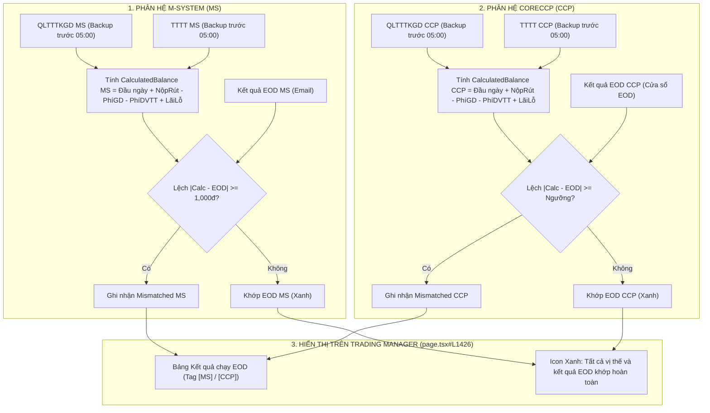

# TÀI LIỆU THIẾT KẾ NGHIỆP VỤ & KIẾN TRÚC KỸ THUẬT
# ĐỐI CHIẾU SỐ DƯ KẾT QUẢ EOD SONG SONG M-SYSTEM (MS) & CLEARING HOUSE (CCP)

---

- **Mã tài liệu**: `MXV-DES-RECON-EOD-MS-CCP-01`
- **Hệ thống**: MXV Shift Checklist & Trading Manager
- **Phân hệ**: Core Reconciliation Engine (`reconciliation.service.ts`) & Trading Manager Web Console (`trading-manager/page.tsx`)
- **Ngày ban hành**: 11/09/2026
- **Trạng thái**: Hoàn thiện thiết kế & Chuẩn bị tích hợp

---

## MỤC LỤC

1. [TỔNG QUAN & BỐI CẢNH NGHIỆP VỤ](#1-tổng-quan--bối-cảnh-nghiệp-vụ)
2. [MA TRẬN NGUỒN FILE ĐẦU VÀO](#2-ma-trận-nguồn-file-đầu-vào)
3. [MÔ HÌNH TOÁN HỌC & CÔNG THỨC ĐỐI CHIẾU SỐ DƯ EOD](#3-mô-hình-toán-học--công-thức-đối-chiếu-số-dư-eod)
   - 3.1. Phân hệ M-System (Hiện trạng)
   - 3.2. Phân hệ CoreCCP (Thêm mới)
   - 3.3. So sánh công thức đối chiếu giữa 2 phân hệ
4. [QUY TRÌNH BÓC TÁCH & ĐỐI SOÁT DỮ LIỆU CHI TIẾT](#4-quy-trình-bóc-tách--đối-soát-dữ-liệu-chi-tiết)
   - 4.1. Bóc tách báo cáo QLTTTKGD (MS & CCP)
   - 4.2. Bóc tách báo cáo TTTT (MS & CCP)
   - 4.3. Bóc tách file Kết quả EOD (MS & CCP)
5. [THIẾT KẾ TÍCH HỢP TRÊN NỀN TẢNG NESTJS & NEXT.JS](#5-thiết-kế-tích-hợp-trên-nền-tảng-nestjs--nextjs)
   - 5.1. Cấu trúc dữ liệu & Interface mở rộng (`EODMismatchedItem`)
   - 5.2. Mở rộng hàm `checkEOD()` trong `reconciliation.service.ts`
   - 5.3. Hiển thị trực quan trên giao diện Trading Manager (`page.tsx#L1426`)
6. [CÁC ĐIỂM CẦN LÀM RÕ VỚI ĐỘI VẬN HÀNH / USER](#6-các-điểm-cần-làm-rõ-với-đội-vận-hành--user)

---

## 1. TỔNG QUAN & BỐI CẢNH NGHIỆP VỤ

Trong quy trình chốt ca trực cuối ngày (Post-EOD) tại Sở Giao dịch Hàng hóa Việt Nam (MXV), tác vụ **Kiểm tra tính toàn vẹn kết quả chạy EOD** là chốt chặn quan trọng nhất nhằm bảo vệ an toàn tài sản của nhà đầu tư và thành viên giao dịch.

### 1.1. Hiện trạng trên M-System (MS)
- M-System thực hiện chạy chốt sổ cuối ngày (EOD), xuất kết quả và gửi file qua email.
- Đội ngũ trực ca sử dụng tool để lấy số dư EOD trong file kết quả EOD này đối chiếu với các file báo cáo tài chính sao lưu trước 05:00 sáng (`QLTTTKGD.xlsx` và `TTTT.xlsx`).
- Công thức kiểm tra dòng tiền:
  $$\text{Số dư EOD} = \text{Số dư đầu ngày} + \text{NR trong phiên} - \text{Phí GD (từ QLTTTKGD)} + \text{Lãi lỗ thực tế} - \text{Phí DVTT (từ TTTT)}$$

### 1.2. Nâng cấp khi vận hành thêm CoreCCP (CCP)
- Khi phân hệ Bù trừ Trung tâm CoreCCP chính thức đi vào vận hành song song với M-System, MXV quản lý đồng thời:
  1. **M-System (MS)**: Hệ thống quản lý tài khoản, vị thế giao dịch hàng hóa, ký quỹ khách hàng.
  2. **CoreCCP (CCP)**: Hệ thống bù trừ, thanh toán, ký quỹ thành viên bù trừ và quản trị rủi ro thanh toán.
- Quy trình đối chiếu EOD phải được **thực hiện song song và độc lập trên cả 2 phân hệ**, đảm bảo từng hệ thống đều khớp tuyệt đối trước khi mở phiên giao dịch của ngày tiếp theo.

---

## 2. MA TRẬN NGUỒN FILE ĐẦU VÀO

Quy trình đối chiếu EOD song song yêu cầu tổng cộng **4 nhóm dữ liệu đầu vào** (gồm 4 - 6 file):

```text
┌──────────────────────────────────────────────────────────────────────────────────────────────────┐
│                                 MA TRẬN FILE ĐẦU VÀO ĐỐI CHIẾU EOD                               │
├─────────────────────────────────────────────┬────────────────────────────────────────────────────┤
│            PHÂN HỆ M-SYSTEM (MS)            │             PHÂN HỆ CORECCP (CCP)                  │
├─────────────────────────────────────────────┼────────────────────────────────────────────────────┤
│ [File 1.1] Kết quả EOD MS                   │ [File 2.1] Kết quả EOD CCP                         │
│ • Nguồn: Email tự động gửi sau khi chạy     │ • Nguồn: Tải trực tiếp từ cửa sổ kết quả EOD      │
│   EOD MS thành công.                        │   khi CoreCCP EOD thành công.                      │
│ • Định dạng: CSV / Excel (`eod.csv`)        │ • Định dạng: CSV / Excel                           │
│ • Trường chính: `InvestorCode`, `EODBalance`│ • Trường chính: `InvestorCode`, `EODBalance`       │
├─────────────────────────────────────────────┼────────────────────────────────────────────────────┤
│ [File 1.2] QLTTTKGD Backup MS               │ [File 2.2] QLTTTKGD Backup CCP                     │
│ • Nguồn: Backup định kỳ trước 05:00 sáng.   │ • Nguồn: Backup định kỳ trước 05:00 sáng.          │
│ • Định dạng: Excel (`QLTTTKGD.xlsx`)        │ • Định dạng: Excel / CSV                           │
│ • Dữ liệu: Số dư đầu ngày, Nộp rút, Phí GD, │ • Dữ liệu: Số dư đầu ngày, Nộp rút, Phí GD,        │
│   Lãi lỗ thực tế (VND/USD/JPY/MYR).         │   Lãi lỗ thực tế (VND/USD).                        │
├─────────────────────────────────────────────┼────────────────────────────────────────────────────┤
│ [File 1.3] TTTT Backup MS                   │ [File 2.3] TTTT Backup CCP                         │
│ • Nguồn: Backup định kỳ trước 05:00 sáng.   │ • Nguồn: Backup định kỳ trước 05:00 sáng.          │
│ • Định dạng: Excel (`TTTT.xlsx`)            │ • Định dạng: Excel / CSV                           │
│ • Dữ liệu: Phí dịch vụ thanh toán (VND).    │ • Dữ liệu: Phí dịch vụ thanh toán (VND).           │
└─────────────────────────────────────────────┴────────────────────────────────────────────────────┘
```

---

## 3. MÔ HÌNH TOÁN HỌC & CÔNG THỨC ĐỐI CHIẾU SỐ DƯ EOD

### 3.1. Công thức đối chiếu số dư EOD trên M-System (MS)
$$\text{CalculatedBalance}_{\text{MS}} = \text{Balance}_{\text{start}} + \text{NetDeposit} - \text{TradeFee} - \text{PaymentServiceFee} + \text{ActualPnL}$$

Trong đó:
- $\text{Balance}_{\text{start}}$: Số dư TKKQ đầu ngày (từ `QLTTTKGD MS`).
- $\text{NetDeposit}$: Nộp / rút tiền trong phiên (từ `QLTTTKGD MS`).
- $\text{TradeFee}$: Phí giao dịch (từ `QLTTTKGD MS`).
- $\text{PaymentServiceFee}$: Phí dịch vụ thanh toán (từ `TTTT MS` hoặc cột phí DV trong `QLTTTKGD MS`).
- $\text{ActualPnL}$: Lãi lỗ thực tế quy đổi VND theo tỷ giá thực tế:
  $$\text{ActualPnL} = (\text{Lãi lỗ USD} + \text{Phí QC}) \times \text{Tỷ giá USD} + \text{Lãi lỗ JPY} \times \text{Tỷ giá JPY} + \text{Lãi lỗ MYR} \times \text{Tỷ giá MYR}$$
  *(Nếu có cột Lãi lỗ thực tế VND thì ưu tiên dùng trực tiếp).*

**Điều kiện ghi nhận lệch EOD MS**:
$$\left| \text{CalculatedBalance}_{\text{MS}} - \text{EODBalance}_{\text{MS}} \right| \ge 1,000 \text{ VNĐ}$$

---

### 3.2. Công thức đối chiếu số dư EOD trên CoreCCP (CCP)
$$\text{CalculatedBalance}_{\text{CCP}} = \text{Balance}_{\text{start}}^{\text{CCP}} + \text{NetDeposit}^{\text{CCP}} - \text{TradeFee}^{\text{CCP}} - \text{PaymentServiceFee}^{\text{CCP}} + \text{ActualPnL}^{\text{CCP}}$$

Trong đó:
- $\text{Balance}_{\text{start}}^{\text{CCP}}$: Số dư đầu ngày (từ `QLTTTKGD CCP`).
- $\text{NetDeposit}^{\text{CCP}}$: Nộp / rút trong phiên (từ `QLTTTKGD CCP`).
- $\text{TradeFee}^{\text{CCP}}$: Phí giao dịch (từ `QLTTTKGD CCP`).
- $\text{PaymentServiceFee}^{\text{CCP}}$: Phí dịch vụ thanh toán (từ `TTTT CCP`).
- $\text{ActualPnL}^{\text{CCP}}$: Lãi lỗ thực tế trên CCP.

**Điều kiện ghi nhận lệch EOD CCP**:
$$\left| \text{CalculatedBalance}_{\text{CCP}} - \text{EODBalance}_{\text{CCP}} \right| \ge \text{Threshold}_{\text{CCP}}$$

---

### 3.3. So sánh công thức đối ứng giữa 2 phân hệ

| Thành phần Dòng tiền | Nguồn dữ liệu MS | Nguồn dữ liệu CCP | Bản chất nghiệp vụ |
| :--- | :--- | :--- | :--- |
| **Số dư EOD mục tiêu** | File `eod.csv` (Email MS) | File Kết quả EOD CCP (Cửa sổ EOD) | Số dư thực tế sau khi hệ thống chốt phiên |
| **Số dư đầu ngày** | `QLTTTKGD.xlsx` (Cột Số dư đầu ngày) | `QLTTTKGD CCP` (Cột Số dư đầu ngày) | Số dư khả dụng đầu ngày giao dịch |
| **Nộp rút trong phiên** | `QLTTTKGD.xlsx` (Cột Nộp rút) | `QLTTTKGD CCP` (Cột Nộp rút) | Dòng tiền nộp/rút nạp vào hệ thống |
| **Phí giao dịch** | `QLTTTKGD.xlsx` (Cột Phí GD) | `QLTTTKGD CCP` (Cột Phí GD) | Phí giao dịch trừ trong phiên |
| **Phí DV thanh toán** | `TTTT.xlsx` (Trạng thái tất toán) | `TTTT CCP` (Trạng thái tất toán CCP) | Phí dịch vụ thanh toán bù trừ |
| **Lãi lỗ thực tế** | `QLTTTKGD.xlsx` (Đa tiền tệ VND/USD) | `QLTTTKGD CCP` (Lãi lỗ thực tế) | Lãi/lỗ đóng vị thế trong phiên |

---

## 4. QUY TRÌNH BÓC TÁCH & ĐỐI SOÁT DỮ LIỆU CHI TIẾT



---

## 5. THIẾT KẾ TÍCH HỢP TRÊN NỀN TẢNG NESTJS & NEXT.JS

Toàn bộ giải pháp được thiết kế trực tiếp trên hệ thống chính bằng **TypeScript**:

### 5.1. Cấu trúc dữ liệu mở rộng (`EODMismatchedItem`)
```typescript
export interface EODMismatchedItem {
  system: 'MS' | 'CCP';       // Phân hệ phát hiện lệch
  maTKGD: string;             // Mã tài khoản giao dịch
  calculatedBalance: number;  // Số dư lý thuyết tính từ QLTTTKGD + TTTT
  eodBalance: number;         // Số dư thực tế trong file kết quả EOD
  differ: number;             // Độ lệch chênh lệch (|eodBalance - calculatedBalance|)
}
```

### 5.2. Mở rộng hàm `checkEOD()` trong [reconciliation.service.ts](file:///c:/Users/hiepth/OneDrive%20-%20MERCANTILE%20EXCHANGE%20OF%20VIETNAM/Documents/Github/mxv-shift-checklist/backend/src/modules/reconciliation/reconciliation.service.ts)
Hàm `checkEOD` sẽ nhận đầu vào linh hoạt:
```typescript
async checkEOD(
  files: {
    // Phân hệ M-System
    qltkgd: Buffer;
    eod?: Buffer;
    tttt?: Buffer;
    // Phân hệ CoreCCP
    qltkgdCcp?: Buffer;
    eodCcp?: Buffer;
    ttttCcp?: Buffer;
  },
  exchangeRates?: ExchangeRateConfig,
): Promise<{
  negativeIMRAcc: string[];
  negativeBalanceAccs?: string[];
  mismatchedEOD: EODMismatchedItem[];
}>;
```
- **Luồng 1 (MS)**: Quét `qltkgd` + `tttt` + `eod` $\rightarrow$ sinh ra các phần tử `{ system: 'MS', ... }`.
- **Luồng 2 (CCP)**: Quét `qltkgdCcp` + `ttttCcp` + `eodCcp` $\rightarrow$ sinh ra các phần tử `{ system: 'CCP', ... }`.
- Gộp chung kết quả trả về `mismatchedEOD` cho Frontend hiển thị.

### 5.3. Hiển thị trực quan trên giao diện Trading Manager ([page.tsx#L1426](file:///c:/Users/hiepth/OneDrive%20-%20MERCANTILE%20EXCHANGE%20OF%20VIETNAM/Documents/Github/mxv-shift-checklist/frontend/src/app/trading-manager/page.tsx#L1426))
Tại bảng **Kết quả chạy EOD**:
1. Bổ sung cột hoặc badge phân hệ:
   - `<span className="badge badge-ms">[MS]</span>` màu xanh/cam.
   - `<span className="badge badge-ccp">[CCP]</span>` màu tím/lam.
2. Hiển thị rõ ràng tài khoản nào bị lệch trên MS hay trên CCP:
   | Hệ thống | TKGD | QLTKGD (Tính toán) | EOD result (Thực tế) | Chênh lệch |
   | :---: | :--- | :---: | :---: | :---: |
   | `[MS]` | `002C4244511-A` | 48,255,748 | 47,528,481 | Lệch: 727,267 đ |
   | `[CCP]` | `003C1577943-A` | 150,000,000 | 148,500,000 | Lệch: 1,500,000 đ |
3. Khi cả 2 hệ thống đều không có chênh lệch: Hiển thị icon xanh `CheckCircle` cùng dòng chữ: **"Tất cả vị thế và kết quả EOD khớp hoàn toàn (MS & CCP)"**.

---

## 6. CÁC ĐIỂM CẦN LÀM RÕ VỚI ĐỘI VẬN HÀNH / USER

Để quá trình lập trình tích hợp vào `reconciliation.service.ts` và `trading-manager/page.tsx` đạt độ chính xác 100%, xin bạn và đội ca trực làm rõ **4 câu hỏi kỹ thuật** sau:

1. **Về file `TTTT` trên CCP**:
   - File tất toán của CCP có tên chính xác là gì (ví dụ: `TTTT.xlsx` hay `TTTT_CCP.xlsx`)?
   - Cột phí dịch vụ thanh toán trong file CCP có tên chính xác là gì?
2. **Về file Kết quả EOD CCP**:
   - File kết quả tải từ cửa sổ EOD CCP có định dạng là `.xlsx` hay `.csv`?
   - Tên cột chứa Mã tài khoản (`InvestorCode` / `Account`) và Số dư EOD (`EOD Balance` / `End Balance`) trên file CCP là gì?
3. **Về cách tính Lãi lỗ thực tế trên CCP**:
   - File `QLTTTKGD CCP` thể hiện lãi lỗ thực tế trực tiếp bằng VNĐ hay cũng có đa tiền tệ (USD, JPY, MYR) cần quy đổi tỷ giá như M-System?
4. **Về Ngưỡng dung sai chênh lệch (Threshold)**:
   - Trên MS, Tool C# áp dụng ngưỡng lệch $\ge 1,000$ VNĐ để tránh lệch làm tròn số thập phân.
   - Trên CoreCCP, MXV áp dụng ngưỡng dung sai là bao nhiêu (ví dụ: $\ge 1,000$ VNĐ, $\ge 100$ VNĐ, hay yêu cầu khớp tuyệt đối $= 0$ VNĐ)?
