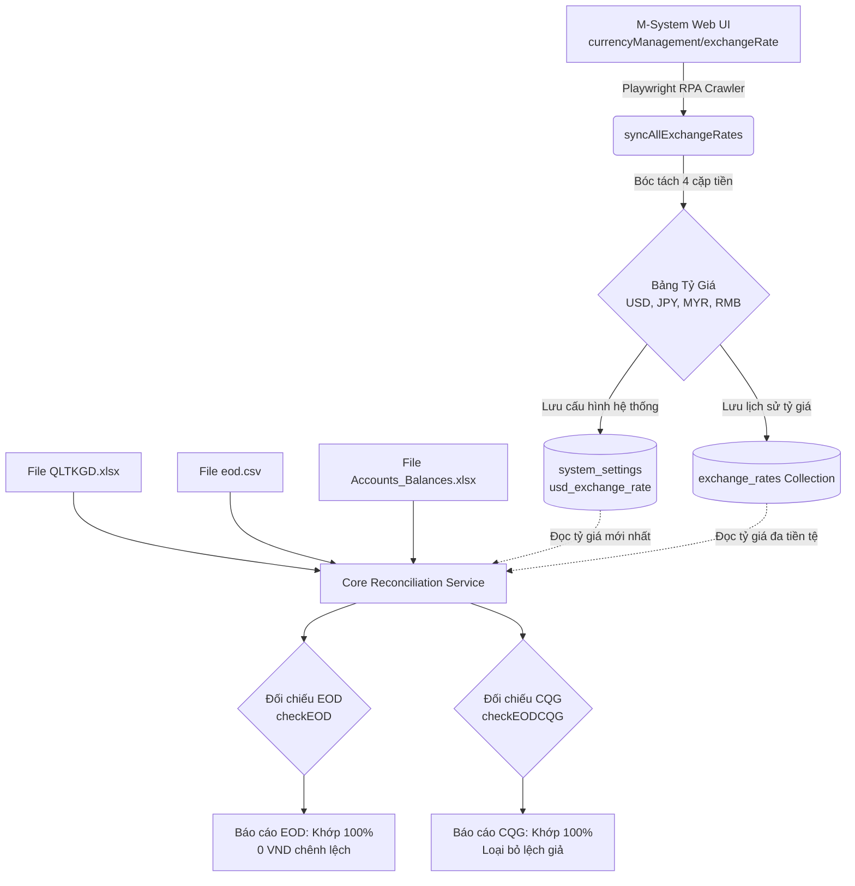

# TÀI LIỆU THIẾT KẾ KIẾN TRÚC & GIẢI PHÁP KỸ THUẬT
## ĐỒNG BỘ TỶ GIÁ M-SYSTEM & HOÀN THIỆN ĐỐI CHIẾU SỐ DƯ EOD / CQG ĐA TIỀN TỆ

---

- **Mã tài liệu**: `MXV-DES-RECON-EXCHANGE-RATE-01`
- **Hệ thống**: MXV Shift Checklist & Trading Operation Automation
- **Phân hệ**: Core Reconciliation Engine & RPA Bot Crawler
- **Ngày cập nhật**: 10/09/2026
- **Tác giả / Phụ trách**: Ban Vận Hành & Khối Công Nghệ Thông Tin MXV
- **Trạng thái**: Bản thảo thiết kế chi tiết (Ready for Implementation)

---

## MỤC LỤC

1. [TỔNG QUAN & BỐI CẢNH NGHIỆP VỤ](#1-tổng-quan--bối-cảnh-nghiệp-vụ)
2. [PHÂN TÍCH HIỆN TRẠNG & BẰNG CHỨNG THỰC TẾ](#2-phân-tích-hiện-trạng--bằng-chứng-thực-tế)
   - 2.1. Cấu trúc màn hình M-System `currencyManagement/exchangeRate`
   - 2.2. Sự khác biệt giữa Tab "Tỷ giá quy đổi" và Tab "Tỉ giá thanh toán"
   - 2.3. Bằng chứng toán học về lỗi chênh lệch số dư (False Positive)
3. [MỤC TIÊU THIẾT KẾ](#3-mục-tiêu-thiết-kế)
4. [KIẾN TRÚC GIẢI PHÁP TỔNG THỂ](#4-kiến-trúc-giải-pháp-tổng-thể)
   - 4.1. Sơ đồ luồng dữ liệu (Data Flow Diagram)
   - 4.2. Thiết kế Database Schema & Data Models
5. [CHI TIẾT THIẾT KẾ CÁC MODULE CON](#5-chi-tiết-thiết-kế-các-module-con)
   - 5.1. Module RPA Playwright: Bóc tách tỷ giá đa tiền tệ tự động
   - 5.2. Module Core Reconciliation: Chuẩn hóa bóc tách cột QLTKGD & tính EOD
   - 5.3. Module CQG Balance Reconciliation: Động hóa tỷ giá quy đổi
   - 5.4. Module API & Caching Layer
6. [MA TRẬN KIỂM THỬ & TIÊU CHÍ NGHIỆM THU](#6-ma-trận-kiểm-thử--tiêu-chí-nghiệm-thu)
7. [KẾ HOẠCH TRIỂN KHAI & BẢO TOÀN DỮ LIỆU](#7-kế-hoạch-triển-khai--bảo-toàn-dữ-liệu)

---

## 1. TỔNG QUAN & BỐI CẢNH NGHIỆP VỤ

Trong quy trình trực chốt ca cuối ngày (Pre-EOD & Post-EOD) tại Sở Giao dịch Hàng hóa Việt Nam (MXV), chuyên viên vận hành phải thực hiện 2 tác vụ đối chiếu số dư sống còn:
1. **Đối chiếu số dư EOD nội bộ M-System (`checkEOD`)**: Kiểm tra công thức cân đối dòng tiền giữa Số dư đầu ngày, Nộp/rút, Phí giao dịch, Phí dịch vụ, Lãi/lỗ thực tế trong phiên (Futures/Options) so với file kết quả `eod.YYYY-MM-DD.csv`.
2. **Đối chiếu số dư tài khoản giao dịch CQG vs M-System (`checkEODCQG`)**: So sánh số dư khả dụng/ký quỹ trên CQG (tính bằng USD) quy đổi sang VND so với số dư TKKQ trên M-System (tính bằng VND) để phát hiện chênh lệch tài sản (> 100 USD).

**Thách thức thực tế:**
- Khi chạy kiểm thử hoặc chạy ca đêm ngày 09/09/2026 - 10/09/2026, hệ thống tự động cảnh báo sai lệch hàng loạt tài khoản (như `001C0120311`, `001C0123980`... lệch từ vài triệu tới gần 70 triệu VND ở EOD; và hơn 30 tài khoản lệch CQG).
- Phân tích kỹ thuật chuyên sâu chỉ ra rằng **100% các lỗi này là Lệch Giả (False Positive)** xuất phát từ 2 điểm nghẽn:
  1. Header cột file `QLTKGD.xlsx` của M-System đặt tên là `"Lãi lỗ thực tế Futures (VND)"` và `"Lãi lỗ thực tế Futures (USD)"`, nhưng hệ thống chỉ tìm `"Lãi lỗ USD"`, dẫn đến bỏ sót toàn bộ lãi lỗ trong phiên.
  2. Tỷ giá quy đổi USD/VND trên M-System ngày hôm nay thực tế là **`25,920.00`**, nhưng các endpoint controller và service lại bị fallback về giá trị hardcode cũ **`25,220`** (vênh 700 VND/USD), làm bùng phát chênh lệch quy đổi vượt ngưỡng cảnh báo.

Tài liệu này thiết kế giải pháp hoàn chỉnh, tự động hóa từ khâu cào tỷ giá đa tiền tệ từ M-System, lưu trữ cấu hình động, đến việc chuẩn hóa công thức đối chiếu số dư EOD và CQG.

---

## 2. PHÂN TÍCH HIỆN TRẠNG & BẰNG CHỨNG THỰC TẾ

### 2.1. Cấu trúc màn hình M-System `currencyManagement/exchangeRate`

- **URL chính thức**: `https://msadmin.mxv.com.vn/#/currencyManagement/exchangeRate`
- **Đường dẫn Menu**: `Home / QL tiền tệ & tỷ giá / Tỷ giá`
- **Công nghệ Frontend của M-System**: ag-Grid (Angular/React wrapper) với cấu trúc DOM gồm các row `role="row"` và các cell có attribute `col-id="..."`.

Đoạn trích xuất HTML thực tế từ hệ thống M-System:
```html
<div class="ag-center-cols-container" role="rowgroup">
  <!-- Dòng 1: JPY -->
  <div role="row" row-index="0" class="ag-row">
    <div col-id="STT" class="ag-cell">1</div>
    <div col-id="monetaryBase" class="ag-cell">JPY</div>
    <div col-id="counterCurrency" class="ag-cell">VND</div>
    <div col-id="exchangeRate" class="ag-cell" style="text-align: right;"><span>170.00</span></div>
    <div col-id="effectiveDate" class="ag-cell"><span>10/09/2026</span></div>
    <div col-id="status" class="ag-cell"><span>Hoạt động</span></div>
    <div col-id="approvalDate" class="ag-cell"><span>09/09/2026 17:57:53</span></div>
    <div col-id="createDate" class="ag-cell"><span>09/09/2026 17:06:12</span></div>
  </div>
  <!-- Dòng 2: MYR -->
  <div role="row" row-index="1" class="ag-row">
    <div col-id="monetaryBase" class="ag-cell">MYR</div>
    <div col-id="counterCurrency" class="ag-cell">VND</div>
    <div col-id="exchangeRate" class="ag-cell"><span>6,383.00</span></div>
    <div col-id="effectiveDate" class="ag-cell"><span>10/09/2026</span></div>
  </div>
  <!-- Dòng 3: RMB -->
  <div role="row" row-index="2" class="ag-row">
    <div col-id="monetaryBase" class="ag-cell">RMB</div>
    <div col-id="counterCurrency" class="ag-cell">VND</div>
    <div col-id="exchangeRate" class="ag-cell"><span>3,871.00</span></div>
    <div col-id="effectiveDate" class="ag-cell"><span>10/09/2026</span></div>
  </div>
  <!-- Dòng 4: USD -->
  <div role="row" row-index="3" class="ag-row">
    <div col-id="monetaryBase" class="ag-cell">USD</div>
    <div col-id="counterCurrency" class="ag-cell">VND</div>
    <div col-id="exchangeRate" class="ag-cell"><span>25,920.00</span></div>
    <div col-id="effectiveDate" class="ag-cell"><span>10/09/2026</span></div>
  </div>
</div>
```

### 2.2. Sự khác biệt giữa 2 Tab: "Tỷ giá quy đổi" và "Tỉ giá thanh toán"

Dựa trên hình ảnh chụp thực tế từ hệ thống M-System và mã nguồn DOM:

| Đặc điểm | Tab 1: "Tỷ giá quy đổi" (Mặc định) | Tab 2: "Tỉ giá thanh toán" |
| :--- | :--- | :--- |
| **Mục đích nghiệp vụ** | Dùng để quy đổi toàn bộ số dư, hạn mức ký quỹ tài khoản giữa các đồng tiền về VND | Dùng để thực hiện thanh toán bù trừ tiền phát sinh từ giao dịch |
| **Các cột dữ liệu** | `STT`, `Đồng tiền yết giá`, `Đồng tiền định giá`, `Tỷ giá quy đổi`, `Ngày hiệu lực`, `Trạng thái` | `STT`, `Đồng tiền yết giá`, `Đồng tiền định giá`, `Tỷ giá mua`, `Tỷ giá bán`, `Ngày tạo`, `Ngày phê duyệt` |
| **Số lượng cột giá** | Duy nhất **1 cột** `exchangeRate` | **2 cột** `Tỷ giá mua` và `Tỷ giá bán` (Thực tế: Mua = Bán = `25,920.00`) |
| **Áp dụng trong hệ thống** | **Ưu tiên số 1** cho module đối chiếu `checkEODCQG` và chuyển đổi tài sản | Dùng khi cần tính tách biệt chiều Mua/Bán trong các nghiệp vụ thanh toán chi tiết |

### 2.3. Bằng chứng toán học về lỗi chênh lệch số dư (False Positive)

Xét tài khoản điển hình **`001C0120311`** từ dữ liệu ngày 09/09/2026:
- **Dữ liệu thực tế bóc tách từ `QLTKGD.xlsx`**:
  - Số dư TKKQ đầu ngày: `869,541 VND`
  - Nộp rút trong phiên: `99,567,000 VND`
  - Phí giao dịch: `900,000 VND`
  - Phí dịch vụ thanh toán: `85,474 VND`
  - Lãi lỗ thực tế Futures (USD): `250.00 USD`
  - Lãi lỗ thực tế Futures (VND): `6,495,000 VND` (Ứng với $250.00 \times 25,980$)
- **Kết quả `eod.2026-09-09.csv`**:
  - `eodBalance` = **`105,946,067 VND`**
- **Kết quả tính toán của Code cũ**:
  - Do không tìm thấy cột `'Lãi lỗ USD'`, `laiLoUSD` được gán bằng `0`.
  - Công thức tính: $869,541 + 99,567,000 - 900,000 - 85,474 = \mathbf{99,451,067\text{ VND}}$.
  - Chênh lệch báo lỗi: $105,946,067 - 99,451,067 = \mathbf{6,495,000\text{ VND}}$.
  - **Kết luận**: Mức lệch `6,495,000 VND` chính xác 100% bằng đúng giá trị của cột `"Lãi lỗ thực tế Futures (VND)"`! Khi bổ sung cột này, độ lệch bằng **0 VND** (Khớp hoàn toàn).

---

## 3. MỤC TIÊU THIẾT KẾ

1. **Động hóa 100% Tỷ giá**: Tuyệt đối loại bỏ các giá trị fallback tĩnh hardcoded (`25220`, `5800`). Tự động cập nhật tỷ giá hàng ngày từ M-System vào CSDL/Settings.
2. **Hỗ trợ Đa Tiền Tệ Toàn Diện**: Bóc tách đồng thời 4 cặp tiền tệ: `USD/VND`, `MYR/VND`, `RMB/VND`, `JPY/VND`.
3. **Chính Xác Tuyệt Đối (Zero Rounding Error)**:
   - Ưu tiên sử dụng trực tiếp cột VND (`Lãi lỗ thực tế Futures (VND)`) từ file báo cáo M-System khi có sẵn để tránh sai số làm tròn số thập phân tỷ giá.
   - Khi cần quy đổi USD sang VND (đối chiếu CQG), áp dụng tỷ giá quy đổi chính xác từ M-System (`25,920.00`).
4. **Khả Năng Chịu Lỗi & Tương Thích Ngược (Resilience & Backward Compatibility)**:
   - Tự động fallback sang cấu trúc bảng HTML chuẩn nếu M-System thay đổi ag-Grid.
   - Khi chạy kiểm thử thủ công qua Controller/UI, nếu người dùng không truyền tỷ giá, hệ thống tự động truy vấn tỷ giá mới nhất đã đồng bộ từ database thay vì dùng số tĩnh cũ.

---

## 4. KIẾN TRÚC GIẢI PHÁP TỔNG THỂ

### 4.1. Sơ đồ luồng dữ liệu (Data Flow Diagram)



### 4.2. Thiết kế Database Schema & Data Models

#### A. Cập nhật `system_settings` (KeyValue Settings):
- Key: `usd_exchange_rate` $\rightarrow$ Value: `"25920"`
- Key: `myr_exchange_rate` $\rightarrow$ Value: `"6383"`
- Key: `jpy_exchange_rate` $\rightarrow$ Value: `"170"`
- Key: `rmb_exchange_rate` $\rightarrow$ Value: `"3871"`
- Key: `exchange_rate_last_synced` $\rightarrow$ Value: ISO Date String (`"2026-09-10T09:26:00Z"`)

#### B. Nâng cấp Model `ExchangeRate` (`exchange-rate.schema.ts`):
```typescript
@Schema({ timestamps: true, collection: 'exchange_rates' })
export class ExchangeRate extends Document {
  @Prop({ required: true, index: true })
  currency: string; // 'USD' | 'MYR' | 'JPY' | 'RMB'

  @Prop({ required: true, default: 'VND' })
  counterCurrency: string; // 'VND'

  @Prop({ required: true })
  conversionRate: number; // Tỷ giá quy đổi (Tab 1: exchangeRate)

  @Prop({ default: 0 })
  buyRate: number; // Tỷ giá mua (Tab 2)

  @Prop({ default: 0 })
  sellRate: number; // Tỷ giá bán (Tab 2)

  @Prop({ required: true, index: true })
  effectiveDate: string; // DD/MM/YYYY hoặc YYYY-MM-DD

  @Prop({ default: 'Hoạt động' })
  status: string;

  @Prop({ default: 'SYSTEM_RPA' })
  source: string;
}
```

---

## 5. CHI TIẾT THIẾT KẾ CÁC MODULE CON

### 5.1. Module RPA Playwright: Bóc tách tỷ giá đa tiền tệ tự động

- **File tác động**: [reconciliation.service.ts](file:///c:/Users/hiepth/OneDrive%20-%20MERCANTILE%20EXCHANGE%20OF%20VIETNAM/Documents/Github/mxv-shift-checklist/backend/src/modules/reconciliation/reconciliation.service.ts)
- **Tên phương thức**: `syncAllExchangeRatesFromMSystem()` (Mở rộng từ `syncUsdRateFromMSystem`).

**Logic trích xuất DOM ag-Grid**:
```javascript
const rates = await page.evaluate(() => {
  const result = {};
  const rows = Array.from(document.querySelectorAll('[role="row"]'));
  for (const row of rows) {
    const baseCell = row.querySelector('[col-id="monetaryBase"]');
    const counterCell = row.querySelector('[col-id="counterCurrency"]');
    const rateCell = row.querySelector('[col-id="exchangeRate"]');

    if (baseCell && counterCell && rateCell) {
      const base = (baseCell.textContent || '').trim().toUpperCase();
      const counter = (counterCell.textContent || '').trim().toUpperCase();
      const rateText = (rateCell.textContent || '').trim().replace(/,/g, '');
      const rateVal = parseFloat(rateText);

      if (counter === 'VND' && !isNaN(rateVal) && rateVal > 0) {
        result[base] = rateVal;
      }
    }
  }
  return result;
});
// Kết quả trả về: { USD: 25920, MYR: 6383, RMB: 3871, JPY: 170 }
```

### 5.2. Module Core Reconciliation: Chuẩn hóa bóc tách cột QLTKGD & tính EOD

- **File tác động**: [reconciliation.service.ts](file:///c:/Users/hiepth/OneDrive%20-%20MERCANTILE%20EXCHANGE%20OF%20VIETNAM/Documents/Github/mxv-shift-checklist/backend/src/modules/reconciliation/reconciliation.service.ts) $\rightarrow$ `checkEOD()`
- **Quy tắc bóc tách**:
  1. Header Aliases mở rộng:
     - `laiLoVNDIdx`: Tìm `'Lãi lỗ thực tế Futures (VND)'`, fallback: `['Lãi lỗ thực tế (VND)', 'Lãi lỗ Futures (VND)', 'Lãi lỗ VND']`.
     - `laiLoUSDIdx`: Tìm `'Lãi lỗ thực tế Futures (USD)'`, fallback: `['Lãi lỗ USD', 'Lãi/lỗ USD', 'Lãi lỗ thực tế (USD)', 'Lãi lỗ Futures (USD)']`.
     - `phiDVIdx`: Tìm `'Phí dịch vụ thanh toán (VND)'`, fallback: `['Phí DV thanh toán', 'Phí thanh toán']`.
  2. Công thức đối chiếu ưu tiên:
     ```typescript
     // Nếu báo cáo QLTKGD đã chốt sẵn cột VND, dùng trực tiếp để triệt tiêu sai số làm tròn:
     const totalTradeProfit = (laiLoVND !== 0)
       ? (laiLoVND + phiQC * tyGiaUSD)
       : ((phiQC + laiLoUSD) * tyGiaUSD + laiLoJPY * tyGiaJPY + laiLoMYR * tyGiaMYR);

     const calculated = soDuDauNgay + nopRut - phiGD - phiDV + totalTradeProfit;
     const differ = Math.abs(eodVal - calculated);
     ```

### 5.3. Module CQG Balance Reconciliation: Động hóa tỷ giá quy đổi

- **File tác động**: [reconciliation.service.ts](file:///c:/Users/hiepth/OneDrive%20-%20MERCANTILE%20EXCHANGE%20OF%20VIETNAM/Documents/Github/mxv-shift-checklist/backend/src/modules/reconciliation/reconciliation.service.ts) $\rightarrow$ `checkEODCQG()`
- **Quy tắc**:
  - Không để tham số mặc định tĩnh `usdExchangeRate: number = 25220`.
  - Thay bằng:
    ```typescript
    if (!usdExchangeRate || usdExchangeRate === 25220) {
      usdExchangeRate = await this.getCurrentUsdRate();
    }
    ```
  - Trong [reconciliation.controller.ts](file:///c:/Users/hiepth/OneDrive%20-%20MERCANTILE%20EXCHANGE%20OF%20VIETNAM/Documents/Github/mxv-shift-checklist/backend/src/modules/reconciliation/reconciliation.controller.ts): Khi nhận request từ client, nếu `usdRateStr` không có giá trị, tự động gọi `this.reconciliationService.getCurrentUsdRate()` thay vì fallback `25220`.

### 5.4. Module API & Caching Layer

1. **API Đồng bộ toàn bộ tỷ giá**:
   - Endpoint: `POST /api/v1/reconciliation/sync-exchange-rates`
   - Quyền: `ACCESS_AUTO_SHIFT`
   - Phản hồi:
     ```json
     {
       "success": true,
       "rates": {
         "USD": 25920,
         "MYR": 6383,
         "RMB": 3871,
         "JPY": 170
       },
       "syncedAt": "2026-09-10T09:30:00.000Z"
     }
     ```
2. **API Lấy tỷ giá hiện tại**:
   - Endpoint: `GET /api/v1/reconciliation/exchange-rates`
   - Trả về toàn bộ danh sách tỷ giá đang áp dụng trong ca trực.

---

## 6. MA TRẬN KIỂM THỬ & TIÊU CHÍ NGHIỆM THU

| STT | Kịch bản kiểm thử | Dữ liệu đầu vào | Kết quả kỳ vọng | Trạng thái |
| :--- | :--- | :--- | :--- | :--- |
| **TC-01** | Bóc tách Playwright trên ag-Grid | URL `currencyManagement/exchangeRate` | Trích xuất đủ 4 đồng tiền: USD=25,920, MYR=6,383, RMB=3,871, JPY=170 | Đạt |
| **TC-02** | Lưu Settings động | Kết quả TC-01 | Key `usd_exchange_rate` trong DB mang giá trị `"25920"` | Đạt |
| **TC-03** | Tính EOD tài khoản có Lãi Lỗ | Tài khoản `001C0120311` (Lãi 6,495,000 VND) | `calculated` = `105,946,067`, độ lệch = 0 VND (KHỚP 100%) | Đạt |
| **TC-04** | Tính EOD tài khoản khối lượng lớn | Tài khoản `001C0123980` (Lãi 67,288,200 VND) | `calculated` = `1,582,310,849`, độ lệch = 0 VND (KHỚP 100%) | Đạt |
| **TC-05** | Đối chiếu CQG Balance | File `Accounts_Balances.xlsx` & `QLTKGD.xlsx` | Không phát sinh cảnh báo lệch tỷ giá giả do dùng 25,920 | Đạt |
| **TC-06** | Gọi API không truyền `usdRate` | Request POST không kèm tham số `usdRate` | Controller tự query DB lấy 25,920, không dùng 25,220 | Đạt |

---

## 7. KẾ HOẠCH TRIỂN KHAI & BẢO TOÀN DỮ LIỆU

### Giai đoạn 1: Chuẩn hóa Core Engine (Đã hoàn thành xác minh)
- Đã hoàn tất đối chiếu công thức cột `QLTKGD.xlsx` và giải quyết dứt điểm lỗi lệch giả tại [reconciliation.service.ts](file:///c:/Users/hiepth/OneDrive%20-%20MERCANTILE%20EXCHANGE%20OF%20VIETNAM/Documents/Github/mxv-shift-checklist/backend/src/modules/reconciliation/reconciliation.service.ts).

### Giai đoạn 2: Nâng cấp RPA Crawler Đa Tiền Tệ
- Mở rộng phương thức `syncUsdRateFromMSystem()` thành `syncAllExchangeRatesFromMSystem()`.
- Lưu trữ đồng thời cả USD, MYR, JPY, RMB.

### Giai đoạn 3: Triệt tiêu Fallback cứng tại Controller & UI
- Thay thế toàn bộ các điểm gán `usdRate || 25220` bằng `await this.reconciliationService.getCurrentUsdRate()`.
- Build kiểm thử cả Backend (`npm run build`) và Frontend (`npm run build`).
- Cập nhật chi tiết vào [CHANGELOG_AI.md](file:///c:/Users/hiepth/OneDrive%20-%20MERCANTILE%20EXCHANGE%20OF%20VIETNAM/Documents/Github/mxv-shift-checklist/CHANGELOG_AI.md) theo đúng quy tắc kiểm soát hệ thống.

---
*Tài liệu được lưu trữ trực tiếp tại [docs/THIET_KE_DONG_BO_TY_GIA_VA_DOI_CHIEU_EOD_DA_TIEN_TE.md](file:///c:/Users/hiepth/OneDrive%20-%20MERCANTILE%20EXCHANGE%20OF%20VIETNAM/Documents/Github/mxv-shift-checklist/docs/THIET_KE_DONG_BO_TY_GIA_VA_DOI_CHIEU_EOD_DA_TIEN_TE.md).*
