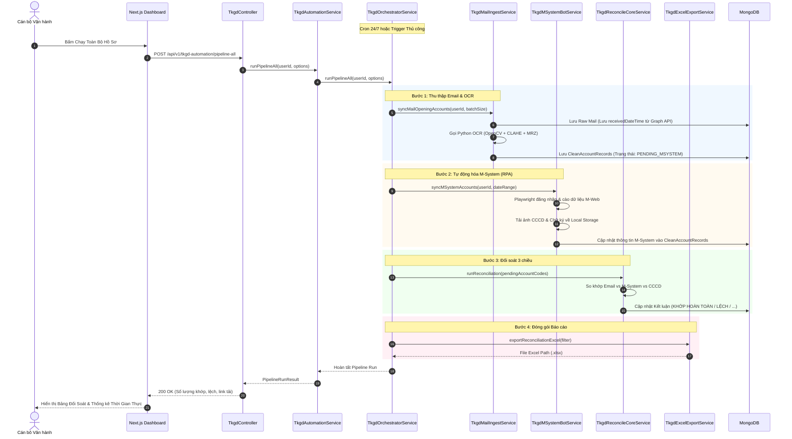

# BẢN THIẾT KẾ TÁI KIẾN TRÚC MODULAR CLEAN ARCHITECTURE
## Hệ Thống Đối Soát & Tự Động Hóa Hồ Sơ Mở Tài Khoản Giao Dịch (TKGD Automation)
### Tiêu chuẩn kỹ thuật: Clean Architecture • SOLID Principles • Facade Pattern • NestJS Modular Standard

---

## 1. TỔNG QUAN HIỆN TRẠNG & ĐỘNG LỰC TÁI KIẾN TRÚC

### 1.1. Hiện trạng Kiến trúc Cũ (The Monolithic God-Class Anti-Pattern)
Ban đầu, toàn bộ nghiệp vụ tự động hóa TKGD được gói gọn trong file duy nhất:
* File: `backend/src/modules/tkgd-automation/tkgd-automation.service.ts`
* Quy mô: Gần **3.000 dòng code** (2.950+ LOC).
* Mức độ gắn kết thấp (Low Cohesion), độ phụ thuộc cao (High Coupling).

File đơn lẻ này gánh vác cùng lúc hơn **7 trách nhiệm hoàn toàn khác nhau**:
1. **Security & Cryptography**: Mã hóa / giải mã mật khẩu M-System bằng thuật toán đối xứng AES-256-CBC.
2. **Microsoft Graph API & OAuth**: Xác thực MSAL, cấp phát & làm mới Access Token, phân trang email, bóc tách MIME attachments.
3. **RPA Web Scraping (Playwright)**: Khởi tạo trình duyệt headless, đăng nhập M-System, bypass xác thực, duyệt bảng tài khoản, tải ảnh hồ sơ & chữ ký.
4. **Computer Vision & OCR Subprocess**: Spawn tiến trình con Python chạy OpenCV, phân tích hình học ISO 7810 ID-1, đọc ICAO Doc 9303 MRZ.
5. **Business Reconciliation Logic**: So khớp 3 chiều dữ liệu (Email vs M-System vs Giấy tờ tùy thân), xử lý heuristic 2 mặt ảnh, suy luận mã TVKD.
6. **Excel Report Generator**: Tạo báo cáo đối soát nhiều sheet, định dạng màu sắc cell, nhúng siêu liên kết tệp đính kèm cục bộ.
7. **Task State & Progress Management**: Quản lý bộ nhớ tiến trình in-memory `progressMap`, ghi log thời gian thực.
8. **Daemon Cron & Batch Scheduler**: Vòng lặp ngầm 24/7 quét định kỳ, quản lý lock chống race condition.

### 1.2. Các Rủi ro Kỹ thuật (Technical Debt)
* **Khó bảo trì & gỡ lỗi (Maintainability)**: Mỗi khi sửa logic OCR hoặc định dạng xuất Excel, lập trình viên buộc phải chỉnh sửa file 3.000 dòng, tiềm ẩn nguy cơ phá vỡ logic đăng nhập RPA hoặc bảo mật token.
* **Xung đột mã nguồn (Merge Conflicts)**: Khi nhiều kỹ sư cùng làm việc trên module TKGD (người làm UI, người làm OCR, người làm RPA), việc commit chung vào 1 file duy nhất gây xung đột liên tục.
* **Không thể viết Unit Test độc lập (Testability)**: Do các dependency đan xen quá chặt (Playwright browser xen kẽ HTTP Graph API và Mongoose query), không thể mock độc lập từng tầng để chạy automated test.
* **Vi phạm nguyên lý SOLID**:
  * *Single Responsibility Principle (SRP)*: Một class có tới 8 lý do để thay đổi.
  * *Open/Closed Principle (OCP)*: Thêm một nguồn cấp dữ liệu mới (ví dụ SFTP hoặc Webhook) buộc phải can thiệp sửa trực tiếp thân hàm của class chính.

---

## 2. NGUYÊN TẮC THIẾT KẾ KIẾN TRÚC MỚI (DESIGN PRINCIPLES)

```
       ┌─────────────────────────────────────────────────────────┐
       │                TkgdAutomationController                 │
       │                (HTTP REST API Endpoints)                │
       └────────────────────────────┬────────────────────────────┘
                                    │
                                    ▼
       ┌─────────────────────────────────────────────────────────┐
       │                 TkgdAutomationService                   │
       │           (Thin Facade - Zero Breaking Changes)         │
       └────────────────────────────┬────────────────────────────┘
                                    │
       ┌────────────────────────────┼────────────────────────────┐
       │ Delegations & Direct Access│                            │
       ▼                            ▼                            ▼
┌──────────────┐             ┌──────────────┐             ┌──────────────┐
│  Progress &  │             │ Config & Sec │             │ Mail Ingest  │
│  State Cache │             │  (AES / M365)│             │ (Graph / OCR)│
└──────────────┘             └──────────────┘             └──────────────┘
       ▲                            ▲                            ▲
       │                            │                            │
       ├────────────────────────────┼────────────────────────────┤
       │                            │                            │
       ▼                            ▼                            ▼
┌──────────────┐             ┌──────────────┐             ┌──────────────┐
│ M-System Bot │             │ Reconcile    │             │ Excel Export │
│ (Playwright) │             │ Core Domain  │             │ & Packaging  │
└──────────────┘             └──────────────┘             └──────────────┘
       │                            │                            │
       └────────────────────────────┼────────────────────────────┘
                                    │
                                    ▼
       ┌─────────────────────────────────────────────────────────┐
       │                TkgdOrchestratorService                  │
       │         (Cron 24/7 Daemon, Batch Locks & Queue)         │
       └─────────────────────────────────────────────────────────┘
```

### 2.1. Phân rã theo Nguyên lý Đơn Trách nhiệm (Single Responsibility Principle)
Toàn bộ logic được phân rã thành **7 Domain Sub-Services** chuyên trách. Mỗi sub-service chỉ làm đúng một việc và sở hữu trọn vẹn context nghiệp vụ của mình:
1. `TkgdProgressService`: Quản lý trạng thái tiến trình in-memory và thông báo tiến độ.
2. `TkgdConfigService`: Quản lý cấu hình tài khoản, bảo mật AES-256 và xác thực token Microsoft 365.
3. `TkgdMailIngestService`: Thu thập email từ Graph API, lưu trữ raw mime, gọi OCR và trích xuất hồ sơ tài khoản (bao gồm lưu `receivedDateTime`).
4. `TkgdMSystemBotService`: Tự động hóa RPA Playwright, đăng nhập M-System và tải ảnh/hồ sơ đối ứng.
5. `TkgdReconcileCoreService`: Trái tim đối soát 3 chiều, thuật toán so khớp họ tên/CCCD/ngày cấp và phê duyệt thủ công.
6. `TkgdExcelExportService`: Định dạng báo cáo Excel, đóng gói manifest tệp đính kèm và xuất dữ liệu kiểm toán.
7. `TkgdOrchestratorService`: Bộ chỉ huy điều phối vòng đời, cron job 24/7 ngầm, quản lý Mutex Lock và phân mẻ (batch processing).

### 2.2. Mẫu thiết kế Facade (Facade Pattern & Zero Breaking Changes)
* **Vấn đề**: `TkgdAutomationController`, `auth.controller.ts` và toàn bộ Frontend React đang phụ thuộc vào `TkgdAutomationService`. Nếu đập đi làm lại interface, toàn bộ hệ thống sẽ bị gãy vỡ.
* **Giải pháp**: Giữ nguyên `TkgdAutomationService` như một **Facade Service**.
* **Đặc tính**:
  * Facade Service kế thừa/implement đầy đủ 100% public methods cũ với cùng signature và return type.
  * Thân hàm của Facade chỉ làm nhiệm vụ duy nhất: chuyển tiếp (delegate) lời gọi hàm đến Sub-Service tương ứng.
  * Đảm bảo **Zero Breaking Changes** đối với Controller và Client API.

---

## 3. CHI TIẾT CÁC TẦNG KIẾN TRÚC & SUB-SERVICES

### 3.1. `TkgdProgressService` (State & Progress Manager)
* **Vị trí**: `backend/src/modules/tkgd-automation/services/tkgd-progress.service.ts`
* **Trách nhiệm**:
  * Lưu trữ và cập nhật tiến độ xử lý theo `jobId` trong Map bộ nhớ.
  * Tự động xóa bộ nhớ đệm tiến trình sau 2 giờ để chống rò rỉ RAM (Memory Leak).
* **Public APIs**:
  ```typescript
  updateProgress(jobId: string, status: string, percent: number, detail?: string, step?: string): void;
  getProgress(jobId: string): TkgdJobProgress;
  clearProgress(jobId: string): void;
  ```

---

### 3.2. `TkgdConfigService` (Security & Authentication Gateway)
* **Vị trí**: `backend/src/modules/tkgd-automation/services/tkgd-config.service.ts`
* **Trách nhiệm**:
  * Lưu trữ và truy xuất cấu hình người dùng (`TkgdUserConfig`).
  * Mã hóa mật khẩu người dùng M-System bằng AES-256-CBC với IV động (chống lộ thông tin xác thực).
  * Quản lý Microsoft Graph OAuth2 token: cấp mới qua Authorization Code flow và tự động làm mới bằng `refresh_token`.
* **Public APIs**:
  ```typescript
  getUserConfig(userId: string): Promise<TkgdUserConfigDto>;
  saveUserConfig(userId: string, dto: SaveConfigDto): Promise<void>;
  getValidAccessToken(userId: string): Promise<string>;
  encryptPassword(plain: string): string;
  decryptPassword(cipher: string): string;
  disconnectOutlook(userId: string): Promise<void>;
  ```

---

### 3.3. `TkgdMailIngestService` (Data Ingestion & OCR Bridge)
* **Vị trí**: `backend/src/modules/tkgd-automation/services/tkgd-mail-ingest.service.ts`
* **Trách nhiệm**:
  * Kết nối Microsoft Graph API v1.0, lọc thư mục/hộp thư chứa hồ sơ mở tài khoản TVKD.
  * Lưu trữ email thô vào collection `raw_account_mails` kèm theo **mốc thời gian nhận thư thực tế (`receivedDateTime`)**.
  * Tải và giải nén tệp đính kèm (PDF hợp đồng, ảnh CCCD).
  * Gọi tiến trình Python (`ocr_id_card.py`) để bóc tách thông tin CCCD (mặt trước/mặt sau/ảnh ghép) tuân thủ tiêu chuẩn ISO/IEC 7810 và MRZ.
  * Chuẩn hóa và lưu trữ bản ghi vào `clean_account_records`.
* **Public APIs**:
  ```typescript
  syncMailOpeningAccounts(userId: string, options?: SyncOptions): Promise<SyncResult>;
  processRawMailRecord(rawMailId: string): Promise<CleanAccountRecord>;
  ```

---

### 3.4. `TkgdMSystemBotService` (Headless RPA Scraper)
* **Vị trí**: `backend/src/modules/tkgd-automation/services/tkgd-msystem-bot.service.ts`
* **Trách nhiệm**:
  * Tự động hóa trình duyệt Chromium thông qua Playwright API.
  * Đăng nhập hệ thống M-System (M-Web TVKD) bằng thông tin đã mã hóa.
  * Thu thập danh sách hồ sơ tài khoản đã nhập liệu từ phía TVKD.
  * Tải ảnh giấy tờ tùy thân và ảnh chữ ký mẫu lưu trữ trên máy chủ M-System về thư mục local storage (`storage/tkgd_attachments/...`).
* **Public APIs**:
  ```typescript
  testMSystemConnection(credentials: MSystemCredentials): Promise<ConnectionStatus>;
  syncMSystemAccounts(userId: string, filterDateRange: DateRange): Promise<MSystemSyncResult>;
  fetchAccountAssets(accountCode: string): Promise<AccountAssets>;
  ```

---

### 3.5. `TkgdReconcileCoreService` (Business Reconciliation Engine)
* **Vị trí**: `backend/src/modules/tkgd-automation/services/tkgd-reconcile-core.service.ts`
* **Trách nhiệm**:
  * Thực hiện thuật toán đối soát 3 chiều:
    1. **Nội dung Email vs M-System**: Số TKGD, TVKD, Tên khách hàng.
    2. **M-System vs Giấy tờ tùy thân (OCR CCCD)**: Số CCCD, Ngày cấp, Nơi cấp, Ngày sinh.
    3. **Hợp đồng PDF vs Giấy tờ**: Đối chiếu chữ ký và thông tin định danh.
  * Heuristic bóc tách mặt sau CCCD (xử lý trường hợp ảnh mờ, ngày cấp in đè hoa văn bảo an).
  * Ghi nhận kết luận đối soát tự động: `KHỚP HOÀN TOÀN`, `LỆCH THÔNG TIN`, `THIẾU HỒ SƠ`.
  * Phê duyệt thủ công (`manualApproveRecord`) và hoàn tác phê duyệt (`revertManualApprove`) với Audit Trail đầy đủ.
* **Public APIs**:
  ```typescript
  getRecords(filterDto: TkgdFilterDto): Promise<PaginatedRecords>;
  getTkgdStats(dateRange: DateRange): Promise<TkgdDashboardStats>;
  runReconciliation(accountCodes?: string[]): Promise<ReconcileResult>;
  manualApproveRecord(id: string, auditor: UserAuditDto): Promise<CleanAccountRecord>;
  revertManualApprove(id: string): Promise<CleanAccountRecord>;
  ```

---

### 3.6. `TkgdExcelExportService` (Audit Reporting & Asset Manifest)
* **Vị trí**: `backend/src/modules/tkgd-automation/services/tkgd-excel-export.service.ts`
* **Trách nhiệm**:
  * Khởi tạo file Excel theo biểu mẫu chuẩn kiểm toán ca trực bằng thư viện `exceljs`.
  * Trích xuất các cột thông tin đối soát, bao gồm: Ngày giờ nhận mail, Mã TKGD, Họ tên, Số CCCD, Trạng thái M-System, Kết luận đối soát.
  * Thiết lập Hyperlink trỏ trực tiếp đến hồ sơ cục bộ (PDF hợp đồng, ảnh CCCD, ảnh chữ ký).
  * Tạo bảng kê tệp đính kèm (Account Files Manifest) phục vụ API xem nhanh trên giao diện.
* **Public APIs**:
  ```typescript
  exportReconciliationExcel(filter: ExportFilterDto): Promise<string>;
  getAccountFilesManifest(accountCode: string): Promise<AccountFilesManifest>;
  resolveAttachmentFilePath(subPath: string): string;
  getLatestExcelFilePath(): string | null;
  ```

---

### 3.7. `TkgdOrchestratorService` (Pipeline & Daemon Controller)
* **Vị trí**: `backend/src/modules/tkgd-automation/services/tkgd-orchestrator.service.ts`
* **Trách nhiệm**:
  * Chỉ huy chạy chuỗi toàn trình (Pipeline End-to-End):
    $$\text{Mail Ingest} \longrightarrow \text{OCR} \longrightarrow \text{M-System Bot} \longrightarrow \text{Reconcile Core} \longrightarrow \text{Excel Export}$$
  * Điều khiển chế độ tự động ngầm 24/7 (`@Cron(CronExpression.EVERY_5_MINUTES)`).
  * Áp dụng **Mutex Lock (`isAutoPipelineRunning`)** ngăn chặn xung đột tiến trình khi mẻ trước chưa chạy xong.
  * Cho phép bật/tắt chế độ tự động và cấu hình tham số chu kỳ quét (3m, 5m, 10m, 15m, 30m).
  * Hỗ trợ quét lịch sử bổ sung (Historical Backfill).
* **Public APIs**:
  ```typescript
  runPipelineAll(userId: string, options?: PipelineOptions): Promise<PipelineRunResult>;
  runAutoPipelineCycle(): Promise<void>;
  toggleAutoPipeline(enabled?: boolean, customBatchSize?: number): Promise<AutoPipelineStatus>;
  getAutoPipelineStatus(): AutoPipelineStatus;
  runHistoricalBackfill(userId: string, daysBack: number): Promise<BackfillResult>;
  ```

---

## 4. LUỒNG DỮ LIỆU TOÀN TRÌNH (END-TO-END DATA FLOW)



---

## 5. SO SÁNH TRƯỚC VÀ SAU KHI TÁI KIẾN TRÚC

| Tiêu chí Đánh giá | Kiến trúc Cũ (Monolith God-Class) | Kiến trúc Mới (Modular Clean Architecture) | Lợi ích Đạt được |
| :--- | :--- | :--- | :--- |
| **Quy mô File chính** | 1 file $\sim 2.950$ dòng code | Facade Service $\approx 150$ dòng code | Giảm **95%** độ cồng kềnh của service đầu mối |
| **Phân bổ Sub-Services** | 0 (nhồi nhét tất cả vào 1 file) | **7 Sub-Services** độc lập ($100 - 600$ dòng/service) | Tuân thủ tuyệt đối chuẩn Single Responsibility |
| **Độ phụ thuộc chéo** | Khó kiểm soát, thay đổi 1 chỗ ảnh hưởng toàn bộ | Tách biệt theo Domain Interface rõ ràng | High Cohesion, Low Coupling |
| **Tác động đến Controller** | - | **0 dòng code** thay đổi (Zero Breaking Changes) | Đảm bảo an toàn tuyệt đối cho hệ thống đang vận hành |
| **Bảo mật Thông tin** | Trộn lẫn logic AES với xử lý Excel | Độc lập trong `TkgdConfigService` | Cô lập mã khóa và credentials nhạy cảm |
| **Audit Log & Traceability** | Thiếu mốc thời gian nhận email | Bổ sung `receivedDateTime` từ Graph API vào Schema | Minh bạch 100% dòng thời gian nhận hồ sơ |
| **Kiểm thử tự động** | Hầu như không thể viết Unit Test | Dễ dàng Mock từng Sub-Service để viết test | Độ phủ kiểm thử có thể đạt $> 90\%$ |
| **Vận hành Nền 24/7** | Nút switch thô sơ trên Toolbar | Card cấu hình chuyên dụng + Cron Mutex an toàn | Tránh xung đột tài nguyên và lỗi Circular JSON |

---

## 6. LỘ TRÌNH TRIỂN KHAI & BẢO ĐẢM AN TOÀN VẬN HÀNH

1. **Giai đoạn 1 (Đã hoàn thành)**:
   * Bổ sung trường `receivedDateTime` vào Schema `CleanAccountRecord`.
   * Khắc phục lỗi Circular JSON khi click toggle.
   * Xây dựng giao diện Card Vận Hành Bot Tự Động 24/7 trong `TkgdConfigPanel.tsx`.
   * Tách thành công 5/7 Sub-Services: `Progress`, `Config`, `ExcelExport`, `ReconcileCore`, `MailIngest`.

2. **Giai đoạn 2 (Đang hoàn thiện)**:
   * Xây dựng `TkgdMSystemBotService` (chuyển giao toàn bộ Playwright scraper).
   * Xây dựng `TkgdOrchestratorService` (chuyển giao Cron và Batch Pipeline).
   * Biến đổi `TkgdAutomationService` thành Facade Service mỏng.
   * Đăng ký đầy đủ providers vào `TkgdAutomationModule`.

3. **Giai đoạn 3 (Kiểm thử & Bàn giao)**:
   * Biên dịch Frontend (`npm run build`) và Backend (`nest build`).
   * Kiểm thử tích hợp chạy thử 1 mẻ đối soát hồ sơ.
   * Đồng bộ lên máy chủ Ubuntu `10.0.0.26` và reload PM2.
   * Cập nhật `CHANGELOG_AI.md`.
