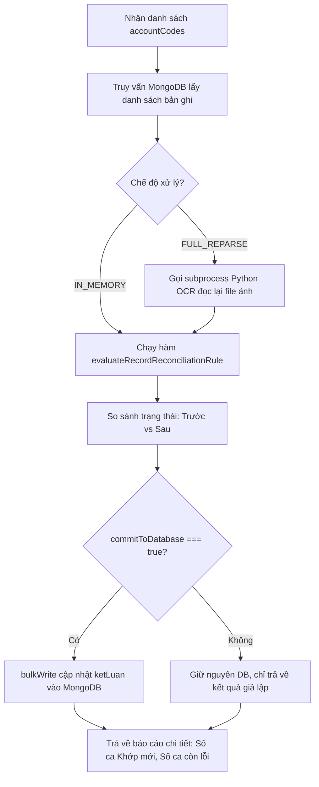

# THIẾT KẾ KỸ THUẬT: HỆ THỐNG TÁI XỬ LÝ & KHẮC PHỤC LỖI ĐỐI SOÁT TKGD (INTERNAL DEV REMEDIATION TOOL)

> **Phạm vi áp dụng**: Công cụ nội bộ dành riêng cho Kỹ thuật / Developer / Quản trị hệ thống.  
> **Người dùng ca trực (End-user)**: Không cần quan tâm tới công cụ này, chỉ tiếp nhận kết quả cuối cùng trên bảng đối soát.  
> **Mục tiêu cốt lõi**: Khắc phục triệt để tình trạng "Nâng cấp code thì tài khoản mới được fix, tài khoản cũ trong DB vẫn bị ghim lỗi". Thay thế hoàn toàn quy trình thủ công (chạy script máy tính cá nhân rồi cập nhật chéo lên server Ubuntu).

---

## 1. Bối Cảnh & Vấn Đề Cần Giải Quyết

### 1.1. Hiện trạng trước khi có tính năng
Khi hệ thống đối soát TKGD vận hành thực tế, phát sinh nhiều ca lệch dị biệt (Edge cases). Khi Developer phân tích nguyên nhân và nâng cấp mã nguồn:
1. **Lỗ hổng hồi tố (Retroactive Gap)**: Mã nguồn mới chỉ áp dụng cho các tài khoản được quét sau thời điểm deploy. Hàng trăm tài khoản cũ trong MongoDB vẫn lưu trữ nhãn lỗi cũ (`ketLuan.trangThai = "LECH"`).
2. **Quy trình vá lỗi thủ công cồng kềnh**:
   - Developer phải mở terminal trên máy local.
   - Chạy script kiểm tra hoặc bóc tách từng tài khoản (`tkgd_case_inspector.js --test <MÃ>`).
   - Viết câu lệnh hoặc script đẩy cập nhật chéo qua SSH lên server Ubuntu `10.0.0.26`.
   - Rủi ro cao, tốn thời gian và dễ phát sinh lỗi lệch pha dữ liệu giữa môi trường dev và production.

### 1.2. Yêu cầu đặt ra cho Công cụ Kỹ thuật Mới
* **Đầu vào linh hoạt**: Cho phép Kỹ thuật ném 1 danh sách mã tài khoản (copy/paste hoặc tải file text/excel/csv danh sách tài khoản lỗi).
* **Xử lý trực tiếp trên Server Production (Ubuntu)**: Kích hoạt API nội bộ chạy trực tiếp trên môi trường đang vận hành, ghi thẳng kết quả vào MongoDB production mà không cần qua trung gian SSH/script ngoài.
* **Hỗ trợ 2 chế độ xử lý theo bản chất bug**:
  - *Chế độ 1 - In-Memory Fast Re-evaluate (Siêu tốc, 0% CPU)*: Dành cho các bug logic TypeScript/JavaScript.
  - *Chế độ 2 - Deep OCR Reparse (Chạy lại bóc tách)*: Dành cho các bug bóc tách ảnh Python OCR.
* **Báo cáo đối chiếu Before vs After**: Hiển thị rõ số ca đã chuyển từ `LECH` $\rightarrow$ `KHOP`, danh sách các ca còn lỗi và nguyên nhân cụ thể theo logic mới.

---

## 2. Tổng Hợp Danh Mục Test Cases Kinh Điển & Logic Khắc Phục (Knowledge Base)

Dưới đây là 8 nhóm Test Case thực tế đã bóc tách và phân loại trong quá trình kiểm thử hệ thống:

| Nhóm Case | Test Case Điển Hình | Nguyên Nhân Gốc Rễ | Phương Thức Xử Lý Chuẩn | Mức Độ Can Thiệp |
| :--- | :--- | :--- | :--- | :---: |
| **1. Stale Reconcile (Lệch pha thời gian)** | `012C4242408` (Lành Thị Nhiên) | Quét Mail lúc 06:45 chưa có MS $\rightarrow$ ghi lỗi. Bot RPA cào MS lúc 06:50 nhưng **không trigger re-evaluate**. Bảng xanh 100% nhưng khung đỏ báo "Chưa có MS". | Chạy lại hàm `evaluateRecordReconciliationRule(record)` in-memory. Cập nhật lại `ketLuan`. | **In-Memory (1ms)** |
| **2. Lệch ngày cấp CCCD (Consensus Healing)** | ~108 ca (Đỗ Thị Tuyết, Trịnh Xuân Đạt...) | Họ tên + Số CCCD 12 số + Ngày sinh khớp 100%. Ngày cấp trên chip khác ngày cấp gõ tay trên M-System (do TVKD gõ nhầm hoặc ngày cấp phôi thẻ). | Áp dụng rule **Tự lành đồng thuận**: Lấy ngày cấp theo chip CCCD làm chuẩn $\rightarrow$ Chuyển `KHOP` kèm tag `AUTO_HEALED_ISSUE_DATE`. | **In-Memory (1ms)** |
| **3. Lỗi MRZ 2 dòng (Phantom CCCD)** | Thẻ chip đuôi `...0803` | Regex tham lam `0\d{11}` ở Dòng 1 cắt nhầm chuỗi số ma `087035120803` làm suy luận sai năm sinh 1935 và giới tính Nữ. | Bắt buộc xử lý Dòng 2 trước Dòng 1: Kiểm tra 2 chữ số năm sinh `cccd[4:6]` phải khớp `YY` của Dòng 2. | **Deep Reparse OCR** |
| **4. Nhầm lẫn ảnh Thumbnail M-System (270px)** | Các ca đọc nhầm `5` thành `6` | Quét nhầm ảnh thumbnail `_MS_` kích thước siêu nhỏ 270x172px do bot cào web về thay vì dùng ảnh gốc khách hàng gửi mail (1000px). | Hàm quét file lọc bỏ tiền tố `_MS_`, `chuky`, ưu tiên 100% ảnh gốc `customerFiles`. | **Deep Reparse OCR** |
| **5. File dị biệt (.paint, .heic, raw stream)** | Khách hàng dùng iPhone / Samsung | Ảnh gửi qua mail bị đóng gói dạng luồng nhị phân nén zlib `.paint` hoặc container Apple HEIF/HEIC. | Sử dụng worker Python giải nén zlib, tái tạo mảng pixel RGB và xuất file JPEG chuẩn. | **Deep Reparse OCR** |
| **6. Chuẩn hóa Họ Tên (Unicode, Khoảng trắng)** | `NGUYEN  VAN  A` vs `Nguyễn Văn A` | Tên trên M-System gõ thừa dấu cách kép, viết hoa không dấu, hoặc lệch bảng mã Unicode dựng sẵn (NFC) vs tổ hợp (NFD). | Áp dụng hàm `normalizeName()`: Loại bỏ khoảng trắng thừa, chuẩn hóa NFC, loại bỏ dấu tiếng Việt khi so sánh lỏng. | **In-Memory (1ms)** |
| **7. Tiểu khoản Kế thừa (-A, -L, -S, PL01)** | `012C...-A` (ACM Nano) | Tiểu khoản không gửi lại CCCD riêng mà kế thừa hồ sơ từ tài khoản cơ sở. | Truy vấn liên kết tài khoản cha trong DB, kích hoạt `verifyAndHealWithImageHash` kế thừa `canCuoc`. | **In-Memory (1ms)** |
| **8. Thiếu CCCD trên M-System (Lỗi TVKD)** | ~135 ca (TVKD 003, 012) | TVKD tạo tài khoản trên MS nhưng bỏ trống hoàn toàn ô CCCD. Đây là lỗi quy trình của TVKD, không phải lỗi OCR. | Giữ nguyên trạng thái cảnh báo vàng `[THIEU_CCCD_MS]`, phân nhóm riêng để xuất báo cáo gửi Giám sát. | **In-Memory (1ms)** |

---

## 3. Thiết Kế Kiến Trúc Backend (NestJS Service & Endpoints)

### 3.1. Endpoint 1: Xuất Danh Sách Lỗi Mẫu (`GET /api/v1/tkgd/dev/export-anomalies`)
* **Mục đích**: Cho phép Kỹ thuật 1-click tải về toàn bộ danh sách các tài khoản đang mang trạng thái `LECH` hoặc `CAN_KIEM_TRA` trong CSDL.
* **Định dạng trả về**: File Excel (`.xlsx`) gồm các cột: `Mã TKGD`, `Họ tên`, `CCCD M-System`, `CCCD OCR`, `Trạng thái hiện tại`, `Danh sách lỗi chi tiết`, `Batch Date`.
* **Sử dụng**: Làm file input mẫu để Kỹ thuật ném lại vào tính năng re-evaluate sau khi sửa code.

### 3.2. Endpoint 2: Tái Thẩm Định Hàng Loạt Theo Danh Sách (`POST /api/v1/tkgd/dev/batch-recheck`)
* **Payload nhận vào**:
```typescript
export interface BatchRecheckDto {
  /** Danh sách mã tài khoản cần xử lý (ví dụ: ['012C4242408', '003C123456']) */
  accountCodes?: string[];
  
  /** Nếu true: Hệ thống tự động gom toàn bộ các ca đang LECH / CAN_KIEM_TRA trong DB */
  targetAllAnomalies?: boolean;
  
  /** 
   * Chế độ xử lý:
   * - 'IN_MEMORY': Chạy lại logic so khớp JS thuần túy (1-2s, 0% CPU, an toàn tuyệt đối).
   * - 'FULL_REPARSE': Đọc lại file ảnh trên disk và gọi lại Python OCR bóc tách từ đầu.
   */
  mode: 'IN_MEMORY' | 'FULL_REPARSE';

  /** Có tự động ghi đè kết quả mới vào MongoDB hay không (Mặc định: true) */
  commitToDatabase?: boolean;

  /** Lọc theo ngày đợt (tùy chọn) */
  batchDate?: string;
}
```

* **Luồng xử lý (Execution Flow)**:


* **Response mẫu**:
```json
{
  "success": true,
  "summary": {
    "totalProcessed": 50,
    "fixedToKhopCount": 38,
    "stillAnomaliesCount": 12,
    "executionTimeMs": 1420,
    "mode": "IN_MEMORY",
    "committed": true
  },
  "fixedAccounts": [
    {
      "accountCode": "012C4242408",
      "customerName": "LÀNH THỊ NHIÊN",
      "previousStatus": "LECH",
      "newStatus": "KHOP",
      "clearedErrors": ["Tài khoản chưa được tạo trên M-System"]
    }
  ],
  "remainingAnomalies": [
    {
      "accountCode": "003C999888",
      "customerName": "NGUYỄN VĂN B",
      "status": "LECH",
      "errors": ["M-System chưa nhập số CCCD"]
    }
  ]
}
```

---

## 4. Thiết Kế Giao Diện Kỹ Thuật (Dev Remediation Console)

Giao diện được thiết kế độc lập dưới dạng **Drawer / Modal Kỹ Thuật (Internal Tech Modal)**, không làm rối mắt người dùng ca trực:

### 4.1. Điểm truy cập giao diện
* Nút bấm **`[🛠️ Kỹ Thuật: Quét Lại Bug]`** đặt ở góc thanh công cụ [TkgdActionToolbar.tsx](file:///c:/Users/hiepth/OneDrive%20-%20MERCANTILE%20EXCHANGE%20OF%20VIETNAM/Documents/Github/mxv-tkgd-ccp-work/frontend/src/features/tkgd/components/TkgdActionToolbar.tsx) (có thể gắn phân quyền `isAdmin` hoặc nút chuyên dụng).
* Cạnh đó là nút **`[📥 Xuất DS Lỗi]`** để lấy nhanh dữ liệu đầu vào.

### 4.2. Các khối chức năng trên Modal
1. **Khối 1 - Nạp danh sách mục tiêu**:
   - Tab 1: **Kéo thả File** (hỗ trợ Excel `.xlsx`, `.xls`, `.csv`, `.txt`). Hệ thống tự trích xuất cột `Mã TKGD`.
   - Tab 2: **Dán Text** (hộp Textarea hỗ trợ dán danh sách mã cách nhau bằng dấu phẩy, khoảng trắng hoặc xuống dòng).
   - Nút tắt tiện ích: **`[Tự động nạp tất cả ca LỆCH trong DB]`**.
2. **Khối 2 - Tùy chọn thực thi**:
   - Lựa chọn Radio:
     - ⚡ **Quét Nhanh In-Memory (Khuyên dùng)**: Áp dụng logic JS/TS mới (vài giây).
     - 🔍 **Quét Sâu Full Reparse**: Đọc lại ảnh & chạy Python OCR.
   - Checkbox: `[x] Tự động cập nhật vào CSDL khi quét xong`.
3. **Khối 3 - Nút kích hoạt**:
   - Nút **`[⚡ Bắt Đầu Tái Thẩm Định]`** kèm hiệu ứng loading spinner.
4. **Khối 4 - Bảng đối chiếu Trước vs Sau (Real-time Report)**:
   - Thẻ thống kê: **Tổng đã xử lý** | **Đã Khớp (Fix thành công)** | **Còn lỗi**.
   - Bảng danh sách chi tiết có thể lọc và tìm kiếm.
   - Nút **`[Xuất Báo Cáo Kết Quả Excel]`**.

---

## 5. Quy Trình Vận Hành Chuẩn Khi Sửa Code & Khắc Phục Bug (SOP For Developers)

Mỗi khi phát hiện ca lỗi mới hoặc cần nâng cấp logic, Developer thực hiện đúng quy trình 5 bước sau:

```
[BƯỚC 1: XUẤT DS LỖI]  ──► Bấm "Xuất DS Lỗi" lấy file Excel các ca đang lệch làm bộ test dataset.
                                      │
                                      ▼
[BƯỚC 2: PHÂN TÍCH & SỬA CODE] ──► Mở mã nguồn sửa logic (Regex, Normalizer, Rule tự lành, Python OCR).
                                      │
                                      ▼
[BƯỚC 3: DEPLOY CODE LÊN UBUNTU] ──► Chạy script deploy chuẩn: node src/scripts/_deploy_update_all.js
                                      │
                                      ▼
[BƯỚC 4: NÉM FILE VÀO DEV TOOL] ──► Mở Modal "Kỹ Thuật: Quét Lại Bug", kéo thả file ở Bước 1 vào.
                                      │   Chọn chế độ "In-Memory" (hoặc Reparse) ──► Bấm [Bắt Đầu]
                                      ▼
[BƯỚC 5: XÁC NHẬN KẾT QUẢ]      ──► Quan sát bảng Trước vs Sau:
                                      Các ca đã chuyển thành KHỚP 100% trên CSDL Ubuntu. Hoàn tất!
```

---

## 6. Danh Sách File Tác Động Khi Triển Khai

1. **Backend**:
   - [tkgd-automation.controller.ts](file:///c:/Users/hiepth/OneDrive%20-%20MERCANTILE%20EXCHANGE%20OF%20VIETNAM/Documents/Github/mxv-tkgd-ccp-work/backend/src/modules/tkgd-automation/tkgd-automation.controller.ts): Thêm 2 route `dev/export-anomalies` và `dev/batch-recheck`.
   - [tkgd-automation.service.ts](file:///c:/Users/hiepth/OneDrive%20-%20MERCANTILE%20EXCHANGE%20OF%20VIETNAM/Documents/Github/mxv-tkgd-ccp-work/backend/src/modules/tkgd-automation/tkgd-automation.service.ts): Hiện thực hàm `exportAnomaliesExcel()` và `batchRecheckAccounts()`.
2. **Frontend**:
   - `frontend/src/features/tkgd/components/modal/TkgdDevBatchRecheckModal.tsx` *(File mới)*: Giao diện Modal kỹ thuật nạp file và đối chiếu Before/After.
   - [TkgdActionToolbar.tsx](file:///c:/Users/hiepth/OneDrive%20-%20MERCANTILE%20EXCHANGE%20OF%20VIETNAM/Documents/Github/mxv-tkgd-ccp-work/frontend/src/features/tkgd/components/TkgdActionToolbar.tsx): Gắn nút kích hoạt và kết nối state mở Modal.
   - `frontend/src/features/tkgd/services/tkgd.service.ts`: Bổ sung 2 hàm gọi API tương ứng.
