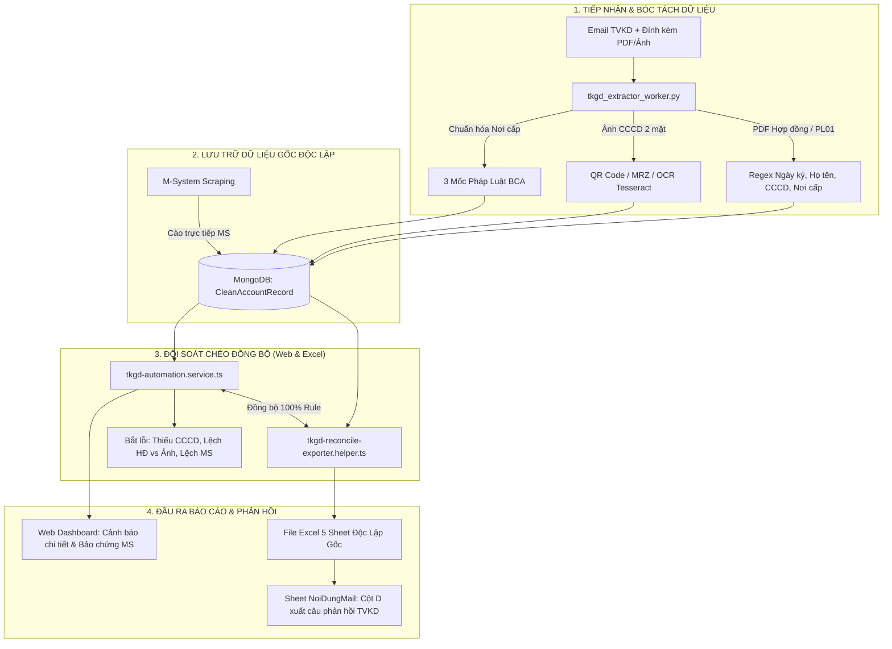

# TÀI LIỆU THIẾT KẾ & HƯỚNG DẪN TRIỂN KHAI NÂNG CẤP TOÀN VẸN DỮ LIỆU ĐỐI SOÁT TKGD

| Thông Tin Tài Liệu | Chi Tiết |
| :--- | :--- |
| **Dự án** | MXV Shift Checklist & Automation System |
| **Phân hệ** | Quản lý & Đối soát Tự động Hồ sơ Mở TKGD (Phòng Quản lý Thành viên - TVKD) |
| **Phiên bản** | **v2.0 - Enterprise Audit & Data Integrity Standard** |
| **Tác giả / Phụ trách** | Đội ngũ Phát triển Hệ thống Ca trực MXV & AI Assistant |
| **Trạng thái** | Sẵn sàng Triển khai (Approved for Implementation) |
| **Ngày ban hành** | 09/09/2026 |

---

## 1. Bối Cảnh & Mục Tiêu Nâng Cấp

### 1.1. Hiện trạng & Thách thức
Hệ thống đối soát hồ sơ mở tài khoản giao dịch (TKGD) tự động đã hoàn thành việc bóc tách OCR căn cước, hợp đồng và đối chiếu với M-System. Tuy nhiên, qua quá trình vận hành thực tế phát sinh một số điểm bất cập về tính toàn vẹn dữ liệu:
1. **Khuyết thiếu `Ngày ký HĐ`**: File PDF Hợp đồng chưa được trích xuất ngày ký, dẫn đến hệ thống phải mượn `ms.ngayThamGia` hoặc đề xuất lấy ngày nhận email (`receivedDateTime`), vi phạm tính độc lập pháp lý của hợp đồng thương mại.
2. **Nhiễm chéo dữ liệu giữa các Sheet Excel**: File Excel đối chiếu 5 sheet (`NoiDungMail`, `Cancuoc`, `HopDong`, `Phuluc`, `MS`) đang sử dụng fallback `hd.soCanCuoc || ms.soCMND_HoChieu`, làm mất đi tính độc lập để phát hiện lỗi thiếu sót thông tin trên từng tài liệu.
3. **Nơi cấp CCCD chưa chuẩn hóa theo pháp luật**: Việc gán cứng mặc định `BỘ CÔNG AN` hoặc tự đoán theo năm thiếu căn cứ thời hiệu của các Thông tư Bộ Công an.
4. **Vênh kết quả giữa Web UI và File Excel**: Bộ rule kiểm tra đối soát nằm ở cả Service và Helper xuất Excel nhưng chưa được đồng bộ 100%, gây nguy cơ trên Web báo LỆCH nhưng Excel tải về lại báo KHỚP.

### 1.2. Mục tiêu Nâng cấp
- **Toàn vẹn 100% dữ liệu gốc**: Mỗi tài liệu (Hợp đồng, Ảnh CCCD, M-System) chỉ phản ánh đúng những gì xuất hiện trên tài liệu đó. Tuyệt đối không "mượn" dữ liệu lẫn nhau trên các sheet kiểm toán.
- **Tuân thủ Pháp lý (Legal Compliance)**: 
  - Không bao giờ gán ngày nhận mail làm ngày ký hợp đồng.
  - Áp dụng chuẩn xác 3 mốc thời hiệu cấp thẻ định danh theo Luật Căn cước 2023 và các Thông tư của Bộ Công an.
- **Đồng bộ tuyệt đối Web & Excel**: Mọi kết quả kiểm tra (Khớp, Lệch, Cần tra soát) và các thông báo lỗi phản hồi TVKD phải nhất quán 100% giữa giao diện Web và file Excel tải về.

---

## 2. Kiến Trúc Dòng Dữ Liệu (System Architecture & Data Flow)



---

## 3. Đặc Tả Thiết Kế Kỹ Thuật Chi Tiết

### 3.1. Phân Hệ Python Worker (`tkgd_extractor_worker.py`)

#### A. Trích xuất Ngày ký Hợp đồng (`extract_pdf_contract` & `extract_pdf_pl01`)
Áp dụng 3 mẫu biểu thức chính quy (Regex) quét đa dạng các mẫu biểu của các TVKD (Gia Cát Lợi 003, Hitech 036, VMEX 012...):
1. **Mẫu mở đầu**:
   ```python
   re.search(r'(?:Hôm\s*nay,?\s*)?ngày\s+(\d{1,2})\s+tháng\s+(\d{1,2})\s+năm\s+(\d{4})', text, re.I)
   ```
2. **Mẫu chân trang (địa danh kèm ngày tháng)**:
   ```python
   re.search(r'(?:Hà\s*Nội|Hồ\s*Chí\s*Minh|TP\.?\s*HCM|Đà\s*Nẵng|Cần\s*Thơ|[A-ZÀ-Ỹa-zà-ỹ\s]{3,30}),\s*ngày\s+(\d{1,2})\s+tháng\s+(\d{1,2})\s+năm\s+(\d{4})', text, re.I)
   ```
3. **Mẫu nhãn trường (Biểu mẫu điện tử / Form PDF)**:
   ```python
   re.search(r'(?:Ngày\s*ký|Ký\s*ngày|Thời\s*gian\s*ký)[\s:\.\-]+(\d{1,2}[\/\-\.]\d{1,2}[\/\-\.]\d{4})', text, re.I)
   ```
- **Kiểm soát tính hợp lệ**: `1 <= day <= 31`, `1 <= month <= 12`, `2000 <= year <= 2099`.
- Nếu không tìm thấy (do bản scan tay nhăn/mờ), giữ `ngayKyHD = None` để hiển thị `-` trên hệ thống, không tự ý gán ngày nhận mail.

#### B. Chuẩn hóa Nơi cấp CCCD theo 3 Mốc Pháp Luật
Nếu OCR mặt sau bị nhòe con dấu đỏ không đọc được chữ "Cục Cảnh sát...", hệ thống kiểm tra điều kiện: **Số CCCD đủ 12 chữ số** và **Có Ngày cấp hợp lệ**:
- `ngayCap >= 01/07/2024`: Gán chuẩn `BỘ CÔNG AN` *(Căn cứ: Luật Căn cước số 26/2023/QH15)*.
- `10/10/2018 <= ngayCap < 01/07/2024`: Gán chuẩn `Cục Cảnh sát quản lý hành chính về trật tự xã hội` *(Căn cứ: TT 06/2021/TT-BCA & TT 48/2019/TT-BCA)*.
- `01/01/2016 <= ngayCap < 10/10/2018`: Gán chuẩn `Cục Cảnh sát đăng ký quản lý cư trú và dữ liệu Quốc gia về dân cư` *(Căn cứ: TT 61/2015/TT-BCA)*.
- **Đối với CMND 9 số cũ**: Tuyệt đối **KHÔNG suy đoán**, giữ `null` và hiển thị cảnh báo yêu cầu đổi sang CCCD gắn chip theo quy định của Sở.

---

### 3.2. Phân Hệ Backend Services (`tkgd-automation.service.ts` & `tkgd-mail-ingest.service.ts`)

#### A. Mapping Dữ liệu Bóc tách
- Bổ sung trường:
  ```typescript
  hopDongData.ngayKyHD = parseDate(pythonRes.hopDong.ngayKyHD);
  hopDongData.rawNgayKyHD = pythonRes.hopDong.rawNgayKyHD;
  phuLucData.ngayKyHD = parseDate(pythonRes.phuLuc.ngayKyHD);
  phuLucData.rawNgayKyHD = pythonRes.phuLuc.rawNgayKyHD;
  ```
- Loại bỏ toàn bộ việc gán cứng mặc định `noiCap || 'BỘ CÔNG AN'`.

#### B. Chuẩn hóa Bộ Quy Tắc Đối Soát (Validation Rules Engine)
Hệ thống phân định rõ luồng xử lý theo loại tài khoản:
1. **Phân loại Tài khoản**:
   - Nếu là **Tiểu khoản (`-A`, `-L`, `-S`)**: Không bắt buộc phải có ảnh CCCD trong mail (vì TVKD chỉ gửi PL01 đính kèm tài khoản cơ sở). Kiểm tra khớp Họ tên và Mã cơ sở với PL01.
   - Nếu là **Tài khoản cơ sở (Base Account)**:
2. **Kiểm tra CCCD**:
   - **Lỗi 1 (Hồ sơ thiếu CCCD)**:
     `if (!targetCccd)` $\rightarrow$ Lỗi: `"Hồ sơ thiếu CCCD (Ảnh CCCD không hợp lệ/mờ và HĐ không có số)"`
   - **Lỗi 2 (M-System chưa nhập CCCD)**:
     `if (ms.isFoundOnMS && !msCccd)` $\rightarrow$ Lỗi: `"M-System chưa nhập số CCCD"`
   - **Lỗi 3 (Lệch CCCD giữa Hợp đồng và Ảnh CCCD)**:
     `if (hdCccd && imgCccd && hdCccd !== imgCccd)` $\rightarrow$ Lỗi: `"Lệch số CCCD giữa HĐ và ảnh CCCD (HĐ: ${hdCccd} != Ảnh: ${imgCccd})"`
   - **Lỗi 4 (Lệch CCCD giữa Hồ sơ và M-System)**:
     `if (targetCccd && msCccd && targetCccd !== msCccd)` $\rightarrow$ Lỗi: `"Lệch số CCCD (Hồ sơ: ${targetCccd} != MS: ${msCccd})"`

---

### 3.3. Phân Hệ Xuất Báo Cáo Excel (`tkgd-reconcile-exporter.helper.ts`)

Bảo toàn tính độc lập tuyệt đối của 5 Sheet dữ liệu:

| Sheet Name | Nguyên tắc Xuất Dữ Liệu (Data Integrity Principle) | Các Cột Dữ Liệu Gốc |
| :--- | :--- | :--- |
| **`NoiDungMail`** | Tổng hợp trạng thái và kết quả đối chiếu toàn diện | STT, Mã TKGD, Tên TK, **Kết quả (Cột D - Câu phản hồi TVKD)**, Thời gian kiểm tra |
| **`Cancuoc`** | **Chỉ ghi dữ liệu bóc từ ảnh CCCD** (Nếu OCR không đọc được, để trống, không mượn từ MS/HĐ) | STT, Họ tên, Số CCCD, Ngày sinh, Có giá trị đến, Ngày cấp, Nơi cấp |
| **`HopDong`** | **Chỉ ghi dữ liệu bóc từ PDF Hợp đồng** (Bỏ hoàn toàn fallback `\|\| ms...`) | STT, Mã TKGD, Họ tên, Số CCCD, Ngày sinh, Ngày cấp, Nơi cấp, **Ngày ký HĐ**, Loại hình, Chữ ký, Kết quả |
| **`Phuluc`** | **Chỉ ghi dữ liệu bóc từ PDF Phụ lục 01** (Bỏ hoàn toàn fallback `\|\| ms...`) | STT, Mã TKGD (-A), Họ tên, Số CCCD, Ngày sinh, Ngày cấp, Nơi cấp, **Ngày ký PL**, Chữ ký, Kết quả |
| **`MS`** | **Chỉ ghi dữ liệu cào trực tiếp từ M-System** (Nếu MS chưa nhập, để trống để kiểm toán) | STT, Mã TKGD cơ sở, Tên TK, Họ tên, Số CMND/CCCD, Ngày sinh, Ngày cấp, Nơi cấp, Ngày tham gia, Loại hình, Chữ ký, Kết quả |

---

## 4. Ma Trận So Sánh Trước vs Sau Cải Tiến

| Hạng Mục | Trước Cải Tiến (v1.5) | Sau Cải Tiến (v2.0) | Lợi Ích Mang Lại |
| :--- | :--- | :--- | :--- |
| **`Ngày ký HĐ`** | Mượn `ms.ngayThamGia` hoặc bỏ trống | Bóc tách tự động từ PDF HĐ/PL01 bằng 3 mẫu Regex | Phản ánh chính xác ngày ký thật, không sai lệch pháp lý |
| **Fallback ngày nhận mail** | Có rủi ro gán ngày nhận mail làm ngày ký | **Triệt tiêu 100%**, giữ `null` (`-`) nếu bản scan mờ | Tuân thủ tuyệt đối chuẩn kiểm toán của Sở |
| **Nơi cấp CCCD** | Gán cứng `BỘ CÔNG AN` hoặc tự đoán theo năm | Áp dụng 3 mốc thời hiệu pháp luật BCA; giữ `null` cho CMND 9 số | Đảm bảo tính hợp pháp, không đoán mò |
| **Độc lập 5 Sheet Excel** | Lấy dữ liệu MS đắp vào HĐ và CCCD khi thiếu | 5 Sheet độc lập 100% dữ liệu gốc | Giúp kiểm soát viên và TVKD nhìn thấy rõ giấy tờ nào đang thiếu dữ liệu |
| **Kiểm tra Chéo HĐ vs Ảnh** | Chưa có (chỉ so hồ sơ chung với MS) | Bổ sung kiểm tra `hdCccd !== imgCccd` | Ngăn chặn việc TVKD gõ nhầm số CCCD trên bản Hợp đồng |
| **Đồng bộ Web & Excel** | Rule đối soát tách rời ở 2 file | Đồng bộ 100% bộ quy tắc đối soát | Đảm bảo Web hiển thị thế nào thì Excel tải về y hệt |

---

## 5. Kế Hoạch Triển Khai & Kiểm Thử An Toàn (Deployment & Rollback)

### 5.1. Danh Sách File Tác Động
1. `backend/src/scripts/python/tkgd_extractor_worker.py`
2. `backend/src/modules/tkgd-automation/tkgd-automation.service.ts`
3. `backend/src/modules/tkgd-automation/services/tkgd-mail-ingest.service.ts`
4. `backend/src/modules/bot-engine/helpers/tkgd-reconcile-exporter.helper.ts`

### 5.2. Các Bước Thực Hiện
1. **Thực hiện cập nhật mã nguồn** trên các file tương ứng theo thiết kế chi tiết.
2. **Kiểm tra Biên dịch (Compile Verification)**:
   - Backend: `npm run build` (hoặc `npx tsc --noEmit`) $\rightarrow$ Phải đạt `Exit code: 0`.
   - Frontend: `npx tsc --noEmit` $\rightarrow$ Phải đạt `Exit code: 0`.
3. **Đồng bộ Lên Máy Chủ Ubuntu (`10.0.0.26`)**:
   - Chạy script đồng bộ: `node backend/src/scripts/deploy_to_ubuntu.js`.
   - Khởi động lại tiến trình PM2 backend & frontend trên server.
4. **Ghi Vết Kiểm Toán (Audit Trail)**:
   - Cập nhật toàn bộ nội dung thay đổi vào file `CHANGELOG_AI.md`.
   - Tạo commit git chuẩn mực trên nhánh `AML_TTTT_BT`.

### 5.3. Kịch Bản Khôi Phục Sự Cố (Rollback Plan)
Nếu phát sinh bất kỳ lỗi nghiêm trọng nào trong quá trình chạy thực tế:
- Git rollback về commit gần nhất trên nhánh `AML_TTTT_BT`.
- Chạy lại script deploy để đồng bộ mã nguồn ổn định lên máy chủ Ubuntu.
- Khởi động lại PM2 trong vòng dưới 30 giây.
