# BẢN TỔNG HỢP RÀ SOÁT KIẾN TRÚC & LUỒNG TỰ ĐỘNG HÓA CHO 2 TRANG ĐỘC LẬP
## (PHÂN HỆ M-SYSTEM & CQG ↔ PHÂN HỆ CORECCP & COREEX)

> **Mã tài liệu**: `MXV-ARCH-AUTOMATION-TM-2026-V1.0`  
> **Ngày lập**: 01/10/2026  
> **Mục tiêu**: Rà soát, chuẩn hóa và đặc tả toàn bộ các luồng tự động hóa chạy ngầm (Cron Jobs, Bot RPA, File Watchers, Schedulers) cho 2 trang vừa thiết kế độc lập (`/trading-manager/ms-cqg` và `/trading-manager/ccp-ce`), giải phóng khỏi sự phụ thuộc vào ca trực checklist, đảm bảo Zero-Downtime và sẵn sàng triển khai.

---

## I. TỔNG QUAN KIẾN TRÚC TỰ ĐỘNG HÓA TOÀN HỆ THỐNG

### 1. Hiện Trạng & Sự Phân Tách Nhiệm Vụ (Separation of Concerns)
Trước đây, toàn bộ logic tự động bị nhồi nhét chung trong một vòng lặp `@Cron('* * * * *')` của `bot-engine.service.ts` và bị "trói chân" bởi điều kiện tiên quyết: **Phải có ca trực mở (`activeLogs.length > 0`)**. Điều này khiến Trading Manager không thể hoạt động tự động nếu không có người mở ca trực.

Sau khi tái cấu trúc bóc tách thành 2 trang độc lập:
1. **Trang 1: MS & CQG (`/trading-manager/ms-cqg`)**: Phụ trách toàn bộ thị trường hàng hóa phái sinh truyền thống (M-System, CQG Gateway, Straits Financial ACM).
2. **Trang 2: CoreCCP & CoreEX (`/trading-manager/ccp-ce`)**: Phụ trách toàn bộ hệ thống giao dịch & bù trừ thanh toán thế hệ mới (VNCLEAR Maker, CoreEX OMS).
3. **Màn hình dùng chung (Common Shared Component)**: Màn hình **Check KLGD (Đối Soát Khớp Lệnh 4 Bên)** được mount chung ở Tab 1 của cả 2 trang, đảm bảo bức tranh toàn cảnh độ lệch không bao giờ bị chia cắt.

---

## II. MA TRẬN LUỒNG TỰ ĐỘNG HÓA CHI TIẾT THEO TỪNG PHÂN HỆ

```mermaid
flowchart TB
    subgraph SHARED_CRON["NHỊP ĐẬP TRUNG TÂM (CRON & QUEUE ENGINE)"]
        CronKLGD["@Cron('* * * * *')<br/>Quét chu kỳ 60 phút trong phiên"]
        CronScheduler["@Cron('* * * * *') Dynamic Scheduler<br/>Kích hoạt theo mốc giờ cố định"]
        JobQueue["MongoDB Queue (bot_jobs)<br/>Quản lý trạng thái, Retry & Deduplication"]
    end

    subgraph SYSTEM_MS_CQG["PHÂN HỆ 1: M-SYSTEM & CQG (/trading-manager/ms-cqg)"]
        BotRecon["Bot CHECK_KLGD (4 Bên)<br/>MS ↔ CQG ↔ ACM ↔ CoreCCP"]
        BotPreEod["Bot CHECK_PRE_EOD & DSGDBeforeEOD<br/>Quét DSGD snapshot vs Straits CSV"]
        BotEodMS["Bot CHECK_EOD_MM<br/>Đối chiếu QLTKGD vs eod.csv & Quét âm KQ"]
        BotCqgSync["Bot CHECK_CQG_SYNC<br/>Ghép 4 cặp file thô CQG & Check balance"]
        BotBackupMS["RPA M-System (20 báo cáo)<br/>Tải qua Chrome headless / Playwright"]
        BotBackupCQG["RPA CQG (9 file thô)<br/>Tải qua CQG Web API / Portal"]
        MacroEngine["Excel Headless Runner<br/>Chạy Macro Lot & Value lúc 06:00 - 06:30"]
    end

    subgraph SYSTEM_CCP_CE["PHÂN HỆ 2: CORECCP & COREEX (/trading-manager/ccp-ce)"]
        BotReconCCP["Bot CHECK_KLGD (4 Bên - Dùng chung)"]
        BotDownCCP1["RPA CoreCCP Đợt 1 (Trước 16h20)<br/>Tải 2 file: QL TT TKGD & TTM trước 4h20"]
        BotDownCCP2["RPA CoreCCP Đợt 2 (EOD Cuối ngày)<br/>Tải 23 báo cáo VNCLEAR Maker"]
        BotEodCCP["Engine CHECK_EOD_CCP<br/>Đối soát 4 thành phần số dư & Quỹ bù trừ"]
        BotLotStats["Engine CALCULATE_CCP_LOT_STATS<br/>Bóc tách DSGD CCP 4 nhóm lệnh per TVKD"]
        BotDownCE["RPA CoreEX (10 báo cáo)<br/>Tải báo cáo sàn giao dịch mới"]
        BotFxMatrix["Sync Engine Tỷ Giá CoreCCP<br/>Cập nhật Ma trận đa nguyên tệ (USD, EUR, JPY...)"]
    end

    CronKLGD -->|Kích hoạt khi bot_auto_recon_enabled=true| BotRecon
    CronKLGD -->|Đồng bộ trạng thái 4 bên| BotReconCCP
    
    CronScheduler -->|04:30 - 06:00| BotBackupMS
    CronScheduler -->|06:00| BotBackupCQG
    CronScheduler -->|06:15| BotCqgSync
    CronScheduler -->|06:30| MacroEngine
    CronScheduler -->|Cuối phiên MS| BotPreEod
    CronScheduler -->|Sau chốt EOD MS| BotEodMS

    CronScheduler -->|16:15| BotDownCCP1
    CronScheduler -->|Sau chốt EOD CCP| BotDownCCP2
    CronScheduler -->|Sau khi đủ 23 file| BotEodCCP
    CronScheduler -->|18:00 - 19:00| BotLotStats
    CronScheduler -->|19:30| BotDownCE
    CronScheduler -->|Định kỳ đầu ngày| BotFxMatrix

    BotRecon --> JobQueue
    BotPreEod --> JobQueue
    BotEodMS --> JobQueue
    BotCqgSync --> JobQueue
    BotDownCCP1 --> JobQueue
    BotDownCCP2 --> JobQueue
    BotEodCCP --> JobQueue
    BotLotStats --> JobQueue
```

---

## III. CHI TIẾT TỪNG PHÂN HỆ VẬN HÀNH ĐỘC LẬP

### 🏢 1. Phân Hệ M-System & CQG (`/trading-manager/ms-cqg`)

| Tác Vụ Tự Động | Cờ Cấu Hình / Lịch Chạy | File Đầu Vào / Nguồn | Logic Xử Lý & Kết Quả |
| :--- | :--- | :--- | :--- |
| **1.1. Check KLGD Trong Phiên** | `bot_auto_recon_enabled = true` Chu kỳ: 60 phút/lần | • M-System: `DSGD.xlsx`, `TTM.xlsx` • CQG: `FR.xlsx`, `PS.xlsx` • ACM: `Straits.csv` • CCP: `DSGD CCP.xlsx` | So khớp ma trận 3 dòng x 4 cột: Khớp lệnh (KLGD), Vị thế mở (TTM), Tất toán (TTTT). Nếu lệch: Bật chuông âm thanh & sinh `dgvOrderInfo`. |
| **1.2. Check DSGD Trước EOD** | Kích hoạt tự động lúc ~22:00 hoặc trước giờ chạy EOD | • `DSGD.xlsx` (Gốc) • `DSGD[timestamp].xlsx` (Snapshot) • Straits CSV ACM (T-1) | So sánh tổng khối lượng khớp MS vs Snapshot vs Straits ACM để cảnh báo giao dịch muộn trước khi khóa sổ EOD. |
| **1.3. Đối Chiếu Pre-EOD 3 Bên** | Chạy tự động trước khi đóng phiên giao dịch | • `FR.xlsx` (CQG gộp) • `DSGD.xlsx` (MS) • `Straits.csv` (ACM) | Đối chiếu 3 bên khớp lệnh và vị thế ròng Net Position giữa M-System, CQG và Straits Financial. |
| **1.4. Đối Chiếu & Chạy EOD MS** | Sau khi nhận mail `it.support` hoặc tải file EOD | • `QLTKGD.xlsx` • `eod.csv` (Email M365) | So sánh chi tiết từng tài khoản giữa số dư QLTKGD và file EOD. Phát hiện tài khoản âm ký quỹ mới (`SCAN_NEGATIVE_MARGIN`). |
| **1.5. Đồng Bộ Số Dư CQG Sync** | Chạy sau khi có đủ file thô CQG sáng sớm (06:00 - 06:15) | • `FR1` + `FR2` $\rightarrow$ `FR.xlsx` • `PS1` + `PS2` $\rightarrow$ `PS.xlsx` • `OP1` + `OP2` $\rightarrow$ `OP.xlsx` • `OD1` + `OD2` $\rightarrow$ `Od.xlsx` | Tự động ghép nối các file thô của 2 tài khoản CQG Trading Desk, kiểm tra số dư chênh lệch MS vs CQG. |
| **1.6. Tải Backup MS & CQG** | `bot_auto_backup_enabled = true` Giờ chạy: 04:30 - 06:00 | • M-System Web RPA • CQG Portal RPA | Tải tự động 20 báo cáo MS và 9 file CQG vào thư mục `dd.mm MS` và `dd.mm CQG`. |
| **1.7. Chạy Macro Lot & Value** | Sau khi tải xong file MS (06:30) | • `DSGD.xlsx` • Macro Excel template | Kích hoạt headless Excel runner chạy macro thống kê số lot thị trường và giá trị giao dịch. |

---

### 🏛️ 2. Phân Hệ CoreCCP & CoreEX (`/trading-manager/ccp-ce`)

| Tác Vụ Tự Động | Cờ Cấu Hình / Lịch Chạy | File Đầu Vào / Nguồn | Logic Xử Lý & Kết Quả |
| :--- | :--- | :--- | :--- |
| **2.1. Check KLGD 4 Bên** | Dùng chung nhịp với MS-CQG (60p) | Ma trận 4 bên toàn hệ thống | Đảm bảo trực ban CoreCCP nắm bắt được trạng thái khớp lệnh toàn sàn. |
| **2.2. Tải CoreCCP Đợt 1 (16h20)** | 16h15 - 16h20 hàng ngày | Web VNCLEAR RPA | Tải 2 file chốt trước 16h20: `QL TT TKGD truoc 4h20.xlsx` và `TTM truoc 4h20.xlsx`. |
| **2.3. Tải CoreCCP Đợt 2 (EOD)** | Sau khi VNCLEAR hoàn tất chạy EOD cuối ngày | Web VNCLEAR RPA | Tải trọn bộ 23 báo cáo VNCLEAR Maker (6 nhóm: Sổ lệnh thường, Sổ lệnh MM, Vị thế PnL, Rủi ro ký quỹ, Tiền gửi, Hàng hóa giá). |
| **2.4. Đối Soát EOD CoreCCP** | Kích hoạt ngay sau khi Đợt 2 tải xong | • `QLTTTKGD.xlsx` • `EOD.csv` • `NR.xlsx` • `TTTT.xlsx` | Đối chiếu 4 thành phần số dư chuẩn VNCLEAR: Số dư tiền gửi bù trừ, Ký quỹ ban đầu (IMR), Quỹ bù trừ thành viên, Lãi lỗ vị thế. Báo cáo trạng thái User/Expert. |
| **2.5. Thống Kê Số Lot & GTGD CoreCCP** | Tự động sau khi có `DSGD CCP.xlsx` | `DSGD CCP.xlsx` (Hàng chục nghìn dòng) | Single-pass $O(N)$ phân loại 4 nhóm lệnh (Thường, MM, Khớp chéo, Tự doanh) theo từng TVKD, ghi file lũy kế năm `Thong ke so lot giao dich [year].xlsx`. |
| **2.6. Báo Cáo Sàn CoreEX (CE)** | 19h00 - 20h00 hàng ngày | Web CoreEX RPA | Tải tự động 10 báo cáo sàn CoreEX (`DSGD ACM CE`, `DSL ACM CE`, `NR ACM CE`...) vào thư mục `dd.mm CE`. |
| **2.7. Đồng Bộ Ma Trận Tỷ Giá CoreCCP** | Hàng ngày hoặc định kỳ đầu ca | Web VNCLEAR / API CoreCCP | Cập nhật ma trận tỷ giá đa nguyên tệ (`USD`, `EUR`, `JPY`, `MYR`, `VND`...), lưu vào CSDL phục vụ quy đổi GTGD. |

---

## IV. CÁC NGUYÊN TẮC CỐT LÕI ĐẢM BẢO CHẠY ĐỘC LẬP & AN TOÀN

1. **Ly hôn hoàn toàn với Ca trực Checklist (Decoupling)**:
   - Các tác vụ của 2 trang mới sử dụng cờ cấu hình riêng trong MongoDB `system_settings`:
     - `bot_auto_recon_enabled`: Bật/tắt tự động đối chiếu trong phiên (Tab 1 cả 2 trang).
     - `bot_auto_backup_enabled`: Bật/tắt tự động tải backup & chạy macro MS-CQG.
     - `bot_auto_ccp_enabled`: Bật/tắt tự động tải & đối soát CoreCCP VNCLEAR.
   - Khi ca trực checklist bị đóng hoặc chưa tạo ca mới, **Trading Manager vẫn tự động chạy 100%** theo lịch trình đã định.

2. **Cơ chế Fail-Fast & Tái sử dụng File thông minh (Zero-Duplicate)**:
   - Mọi bot trước khi cào web đều kiểm tra xem file đã có trong thư mục ngày chưa (`dd.mm MS`, `dd.mm CQG`, `dd.mm CoreCCP`).
   - Nếu file đã tồn tại và hợp lệ $\rightarrow$ Chuyển thẳng sang bước phân tích đối chiếu, không bao giờ đăng nhập cào lại làm tốn tài nguyên.

3. **Cơ chế Circuit Breaker (Cầu dao an toàn khi Bot RPA lỗi mạng)**:
   - Nếu web M-System hoặc CoreCCP thay đổi Captcha / timeout $\rightarrow$ Bot ghi log chi tiết, chuyển sang trạng thái cảnh báo và dừng retry lặp vô hạn.
   - Trực ban ca luôn có nút **"Upload file thủ công"** và nút **"Check" ngay trên giao diện Web UI** để làm việc bình thường mà không bị gián đoạn.

---

## V. CHECKLIST HÀNH ĐỘNG CHO NGÀY MAI (NEXT ACTION STEPS)

- [ ] **Bước 1**: Mở trình duyệt kiểm tra thực tế 2 URL:
  - `http://localhost:3002/trading-manager/ms-cqg`
  - `http://localhost:3002/trading-manager/ccp-ce`
- [ ] **Bước 2**: Thử nghiệm các nút bấm thao tác thủ công (Manual Run):
  - Bấm nút `Check` và `Check thủ công` trên Tab 1 để kiểm tra phản hồi API.
  - Bấm tab `Check & Chạy EOD (MS-CQG)` để kiểm tra 2 cột quét âm ký quỹ và EOD.
  - Bấm tab `Backup - Thống Kê MS-CQG` để kiểm tra 2 cột MS & CQG và nút lấy file EOD email.
  - Bấm tab `Đối Soát EOD CoreCCP` để kiểm tra chế độ kép Vận hành / Kỹ thuật.
- [ ] **Bước 3**: Rà soát bộ cấu hình đường dẫn thư mục trong Tab 4 của cả 2 trang:
  - Trang MS-CQG: Đảm bảo 7 đường dẫn MS/CQG/ACM/Macro trỏ đúng ổ `M:\`.
  - Trang CoreCCP-CE: Đảm bảo đường dẫn CoreCCP và CoreEX trỏ đúng thư mục lưu trữ.
- [ ] **Bước 4**: Thống nhất phương án cấu hình lịch chạy Cron độc lập (`standalone-scheduler`) trong Backend để không phụ thuộc vào `activeLogs.length > 0`.
