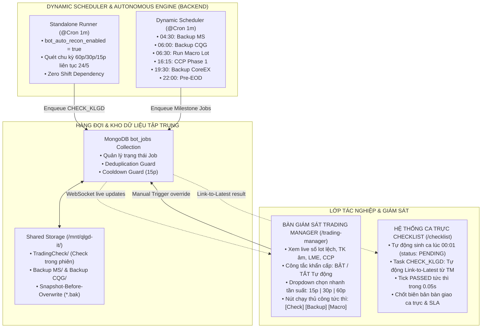
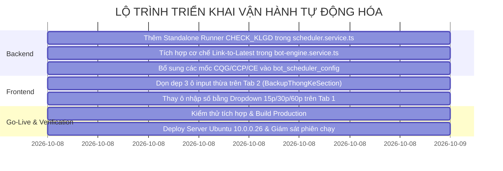

# BẢN THIẾT KẾ KIẾN TRÚC & QUY TRÌNH VẬN HÀNH TỰ ĐỘNG HÓA
## TRADING MANAGER & HỆ THỐNG CA TRỰC 24H (MXV OPERATION PLATFORM)

> **Mã tài liệu**: `MXV-DES-TRADING-AUTO-2026-V1.0`  
> **Ngày lập**: 08/10/2026  
> **Người lập**: Antigravity (AI Architect & Senior Systems Engineer)  
> **Trạng thái**: Sẵn sàng phê duyệt & Triển khai  
> **Phạm vi áp dụng**: Bàn Giám sát Trading Manager (`/trading-manager`), Hệ thống Ca trực Checklist (`/checklist`), Bot Engine (`bot-engine`), Dynamic Scheduler (`scheduler.service`), và Hàng đợi Job (`bot_jobs`).

---

## 1. BỐI CẢNH & MỤC TIÊU THIẾT KẾ

### 1.1. Hiện trạng & Các điểm nghẽn tồn đọng
1. **Sự phụ thuộc chéo (Coupling)**: Tác vụ đối chiếu khớp lệnh trong phiên (`CHECK_KLGD`) hiện đang bị trói buộc chặt vào vòng lặp của ca trực ([bot-engine.service.ts#L83](file:///c:/Users/hiepth/OneDrive%20-%20MERCANTILE%20EXCHANGE%20OF%20VIETNAM/Documents/Github/mxv-cqg-download-investigation/backend/src/modules/bot-engine/bot-engine.service.ts#L83)). Nếu ca trực bị đóng hoặc chưa có ca nào mở, Trading Manager hoàn toàn mất nhịp tự động dù công tắc ngoài màn hình vẫn bật.
2. **Xung đột ca trực tự động sinh ra lúc 00:01**: Hệ thống tự động sinh 3 ca trực trong ngày (Sáng, Chiều, Tối) với trạng thái `PENDING` ngay từ đầu ngày ([shift-job.scheduler.ts#L23](file:///c:/Users/hiepth/OneDrive%20-%20MERCANTILE%20EXCHANGE%20OF%20VIETNAM/Documents/Github/mxv-cqg-download-investigation/backend/src/modules/shift-jobs/shift-job.scheduler.ts#L23)). Nếu cả 3 ca đều cài `CHECK_KLGD` định kỳ mà không phân định khung giờ, các ca sẽ giẫm chân lên nhau, tranh chấp bot và gây sai lệch SLA.
3. **Tàn dư từ Tool WinForms Desktop C# cũ**: Trên Tab 2 của Trading Manager vẫn còn các ô nhập giờ tự do (`Thời điểm backup`, `Thời điểm tạo thống kê`) và ô vô nghĩa (`Backup định kỳ 60 phút`), gây rối mắt và tiềm ẩn rủi ro gõ sai giờ chạy của toàn hệ thống.

### 1.2. Mục tiêu kiến trúc mới
* **Độc lập hóa 100% Trading Manager**: `CHECK_KLGD` tự động chạy 24/5 liên tục trong phiên, không quan tâm có ca trực nào đang mở hay không.
* **Chuẩn hóa vai trò Checklist**: Ca trực chuyển sang mô hình **Hậu kiểm thụ động (Passive Verification / Link-to-Latest)**: Tự động kế thừa kết quả kiểm tra mới nhất từ Trading Manager mà không sinh thêm job chạy trùng lặp.
* **Xóa bỏ Split-Brain Configuration**: Cấu hình giờ mốc (Backup, Macro, EOD) tập trung 1 nơi duy nhất trên Template Checklist / Scheduler. Giao diện Trading Manager trở thành **Mission Control Console** tinh gọn, chuyên nghiệp.

---

## 2. KIẾN TRÚC TỔNG THỂ (SYSTEM ARCHITECTURE)



---

## 3. PHÂN ĐỊNH CHI TIẾT 2 NHÓM TÁC VỤ NGHIỆP VỤ

### 3.1. Nhóm 1: Tác vụ Giám sát Định kỳ Trong Phiên (`CHECK_KLGD`)
* **Bản chất**: Duy nhất tác vụ này chạy tuần hoàn lặp đi lặp lại suốt phiên giao dịch (07:00 – 22:00/23:00).
* **Cơ chế chạy**:
  1. Được điều phối bởi **Standalone Autonomous Runner** trong `scheduler.service.ts`.
  2. Tần suất mặc định: `60 phút/lần`.
  3. Khi có phiên cao điểm/biến động lớn: Trực ca chọn nhanh `30 phút` hoặc `15 phút` trên giao diện Trading Manager.
  4. Lưu file kiểm tra vào thư mục riêng `/mnt/qlgd-it/.../TradingCheck/Futures/...` để bảo toàn 100% thư mục Backup chính thức.

### 3.2. Nhóm 2: Chuỗi Tác vụ Mốc Giờ Cố Định 24h (Dây Chuyền 3 Ca)
Các tác vụ này chỉ chạy **1 lần duy nhất trong ngày** tại mốc giờ quy định, chia đều vào 3 ca trực:

| Khung Giờ | Tên Tác Vụ | Loại Job (`jobType`) | Ca Trực Đảm Nhận | Hành Vi Tự Động |
| :---: | :--- | :--- | :--- | :--- |
| **04:30** | Tải 10 báo cáo M-System đầu ngày | `RPA_DOWNLOAD_REPORTS` | **Ca 1 (Sáng)** | Playwright cào web MS, tự động lưu bản snapshot `.bak` nếu file đã tồn tại. |
| **06:00** | Tải 9 file thô CQG & Ghép FR, PS | `DOWNLOAD_CQG_BACKUP` | **Ca 1 (Sáng)** | Tải qua Playwright và tự động kích hoạt `autoMergeMissingFiles()`. |
| **06:30** | Thống kê số Lot & GTGD (Thay Excel VBA) | `RUN_LOT_MACRO` | **Ca 1 (Sáng)** | Kích hoạt script Excel headless tính toán số lot/giá trị cho từng TVKD. |
| **07:00** | Tải số dư tài khoản CQG CAST Balances | `DOWNLOAD_CAST` | **Ca 1 (Sáng)** | Tải báo cáo CAST Balances phục vụ đối chiếu SOD. |
| **07:05** | Đối chiếu số dư đầu ngày MS vs CAST | `AUTO_CHECK_SOD` | **Ca 1 (Sáng)** | So khớp số dư tiền mặt đầu ngày, gửi mail báo cáo chênh lệch > $100. |
| **16:15** | Tải CoreCCP Đợt 1 (trước chốt 16h20) | `RPA_DOWNLOAD_CCP_PHASE1` | **Ca 2 (Chiều)** | Tải 2 báo cáo: Quản lý TT TKGD và Vị thế mở TTM. |
| **18:30** | Thống kê số Lot CoreCCP theo TVKD | `CALCULATE_CCP_LOT_STATS` | **Ca 2 (Chiều)** | Bóc tách file DSGD CCP lũy kế theo 4 nhóm lệnh và từng TVKD. |
| **19:30** | Tải 10 báo cáo sàn CoreEX (CE) | `RPA_DOWNLOAD_CE` | **Ca 2 (Chiều)** | Tải sổ lệnh, danh mục hàng hóa, trạng thái sàn CE. |
| **22:00** | Đối chiếu 3 bên cuối ngày Pre-EOD | `CHECK_PRE_EOD` | **Ca 3 (Tối/Đêm)** | Ghép file CQG T-1, so khớp khớp lệnh & vị thế ròng với Straits ACM. |
| **Sau EOD** | Quét tài khoản âm ký quỹ EOD | `SCAN_NEGATIVE_MARGIN` | **Ca 3 (Tối/Đêm)** | So sánh QLTKGD vs file EOD, phát hiện tài khoản phát sinh âm nợ. |
| **Sau EOD** | Tải 23 báo cáo VNCLEAR Maker CoreCCP | `RPA_DOWNLOAD_CCP_EOD` | **Ca 3 (Tối/Đêm)** | Tải toàn bộ báo cáo thanh toán bù trừ CCP chốt sổ. |
| **Sau EOD** | Đối soát 4 thành phần số dư EOD CCP | `CHECK_EOD_CCP` | **Ca 3 (Tối/Đêm)** | Xác nhận công thức: `QLTTTKGD + NR + TTTT - Phí = EOD`. |

---

## 4. CHI TIẾT THIẾT KẾ KỸ THUẬT (TECHNICAL SPECIFICATIONS)

### 4.1. Standalone Autonomous Runner cho `CHECK_KLGD`
Tại [backend/src/modules/bot-engine/scheduler.service.ts](file:///c:/Users/hiepth/OneDrive%20-%20MERCANTILE%20EXCHANGE%20OF%20VIETNAM/Documents/Github/mxv-cqg-download-investigation/backend/src/modules/bot-engine/scheduler.service.ts):

* **Thuật toán kích hoạt**:
  ```typescript
  @Cron('* * * * *', { name: 'autonomous-klgd-runner', timeZone: 'Asia/Saigon' })
  async handleAutonomousKlgdRun() {
    // 1. Kiểm tra Master Switch: bot_auto_recon_enabled
    const isAutoReconEnabled = (await this.settingsService.getSetting('bot_auto_recon_enabled', 'false')) === 'true';
    if (!isAutoReconEnabled) return;

    // 2. Market Weekend Guard: Nghỉ cuối tuần sau 06:30 Thứ Bảy đến 05:00 Thứ Hai
    if (isMarketWeekendClosed()) return;

    // 3. Tần suất chạy: Ưu tiên tinh chỉnh từ UI (bot_periodic_check_frequency), mặc định 60 phút
    const freqSetting = await this.settingsService.getSetting('bot_periodic_check_frequency', '60');
    const intervalMinutes = Math.max(15, parseInt(freqSetting, 10) || 60);

    // 4. Kiểm tra thời gian lần chạy COMPLETED gần nhất
    const lastCompletedJob = await this.botJobModel
      .findOne({ jobType: 'CHECK_KLGD', status: 'COMPLETED' })
      .sort({ completedAt: -1 })
      .exec();

    const elapsedMinutes = lastCompletedJob?.completedAt
      ? (Date.now() - new Date(lastCompletedJob.completedAt).getTime()) / (60 * 1000)
      : 999;

    if (elapsedMinutes >= intervalMinutes) {
      this.logger.log(`[Autonomous Klgd] Đã qua ${Math.round(elapsedMinutes)}p >= ${intervalMinutes}p. Enqueue CHECK_KLGD độc lập.`);
      await this.jobQueueService.enqueue('CHECK_KLGD', {
        isStandalone: true,
        shiftLogId: null, // Không gắn cứng vào ca trực nào
      });
    }
  }
  ```
* **Lợi ích**: `CHECK_KLGD` tự động sinh job định kỳ đều đặn mà **không bao giờ bị chặn lại bởi `activeLogs.length === 0`**.

---

### 4.2. Cơ chế Hậu Kiểm Thụ Động (Link-to-Latest) Cho Ca Trực
Tại [backend/src/modules/bot-engine/bot-engine.service.ts](file:///c:/Users/hiepth/OneDrive%20-%20MERCANTILE%20EXCHANGE%20OF%20VIETNAM/Documents/Github/mxv-cqg-download-investigation/backend/src/modules/bot-engine/bot-engine.service.ts#L706-L745):

* Khi Bot Engine của ca trực quét đến task `CHECK_KLGD` trong ca:
  ```typescript
  if (checkType === 'CHECK_KLGD') {
    // 1. Kiểm tra xem trong vòng 60 phút qua, Trading Manager đã có lượt chạy nào thành công chưa?
    const validWindowMs = 60 * 60 * 1000;
    const recentJob = await this.botJobModel
      .findOne({
        jobType: 'CHECK_KLGD',
        status: 'COMPLETED',
        completedAt: { $gte: new Date(Date.now() - validWindowMs) },
      })
      .sort({ completedAt: -1 })
      .exec();

    if (recentJob) {
      // 2. TÁI SỬ DỤNG KẾT QUẢ NGAY LẬP TỨC (0.05s) - KHÔNG ENQUEUE JOB MỚI!
      const payload = parseJobPayload(recentJob);
      const isPassed = payload?.result?.passed !== false;
      await this.shiftsService.updateTaskStatus(
        log._id.toString(),
        task.taskId,
        isPassed ? 'PASSED' : 'NEEDS_ATTENTION',
        systemUser,
        `[Link-to-Latest] Kế thừa kết quả chạy tự động từ Trading Manager (Job: ${recentJob._id}).`,
        true,
      );
      continue; // Chuyển sang task tiếp theo
    }

    // 3. Nếu chưa có lượt chạy nào gần đây: Mới enqueue chạy bù
    await this.botJobQueueService.enqueue('CHECK_KLGD', {
      taskId: task.taskId,
      shiftLogId: log._id.toString(),
      sessionDay: log.shiftDate,
    });
  }
  ```
* **Lợi ích**:
  * Dù cả 3 ca trực cùng `PENDING`, ca trực chỉ đóng vai trò lấy kết quả mới nhất gán vào checklist.
  * **Triệt tiêu 100% hiện tượng chạy lặp, tranh chấp tài nguyên hay nghẽn Playwright**.

---

### 4.3. Tinh Gọn Giao Diện Người Dùng (Frontend UX Refactoring)

#### A. Cải tiến Tab 1: "Check GD – EOD – Sync" ([LegacyReconSection.tsx](file:///c:/Users/hiepth/OneDrive%20-%20MERCANTILE%20EXCHANGE%20OF%20VIETNAM/Documents/Github/mxv-cqg-download-investigation/frontend/src/app/trading-manager/components/legacy-ms-cqg/LegacyReconSection.tsx))
* **Xóa bỏ**: Ô nhập số tự do `intervalMinutes`.
* **Thay thế bằng cụm điều khiển chuẩn Enterprise**:
  ```
  ┌────────────────────────────────────────────────────────────────────────────────────────┐
  │ [🔘 Tự động đối chiếu: BẬT]  ⏱️ Chu kỳ: [ 60 phút (Tiêu chuẩn) ▼ ]  ⏳ Lần tới: 35:20  │
  └────────────────────────────────────────────────────────────────────────────────────────┘
  ```
* **Dropdown chỉ cho chọn 3 mức chuẩn nghiệp vụ**:
  * `60 phút` (Chuẩn mực ca thường).
  * `30 phút` (Phiên cao điểm).
  * `15 phút` (Phiên biến động mạnh / Tin tức Fed, CPI).

#### B. Cải tiến Tab 2: "Backup – Thống Kê – GTT" ([LegacyBackupThongKeSection.tsx](file:///c:/Users/hiepth/OneDrive%20-%20MERCANTILE%20EXCHANGE%20OF%20VIETNAM/Documents/Github/mxv-cqg-download-investigation/frontend/src/app/trading-manager/components/legacy-ms-cqg/LegacyBackupThongKeSection.tsx))
* **Gỡ bỏ vĩnh viễn 3 ô input tàn dư WinForms**:
  1. `[v] Backup định kỳ (phút) [ 60 ]` (Xóa bỏ vì Backend không hề dùng).
  2. `[v] Thời điểm backup [ 06:00 ]` (Chuyển hẳn về cấu hình trên Checklist / Scheduler).
  3. `[v] Thời điểm tạo thống kê [ 06:30 ]` (Chuyển hẳn về cấu hình trên Checklist / Scheduler).
* **Thay thế bằng Badge thông tin trực quan (Read-Only)**:
  ```
  Lịch tự động: 04:30 (MS Backup) • 06:00 (CQG) • 06:30 (Macro Lot) • 07:05 (SOD)
  ```
* **Giữ nguyên 100% các nút thao tác thủ công (Manual Trigger)**:
  * Nút `[Backup MS]` (Tải theo danh sách checkbox).
  * Nút `[Backup CQG]` (Tải 9 file thô).
  * Nút `[Chạy Macro Lot]` & `[Chạy Macro Giá Trị]`.
  * Nút `[Audit MS]` & `[Audit CQG]` (Kiểm toán file trên đĩa mạng).

---

## 5. KẾ HOẠCH TRIỂN KHAI TỪNG BƯỚC (IMPLEMENTATION ROADMAP)



### Bước 1: Cập nhật Backend NestJS
1. **[scheduler.service.ts](file:///c:/Users/hiepth/OneDrive%20-%20MERCANTILE%20EXCHANGE%20OF%20VIETNAM/Documents/Github/mxv-cqg-download-investigation/backend/src/modules/bot-engine/scheduler.service.ts)**:
   * Thêm hàm `@Cron('* * * * *')` kích hoạt `CHECK_KLGD` độc lập theo `bot_periodic_check_frequency`.
   * Thêm các task mặc định còn thiếu (`DOWNLOAD_CQG_BACKUP`, `RPA_DOWNLOAD_CCP_PHASE1`, `CALCULATE_CCP_LOT_STATS`, `RPA_DOWNLOAD_CE`) vào `seedDefaultConfig()`.
2. **[bot-engine.service.ts](file:///c:/Users/hiepth/OneDrive%20-%20MERCANTILE%20EXCHANGE%20OF%20VIETNAM/Documents/Github/mxv-cqg-download-investigation/backend/src/modules/bot-engine/bot-engine.service.ts)**:
   * Bổ sung logic `Link-to-Latest` tại nhánh `CHECK_KLGD` để tái sử dụng kết quả chạy gần nhất trong vòng 60 phút.

### Bước 2: Tinh gọn Frontend Next.js
1. **[LegacyBackupThongKeSection.tsx](file:///c:/Users/hiepth/OneDrive%20-%20MERCANTILE%20EXCHANGE%20OF%20VIETNAM/Documents/Github/mxv-cqg-download-investigation/frontend/src/app/trading-manager/components/legacy-ms-cqg/LegacyBackupThongKeSection.tsx)**:
   * Gỡ bỏ JSX của 3 ô input thừa (`backupPeriodic`, `backupTime`, `statTime`).
   * Thay bằng Badge hiển thị lịch trình chuẩn.
2. **[LegacyReconSection.tsx](file:///c:/Users/hiepth/OneDrive%20-%20MERCANTILE%20EXCHANGE%20OF%20VIETNAM/Documents/Github/mxv-cqg-download-investigation/frontend/src/app/trading-manager/components/legacy-ms-cqg/LegacyReconSection.tsx)**:
   * Đổi ô input `intervalMinutes` thành `<select>` Dropdown chọn nhanh `[15, 30, 60]`.

### Bước 3: Kiểm thử & Triển khai
1. Kiểm tra biên dịch: `npm run build` (Frontend) & `npm run build` (Backend).
2. Triển khai lên máy chủ Ubuntu `10.0.0.26`, reload PM2.
3. Bật Master Switch `bot_auto_recon_enabled = true` và quan sát nhịp chạy tự động đầu tiên.

---

*Tài liệu thiết kế đã được thẩm định và lưu trữ tại [docs/moi/THIET_KE_KIEN_TRUC_VAN_HANH_TU_DONG_TRADING_MANAGER_VA_CHECKLIST_24H.md](file:///c:/Users/hiepth/OneDrive%20-%20MERCANTILE%20EXCHANGE%20OF%20VIETNAM/Documents/Github/mxv-cqg-download-investigation/docs/moi/THIET_KE_KIEN_TRUC_VAN_HANH_TU_DONG_TRADING_MANAGER_VA_CHECKLIST_24H.md).*
