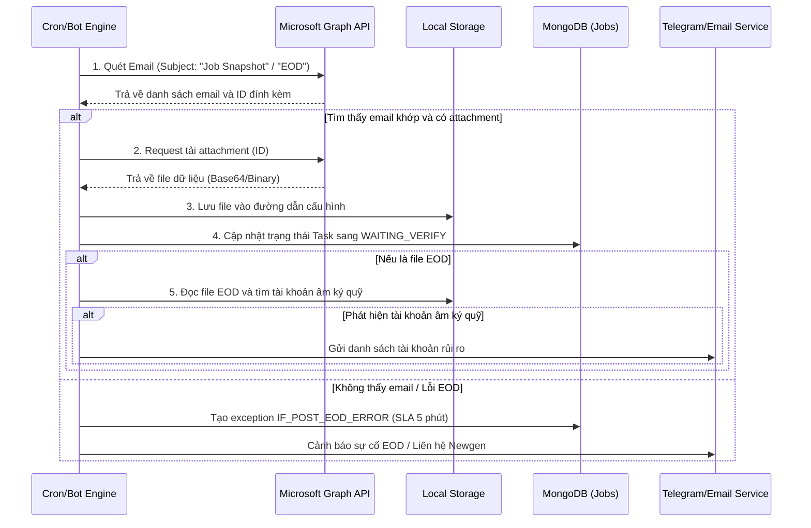

# Kế hoạch tích hợp Microsoft Graph API & Tự động hóa Post-EOD

Kế hoạch này chi tiết hóa cách cấu hình và triển khai hệ thống tự động:
1. Đọc và quét hòm thư Outlook 365 (qua Microsoft Graph API) để tìm Email Job Snapshot Đầu Ngày và Email Báo cáo EOD.
2. Tải các tệp tin đính kèm từ Email về thư mục đích cấu hình trước.
3. Thực hiện hậu kiểm sau EOD (Post-EOD): Kiểm tra số dư và lập danh sách các tài khoản bị âm ký quỹ đầu ngày để gửi cảnh báo.
4. Xử lý ngoại lệ khi xảy ra lỗi EOD (phối hợp với Newgen để chạy lại).

---

## User Review Required

> [!IMPORTANT]
> **Các yêu cầu về phân quyền và hạ tầng cần chuẩn bị:**
> 1. **Đăng ký ứng dụng Microsoft Azure (App Registration)**:
>    - Cần tạo một App Registration trên Azure Portal của doanh nghiệp để lấy `client_id`, `client_secret`, và `tenant_id`.
>    - Yêu cầu cấp quyền API dạng **Application Permission** (không cần người dùng tương tác đăng nhập): `Mail.Read` hoặc `Mail.Read.Shared` (nếu hòm thư nhận mail là hòm thư chung/shared mailbox).
> 2. **Đường dẫn thư mục lưu trữ (Download Destination)**:
>    - Xác định đường dẫn thư mục đích trên Server hoặc phân vùng mạng chia sẻ (Shared Folder) để Bot lưu trữ các file báo cáo EOD tải về (ví dụ: `C:\Quanlygiaodich\Reports\${YYYY}-${MM}-${DD}`).
> 3. **Mẫu thông tin (Template) email**:
>    - Sau khi bạn cung cấp mẫu (form email, cấu trúc tiêu đề, nội dung mẫu của email Job Snapshot và file EOD) vào ngày mai, chúng ta sẽ cấu hình chính xác các bộ lọc (filter) để Bot nhận diện email chuẩn xác nhất.

---

## Open Questions

> [!WARNING]
> 1. **Cách thức Cảnh báo tài khoản âm ký quỹ**:
>    - Khi Bot quét ra danh sách các tài khoản bị âm ký quỹ đầu ngày, hệ thống nên gửi thông báo qua kênh nào? (Gửi qua nhóm Telegram nội bộ, gửi Email cảnh báo hay chỉ hiển thị trên giao diện Dashboard Web Checklist?).
> 2. **Xử lý khi phát hiện lỗi dữ liệu (Error Flow)**:
>    - Khi EOD thất bại hoặc dữ liệu lỗi (phát sinh exception `IF_POST_EOD_ERROR`), ngoài việc tạo Exception trên Web Checklist và bắt đầu đếm ngược SLA 5 phút, hệ thống có cần tự động gửi email/tin nhắn thông báo trực tiếp cho đầu mối kỹ thuật của bên Newgen không?

---

## Proposed Changes

Chúng ta sẽ triển khai và cập nhật các module ở Backend NestJS để hiện thực hóa nghiệp vụ này.

### Component: Backend Mail & Post-EOD Logic

#### [MODIFY] [email-watcher.service.ts](file:///d:/sontayweb/mxv-shift-checklist/backend/src/modules/bot-engine/email-watcher.service.ts)
*   **Thêm tính năng Tải file đính kèm (Attachment Downloader)**:
    *   Viết hàm `downloadEmailAttachments(messageId: string, targetDirectory: string)` để gọi tới endpoint `https://graph.microsoft.com/v1.0/users/{user}/messages/{messageId}/attachments`.
    *   Tự động giải mã nội dung file đính kèm dạng Base64 và lưu trực tiếp thành file vật lý xuống thư mục đích đã chỉ định.
*   **Mở rộng bộ lọc email**:
    *   Hỗ trợ lọc chính xác theo cấu trúc tiêu đề (Subject Pattern) và định dạng file đính kèm (ví dụ: chỉ tải các file `.xlsx` hoặc `.csv`).

#### [MODIFY] [bot-job-queue.service.ts](file:///d:/sontayweb/mxv-shift-checklist/backend/src/modules/bot-engine/bot-job-queue.service.ts)
*   **Thêm Job Type mới: `POST_EOD_EMAIL_CHECK`**:
    *   Định kỳ chạy quét email kiểm tra Job Snapshot đầu ngày và EOD thành công.
    *   Khi tải thành công, tự động gọi Service phân tích tệp tin EOD.
*   **Thêm Job Type mới: `CHECK_NEGATIVE_MARGIN`**:
    *   Đọc file Excel/CSV báo cáo EOD đã được tải về.
    *   Lọc cột "Ký quỹ đầu ngày" hoặc "Ký quỹ khả dụng" để tìm các tài khoản có giá trị `< 0`.
    *   Tổng hợp danh sách tài khoản vi phạm.

#### [NEW] [post-eod-handler.service.ts](file:///d:/sontayweb/mxv-shift-checklist/backend/src/modules/bot-engine/post-eod-handler.service.ts)
*   Chứa logic nghiệp vụ sau EOD:
    *   Quy trình phối hợp Newgen: Khi phát hiện dữ liệu lỗi hoặc không nhận được email EOD thành công đúng giờ $\rightarrow$ Tự động kích hoạt Exception `IF_POST_EOD_ERROR` trên hệ thống và đếm ngược SLA.
    *   Cung cấp API để nhân viên trực ca bấm nút **"Xác nhận đã xử lý lỗi với Newgen"** nhằm đóng Exception và ghi lại log lịch sử.

---

## Verification Plan

### Automated Tests
1. **Kiểm thử Mock Graph API**:
   - Sử dụng dữ liệu email giả lập trong file `mock-emails.json` có chứa mock attachments.
   - Kiểm tra xem Bot có đọc được nội dung và giải mã file ghi xuống thư mục `/temp` chính xác hay không.
2. **Kiểm thử logic âm ký quỹ**:
   - Chuẩn bị 1 file Excel báo cáo EOD giả lập chứa 3 tài khoản âm ký quỹ và 5 tài khoản dương ký quỹ.
   - Chạy hàm quét của Bot và xác nhận kết quả trả về đúng 3 tài khoản bị âm.

### Manual Verification
1. Cấu hình hòm thư Outlook thử nghiệm trên môi trường Staging.
2. Gửi một email chứa file đính kèm mẫu theo định dạng ngày hôm nay.
3. Kiểm tra xem hệ thống có tự động phát hiện, tải file về đúng thư mục chỉ định, và gửi tin nhắn cảnh báo tài khoản âm lên nhóm Telegram test hay không.
