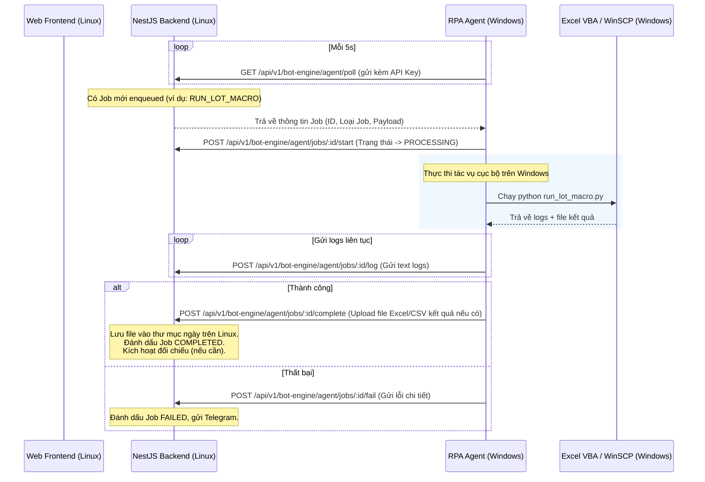

# Kế hoạch Triển khai Hệ thống Checklist Trực ca MXV (Hybrid Deployment: Core Linux + RPA Windows)

Tài liệu này đề xuất phương án và thiết kế chi tiết để triển khai hệ thống **MXV Shift Checklist** theo mô hình lai (Hybrid):
1. **Core Server (Web + API + DB)** được triển khai trên **Linux Server (Docker Compose)** để tối ưu chi phí, hiệu năng và tính ổn định.
2. **RPA Agent** được cài đặt dưới dạng một dịch vụ chạy ngầm trên **Windows PC/Server** (máy đang chạy Tool IT cũ) để thực thi các tác vụ đặc thù của Windows như Excel VBA Macros (`.xlsm`), tương tác tệp tin SFTP nội bộ, và chạy Playwright tải báo cáo.

---

## User Review Required

> [!IMPORTANT]
> **Các điểm thiết kế chính cần xác nhận:**
> 1. **Cơ chế truyền thông (Polling vs WebSockets)**: RPA Agent chạy trên Windows sẽ giao tiếp với Core Backend trên Linux thông qua **HTTP REST Polling** (chu kỳ 5-10 giây) hoặc **WebSockets**. REST Polling được đề xuất làm mặc định vì tính đơn giản, dễ debug, tránh được các vấn đề ngắt kết nối mạng chập chuẩn của mạng nội bộ và dễ cấu hình qua tường lửa.
> 2. **Bảo mật API**: Thêm một biến môi trường `RPA_AGENT_API_KEY` trong file cấu hình của cả Linux Backend và Windows Agent để xác thực các request từ Agent lên server, đảm bảo an toàn dữ liệu.
> 3. **Thay đổi cấu hình Thư mục (Paths)**: Khi Backend chạy trên Linux, quản trị viên cần vào giao diện **Settings** trên Web để cập nhật các đường dẫn thư mục sao lưu từ định dạng Windows (`C:\Quanlygiaodich\...`) sang định dạng Linux (ví dụ `/app/backup/ms`). Khi RPA Agent tải tệp tin và hoàn thành công việc, nó sẽ upload tệp tin đó lên Linux Backend và Backend sẽ lưu tệp tin vào đúng cấu trúc thư mục ngày trên Linux.

---

## Open Questions

> [!WARNING]
> 1. **Cơ chế xử lý Captcha thủ công**: Một số tác vụ (như đăng nhập ACM) yêu cầu người dùng giải Captcha thủ công từ Web UI khi Gemini AI tự động giải thất bại. Ở kiến trúc cũ, Playwright chạy trực tiếp trên Backend NodeJS và treo Promise để chờ. Ở kiến trúc mới, Playwright chạy trên Windows RPA Agent. Chúng ta cần bổ sung thêm trạng thái `AWAITING_CAPTCHA` và gửi ảnh captcha base64 từ RPA Agent lên Linux Backend, lưu vào DB để hiển thị trên UI. Khi người trực ca nhập mã, Backend sẽ lưu vào DB để RPA Agent lấy về và điền tiếp. Bạn có đồng ý với thiết kế này không?
> 2. **Dịch vụ WinSCP**: Tác vụ đồng bộ SFTP sử dụng CLI của `WinSCP.com`. Do chạy trên Windows RPA Agent, Agent cần đảm bảo có cài đặt WinSCP và cấu hình đúng biến môi trường hệ thống (PATH) để gọi được lệnh `WinSCP.com`.

---

## Proposed Changes

Chúng ta sẽ tạo một thư mục triển khai tập trung tên là `deployment/` ở thư mục gốc của project, đồng thời sửa đổi mã nguồn Backend NestJS để hỗ trợ chế độ Remote Agent.

---

### Component 1: Linux Server Deployment (Core Web + API + DB)

Tạo các file docker hóa để deploy toàn bộ cụm Core lên Linux.

#### [NEW] [docker-compose.yml](file:///d:/sontayweb/mxv-shift-checklist/deployment/docker-compose.yml)
Định nghĩa dịch vụ:
- `mongodb`: Cơ sở dữ liệu lưu trạng thái ca trực, checklist và logs.
- `backend`: NestJS API Server chạy cổng 3001, volume lưu các file upload/backup đối chiếu.
- `frontend`: Next.js Web App chạy cổng 3000.
- `nginx`: Reverse proxy điều hướng traffic cổng 80/443.

#### [NEW] [Dockerfile.backend](file:///d:/sontayweb/mxv-shift-checklist/deployment/Dockerfile.backend)
Dockerfile đa giai đoạn (multi-stage build) để biên dịch và chạy NestJS trên môi trường Alpine Linux siêu gọn nhẹ.

#### [NEW] [Dockerfile.frontend](file:///d:/sontayweb/mxv-shift-checklist/deployment/Dockerfile.frontend)
Dockerfile build bundle Next.js tối ưu cho Production.

#### [NEW] [nginx.conf](file:///d:/sontayweb/mxv-shift-checklist/deployment/nginx.conf)
Cấu hình chuyển tiếp request:
- `/api/` -> `backend:3001`
- `/` -> `frontend:3000`

---

### Component 2: Windows RPA Agent (Lightweight Python Service)

Tạo agent chạy trực tiếp trên Windows của IT để nhận lệnh và thực thi cục bộ.

#### [NEW] [agent.py](file:///d:/sontayweb/mxv-shift-checklist/deployment/rpa-agent/agent.py)
Script Python chính thực hiện:
- Poll jobs định kỳ từ API Linux.
- Thực thi các job loại `RUN_LOT_MACRO`, `RUN_VALUE_MACRO`, `DOWNLOAD_CAST`, `FILE_AUDIT_ACM`, `FILE_AUDIT_MS`, `FILE_AUDIT_CQG` sử dụng chính các script Python sẵn có (`run_lot_macro.py`...) và Playwright Windows.
- Báo cáo nhịp tim (Heartbeat) định kỳ để Backend hiển thị trạng thái Agent (Online/Offline) trên Web.
- Gửi logs thời gian thực và upload tệp tin tải về lên Linux Backend thông qua API dạng multipart/form-data.
- Hỗ trợ giải Captcha thủ công qua luồng truyền tin trạng thái `AWAITING_CAPTCHA`.

#### [NEW] [config.json](file:///d:/sontayweb/mxv-shift-checklist/deployment/rpa-agent/config.json)
Cấu hình URL API Linux, API Key, và các đường dẫn file macro/backup cục bộ trên máy Windows.

#### [NEW] [requirements.txt](file:///d:/sontayweb/mxv-shift-checklist/deployment/rpa-agent/requirements.txt)
Thư viện Python cần thiết: `requests`, `playwright`, `pywin32` (nếu cần điều phối COM).

#### [NEW] [setup_agent.bat](file:///d:/sontayweb/mxv-shift-checklist/deployment/rpa-agent/setup_agent.bat)
Tự động cài đặt dependencies, khởi tạo Playwright cho Windows (`playwright install chromium`), và cấu hình chạy ngầm Agent bằng Windows Task Scheduler hoặc PM2 cho Windows.

---

### Component 3: Backend REST APIs & Decoupled Execution (NestJS)

Điều chỉnh mã nguồn NestJS để hỗ trợ chế độ điều phối RPA Agent từ xa.

#### [MODIFY] [bot-engine.controller.ts](file:///d:/sontayweb/mxv-shift-checklist/backend/src/modules/bot-engine/bot-engine.controller.ts)
Thêm các endpoints quản trị Agent (bảo vệ bằng API Key):
- `POST /api/v1/bot-engine/agent/heartbeat`: Nhận thông tin heartbeat từ Agent để giám sát sức khỏe.
- `GET /api/v1/bot-engine/agent/poll`: Lấy job PENDING tiếp theo phù hợp.
- `POST /api/v1/bot-engine/agent/jobs/:id/start`: Chuyển trạng thái sang PROCESSING.
- `POST /api/v1/bot-engine/agent/jobs/:id/log`: Nhận log từ Agent và append vào log database.
- `POST /api/v1/bot-engine/agent/jobs/:id/complete`: Nhận file upload từ Agent, lưu file vào thư mục đích trên Linux Server, hoàn thành job.
- `POST /api/v1/bot-engine/agent/jobs/:id/fail`: Đánh dấu job thất bại với log lỗi.
- `POST /api/v1/bot-engine/agent/jobs/:id/captcha`: Cập nhật hình ảnh captcha hoặc lấy kết quả giải captcha.
- `GET /api/v1/bot-engine/agent/status`: Endpoint cho Web UI kiểm tra trạng thái Agent (IP, Last active, OS).

#### [MODIFY] [bot-job-queue.service.ts](file:///d:/sontayweb/mxv-shift-checklist/backend/src/modules/bot-engine/bot-job-queue.service.ts)
- Đọc biến cấu hình `RPA_AGENT_MODE=remote` (mặc định sẽ là `local` nếu chạy trên Windows cũ).
- Trong `processQueue()`, nếu chạy ở chế độ `remote`:
  - Bỏ qua việc tự chạy cục bộ các job của trình duyệt / macro (như `RUN_LOT_MACRO`, `DOWNLOAD_CAST`, `FILE_AUDIT_ACM`...) để nhường cho RPA Agent lấy về chạy.
  - Vẫn tự động xử lý các job tính toán thuần túy như đối chiếu số dư (`AUTO_CHECK_SOD`, `CHECK_PRE_EOD`, `CHECK_EOD_MM`) ngay trên Linux Server khi các tệp tin liên quan đã được Agent tải lên đầy đủ.
- Cập nhật hàm lưu file khi nhận dữ liệu upload từ Agent để khớp với cấu trúc thư mục ngày trên Linux.

---

## Verification Plan

### Automated Tests (Giả lập UAT)
1. **Kiểm tra API Agent**: Chạy thử các request HTTP curl để mô phỏng luồng của Agent: heartbeat, poll job, gửi logs và upload file.
2. **Kiểm tra Chế độ Remote**: Enqueue một job `RUN_LOT_MACRO` trên Backend Linux, xác nhận Backend không tự spawn tiến trình nội bộ mà giữ ở trạng thái `PENDING` và xuất hiện trong kết quả API `poll`.

### Manual Verification
1. **Chạy thử RPA Agent trên Windows**: Khởi chạy script Python `agent.py`, kiểm tra kết nối thành công tới Backend Linux.
2. **End-to-End Flow**:
   - Trực ca bấm nút "Chạy Macro" trên UI Web (Linux).
   - Xác nhận Windows RPA Agent nhận được Job, tự động mở Excel Macro cục bộ và chạy thành công.
   - Xác nhận logs từ Windows được gửi thời gian thực lên giao diện Web Checklist Linux.
   - Xác nhận tệp kết quả được upload từ Windows lên Linux, lưu vào thư mục `/app/backup/` và kích hoạt thành công tiến trình đối soát SOD/EOD tự động trên Linux Backend.
