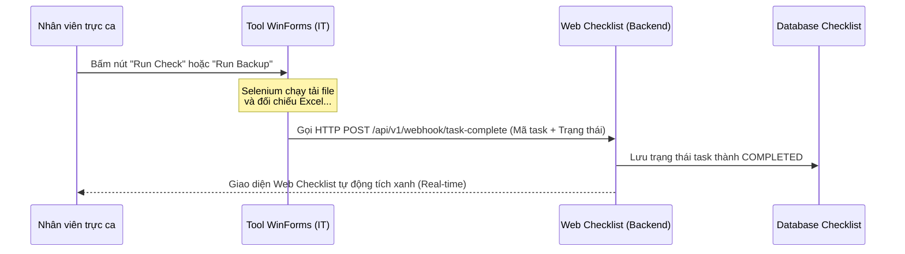

# ĐỀ XUẤT PHƯƠNG ÁN TÍCH HỢP HỆ THỐNG CHECKLIST VỚI BỘ TOOL WINFORMS CỦA IT

Tài liệu này phân tích bản chất kỹ thuật của 4 tool WinForms hiện tại của IT và đề xuất giải pháp kết hợp tối ưu nhất để hệ thống Checklist tự động hóa ca trực.

---

## 1. Phân Tích Bản Chất Kỹ Thuật Của Các Tool IT Hiện Tại

Qua phân tích mã nguồn C# của các tool, chúng tôi nhận thấy các tool này thực tế hoạt động như sau:

* **Tự động hóa trình duyệt (RPA với Selenium):** 
  * File `ChromeBot.cs` cấu hình chạy trình duyệt Chrome ẩn danh để tự động truy cập M-System và hệ thống CQG Cast.
  * Bot tự điền thông tin đăng nhập, **giải quyết khâu nhập mã PIN bảo mật ảo bằng cách click tuần tự trên màn hình PIN ảo** (hàm `EnterPinAsync`).
  * Bot tự động tải hàng loạt file Excel báo cáo (DSGD, TTM, TTTT, QLTKGD, FR1, OP1...) về máy trạm.
* **Đối chiếu số liệu Excel:**
  * File `TransactionCheckingService.cs` và `MarginChecking.cs` dùng thư viện `OfficeOpenXml` để đọc trực tiếp dữ liệu từ các file Excel vừa tải về.
  * Thực hiện tính toán đối chiếu chênh lệch khối lượng giao dịch giữa M-System, CQG và ACM (hàm `CheckKLGD`), hoặc kiểm tra chênh lệch số dư EOD.
* **Gửi báo cáo & Log:**
  * Sau khi đối chiếu xong, tool tự động soạn HTML Table và gửi Email kết quả qua giao thức SMTP (`Mailer.cs` / `MailService.cs`).
  * Xuất các file Excel đối chiếu thành phẩm vào thư mục lưu trữ (định dạng theo ngày `YYYY\TMM.YYYY\DD.MM`).

---

## 2. Đề Xuất 3 Phương Án Tích Hợp Chi Tiết

Dưới đây là 3 cách để kết hợp các tool WinForms này với Web Checklist của bạn:

### PHƯƠNG ÁN A: WinForms Tự Động Báo Cáo Kết Quả Cho Checklist (Real-time Webhook) - KHUYÊN DÙNG

* **Cách hoạt động:** WinForms vẫn chạy độc lập trên máy nhân viên như cũ. Nhưng khi chạy xong thành công một tác vụ (ví dụ: Backup thành công hoặc đối chiếu Không Lệch), WinForms sẽ tự gửi một API Call (HTTP POST) báo cho Web Checklist để tự động tích xanh nhiệm vụ đó.
* **Sơ đồ luồng:**


* **Đoạn code C# mẫu để bạn gửi cho IT chèn vào cuối các Service (ví dụ: `BackupService.cs` hoặc `TransactionCheckingService.cs`):**
```csharp
// Thêm thư viện gọi API
using System.Net.Http;
using System.Text;

public static async Task NotifyChecklistAsync(string taskId, string status, string details = "")
{
    try
    {
        using (var client = new HttpClient())
        {
            // Thiết lập địa chỉ API của Web Checklist
            string url = "http://checklist.mxv.vn/api/v1/webhook/task-status";
            
            var payload = new
            {
                taskId = taskId,       // Ví dụ: "TASK_009"
                status = status,       // "SUCCESS" hoặc "FAILED"
                operatorName = Environment.UserName,
                details = details      // Log lỗi nếu có
            };
            
            string json = Newtonsoft.Json.JsonConvert.SerializeObject(payload);
            var content = new StringContent(json, Encoding.UTF8, "application/json");
            
            HttpResponseMessage response = await client.PostAsync(url, content);
            if (response.IsSuccessStatusCode)
            {
                Console.WriteLine("Đã cập nhật trạng thái lên Checklist thành công.");
            }
        }
    }
    catch (Exception ex)
    {
        Console.WriteLine($"Không thể kết nối tới Checklist API: {ex.Message}");
    }
}
```

---

### PHƯƠNG ÁN B: Tích Hợp Không Xâm Lấn (Quét File Log / Shared Folder)

* **Cách hoạt động:** Đội IT không cần sửa bất kỳ dòng code nào trong WinForms. 
* **Luồng chạy:**
  1. Khi WinForms chạy xong, nó sẽ xuất file Excel kết quả đối chiếu vào thư mục lưu trữ nội bộ (Shared Folder) hoặc gửi Email báo cáo (như email báo lệch/không lệch sẵn có).
  2. Bot ngầm của Web Checklist (viết bằng NestJS) sẽ định kỳ quét thư mục Shared Folder đó (sử dụng thư viện đọc Excel của Node.js) hoặc đọc hòm thư ca trực thông qua Microsoft Graph API.
  3. Nếu phát hiện file Excel của ngày hôm nay đã được tạo và nội dung không có cảnh báo lệch -> Tự động chuyển trạng thái Task trên Checklist sang `COMPLETED`.
* **Ưu điểm:** IT hoàn toàn không phải tham gia vào việc sửa tool. Bạn tự chủ động 100%.

---

### PHƯƠNG ÁN C: Chuyển WinForms Thành Windows Service (Chạy ngầm hoàn toàn)

* **Cách hoạt động:** Đội IT đóng gói phần logic (Services) của WinForms thành một **Windows Service** chạy nền trên Server hoặc một máy ảo cố định.
* **Luồng chạy:**
  1. Nhân viên trực ca vào Web Checklist, bấm nút **[Kích hoạt Check GD]** hoặc **[Chạy Backup]**.
  2. Web Backend của Checklist gửi tín hiệu điều khiển tới Windows Service của IT.
  3. Windows Service tự động mở Chrome (Headless mode - không hiển thị màn hình) thực hiện login M-System, tải file, đối chiếu và trả kết quả ngược lại cho Web Checklist.
* **Đánh giá:** Đây là giải pháp tự động hóa triệt để nhất (RPA tập trung), nhân viên không cần phải tự mở tool WinForms lên bấm tay nữa. Tuy nhiên yêu cầu đội IT phải cấu hình hạ tầng máy chủ chạy bot riêng.

---

## 3. Khuyên Dùng Cho Dự Án

* **Giai đoạn đầu (Quick Wins):** Sử dụng **Phương án B (Quét File Log / Quét Email)**. Bạn chỉ cần viết script Node.js quét các file Excel trong thư mục lưu trữ mà tool WinForms xuất ra. Không cần phụ thuộc vào IT.
* **Giai đoạn tiếp theo:** Thỏa thuận với IT áp dụng **Phương án A (Tích hợp API)**. Việc này rất nhẹ nhàng cho IT, họ chỉ cần bổ sung hàm gửi request HTTP (như code mẫu ở trên) vào cuối mỗi hành động trong WinForms.
