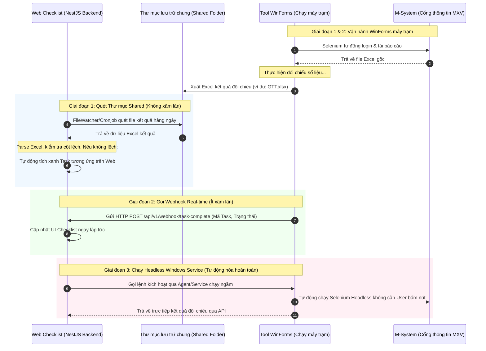

# TÀI LIỆU PHÂN TÍCH LOGIC & HƯỚNG DẪN SỬ DỤNG BỘ CÔNG CỤ IT WINFORMS (IT-TOOL-SRC)

Tài liệu này cung cấp cái nhìn chi tiết về cấu trúc mã nguồn, logic xử lý nghiệp vụ, cách thức cấu hình, vận hành và các phương án tích hợp bộ công cụ WinForms (`it-tool-src`) vào hệ thống Web Shift Checklist (Checklist ca trực) của Sở Giao dịch Hàng hóa Việt Nam (MXV).

---

## I. TỔNG QUAN BỘ CÔNG CỤ IT WINFORMS

Bộ công cụ WinForms nằm trong thư mục `it-tool-src` bao gồm 4 ứng dụng nghiệp vụ chính phục vụ công tác giám sát, đối chiếu giao dịch, tính toán ký quỹ và lập báo cáo hàng ngày của Khối Vận hành Giao dịch (VHGD):

| Tên Công Cụ | Các Service Chính | Dữ Liệu Đầu Vào (File Input) | Dữ Liệu Đầu Ra (Output & Alerts) | Mục Tiêu Nghiệp Vụ |
| :--- | :--- | :--- | :--- | :--- |
| **`operate-transaction-app`** | `TransactionCheckingService`<br>`BackupService`<br>`MailService`<br>`ChromeBot` | - Báo cáo từ M-System (DSGD, TTM, TTTT, QLTKGD)<br>- Báo cáo CQG (FR, PS, OP, OD)<br>- Dữ liệu ACM (Nano) | - Mail cảnh báo lệch KLGD, EOD, CQG Balance<br>- File Excel đối chiếu thành phẩm (`ddMMyyyy_HHmm`) | Tự động hóa tải báo cáo, đối chiếu khối lượng giao dịch, số dư tài khoản EOD và đồng bộ CQG. |
| **`margin-checker`** | `MarginChecking`<br>`ChromeBot`<br>`MailService` | - Báo cáo quản lý tài khoản ký quỹ (QLTKGD) | - Mail cảnh báo vi phạm tỷ lệ ký quỹ khả dụng | Tải dữ liệu ký quỹ, tính toán tỷ lệ ký quỹ động và gửi email cảnh báo các tài khoản vi phạm. |
| **`CCP-Statistics-Tool`** | `ExcelDataService` | - Các file dữ liệu thanh toán bù trừ (DSGD, DSTKGD, NR, TTM, TTTT) | - Báo cáo thống kê tổng hợp CCP | Tổng hợp dữ liệu giao dịch CCP, gom nhóm theo thành viên và hàng hóa, xử lý tệp dữ liệu lớn. |
| **`trading-report-app`** | `ReportService` | - Báo cáo giao dịch định kỳ (Tháng, Quý, TTTT) | - Các file báo cáo Excel định dạng chuẩn để gửi các bên | Xuất báo cáo tăng trưởng giao dịch theo tháng/quý, báo cáo trạng thái tất toán và quy đổi ngoại tệ. |

---

## II. KIẾN TRÚC HOẠT ĐỘNG CHUNG (RPA & ETL FLOW)

Các ứng dụng WinForms này chia sẻ chung một quy trình xử lý dữ liệu tự động hóa gồm 3 giai đoạn:

```mermaid
flowchart TD
    subgraph Giai đoạn 1: RPA (Tải dữ liệu)
        A[ChromeBot - Selenium] -->|1. Đăng nhập M-System & CQG| B(Virtual PIN Keypad Clicker)
        B -->|2. Tải CSV / Excel| C[Thư mục tạm /reports]
    end
    subgraph Giai đoạn 2: ETL & Calculations (Xử lý & Đối chiếu)
        C -->|3. Đọc dữ liệu| D[ExcelDataReader / EPPlus]
        D -->|4. Áp dụng quy tắc nghiệp vụ| E{Đối chiếu & Tính toán}
    end
    subgraph Giai đoạn 3: Output & Notification (Xuất bản)
        E -->|5. Tạo file thành phẩm| F[Thư mục lưu trữ định dạng ngày YYYY/TMM.YYYY/DD.MM]
        E -->|6. Phát hiện lệch / Cảnh báo| G[SMTP Mailer - HTML Report Email]
    end
end
```

### 1. Logic Vượt PIN Bảo Mật Ảo (Virtual PIN Bypass)
Trong file `ChromeBot.cs`, khi đăng nhập vào hệ thống M-System, bot phải vượt qua bàn phím mã PIN ảo (để bảo mật tránh keylogger). Thay vì nhập chuỗi ký tự thông thường, bot thực hiện:
* Tìm phần tử bàn phím PIN hiển thị trên màn hình.
* Duyệt từng ký tự trong chuỗi mã PIN (`pin` cấu hình trong `loginConfig.json`).
* Xác định phần tử số tương ứng bằng XPath: `.//div[text()='{pinDigit}']` hoặc click trực tiếp theo tọa độ phần tử.
* Thực hiện gọi hàm `Click()` qua driver Selenium để giả lập hành vi click chuột của con người.
* Chờ giao diện chính tải xong (xác nhận bằng sự xuất hiện của nhãn `"Ngày phiên hiện tại:"`).

### 2. Quản Lý Bộ Nhớ Khi Xử Lý File Excel Lớn (Garbage Collection Control)
Trong `CCP-Statistics-Tool` (`ExcelDataService.cs`), do phải làm việc với các file báo cáo lớn chứa hàng trăm nghìn dòng giao dịch, ứng dụng sử dụng:
* **`ExcelDataReader`**: Thư viện đọc dạng stream tốc độ cao, tiêu tốn cực ít bộ nhớ RAM so với việc nạp toàn bộ DOM Excel.
* **`GC.Collect()` & `GC.WaitForPendingFinalizers()`**: Ép hệ thống giải phóng bộ nhớ RAM ngay lập tức sau khi xử lý xong từng file Excel lớn, tránh hiện tượng rò rỉ bộ nhớ (Memory Leak) dẫn tới treo ứng dụng.

---

## III. PHÂN TÍCH CHI TIẾT LOGIC NGHIỆP VỤ TỪNG CÔNG CỤ

### 1. operate-transaction-app (Ứng dụng Vận hành chính)
Đây là công cụ quan trọng nhất của ca trực, tích hợp đầy đủ các logic kiểm tra chênh lệch số liệu.

#### a. Kiểm tra chênh lệch Khối lượng Giao dịch (`CheckKLGD`)
Hàm đối chiếu khối lượng giao dịch giữa các nguồn dữ liệu khác nhau để phát hiện khớp thiếu/lệch lệnh:
* **Nguồn dữ liệu đối chiếu**:
  * **M-System (`DSGD.xlsx`)**: Phân tách thành 2 nhóm:
    * Tài khoản thường: Tính tổng khối lượng giao dịch `totalDSGD` (bỏ qua các tài khoản kết thúc bằng ký tự `"A"`).
    * Tài khoản nội bộ/giao dịch chênh lệch (ACM): Tính tổng khối lượng `totalACM` (tài khoản kết thúc bằng chữ `"A"`).
  * **CQG (`FR1.xlsx`, `FR2.xlsx`)**: Đọc từ CQG report (loại trừ mã sản phẩm `"ZWAZCE"`). Tính tổng khối lượng `totalFR`.
  * **ACM (`Nano`)**: Đọc khối lượng giao dịch hợp đồng Micro/Nano tự doanh. Tính tổng `totalNano`.
* **Quy tắc so khớp chênh lệch**:
  * So sánh: `differ = |totalFR - totalDSGD|`. Nếu `differ > 0`, ghi nhận lệch CQG.
  * So sánh: `differACM = |totalNano - totalACM|`. Nếu `differACM > 0`, ghi nhận lệch ACM.
  * Bot tự động quét chéo: tìm các dòng mã giao dịch có trong `FR` nhưng thiếu trong `DSGD`, hoặc có trong `DSGD` nhưng thiếu trong `FR` để đưa vào bảng chi tiết lệch (`detailOrderData`).
* **Cảnh báo**: Gửi mail SMTP với tiêu đề bắt đầu bằng trạng thái tương ứng: `LỆCH CQG ...`, `LỆCH ACM ...` hoặc `KHÔNG LỆCH – MXV VHGD – Kiểm tra chênh lệch khối lượng giao dịch`.

#### b. Đối chiếu số dư sau khi chạy EOD (`CheckEOD`)
Chạy cuối ngày (End-Of-Day) để đảm bảo số dư tài khoản của khách hàng khớp chính xác giữa hệ thống lõi M-System và báo cáo kế toán.
* **Công thức tính toán lại số dư**:
  $$ResultBalance = OpeningBalance + DepositWithdrawal - TradingFee - SettlementFee + (OptionPremium + UsdProfit) \times UsdRate + JpyProfit \times JpyRate + MyrProfit \times MyrRate$$
  * *Lưu ý*: Tỷ giá USD, JPY, MYR được áp dụng động tùy thuộc vào việc tài khoản phát sinh lãi hay lỗ (lãi dùng tỷ giá mua, lỗ dùng tỷ giá bán để đảm bảo tính an toàn tài chính).
* **Quy tắc so khớp**: So sánh số dư tính toán lại ($ResultBalance$) với số dư thực tế ghi nhận trên báo cáo EOD của tài khoản ($EodBalance$). Nếu chênh lệch $\ge 1,000$ VNĐ, tài khoản sẽ bị đưa vào danh sách lệch (`eodResult`).
* **Cảnh báo số dư âm**: Phát hiện các tài khoản bị âm ký quỹ khả dụng mới phát sinh (`NegativeIMRAcc`) để gửi mail kèm file Excel chi tiết đính kèm.

#### c. Đối chiếu số dư CQG EOD (`CheckEODCQG`)
Kiểm tra tính đồng bộ số dư ký quỹ giữa M-System và cổng giao dịch CQG:
* **Công thức quy đổi**:
  $$CalculatedBalance (USD) = \frac{CurrentMarginBalance (MS) + PendingSettlement - VND\_ProfitLoss}{USD\_ExchangeRate}$$
* **Quy tắc so khớp**: So sánh $CalculatedBalance$ (USD) với số dư thực tế trên cổng CQG. Nếu chênh lệch $> 100$ USD, tài khoản sẽ bị đưa vào danh sách cảnh báo lệch.

#### d. Thống kê số Lot Giao dịch (`LotStactics`)
Quét toàn bộ dữ liệu giao dịch trong ngày để phân tích phân phối dòng tiền:
* Gom nhóm theo Thành viên kinh doanh (TVKD): Cắt 3 ký tự đầu của mã tài khoản giao dịch (ví dụ: `001` tương ứng thành viên HN, `002` tương ứng thành viên SF).
* Phân loại theo Hàng hóa: Tách mã sản phẩm từ mã hợp đồng (ví dụ: `CLE` -> Dầu WTI, `ZCE` -> Ngô).
* Phân tích loại hợp đồng: Futures, Spread, LME, Options để thống kê tổng khối lượng giao dịch và vị thế mở cuối ngày (TTM).

---

### 2. margin-checker (Cảnh báo Ký quỹ khả dụng)
Công cụ chạy giám sát liên tục trong phiên giao dịch để phát hiện các tài khoản chạm ngưỡng rủi ro:
* **Quy trình**: Định kỳ chạy ChromeBot tải file quản lý tài khoản ký quỹ (QLTKGD).
* **Đánh giá rủi ro động**: Sử dụng thư viện `Microsoft.CodeAnalysis.CSharp.Scripting` để biên dịch trực tiếp công thức đánh giá rủi ro từ file cấu hình. Ví dụ:
  * Nếu tỷ lệ Ký quỹ khả dụng / Ký quỹ yêu cầu dưới mức quy định (ví dụ: $< 20\%$).
  * Hoặc số dư ký quỹ bị âm sâu.
* **Cảnh báo**: Tự động kích hoạt gửi Email SMTP khẩn cấp tới bộ phận Quản trị rủi ro (QTRR) và Thành viên liên quan để yêu cầu bổ sung ký quỹ hoặc thực hiện đóng vị thế bắt buộc.

---

### 3. CCP-Statistics-Tool (Thống kê CCP)
Tập trung vào xử lý dữ liệu lớn sau ngày giao dịch phục vụ nghiệp vụ bù trừ:
* **Gom nhóm dữ liệu**: Tổng hợp toàn bộ lượng nộp rút tiền (`NR`), trạng thái vị thế mở (`TTM`), kết quả tất toán (`TTTT`) của toàn bộ thị trường.
* **Đối chiếu chéo**: Đảm bảo tổng lượng nộp rút thực tế trên ngân hàng khớp với tổng lượng nộp rút ghi nhận trên hệ thống M-System.
* **Đầu ra**: Xuất file báo cáo tài chính CCP chuẩn hóa phục vụ các phòng ban kế toán và kiểm toán.

---

### 4. trading-report-app (Báo cáo Giao dịch định kỳ)
Hỗ trợ tổng hợp dữ liệu giao dịch ở quy mô thời gian dài:
* **Báo cáo tháng (`ExportMonthReport`)**: Tính toán sản lượng giao dịch tháng hiện tại so với tháng trước (T vs T-1), xác định ngày có khối lượng giao dịch kỷ lục (Peak Date) và ngày có khối lượng thấp nhất (Valley Date) của từng thành viên và sản phẩm.
* **Báo cáo quý (`ExportQuarterReport`)**: Thống kê sản lượng và quy đổi doanh thu/lợi nhuận từ nhiều loại ngoại tệ (USD, JPY, MYR) về VNĐ dựa trên bảng tỷ giá lịch sử áp dụng cho từng ngày hiệu lực.

---

## IV. HƯỚNG DẪN CẤU HÌNH & VẬN HÀNH

Để vận hành bộ công cụ này một cách ổn định, cần đảm bảo các điều kiện kỹ thuật dưới đây:

### 1. Chuẩn bị môi trường (Prerequisites)
* **Hệ điều hành**: Windows 10/11 hoặc Windows Server 2016 trở lên.
* **Runtime**: .NET Framework 4.7.2 trở lên (hoặc .NET 8.0 đối với các phiên bản build mới).
* **Chrome Browser**: Cài đặt Google Chrome. Cần tải thư viện `ChromeDriver.exe` có phiên bản trùng khớp chính xác với phiên bản Chrome đang chạy trên máy và đặt trong thư mục chạy của bot.

### 2. Cấu hình các file JSON hệ thống
Các cấu hình hoạt động nằm trong thư mục `Configuration/` của các tool:

#### a. `loginConfig.json` (Thông tin tài khoản đăng nhập)
Cấu hình đường dẫn hệ thống và thông tin đăng nhập vượt PIN:
```json
{
  "username": "giangphung",
  "password": "Password_Cua_Ban",
  "pin": "922081",
  "MSystemUrl": "https://msystem.mxv.vn/",
  "usernameCQG1": "CQG_User_1",
  "passwordCQG1": "CQG_Pass_1",
  "usernameCQG2": "CQG_User_2",
  "passwordCQG2": "CQG_Pass_2",
  "CQGUrl": "https://desktop.cqg.com/cqg/desktop/logon?ref=forced"
}
```

#### b. `config.json` (Tham số nghiệp vụ & Đường dẫn thư mục)
Cấu hình tỷ giá, thời gian chạy tự động và đường dẫn thư mục lưu trữ file:
```json
{
  "ConfigsAndPath": {
    "Configs": {
      "PaymentExchangeRate1": { "USD": 25220.0, "MYR": 1.0, "JPY": 3.0, "RMB": 5.0 },
      "ConvertExchangeRate": { "USD": 25220.0, "MYR": 1.0, "JPY": 2.0, "RMB": 3.0 },
      "Session": { "Start": "06:00", "End": "06:00" }
    },
    "CheckPath": {
      "TradingCheckPath": "D:\\MXV_Data\\RawReports",
      "TradingCheckResultPath": "D:\\MXV_Data\\CheckResults",
      "MSSODBanlance": "D:\\MXV_Data\\Balance"
    },
    "FilePath": {
      "MSBackup": "D:\\MXV_Data\\MSBackup",
      "CQGBackup": "D:\\MXV_Data\\CQGBackup",
      "TradingLotsStatics": "D:\\MXV_Data\\Statistics"
    }
  },
  "BackupStatisticsGTT": {
    "IsBackup": true,
    "BackupTime": "14:00",
    "IsStactics": true,
    "StaticsTime": "05:20"
  }
}
```

---

## V. LỘ TRÌNH TÍCH HỢP VÀO HỆ THỐNG WEB CHECKLIST

Để tối ưu hóa quy trình trực ca, giảm tải việc mở WinForms thủ công, hệ thống Web Checklist có thể tích hợp với bộ tool này theo lộ trình 3 giai đoạn:



### Chi tiết các bước triển khai:

#### Giai đoạn 1: Triển khai Quét Thư mục Shared (FileWatcher Service) - Thực hiện ngay
* **Nguyên lý**: Tool WinForms xuất các file kết quả Excel vào một thư mục mạng dùng chung (Shared Folder) cấu hình qua `TradingCheckResultPath` trong `config.json`.
* **Phía Web Checklist (NestJS Backend)**:
  * Viết một `FileWatcherService` sử dụng thư viện `chokidar` hoặc thiết lập một `CronJob` định kỳ quét thư mục mạng.
  * Khi phát hiện có file mới xuất hiện khớp với định dạng ngày hôm nay (ví dụ: `GTT.xlsx` hoặc file kiểm tra chênh lệch `Suffix_ddMMyyyy_HHmm.xlsx`), tiến hành đọc file bằng thư viện `exceljs` hoặc `xlsx`.
  * Nếu kết quả đọc file xác nhận số liệu khớp (không ghi nhận dòng lệch) -> Tự động cập nhật trạng thái nhiệm vụ tương ứng trên Web Checklist thành `Hoàn thành`.
* **Ưu điểm**: Không cần sửa đổi mã nguồn WinForms của IT, đội Web tự chủ động triển khai.

#### Giai đoạn 2: Tích hợp Webhook gọi trực tiếp API từ WinForms
* **Nguyên lý**: IT hỗ trợ thêm một hàm HTTP Client gửi request đến API của Web Checklist khi kết thúc tiến trình đối chiếu hoặc backup thành công.
* **Đoạn code C# chèn vào cuối các Service trong WinForms**:
```csharp
using System.Net.Http;
using System.Text;
using Newtonsoft.Json;

public static async Task SendTaskStatusToChecklist(string taskId, string status, string details = "")
{
    try
    {
        using (var client = new HttpClient())
        {
            string url = "https://checklist.mxv.vn/api/v1/webhook/task-status";
            var payload = new
            {
                taskId = taskId,              // Ví dụ: "TASK_CHECK_GD_EOD"
                status = status,              // "SUCCESS" hoặc "FAILED"
                operatorName = Environment.UserName,
                timestamp = DateTime.Now,
                details = details             // Thông tin chi tiết/lỗi nếu có
            };
            
            string json = JsonConvert.SerializeObject(payload);
            var content = new StringContent(json, Encoding.UTF8, "application/json");
            
            HttpResponseMessage response = await client.PostAsync(url, content);
            response.EnsureSuccessStatusCode();
        }
    }
    catch (Exception ex)
    {
        // Ghi log cục bộ nếu không kết nối được Web Checklist
        File.AppendAllText("error_log.txt", $"{DateTime.Now}: Lỗi gọi Webhook: {ex.Message}\n");
    }
}
```
* **Mã Task tương ứng trên Web Checklist**:
  * `TASK_CHECK_KLGD`: Kiểm tra chênh lệch khối lượng giao dịch.
  * `TASK_CHECK_EOD`: Kiểm tra chênh lệch kết quả EOD.
  * `TASK_CHECK_CQG`: Kiểm tra đồng bộ số dư CQG.
  * `TASK_BACKUP_DATA`: Chạy sao lưu dữ liệu phiên giao dịch.

#### Giai đoạn 3: Đóng gói thành Windows Service chạy nền Headless (Tự động hóa hoàn toàn)
* **Mô tả**: Loại bỏ hoàn toàn thao tác bấm nút thủ công trên WinForms.
* **Cách thực hiện**:
  * Chuyển đổi mã nguồn WinForms sang dạng ứng dụng Console/Worker Service chạy ngầm.
  * Cấu hình Selenium Chrome chạy ở chế độ ẩn danh không giao diện (`--headless`).
  * Web Checklist Backend có thể kích hoạt trực tiếp tác vụ qua hàng đợi công việc (Message Queue) gửi đến Service chạy trên Server, hoặc thiết lập lịch trình tự động kích hoạt trùng khớp với thời gian phiên giao dịch.
  * Kết quả đối chiếu hiển thị trực tiếp dạng Dashboard sinh động trên Web Checklist, nhân viên chỉ cần vào xem các cảnh báo nếu có sự cố xảy ra.
