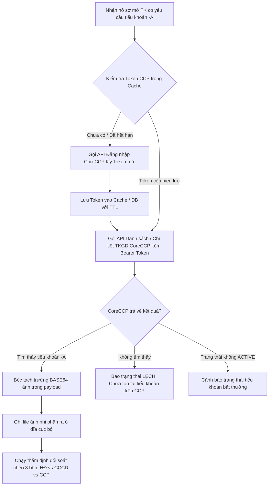

# TÀI LIỆU ĐẶC TẢ KIẾN TRÚC & KẾ HOẠCH PHÁT TRIỂN: THẨM ĐỊNH TIỂU KHOẢN (-A) TRÊN CORECCP (100% REST API)

---

## 1. Bối cảnh & Định hướng Nghiệp vụ

### 1.1. Mục tiêu Nghiệp vụ
* Trong quy trình đối soát mở tài khoản giao dịch (`mxv-account-opening-reconciler`), các hồ sơ có yêu cầu mở tiểu khoản liên thông **ACM Nano (`-A`)** sẽ được thẩm định trực tiếp trên hệ thống **CoreCCP (VNCLEAR)** thay vì M-System.
* Mục tiêu: Xác nhận tiểu khoản `-A` đã tồn tại trên CoreCCP, ở trạng thái hoạt động (`ACTIVE`) và trích xuất dữ liệu ảnh định danh (CCCD, Chữ ký dạng Base64) để đối chiếu chéo.

### 1.2. Quyết định Kiến trúc: 100% Pure REST API (Zero-Playwright)
* Hệ thống **hoàn toàn KHÔNG sử dụng Playwright / Browser Automation** cho luồng CoreCCP vì đã có sẵn logic API lấy Token và tra cứu dữ liệu.
* **Lợi ích vượt trội của Pure REST API:**
  * ⚡ **Tốc độ phản hồi cực nhanh:** < 200ms cho toàn bộ luồng tra cứu (so với 10-15s của trình duyệt).
  * 🟢 **Tiêu tốn tài nguyên gần như bằng 0:** Không cần cài đặt hay khởi chạy Chromium, không tiêu tốn RAM (tiết kiệm hàng trăm MB RAM trên server), không chiếm CPU.
  * 🛡️ **Triệt tiêu lỗi Timeout / OOM:** Không bao giờ gặp lỗi nghẽn trình duyệt, Nginx HTTP 504 Timeout hay crash bộ nhớ khi chạy hàng loạt.

---

## 2. Quy trình Xử lý Nghiệp vụ Chuẩn (Pure API Workflow)



---

## 3. Chi tiết Kỹ thuật Các Bước Thực thi

### 3.1. Bước 1: Quản lý & Tái sử dụng Token API
* Gọi API đăng nhập của CoreCCP bằng `username` và `password` (lấy từ cấu hình `bot_credentials` hoặc `system_settings`).
* Trích xuất `accessToken` (Bearer Token) từ response.
* Lưu `accessToken` vào memory cache hoặc MongoDB kèm thời gian hết hạn (`expiresAt`).
* Khi gọi các request tiếp theo, tái sử dụng Token này. Chỉ gọi lại API đăng nhập khi Token hết hạn hoặc nhận mã lỗi `401 Unauthorized`.

### 3.2. Bước 2: Tra cứu Tiểu khoản (`-A`) & Nhận Dữ liệu
* Gọi HTTP GET/POST tới endpoint quản lý tài khoản của CoreCCP:
  ```typescript
  const response = await fetch(`${CCP_API_BASE}/api/.../accounts?accountCode=${subAccountCode}`, {
    method: 'GET',
    headers: {
      'Authorization': `Bearer ${token}`,
      'Content-Type': 'application/json'
    }
  });
  const data = await response.json();
  ```
* Kiểm tra mã phản hồi `data.success === true` hoặc `data.code === '0'`.

### 3.3. Bước 3: Lưu trữ Ảnh từ chuỗi Base64
Theo đặc tả response mẫu từ CoreCCP (`api-image-base64.md`):
```json
{
  "time": "2026-10-06T11:11:11.967811736",
  "success": true,
  "code": "0",
  "msg": "",
  "payload": {
    "data": [
      {
        "BASE64": "data:image/png;base64,/9j/2wBDAA0JCgsK..."
      }
    ]
  }
}
```

Hàm helper chuẩn hóa xử lý bóc tách và lưu ảnh:
```typescript
import * as fs from 'fs';
import * as path from 'path';

/**
 * Lưu chuỗi Base64 từ API CoreCCP thành file ảnh trên đĩa cứng
 * @param base64Input Chuỗi Base64 (có tiền tố data:image/... hoặc raw base64)
 * @param destinationFilePath Đường dẫn file đích (ví dụ: .../HoSo_DinhKem/20261006/003C1234567/003C1234567-A_CCCD_truoc.jpg)
 */
export function saveApiBase64ToImageFile(base64Input: string, destinationFilePath: string): boolean {
  if (!base64Input) return false;

  try {
    // 1. Tách bỏ prefix nếu có (ví dụ: 'data:image/png;base64,')
    const rawBase64 = base64Input.includes(',') ? base64Input.split(',')[1] : base64Input;

    // 2. Chuyển đổi sang Buffer nhị phân
    const imageBuffer = Buffer.from(rawBase64, 'base64');

    // 3. Đảm bảo thư mục lưu trữ tồn tại
    const parentDir = path.dirname(destinationFilePath);
    if (!fs.existsSync(parentDir)) {
      fs.mkdirSync(parentDir, { recursive: true });
    }

    // 4. Ghi trực tiếp ra file ảnh cục bộ
    fs.writeFileSync(destinationFilePath, imageBuffer);
    return true;
  } catch (error) {
    console.error(`[CCP-IMG] Lỗi khi lưu ảnh Base64 vào ${destinationFilePath}:`, error);
    return false;
  }
}
```

---

## 4. Kế hoạch Tích hợp vào Hệ thống (`mxv-account-opening-reconciler`)

### 4.1. Cấu trúc Module đề xuất
* **Tệp Service API:** `src/modules/tkgd-automation/services/tkgd-ccp-api.service.ts`
  * Chuyên trách:
    1. `getOrRefreshToken()`: Quản lý cache Token.
    2. `querySubAccount(subAccountCode: string)`: Gọi API tra cứu tiểu khoản.
    3. `downloadSubAccountImages(subAccountCode: string, targetDir: string)`: Gọi API lấy Base64 và lưu file ảnh CCCD / Chữ ký.
* **Tích hợp vào Bộ Quy tắc Đối soát:** `src/modules/engine-helpers/tkgd-reconcile-rules.helper.ts`
  * Nhánh logic:
    ```typescript
    if (isSubAccountACM(record.maTKGD)) {
      // Đối soát tiểu khoản -A: Dùng kết quả từ CoreCCP API thay vì M-System
      evaluateWithCcpData(record, ccpData);
    } else {
      // Tài khoản cơ sở: Tiếp tục đối soát qua M-System chuẩn
      evaluateWithMSystemData(record, msData);
    }
    ```

### 4.2. Dọn dẹp & Tối ưu Mã nguồn
* Vì sử dụng 100% REST API, các module Playwright dựng tạm cho CCP (`test_ccp_login_debug.js`, `ccp-auth.helper.ts`, `tkgd-ccp-crawler.service.ts`) sẽ không cần thiết cho luồng chạy chính thức. Ta có thể chuyển đổi trực tiếp `tkgd-ccp-crawler.service.ts` thành `tkgd-ccp-api.service.ts` thuần HTTP fetch.
