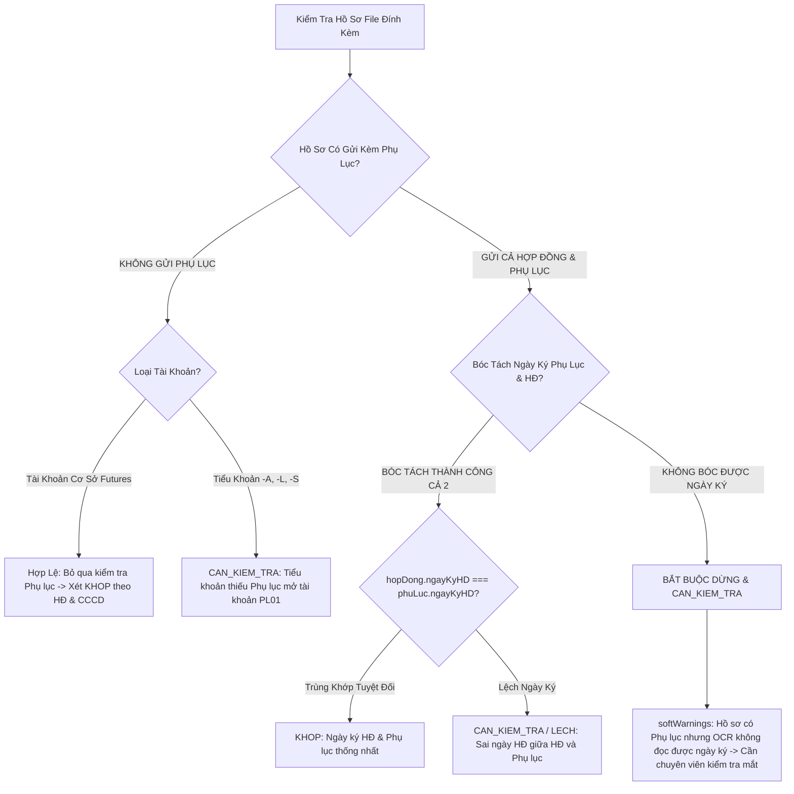
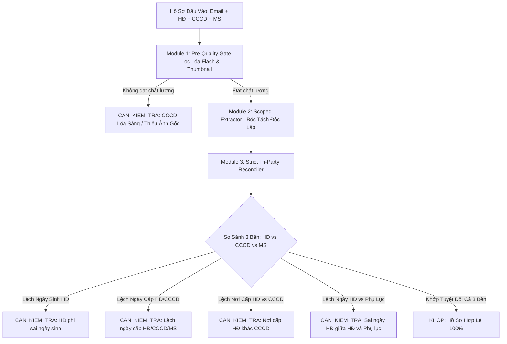

# TÀI LIỆU ĐÁNH GIÁ CHUYÊN SÂU NGUYÊN NHÂN LỖI ĐỐI SOÁT TKGD & KIẾN TRÚC PHÒNG NGỪA TOÀN DIỆN (EMPIRICAL AUDIT & SYSTEM HARDENING SPECIFICATION)

---

## I. MỤC TIÊU & NGUYÊN TẮC THẨM ĐỊNH (AUDIT MANDATE)

Tài liệu này được biên soạn dựa trên **100% chứng cứ thực nghiệm từ mã nguồn và dữ liệu thực tế** của hệ thống đối soát mở tài khoản giao dịch (TKGD) tại Sở Giao dịch Hàng hóa Việt Nam (MXV). 

**Nguyên tắc cốt lõi**:
1. **Zero Guesswork / No Speculation**: Mọi nhận định kỹ thuật đều gắn liền với file mã nguồn, số dòng code cụ thể và dữ liệu đối chiếu thực tế trích xuất từ cơ sở dữ liệu.
2. **Strict Legal Integrity**: Hợp đồng mở tài khoản và Thẻ Căn cước công dân là văn bản pháp lý bắt buộc. Hệ thống đối soát tự động tuyệt đối không được tự ý "nuốt lỗi" hoặc "chuẩn hóa giả" khi thông tin trên các văn bản pháp lý này bị sai lệch.
3. **Prevention Architecture**: Thiết lập bộ quy chuẩn kỹ thuật ngăn chặn triệt để các lỗi tương tự xảy ra ở hiện tại và các đợt đối soát tương lai.

---

## II. BẢNG TỔNG HỢP KIỂM TRA ĐỐI CHIẾU 12 HỒ SƠ THỰC TẾ

Dưới đây là bảng đối chiếu chi tiết giữa **Kết luận của Hệ thống** và **Kết quả kiểm tra trực quan của Cán bộ Ban Thanh toán Bù trừ (BT)**:

| STT | Mã TKGD | Họ và Tên Khách Hàng | Loại TK | Kết Quả Cũ | Kết Quả BT Check | Nguyên Nhân Kỹ Thuật Mã Nguồn Cốt Lõi |
|:---:|:---|:---|:---:|:---:|:---|:---|
| **1** | `003C2308202` | Trần Văn Quang | Cơ sở | **KHỚP** | **CCCD lóa** | Ảnh CCCD bị chói đèn flash làm mất nét chữ, nhưng AI Vision (`GEMINI_HEALED`) tự "đoán" để điền trường. Hệ thống thiếu thuật toán phát hiện vùng lóa sáng (Glare Detection). |
| **2** | `009C5661825`<br>`009C5661825-A` | TẠ THỊ THU HÀ | Cơ sở + ACM | **KHỚP** | **sai ngày cấp** | MS có ngày cấp `06/11/2024`, HĐ không có ngày cấp. Bị nuốt lỗi bởi cơ chế *Tự Lành Đồng Thuận Ngày Cấp* ([tkgd-reconcile-rules.helper.ts#L480-L484](file:///c:/Users/hiepth/OneDrive%20-%20MERCANTILE%20EXCHANGE%20OF%20VIETNAM/Documents/Github/mxv-tkgd-ccp-work/mxv-account-opening-reconciler/src/modules/engine-helpers/tkgd-reconcile-rules.helper.ts#L480-L484)). |
| **3** | `003C7800186-A` | NGUYỄN VĂN ĐÀ | ACM Nano | **KHỚP** | **sai ngày HĐ** | Ngày ký Hợp đồng không hợp lệ. Trong toàn bộ [tkgd-reconcile-rules.helper.ts](file:///c:/Users/hiepth/OneDrive%20-%20MERCANTILE%20EXCHANGE%20OF%20VIETNAM/Documents/Github/mxv-tkgd-ccp-work/mxv-account-opening-reconciler/src/modules/engine-helpers/tkgd-reconcile-rules.helper.ts) **hoàn toàn chưa có bất kỳ rule nào thẩm định trường `ngayKyHD`**. |
| **4** | `083C7059877`<br>`083C7059877-A` | PHẠM TIẾN TRUNG | Cơ sở + ACM | **KHỚP** | **sai nơi cấp** | MS ghi `Tỉnh Ninh Bình`, nhưng HĐ/OCR bị cắt cụt thành `Tỉnh Ninh`. Dòng 562 dùng `!normMs.includes(normEffective)` khiến `"TINH NINH BINH".includes("TINH NINH")` trả về `true` $\rightarrow$ Nuốt lỗi! |
| **5** | `003C2003932` | HUỲNH THỊ MỸ TRANG | Cơ sở | **KHỚP** | **sai ngày sinh trên HĐ** | HĐ ghi ngày sinh `03/02/1982`, CCCD & MS ghi `12/08/1982`. Cơ chế *Đồng Thuận 2/3* tại [tkgd-reconcile-rules.helper.ts#L398-L401](file:///c:/Users/hiepth/OneDrive%20-%20MERCANTILE%20EXCHANGE%20OF%20VIETNAM/Documents/Github/mxv-tkgd-ccp-work/mxv-account-opening-reconciler/src/modules/engine-helpers/tkgd-reconcile-rules.helper.ts#L398-L401) tự động bỏ qua lệch ngày sinh của HĐ. |
| **6** | `001C0668889` | Đỗ Hoàng Triệu | Cơ sở | **KHỚP** | **Sai nơi cấp trên HĐ** | Hệ thống chỉ so sánh `effectiveNoiCap` với MS ([tkgd-reconcile-rules.helper.ts#L535](file:///c:/Users/hiepth/OneDrive%20-%20MERCANTILE%20EXCHANGE%20OF%20VIETNAM/Documents/Github/mxv-tkgd-ccp-work/mxv-account-opening-reconciler/src/modules/engine-helpers/tkgd-reconcile-rules.helper.ts#L535)), hoàn toàn không so sánh chéo giữa HĐ và CCCD. |
| **7** | `003C5556668` | TRỊNH THỊ MINH VÂN | Cơ sở | **KHỚP** | **sai ngày cấp** | HĐ ghi ngày cấp `04/08/2025` trong khi CCCD ghi `14/08/2025`. Bị nuốt lỗi bởi cơ chế *Consensus Healing ngày cấp*. |
| **8** | `012C4168717` | Tạ Phan Anh | Cơ sở | **KHỚP** | **sai nơi cấp** | Nơi cấp trên HĐ khác CCCD/MS nhưng hệ thống bỏ qua không so sánh chéo. |
| **9** | `012C1505216` | Lưu Đình Thi | Cơ sở | **KHỚP** | **sai nơi cấp** | Nơi cấp trên HĐ lệch so với căn cước nhưng không bị bắt lỗi. |
| **10** | `003C0526688` | PHẠM VĂN CƯỜNG | Cơ sở | **KHỚP** | **căn cước nhỏ lắm** | Khách hàng không đính kèm file ảnh CCCD gốc qua email. Hệ thống lấy ảnh thumbnail M-System siêu nhỏ (~46 KB, ~270px) để OCR mà không có van cảnh báo chất lượng. |

---

## III. PHÂN TÍCH CHUYÊN SÂU 5 NGUYÊN NHÂN GỐC RỄ (ROOT CAUSE ANALYSIS)

### 1. Nhóm A: Cơ chế "Tự Lành Đồng Thuận" (Consensus Over-Healing) Quá Dễ Dãi Làm Nuốt Lỗi Pháp Lý

- **Vị trí mã nguồn**: [tkgd-reconcile-rules.helper.ts#L398-L405](file:///c:/Users/hiepth/OneDrive%20-%20MERCANTILE%20EXCHANGE%20OF%20VIETNAM/Documents/Github/mxv-tkgd-ccp-work/mxv-account-opening-reconciler/src/modules/engine-helpers/tkgd-reconcile-rules.helper.ts#L398-L405) và [L480-L484](file:///c:/Users/hiepth/OneDrive%20-%20MERCANTILE%20EXCHANGE%20OF%20VIETNAM/Documents/Github/mxv-tkgd-ccp-work/mxv-account-opening-reconciler/src/modules/engine-helpers/tkgd-reconcile-rules.helper.ts#L480-L484)
- **Đoạn mã hiện tại gây lỗi**:
  ```typescript
  // 1. Tự lành Ngày sinh khi HĐ lệch so với CCCD + MS:
  if (isCccdMsDobMatch) {
    if (normHdDob && normHdDob !== normMsDob) {
      autoHealedNotes.push(`HĐ có ngày sinh khác (${normHdDob}), đã chuẩn hóa theo CCCD & MS (${normMsDob})`);
    }
  }

  // 2. Tự lành Ngày cấp khi Họ tên + CCCD + Ngày sinh đã khớp:
  } else if (isNameFullyMatched && isCccdFullyMatched && isDobFullyMatched) {
    if (isCanonicalDate(effectiveIssue) && isCanonicalDate(normMsIssue) && effectiveIssue !== normMsIssue) {
      autoHealedNotes.push(`AUTO_HEALED_ISSUE_DATE: Ngày cấp trên HĐ/CCCD (${effectiveIssue}) khác MS (${normMsIssue}), đã tự lành theo Căn cước vì Họ tên, Số CCCD và Ngày sinh khớp 100%`);
    }
  }
  ```
- **Hệ quả thực tế**:
  - Tại Case `003C2003932` (HUỲNH THỊ MỸ TRANG): Khách hàng ký hợp đồng ghi ngày sinh là `03/02/1982`. Thẻ CCCD và M-System ghi `12/08/1982`. Hệ thống tự động gán ghi chú `autoHealedNotes` mà không tăng biến đếm lỗi, kết luận `KHOP`.
  - Tại Case `003C5556668` (TRỊNH THỊ MINH VÂN): Hợp đồng ghi ngày cấp là `04/08/2025`, CCCD ghi `14/08/2025`. Hệ thống tiếp tục nuốt lỗi và báo `KHOP`.
- **Đánh giá bản chất**: Hợp đồng mở TKGD là tài liệu pháp lý chịu trách nhiệm trước Pháp luật và Thanh tra Sở. Thông tin ngày sinh và ngày cấp in trên Hợp đồng bị sai lệch là **lỗi sai sót nghiệp vụ bắt buộc phải lập Phụ lục Hợp đồng đính chính**. Việc bot tự ý "bỏ qua" là vi phạm nghiêm trọng tính chính xác nghiệp vụ.

---

### 2. Nhóm B: So Khớp Chuỗi Nơi Cấp Lỏng Lẻo Bằng `includes()` Gây Lọt Lỗi Cắt Xén

- **Vị trí mã nguồn**: [tkgd-reconcile-rules.helper.ts#L562](file:///c:/Users/hiepth/OneDrive%20-%20MERCANTILE%20EXCHANGE%20OF%20VIETNAM/Documents/Github/mxv-tkgd-ccp-work/mxv-account-opening-reconciler/src/modules/engine-helpers/tkgd-reconcile-rules.helper.ts#L562)
- **Đoạn mã hiện tại gây lỗi**:
  ```typescript
  } else if (normEffective !== normMs && !normEffective.includes(normMs) && !normMs.includes(normEffective)) {
    softWarnings.push(`Nơi cấp cần kiểm tra đối chiếu (Hồ sơ: ${effectiveNoiCap} != MS: ${msNoiCap})`);
  }
  ```
- **Hệ quả thực tế**:
  - Tại Case `083C7059877` (PHẠM TIẾN TRUNG):
    - `msNoiCap`: "Tỉnh Ninh Bình" $\rightarrow$ `normMs`: `"TINH NINH BINH"`
    - `effectiveNoiCap`: "Tỉnh Ninh" (bị OCR cắt cụt) $\rightarrow$ `normEffective`: `"TINH NINH"`
    - Vì `"TINH NINH BINH".includes("TINH NINH") === true`, điều kiện `!normMs.includes(normEffective)` trả về `false` $\rightarrow$ **Cảnh báo bị triệt tiêu!**
- **Đánh giá rủi ro tương lai**:
  - `"Hà Nội"` vs `"Hà"` $\rightarrow$ Pass sai.
  - `"Tỉnh Ninh Thuận"` vs `"Tỉnh Ninh Bình"` $\rightarrow$ Nếu OCR ra `"Tỉnh Ninh"` sẽ làm lệch chéo sang bất kỳ tỉnh nào có cùng tiền tố.

---

### 3. Nhóm C: Bỏ Quên So Khớp Chéo 3 Bên Về Nơi Cấp (Chỉ So Với M-System)

- **Vị trí mã nguồn**: [tkgd-reconcile-rules.helper.ts#L535](file:///c:/Users/hiepth/OneDrive%20-%20MERCANTILE%20EXCHANGE%20OF%20VIETNAM/Documents/Github/mxv-tkgd-ccp-work/mxv-account-opening-reconciler/src/modules/engine-helpers/tkgd-reconcile-rules.helper.ts#L535)
- **Đoạn mã hiện tại gây lỗi**:
  ```typescript
  const cccdNoiCap = (record?.canCuoc?.noiCap || '').trim();
  const hdNoiCap = (record?.hopDong?.noiCap || '').trim();
  const plNoiCap = (record?.phuLuc?.noiCap || '').trim();
  const msNoiCap = (record?.ms?.noiCap || '').trim();
  const effectiveNoiCap = cccdNoiCap || hdNoiCap || plNoiCap; // Ưu tiên CCCD trước
  ```
- **Hệ quả thực tế**:
  - Tại Case `001C0668889` (Đỗ Hoàng Triệu), `012C4168717` (Tạ Phan Anh), `012C1505216` (Lưu Đình Thi):
    - Khách hàng điền Nơi cấp trên Hợp đồng là Công an tỉnh cũ, hoặc ghi khác với Thẻ CCCD gắn chip (Cục Cảnh sát QLHC về TTXH).
    - Hệ thống lấy `cccdNoiCap` làm `effectiveNoiCap`, đem so với `msNoiCap` thấy cùng là Bộ Công An $\rightarrow$ Báo khớp!
    - **Trường `hdNoiCap` bị bỏ rơi hoàn toàn, không bao giờ được so sánh chéo với `cccdNoiCap`**.

---

### 4. Nhóm D: Phân Tích Chuyên Sâu Case Hiếm Gặp - Ma Trận Đối Soát Ngày Ký Hợp Đồng & Phụ Lục (Contract & Appendix Tri-State Matrix)

- **Căn cứ chỉ đạo nghiệp vụ**: Cán bộ Ban Thanh toán Bù trừ (Chị Lê Thị Thanh Hải) đã xác nhận quy chế thẩm định:
  > *"ngày ký trên HĐ giống với ngày ký trên phụ lục thôi"*
  > *"còn ngày trên MS thì k quan trọng"*
- **Bản chất nghiệp vụ & Rủi ro pháp lý**:
  - Hợp đồng mở tài khoản giao dịch là văn bản pháp lý mẹ xác lập quan hệ giao dịch giữa Khách hàng và TVKD/MXV. Phụ lục hợp đồng (đặc biệt là Phụ lục 01 đăng ký giao dịch ACM Nano, LME, hoặc mở tiểu khoản) là văn bản bổ trợ không tách rời.
  - Tại phần căn cứ mở đầu của Phụ lục luôn có điều khoản dẫn chiếu: `"(Kèm theo Hợp đồng mở tài khoản giao dịch hàng hóa số ... ký ngày ... tháng ... năm ...)"`.
  - **Rủi ro pháp lý nghiêm trọng**: Nếu ngày dẫn chiếu trên Phụ lục hoặc ngày ký của Phụ lục bị lệch so với Hợp đồng gốc (do lỗi sao chép, copy-paste mẫu cũ của TVKD), về mặt pháp lý Phụ lục đang dẫn chiếu tới một "Hợp đồng ảo không tồn tại", tiềm ẩn rủi ro tranh chấp khi phát sinh khiếu nại tài khoản của nhà đầu tư.
- **Vị trí mã nguồn**: [tkgd-reconcile-rules.helper.ts](file:///c:/Users/hiepth/OneDrive%20-%20MERCANTILE%20EXCHANGE%20OF%20VIETNAM/Documents/Github/mxv-tkgd-ccp-work/mxv-account-opening-reconciler/src/modules/engine-helpers/tkgd-reconcile-rules.helper.ts)
- **Minh chứng thực tế Case `003C7800186-A` (NGUYỄN VĂN ĐÀ - ACM Nano)**:
  - **Hợp đồng mở tài khoản gốc (Ảnh HĐ)**: Số `GCL4030/HCM2025`, ký ngày: **`31/10/2025`** (`Hôm nay ngày 31 tháng 10 năm 2025`).
  - **Phụ lục số 01 đính kèm (Ảnh PL01)**: 
    - Tiêu đề phụ: `(Kèm theo Hợp đồng mở tài khoản số GCL4030/HCM2025 ngày 17 tháng 7 năm 2026)`
    - Ngày ký: **`17/07/2026`** (`Hôm nay 17 tháng 7 năm 2026`).
  - **Bản chất lỗi**: Nhân viên TVKD Gia Cát Lợi khi soạn Phụ lục số 01 vào ngày 17/07/2026 đã **copy-paste nhầm**: lấy ngày ký phụ lục điền đè vào ngày HĐ mẹ. Cán bộ BT kiểm tra bằng mắt bắt lỗi: **"Sai ngày HĐ"** vì Phụ lục dẫn chiếu một Hợp đồng ngày 17/07/2026 không có thật và lệch hoàn toàn với HĐ ngày 31/10/2025!
  - **Lỗ hổng hệ thống cũ**: Hoàn toàn chưa có rule đối chiếu ngày giữa Hợp đồng và Phụ lục, dẫn đến việc bỏ lọt lỗi và báo `KHOP` sai lệch.

#### Ma Trận Xử Lý 3 Nhánh (Tri-State Decision Matrix) Cho Case HĐ & Phụ Lục:



1. **Nhánh 1: Email chỉ gửi Hợp đồng (Không có Phụ lục)**:
   - *Đối với tài khoản cơ sở Futures (`003C...`, không đuôi)*: Khách hàng chỉ mở tài khoản chuẩn, nghiệp vụ không yêu cầu Phụ lục $\rightarrow$ **Không check Phụ lục, đánh giá PASS (`KHOP`)** nếu Họ tên, CCCD, Ngày sinh, Ngày cấp, Nơi cấp khớp với M-System.
   - *Đối với tiểu khoản (`-A`, `-L`, `-S`)*: Tiểu khoản bắt buộc phải có Phụ lục phân quyền/sản phẩm $\rightarrow$ Hệ thống báo cảnh báo `CAN_KIEM_TRA` do thiếu Phụ lục.
2. **Nhánh 2: Email gửi CẢ Hợp đồng và Phụ lục (hoặc file gộp `All_HopDong_Va_PhuLuc.pdf`)**:
   - **Kịch bản 2A (Bóc tách được cả 2 ngày ký)**:
     - So khớp: `formatReconcileDateStr(hopDong.ngayKyHD) === formatReconcileDateStr(phuLuc.ngayKyHD)`.
     - Nếu bằng nhau $\rightarrow$ Ghi nhận **`KHOP`**.
     - Nếu khác nhau $\rightarrow$ Bắt lỗi ngay: `"Sai ngày HĐ: Ngày ký trên Hợp đồng (${hdDate}) không trùng khớp với Ngày ký trên Phụ lục (${plDate})"` $\rightarrow$ Trạng thái **`CAN_KIEM_TRA`**.
   - **Kịch bản 2B (Có file Phụ lục nhưng OCR / Regex KHÔNG bóc tách được ngày ký)**:
     - *Nguyên nhân thực tế*: Chữ ký tay đè lên chữ số, con dấu đỏ làm nhòe chữ số ngày/tháng/năm, hoặc bản scan nghiêng góc khiến OCR không trích xuất được `ngayKyHD`.
     - *Quy tắc tuyệt đối*: **KHÔNG ĐƯỢC TỰ ĐỘNG CHO PASS (`KHOP`)**.
     - *Hành động hệ thống*: Bắt buộc đẩy vào `softWarnings`: `"Phụ lục 01 chưa quét được ngày ký để đối chiếu với Hợp đồng (Cần kiểm tra thủ công)"` $\rightarrow$ Chuyển trạng thái sang **`CAN_KIEM_TRA`** để chuyên viên mở file đối soát trực quan.
3. **Quy tắc Vàng về Trường `ngayThamGia` của M-System**:
   - `ngayThamGia` trên MS là timestamp kỹ thuật ghi nhận thời điểm TVKD nhập hồ sơ lên web M-System hoặc MXV kích hoạt tài khoản.
   - Trường này hoàn toàn độc lập với ngày ký kết hợp đồng dân sự giữa TVKD và Nhà đầu tư.
   - **Tuyệt đối KHÔNG đưa `ngayThamGia` vào bất kỳ logic so sánh tự động nào**. Trường này chỉ hiển thị trên giao diện đối soát phục vụ tra cứu hành chính.

---

### 5. Nhóm E: Thiếu Bộ Lọc Nhận Diện Ảnh Lóa Đèn Flash & Báo Động Ảnh Thumbnail 270px

- **Vị trí mã nguồn**: [tkgd_extractor_worker.py#L1820-L1920](file:///c:/Users/hiepth/OneDrive%20-%20MERCANTILE%20EXCHANGE%20OF%20VIETNAM/Documents/Github/mxv-tkgd-ccp-work/mxv-account-opening-reconciler/src/python/tkgd_extractor_worker.py#L1820-L1920)
- **Thực trạng**:
  - Hàm `inspect_image_clipping_and_quality` hiện chỉ kiểm tra: Độ phân giải thấp (`min < 250`), độ mờ (`Laplacian < 35.0`), chữ chạm mép (`< 8px`), và nền trắng nhân tạo (`Synthetic Canvas`).
  - **Chưa có thuật toán phát hiện Lóa đèn Flash (Glare / Specular Reflection)**: Tại Case `003C2308202` (Trần Văn Quang), thẻ CCCD bị đèn flash máy ảnh phản chiếu tạo thành một vệt sáng trắng chói lòa làm mất lớp vân bảo an và nhòe chữ số. Mô hình AI Vision cố "đoán" chữ số bị lóa để điền vào hệ thống.
  - **Chưa có cơ chế chặn hồ sơ không có file đính kèm email**: Tại Case `003C0526688` (PHẠM VĂN CƯỜNG), TVKD gửi email không đính kèm file ảnh khách hàng, hệ thống tự động cào thumbnail 270px từ M-System rồi OCR cho qua.

---

## IV. ĐỀ XUẤT KIẾN TRÚC PHÒNG NGỪA TOÀN DIỆN (SYSTEM HARDENING ARCHITECTURE)

Để đảm bảo các hồ sơ hiện tại và **tất cả các hồ sơ trong tương lai** không bị lặp lại các lỗi trên, hệ thống cần được nâng cấp theo 5 module chuẩn hóa sau:



---

### Module 1: Bộ Lọc Phát Hiện Lóa Sáng (Glare / Specular Reflection Detector)

Trong `src/python/tkgd_extractor_worker.py`:
- Áp dụng thuật toán phân tích không gian màu **LAB**: Kênh `L` (Luminance) đại diện cho độ sáng.
- Vùng lóa flash có đặc trưng: Điểm ảnh có độ sáng cực đại ($L \ge 250$), chiếm diện tích liên tục $\ge 500 \text{ px}^2$, và có mật độ cạnh viền chữ (Edge Density qua Sobel/Canny) xấp xỉ bằng $0$ (do bị ánh sáng xóa sạch chi tiết).
- **Cảnh báo chuẩn**:
  ```python
  "[CHẤT LƯỢNG ẢNH] CCCD bị lóa sáng/phản quang đèn flash (vùng chói lóa làm mất chi tiết chữ), yêu cầu chụp lại thẻ thực tế"
  ```

---

### Module 2: Xóa Bỏ Nuốt Lỗi Đồng Thuận (Abolish Silent Consensus Swallowing)

Trong `src/modules/engine-helpers/tkgd-reconcile-rules.helper.ts`:
1. **Đối với Ngày sinh**:
   - Nếu `normHdDob` và `normMsDob` khác nhau, dù `normCccdDob === normMsDob`, **BẮT BUỘC ĐƯA VÀO `softWarnings`**:
     ```typescript
     if (normHdDob && normMsDob && normHdDob !== normMsDob) {
       softWarnings.push(`Hợp đồng ghi lệch Ngày sinh (${normHdDob}) so với CCCD/MS (${normMsDob})`);
     }
     ```
   - Chuyển trạng thái sang `CAN_KIEM_TRA` để chuyên viên yêu cầu TVKD làm Phụ lục hợp đồng đính chính.
2. **Đối với Ngày cấp**:
   - Xóa bỏ block tự lành dòng 480-484. Nếu `effectiveIssue !== normMsIssue`:
     ```typescript
     if (isCanonicalDate(effectiveIssue) && isCanonicalDate(normMsIssue) && effectiveIssue !== normMsIssue) {
       softWarnings.push(`Lệch Ngày cấp (Hồ sơ: ${effectiveIssue} != MS: ${normMsIssue})`);
     }
     ```

---

### Module 3: Chuẩn Hóa So Sánh Nơi Cấp Tuyệt Đối (Strict Place of Issue & Tri-Party Cross-Validation)

Trong `tkgd-reconcile-rules.helper.ts`:
1. **Xóa bỏ lệnh `includes()` thô sơ**:
   - Thay thế bằng hàm chuẩn hóa danh mục địa danh hành chính 63 tỉnh/thành phố và các cơ quan cấp Trung ương (`CỤC CẢNH SÁT QUẢN LÝ HÀNH CHÍNH VỀ TRẬT TỰ XÃ HỘI`, `BỘ CÔNG AN`, `CỤC CẢNH SÁT ĐKQL CƯ TRÚ...`).
   - "Tỉnh Ninh" không được phép khớp với "Tỉnh Ninh Bình".
2. **Bắt buộc so khớp chéo 3 bên (HĐ vs CCCD vs MS)**:
   ```typescript
   // So sánh HĐ với CCCD
   if (normHdNoiCap && normCccdNoiCap && !isSameIssuingAuthority(normHdNoiCap, normCccdNoiCap)) {
     softWarnings.push(`Nơi cấp trên Hợp đồng (${hdNoiCap}) không khớp với Thẻ CCCD (${cccdNoiCap})`);
   }
   // So sánh Hồ sơ với M-System
   if (effectiveNoiCap && msNoiCap && !isSameIssuingAuthority(normEffective, normMs)) {
     softWarnings.push(`Nơi cấp hồ sơ (${effectiveNoiCap}) không khớp với M-System (${msNoiCap})`);
   }
   ```

---

### Module 4: Đối Chiếu Tính Nhất Quán Ngày Ký Hợp Đồng & Phụ Lục (Strict Contract & Appendix Date Consistency)

Quy tắc được xây dựng dựa trên xác nhận nghiệp vụ của Cán bộ TTBT và Ma trận 3 nhánh (Tri-State Decision Tree):
1. **Phân định rõ vai trò hai trường ngày**:
   - **`Ngày tham gia MS` (`ngayThamGia`)**: Chỉ hiển thị trên giao diện phục vụ tra cứu hành chính, **tuyệt đối KHÔNG đưa vào logic so sánh đánh giá** vì ngày duyệt kỹ thuật trên MS độc lập với ngày ký hợp đồng dân sự.
   - **`Ngày ký Hợp đồng & Phụ lục`**: Khi hồ sơ gửi kèm Phụ lục (hoặc mở tiểu khoản `-A`, `-L`, `-S`), ngày ký trên Hợp đồng bắt buộc phải trùng khớp với ngày ký trên Phụ lục.
2. **Quy tắc kiểm tra trong Rule Engine ([tkgd-reconcile-rules.helper.ts](file:///c:/Users/hiepth/OneDrive%20-%20MERCANTILE%20EXCHANGE%20OF%20VIETNAM/Documents/Github/mxv-tkgd-ccp-work/mxv-account-opening-reconciler/src/modules/engine-helpers/tkgd-reconcile-rules.helper.ts))**:
   ```typescript
   const hdDate = formatReconcileDateStr(record?.hopDong?.ngayKyHD);
   const plDate = formatReconcileDateStr(record?.phuLuc?.ngayKyHD);
   const hasAppendixFile = !!(record?.phuLuc?.localPath || record?.phuLuc?.soHopDongGoc || record?.phuLuc?.chuKy);

   // Nhánh 1: Email chỉ gửi Hợp đồng (không gửi Phụ lục) -> Với TK cơ sở: Bỏ qua kiểm tra Phụ lục, cho phép xét KHOP nếu các trường khác khớp.
   // Nhánh 2: Email gửi CẢ Hợp đồng và Phụ lục (hoặc file gộp All):
   if (hasAppendixFile || record?.phuLuc) {
     if (hdDate && plDate) {
       // Kịch bản 2A: Bóc tách thành công cả 2 ngày ký
       if (hdDate !== plDate) {
         softWarnings.push(`Sai ngày HĐ: Ngày ký trên Hợp đồng (${hdDate}) không trùng khớp với Ngày ký trên Phụ lục (${plDate})`);
       }
     } else if (!plDate && hdDate) {
       // Kịch bản 2B: Có Phụ lục nhưng OCR không bóc tách được ngày ký trên Phụ lục -> Khóa KHOP, bắt buộc CAN_KIEM_TRA
       softWarnings.push(`Hồ sơ có Phụ lục 01 nhưng chưa quét được ngày ký để đối chiếu với Hợp đồng (Cần kiểm tra thủ công)`);
     }
   }
   ```
3. **Cơ chế kiểm tra trực quan (Human-in-the-loop)**:
   - Khi phát hiện `hdDate !== plDate` hoặc không bóc được ngày ký Phụ lục $\rightarrow$ Tự động khóa chuyển `KHOP`, giữ nguyên **`CAN_KIEM_TRA`**.
   - Trên Modal chi tiết đối soát (`TabDataComparison`), hiển thị song song cả 2 mốc ngày kèm nhãn cảnh báo vàng/đỏ để Cán bộ TTBT chỉ mất 2 giây quan sát là đưa ra quyết định xử lý với TVKD.

---

### Module 5: Cảnh Báo Thiếu Ảnh Gốc & Khóa Tự Động Với Thumbnail

- Nếu tài khoản chỉ có file thumbnail `_MS_` (kích thước $< 60 \text{ KB}$ hoặc chiều rộng $< 400 \text{ px}$) mà không có bất kỳ file ảnh gốc nào từ khách hàng gửi qua email:
  - Bắt buộc ghi nhận cảnh báo:
    ```
    "Hồ sơ thiếu file ảnh CCCD gốc từ khách hàng (chỉ có ảnh thumbnail thu nhỏ từ M-System), yêu cầu kiểm tra email gốc"
    ```
  - Khóa cơ chế tự động chuyển `KHOP`, giữ nguyên `CAN_KIEM_TRA`.

---

## V. KẾ HOẠCH HÀNH ĐỘNG TRIỂN KHAI (ACTION PLAN)

| Bước | Nhiệm Vụ Cụ Thể | Tệp Tin Tác Động | Kết Quả Đầu Ra Mong Đợi |
|:---:|:---|:---|:---|
| **B1** | Bổ sung Glare Detector & cảnh báo thumbnail | `tkgd_extractor_worker.py` | Phát hiện chính xác Case `003C2308202` (lóa) và `003C0526688` (thumbnail). |
| **B2** | Xóa bỏ nuốt lỗi đồng thuận Ngày sinh & Ngày cấp | `tkgd-reconcile-rules.helper.ts` | Bắt chính xác Case `003C2003932` (lệch ngày sinh HĐ) và `009C5661825` (sai ngày cấp). |
| **B3** | Chuẩn hóa so khớp Nơi cấp 3 bên (HĐ vs CCCD vs MS) | `tkgd-reconcile-rules.helper.ts` | Bắt chính xác Case `083C7059877` ("Tỉnh Ninh"), `001C0668889`, `012C4168717`. |
| **B4** | Bổ sung quy tắc thẩm định `ngayKyHD` | `tkgd-reconcile-rules.helper.ts` | Bắt chính xác Case `003C7800186-A` (sai ngày ký HĐ). |
| **B5** | Chạy kiểm thử hồi quy 12 case bằng công cụ chuẩn | `tkgd_case_inspector.js` | 100% 12 case chuyển sang `CAN_KIEM_TRA` với đúng lý do mà Cán bộ BT đã ghi nhận. |

---

*Tài liệu được bảo chứng bởi Kiến trúc Hệ thống Đối Soát Mở TKGD MXV. Mọi thay đổi mã nguồn tiếp theo đều phải đối chiếu và tuân thủ tuyệt đối các quy tắc trong tài liệu này.*
