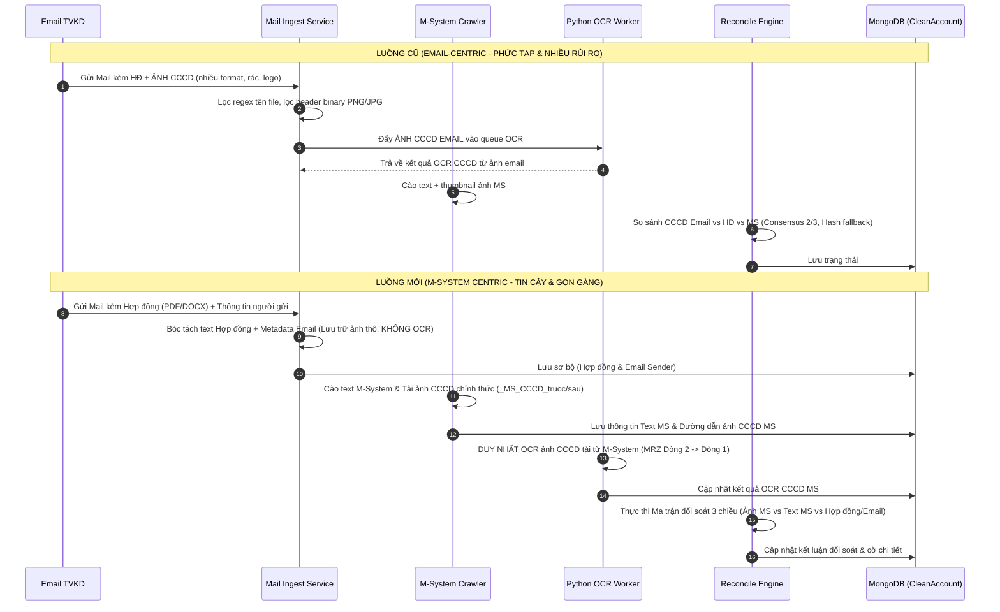

# TÀI LIỆU THIẾT KẾ KIẾN TRÚC: CHUẨN HÓA LUỒNG BÓC TÁCH OCR CCCD TỪ M-SYSTEM & ĐỐI SOÁT VỚI THÔNG TIN HỢP ĐỒNG / NGƯỜI GỬI EMAIL
*(SYSTEM ARCHITECTURE SPECIFICATION: M-SYSTEM CENTRIC CCCD OCR & CROSS-RECONCILIATION WITH EMAIL/CONTRACT PROVENANCE)*

> **Phiên bản**: 2.0 - Chuẩn hóa kiến trúc đối soát TKGD  
> **Căn cứ chỉ đạo**: Định hướng tối ưu hóa quy trình nghiệp vụ: Loại bỏ quét ảnh CCCD từ email; chuyển trọng tâm nhận diện định danh sang ảnh CCCD chính thức trên M-System; đối soát chéo 3 chiều với dữ liệu Hợp đồng và Người gửi Email.  
> **Áp dụng cho**: [mxv-account-opening-reconciler](file:///c:/Users/hiepth/OneDrive%20-%20MERCANTILE%20EXCHANGE%20OF%20VIETNAM/Documents/Github/mxv-tkgd-ccp-work/mxv-account-opening-reconciler) & UI [mxv-account-opening-reconciler-ui](file:///c:/Users/hiepth/OneDrive%20-%20MERCANTILE%20EXCHANGE%20OF%20VIETNAM/Documents/Github/mxv-tkgd-ccp-work/mxv-account-opening-reconciler-ui)

---

## MỤC LỤC
1. [Bối Cảnh Nghiệp Vụ & Lý Do Chuyển Dịch Kiến Trúc](#1-bối-cảnh-nghiệp-vụ--lý-do-chuyển-dịch-kiến-trúc)
2. [Mô Hình Đối Soát 3 Chiều Chuẩn Hóa (3-Way Verification Model)](#2-mô-hình-đối-soát-3-chiều-chuẩn-hóa-3-way-verification-model)
3. [So Sánh Luồng Xử Lý Cũ vs Luồng Xử Lý Mới](#3-so-sánh-luồng-xử-lý-cũ-vs-luồng-xử-lý-mới)
4. [Đặc Tả Kỹ Thuật Chi Tiết Từng Phân Hệ](#4-đặc-tả-kỹ-thuật-chi-tiết-từng-phân-hệ)
   - [4.1 Phân hệ Tiếp Nhận Email (TkgdMailIngestService)](#41-phân-hệ-tiếp-nhận-email-tkgdmailingestservice)
   - [4.2 Phân hệ Thu Thập Dữ Liệu M-System (TkgdMsCrawlerService)](#42-phân-hệ-thu-thập-dữ-liệu-m-system-tkgdmscrawlerservice)
   - [4.3 Phân hệ Bóc Tách OCR Worker Python (tkgd_extractor_worker.py)](#43-phân-hệ-bóc-tách-ocr-worker-python-tkgd_extractor_workerpy)
   - [4.4 Động Cơ Đối Soát & Quy Tắc So Sánh (TkgdReconcileRulesHelper)](#44-động-cơ-đối-soát--quy-tắc-so-sánh-tkgdreconcileruleshelper)
   - [4.5 Chuẩn Hóa Schema CSDL MongoDB (CleanAccountRecord)](#45-chuẩn-hóa-schema-csdl-mongodb-cleanaccountrecord)
   - [4.6 Trực Quan Hóa Giao Diện Người Dùng (Frontend UI Components)](#46-trực-quan-hóa-giao-diện-người-dùng-frontend-ui-components)
5. [Quy Tắc Quản Trị Ngoại Lệ & Mã Lỗi Nghiệp Vụ](#5-quy-tắc-quản-trị-ngoại-lệ--mã-lỗi-nghiệp-vụ)
6. [Kế Hoạch Triển Khai Refactoring & Quy Tắc An Toàn](#6-kế-hoạch-triển-khai-refactoring--quy-tắc-an-toàn)

---

## 1. BỐI CẢNH NGHIỆP VỤ & LÝ DO CHUYỂN DỊCH KIẾN TRÚC

### 1.1 Điểm Nghẽn Của Luồng Cũ (Email-Centric CCCD OCR)
Trong thiết kế ban đầu, hệ thống tải toàn bộ tệp đính kèm trong email của Thành viên kinh doanh (TVKD), sau đó chạy các thuật toán phỏng đoán và OCR hình ảnh CCCD do TVKD gửi qua email. Thực tế vận hành bộc lộ các vấn đề nghiêm trọng:

1. **Ma trận ảnh rác và biến thể tệp trong email**:
   - TVKD đính kèm chữ ký, logo mạng xã hội, banner quảng cáo, file scan ghép 2 mặt, file nén `.paint`, ảnh chụp màn hình điện thoại nghiêng lệch...
   - Hệ thống phải duy trì hàng trăm dòng code regex chỉ để lọc tệp rác (`facebook`, `zalo`, `banner`, `signature`...) và đo header nhị phân để lọc ảnh nhỏ.
2. **Lệch giả (False Positive) và thiếu căn cứ pháp lý**:
   - Ảnh CCCD đính kèm trong email nhiều khi là ảnh cũ, ảnh chụp mờ hoặc khác với bản scan chính thức mà TVKD đã thẩm định và tải lên M-System.
   - Khi OCR ảnh email bị mờ, hệ thống báo lệch (LỆCH/CẦN KIỂM TRA), trong khi trên M-System hồ sơ đã được duyệt hoàn toàn hợp lệ.
3. **Cơ chế Hash MD5 bắc cầu không còn tối ưu**:
   - Trước đây dùng hàm `verifyAndHealWithImageHash` để so khớp MD5 giữa ảnh email và ảnh M-System. Tuy nhiên nếu TVKD upload ảnh đã nén/resize lên M-System, mã MD5 sẽ khác nhau 100%, làm mất tác dụng của cơ chế tự động bù trừ.

### 1.2 Nguyên Tắc Cốt Lõi Của Kiến Trúc Mới (M-System Centric CCCD OCR)
1. **M-System là Nguồn Chân Thực Về Hình Ảnh (Single Source of Truth for ID Images)**:
   - Ảnh CCCD lưu trữ trên M-System chính là hồ sơ điện tử chính thức được TVKD kiểm soát và MXV phê duyệt mở tài khoản.
   - Hệ thống **CHỈ bóc tách OCR từ ảnh CCCD tải về từ M-System**.
2. **Loại bỏ hoàn toàn tác vụ OCR ảnh trong Email**:
   - Tệp đính kèm trong email chỉ dùng để: (1) Trích xuất văn bản Hợp đồng mở tài khoản (PDF/Word), (2) Lưu trữ thô phục vụ tra cứu lịch sử hồ sơ khi cần.
   - Tuyệt đối không đưa ảnh đính kèm trong email vào hàng đợi OCR của Python Worker.
3. **Đối soát chéo minh bạch 3 chiều**:
   - Lấy kết quả OCR từ ảnh CCCD trên M-System làm trung tâm, đối chiếu đồng thời với:
     - **Chiều 1**: Dữ liệu Text do TVKD gõ tay trên M-System (phát hiện lỗi đánh máy của TVKD).
     - **Chiều 2**: Dữ liệu trong Hợp đồng mở tài khoản (PDF/Docx) đính kèm email (đảm bảo khách hàng ký đúng với CCCD được duyệt).
     - **Chiều 3**: Thông tin người gửi email (Domain email TVKD, Mã TVKD trong tiêu đề/nội dung mail so với TVKD quản lý tài khoản trên M-System).

---

## 2. MÔ HÌNH ĐỐI SOÁT 3 CHIỀU CHUẨN HÓA (3-WAY VERIFICATION MODEL)

```
                            ┌────────────────────────────────────────┐
                            │      M-SYSTEM CHÍNH THỨC CỦA MXV       │
                            └───────────────────┬────────────────────┘
                                                │
                     ┌──────────────────────────┴──────────────────────────┐
                     │                                                     │
                     ▼ [Crawler tải về]                                    ▼ [Crawler cào Text]
         ┌─────────────────────────┐                           ┌─────────────────────────┐
         │     ẢNH CCCD M-SYSTEM   │                           │     TEXT M-SYSTEM       │
         │  (_MS_CCCD_truoc/sau)   │                           │  (Họ tên, CCCD, Ngày sinh│
         └───────────┬─────────────┘                           │   Giới tính, TVKD...)   │
                     │                                         └────────────┬────────────┘
                     ▼ [Python OCR Worker]                                  │
         ┌─────────────────────────┐                                        │
         │   DỮ LIỆU OCR BÓC TÁCH  │                                        │
         │ (Họ tên, Số, Ngày sinh, │                                        │
         │  Giới tính, Quê quán...)│                                        │
         └───────────┬─────────────┘                                        │
                     │                                                      │
                     │                 ĐỐI SOÁT CHÉO 3 CHIỀU                │
                     │◄─────────────────── [CHIỀU A] ──────────────────────►│
                     │            (Kiểm tra lỗi nhập liệu TVKD)             │
                     │                                                      │
                     │ [CHIỀU B]                              [CHIỀU C]     │
                     │ (Kiểm tra tính pháp lý HĐ)      (Tính nhất quán HĐ)  │
                     ▼                                                      ▼
         ┌──────────────────────────────────────────────────────────────────────┐
         │                       EMAIL & HỢP ĐỒNG KHÁCH HÀNG                    │
         │  - Text Hợp đồng bóc tách từ PDF/DOCX (Họ tên, CCCD, Ngày sinh...)   │
         │  - Metadata Người gửi (Domain TVKD, Tiêu đề chuẩn, Mã TVKD)         │
         └──────────────────────────────────────────────────────────────────────┘
```

### Bảng Ý Nghĩa Của 3 Chiều Đối Soát

| Chiều Đối Soát | Cặp So Sánh | Mục Tiêu Nghiệp Vụ | Loại Sai Phạm Phát Hiện |
| :--- | :--- | :--- | :--- |
| **Chiều A** *(Nội bộ M-System)* | **OCR Ảnh CCCD MS** $\leftrightarrow$ **Text M-System** | Kiểm tra tính trung thực và chính xác của nhân viên TVKD khi nhập liệu lên hệ thống M-System. | TVKD gõ nhầm số CCCD, gõ sai ngày sinh, sai giới tính so với ảnh CCCD thật đính kèm trên M-System. |
| **Chiều B** *(Pháp lý Hợp đồng)* | **OCR Ảnh CCCD MS** $\leftrightarrow$ **Hợp đồng (Email)** | Đảm bảo Hợp đồng do khách hàng ký kết có thông tin nhân thân trùng khớp hoàn toàn với căn cước đã upload. | Hợp đồng scan bị nhầm của khách hàng khác, hoặc số CCCD ghi trên hợp đồng không trùng với phôi CCCD trên M-System. |
| **Chiều C** *(Nhất quán Hồ sơ)* | **Text M-System** $\leftrightarrow$ **Hợp đồng & Mail TVKD** | Đảm bảo tính toàn vẹn của hồ sơ giữa văn bản đính kèm và tài khoản được tạo; xác thực thẩm quyền người gửi. | TVKD gửi email mở tài khoản cho mã TVKD khác; hồ sơ gửi qua mail một đằng, tạo tài khoản một nẻo. |

---

## 3. SO SÁNH LUỒNG XỬ LÝ CŨ VS LUỒNG XỬ LÝ MỚI



---

## 4. ĐẶC TẢ KỸ THUẬT CHI TIẾT TỪNG PHÂN HỆ

### 4.1 Phân hệ Tiếp Nhận Email ([TkgdMailIngestService](file:///c:/Users/hiepth/OneDrive%20-%20MERCANTILE%20EXCHANGE%20OF%20VIETNAM/Documents/Github/mxv-tkgd-ccp-work/mxv-account-opening-reconciler/src/modules/tkgd-automation/services/tkgd-mail-ingest.service.ts))

#### Thay đổi trọng tâm:
1. **Loại bỏ hàng đợi OCR ảnh Email**:
   - Khi nhận attachment có định dạng ảnh (`.jpg`, `.jpeg`, `.png`): Chỉ lưu file vào thư mục lưu trữ `HoSo_DinhKem/<Ngày>/<Mã TKGD>/attachments_email/` để lưu vết kiểm toán.
   - **Tuyệt đối KHÔNG** gọi worker bóc tách CCCD cho các file này.
2. **Tập trung bóc tách Hợp đồng (PDF / DOCX)**:
   - Gọi bộ bóc tách văn bản hợp đồng: tìm kiếm Họ tên, Số CCCD, Ngày cấp, Ngày sinh, Địa chỉ, Chữ ký.
   - Điền dữ liệu vào cụm trường `record.hopDong`.
3. **Chuẩn hóa Metadata Người gửi (Email Provenance)**:
   - Trích xuất:
     - `senderEmail`: Địa chỉ email người gửi (ví dụ: `support@saigonfutures.com`).
     - `senderDomain`: Domain của TVKD (để đối chiếu xem domain này có thuộc TVKD của tài khoản không).
     - `senderName`: Tên hiển thị người gửi.
     - `emailSubject`: Tiêu đề thư (kiểm tra format chuẩn `[MỞ TKGD] - [MÃ_TVKD] - ...`).
     - `mailReceivedAt`: Thời điểm gửi mail.

### 4.2 Phân hệ Thu Thập Dữ Liệu M-System ([TkgdMsCrawlerService](file:///c:/Users/hiepth/OneDrive%20-%20MERCANTILE%20EXCHANGE%20OF%20VIETNAM/Documents/Github/mxv-tkgd-ccp-work/mxv-account-opening-reconciler/src/modules/tkgd-automation/services/tkgd-ms-crawler.service.ts) & [msystem-scraper.helper.ts](file:///c:/Users/hiepth/OneDrive%20-%20MERCANTILE%20EXCHANGE%20OF%20VIETNAM/Documents/Github/mxv-tkgd-ccp-work/mxv-account-opening-reconciler/src/modules/engine-helpers/msystem-scraper.helper.ts))

#### Thay đổi trọng tâm:
1. **Nâng cao chất lượng ảnh CCCD tải về từ M-System**:
   - Hiện tại hàm `extractAndSaveImage` lấy thuộc tính `src` từ thẻ `` của trang M-System (thường là ảnh thumbnail preview `270x172px` hoặc link Base64).
   - **Cải tiến bắt buộc**:
     - Kiểm tra nếu thẻ `` nằm trong thẻ `<a>` có liên kết ảnh gốc, hoặc có thuộc tính `data-original` / `data-src` / sự kiện popup phóng to: Thực hiện tải ảnh ở độ phân giải gốc cao nhất.
     - Nếu chỉ có ảnh preview trực tiếp: Tải về và lưu với tiền tố chuẩn xác:
       - Mặt trước: `_MS_CCCD_truoc.jpg`
       - Mặt sau: `_MS_CCCD_sau.jpg`
2. **Ghi vết Metadata File**:
   - Tính toán và lưu trữ:
     - `msImageFrontPath`: Đường dẫn tuyệt đối file mặt trước.
     - `msImageBackPath`: Đường dẫn tuyệt đối file mặt sau.
     - `msImageFrontHash`: Mã MD5 hash của ảnh mặt trước.
     - `msImageBackHash`: Mã MD5 hash của ảnh mặt sau.
     - `msImageResolution`: Kích thước width x height của ảnh.

### 4.3 Phân hệ Bóc Tách OCR Worker Python ([tkgd_extractor_worker.py](file:///c:/Users/hiepth/OneDrive%20-%20MERCANTILE%20EXCHANGE%20OF%20VIETNAM/Documents/Github/mxv-tkgd-ccp-work/backend/src/scripts/python/tkgd_extractor_worker.py))

#### Thay đổi trọng tâm:
1. **Chỉ nhận đầu vào là ảnh M-System**:
   - Worker nhận tham số đường dẫn: `ms_front_image_path` và `ms_back_image_path`.
2. **Tiền xử lý ảnh (Image Preprocessing Pipeline) đặc thù cho ảnh M-System**:
   - Vì ảnh trên M-System có thể bị resize, worker thực hiện:
     - **Super-resolution / Bicubic Upscaling**: Nếu ảnh có chiều rộng < 600px, phóng to 2x - 3x kèm thuật toán làm sắc nét đường biên (Unsharp Masking).
     - **Adaptive Thresholding (Otsu / Sauvola)**: Tách lớp chữ và số ra khỏi nền hoa văn bảo an của phôi CCCD gắn chip.
3. **Quy tắc MRZ 2 dòng bất biến (Tuân thủ Quy tắc 6.2 của AGENTS.md)**:
   - Xử lý **Dòng 2 trước Dòng 1**:
     - Dòng 2: Trích xuất `YYMMDD` (Ngày sinh) + `M/F` (Giới tính) + `YYMMDD` (Hạn sử dụng).
     - Dòng 1: Tìm dãy số CCCD có dạng `0\d{11}` sao cho 2 chữ số năm sinh `cccd[4:6]` **bắt buộc phải trùng với `YY` của Dòng 2**.
   - Kết quả bóc tách được ghi nhận chính thức vào nhánh `record.canCuoc` với metadata:
     - `source: 'M_SYSTEM_IMAGE'`
     - `ocrEngine: 'TESSERACT_MRZ_V2'`
     - `confidence: float`

### 4.4 Động Cơ Đối Soát & Quy Tắc So Sánh ([tkgd-reconcile-rules.helper.ts](file:///c:/Users/hiepth/OneDrive%20-%20MERCANTILE%20EXCHANGE%20OF%20VIETNAM/Documents/Github/mxv-tkgd-ccp-work/mxv-account-opening-reconciler/src/modules/engine-helpers/tkgd-reconcile-rules.helper.ts))

Toàn bộ ma trận luật được xây dựng lại dựa trên **Mô hình Đối soát 3 Chiều Minh Bạch (Deterministic 3-Way Rules)**:

#### Bảng Ma Trận So Sánh Các Trường Dữ Liệu

| Trường Thông Tin | Chiều A: [OCR Ảnh MS] vs [Text MS] | Chiều B: [OCR Ảnh MS] vs [Hợp đồng] | Chiều C: [Text MS] vs [Hợp đồng/Email] | Kết luận Trạng Thái |
| :--- | :---: | :---: | :---: | :--- |
| **Số CCCD (12 số)** | Trùng khớp tuyệt đối | Trùng khớp tuyệt đối | Trùng khớp tuyệt đối | `KHOP` |
| **Họ và Tên** | Trùng khớp (bỏ dấu/hoa thường) | Trùng khớp (bỏ dấu/hoa thường) | Trùng khớp (bỏ dấu/hoa thường) | `KHOP` |
| **Ngày sinh** | Trùng `DD/MM/YYYY` | Trùng `DD/MM/YYYY` | Trùng `DD/MM/YYYY` | `KHOP` |
| **Giới tính** | Trùng Nam/Nữ | Trùng Nam/Nữ | Trùng Nam/Nữ | `KHOP` |
| **Mã TVKD / Domain** | - | - | Domain email khớp Mã TVKD trên MS | `KHOP` |

#### Các Tình Huống Sai Lệch & Mã Cờ Cảnh Báo (Discrepancy Flags)

1. **Cờ `FLAG_MS_INPUT_TYPO` (Lệch Chiều A: Lỗi nhập liệu TVKD)**:
   - *Điều kiện*: [OCR Ảnh MS] trùng [Hợp đồng], nhưng KHÁC [Text MS].
   - *Bản chất*: Khách hàng ký HĐ đúng, nộp CCCD đúng, nhưng nhân viên TVKD gõ sai thông tin khi tạo tài khoản trên M-System (ví dụ gõ nhầm 1 số CCCD hoặc gõ sai ngày sinh).
   - *Trạng thái*: `CAN_KIEM_TRA` kèm khuyến nghị: *"TVKD nhập sai thông tin trên M-System so với ảnh CCCD gốc. Yêu cầu đính chính trên M-System"*.

2. **Cờ `FLAG_CONTRACT_ID_MISMATCH` (Lệch Chiều B: Nghi vấn sai Hợp đồng)**:
   - *Điều kiện*: [OCR Ảnh MS] trùng [Text MS], nhưng KHÁC [Hợp đồng].
   - *Bản chất*: Dữ liệu trên M-System khớp hoàn toàn giữa ảnh và text, nhưng bản Hợp đồng scan gửi kèm email lại có số CCCD hoặc Họ tên khác.
   - *Trạng thái*: `LECH` (Nghiêm trọng). Cảnh báo: *"Hồ sơ M-System không trùng khớp với Hợp đồng mở tài khoản đính kèm mail. Kiểm tra nhầm lẫn file Hợp đồng"*.

3. **Cờ `FLAG_IDENTITY_FRAUD_SUSPECT` (Lệch cả 3 chiều)**:
   - *Điều kiện*: Không có sự thống nhất giữa bất kỳ 2 nguồn nào.
   - *Trạng thái*: `LECH` (Báo động đỏ). Yêu cầu dừng duyệt tài khoản.

4. **Cờ `FLAG_SENDER_DOMAIN_UNAUTHORIZED` (Lệch Chiều C: Sai thẩm quyền gửi mail)**:
   - *Điều kiện*: Tài khoản trên M-System thuộc TVKD `003`, nhưng email gửi đến từ domain của TVKD `012` hoặc email cá nhân miễn phí (`@gmail.com`).
   - *Trạng thái*: `CAN_KIEM_TRA`. Cảnh báo: *"Tài khoản thuộc TVKD [XXX] nhưng được gửi từ email không thuộc danh bạ TVKD này"*.

5. **Cờ `FLAG_MS_IMAGE_UNREADABLE` (Ảnh M-System không đọc được)**:
   - *Điều kiện*: M-System không có file ảnh hoặc ảnh bị mờ đến mức OCR không trích xuất được số CCCD.
   - *Trạng thái*: `CAN_KIEM_TRA`. Cảnh báo: *"Ảnh CCCD trên M-System bị thiếu hoặc chất lượng kém, không thể OCR tự động. Yêu cầu kiểm tra thủ công bằng mắt"*.

### 4.5 Bảo Toàn Tuyệt Đối Schema CSDL MongoDB ([clean-account-record.schema.ts](file:///c:/Users/hiepth/OneDrive%20-%20MERCANTILE%20EXCHANGE%20OF%20VIETNAM/Documents/Github/mxv-tkgd-ccp-work/mxv-account-opening-reconciler/src/schemas/clean-account-record.schema.ts))

Để **tuyệt đối không phá vỡ cấu trúc CSDL và các API hiện tại**, hệ thống giữ nguyên 100% cấu trúc các SubDocument của `clean_account_records`. Sự thay đổi chỉ nằm ở **nguồn dữ liệu điền vào các trường (Data Provenance)**:

```typescript
// KHÔNG THAY ĐỔI SCHEMA, CHỈ THAY ĐỔI NGUỒN CẤP DỮ LIỆU:

@Schema({ timestamps: true, collection: 'clean_account_records' })
export class CleanAccountRecord {
  // 1. Định danh (Giữ nguyên)
  @Prop({ required: true, index: true })
  batchDate: string; // YYYY-MM-DD

  @Prop({ required: true, index: true })
  maTVKD: string; // 003, 012...

  @Prop({ index: true })
  maTKGD?: string; // 003C1234567, 003C1234567-A...

  @Prop({ index: true })
  maTKGDBase?: string; // 003C1234567

  @Prop({ enum: ['FUTURES', 'ACM', 'LME', 'SPREAD'], default: 'FUTURES', index: true })
  accountType?: string;

  // 2. Chân kiềng 1: Thông tin từ Email người gửi (Giữ nguyên cấu trúc)
  @Prop({ type: NoiDungMailSubDocSchema, required: true })
  noiDungMail: NoiDungMailSubDoc; // Ghi nhận: tenTaiKhoan, maTKGD_Futures, receivedDateTime...

  // 3. Chân kiềng 2: BÓC TÁCH ẢNH CCCD M-SYSTEM (Thay vì ảnh email)
  // Toàn bộ dữ liệu OCR từ ảnh _MS_CCCD_truoc/sau sẽ được ghi nhận vào canCuoc:
  @Prop({ type: CanCuocSubDocSchema })
  canCuoc?: CanCuocSubDoc;
  // - canCuoc.source = 'MS_CCCD_IMAGE' (Khẳng định nguồn từ ảnh MS)
  // - canCuoc.soCanCuoc = Số CCCD OCR từ ảnh M-System
  // - canCuoc.hoVaTen = Họ tên OCR từ ảnh M-System
  // - canCuoc.ngaySinh, ngayCap, noiCap, gioiTinh = Từ ảnh M-System
  // - canCuoc.cccdMatTruocLocalPath = Đường dẫn file _MS_CCCD_truoc.jpg
  // - canCuoc.cccdMatSauLocalPath = Đường dẫn file _MS_CCCD_sau.jpg

  // 4. Chân kiềng 3: Bóc tách file Hợp đồng PDF/DOCX (Giữ nguyên)
  @Prop({ type: HopDongSubDocSchema })
  hopDong?: HopDongSubDoc;

  // 5. Phụ lục nếu có (Giữ nguyên)
  @Prop({ type: PhuLucSubDocSchema })
  phuLuc?: PhuLucSubDoc;

  // 6. Dữ liệu TEXT M-System cào từ Web (Giữ nguyên)
  @Prop({ type: MSSubDocSchema })
  ms?: MSSubDoc; // soCMND_HoChieu, hoVaTen, ngaySinh, cccdMatTruocLocalPath...

  // 7. Kết luận đối soát chuẩn (Giữ nguyên enum hệ thống đang dùng)
  @Prop({ type: KetLuanDoiSoatSchema, default: () => ({ trangThai: 'CHUA_XU_LY', danhSachLoi: [] }) })
  ketLuan: KetLuanDoiSoat;
  // - trangThai: 'KHOP' | 'CAN_KIEM_TRA' | 'KHOP_TEXT' | 'LECH' | 'CHUA_CO_TREN_MS'
  // - danhSachLoi: string[] (Chứa các thông báo phân loại rõ nguồn lệch)

  // 8. Khối bảo vệ phê duyệt tay & Snapshot (Giữ nguyên 100%)
  @Prop({ type: ManualReviewSubDocSchema })
  manualReview?: ManualReviewSubDoc;

  @Prop({ type: [RecordSnapshotSubDocSchema], default: [] })
  snapshots: RecordSnapshotSubDoc[];
}
```

> **Lợi ích cốt tử**:
> - Không phải migrate hay sửa schema MongoDB.
> - Toàn bộ các API `GET /api/v1/tkgd/records`, `POST /records/:id/manual-approve`, `reparseAccount` và Frontend `TkgdRecordsTable.tsx` giữ nguyên tương thích 100%, không bị vỡ layout hoặc lỗi undefined.


### 4.6 Trực Quan Hóa Giao Diện Người Dùng (Frontend UI Components)

Tuân thủ nghiêm ngặt **Quy tắc 4.5 của AGENTS.md** (Tuyệt đối không dùng Unicode emoji thô `📁`, `💡`, `🔘`, `👁️`, `🟢`...; bắt buộc 100% sử dụng icon chuẩn từ thư viện `lucide-react`):

#### 1. Màn hình Chi tiết Đối Soát ([TabDataComparison.tsx](file:///c:/Users/hiepth/OneDrive%20-%20MERCANTILE%20EXCHANGE%20OF%20VIETNAM/Documents/Github/mxv-tkgd-ccp-work/mxv-account-opening-reconciler/frontend/src/features/tkgd/components/modal/TabDataComparison.tsx))
Hiển thị **Bảng Đối Soát 3 Cột Rõ Ràng**:
- **Cột 1: Hợp Đồng & Email** (Icon `<FileText className="w-4 h-4 text-amber-500" />`):
  - Hiển thị thông tin bóc tách từ Hợp đồng mở tài khoản.
  - Tag hiển thị người gửi email: `<Mail className="w-3.5 h-3.5" /> support@saigonfutures.com`.
- **Cột 2: Ảnh CCCD M-System** (Icon `<ScanFace className="w-4 h-4 text-blue-500" />`):
  - Hiển thị kết quả OCR từ ảnh CCCD tải về từ M-System.
  - Nút xem trước nhanh ảnh CCCD gốc: `<Eye className="w-3.5 h-3.5" /> Xem ảnh MS`.
  - Huy hiệu độ tin cậy OCR (Confidence Badge).
- **Cột 3: Dữ Liệu Text M-System** (Icon `<Database className="w-4 h-4 text-emerald-500" />`):
  - Hiển thị các trường do TVKD nhập liệu trên giao diện M-System.
- **Trạng Thái & Sai Lệch**:
  - Các ô có sự sai lệch giữa 3 nguồn sẽ được highlight viền đỏ/vàng kèm tooltip giải thích chi tiết nguồn gây lệch.

#### 2. Tab Tệp Đính Kèm ([TabAttachmentsViewer.tsx](file:///c:/Users/hiepth/OneDrive%20-%20MERCANTILE%20EXCHANGE%20OF%20VIETNAM/Documents/Github/mxv-tkgd-ccp-work/mxv-account-opening-reconciler/frontend/src/features/tkgd/components/modal/TabAttachmentsViewer.tsx))
Phân chia 2 nhóm tệp rõ ràng:
- **Nhóm 1: Hồ sơ gốc từ M-System** (Ảnh CCCD mặt trước, mặt sau đã cào về).
- **Nhóm 2: Hồ sơ đính kèm từ Email** (Hợp đồng mở tài khoản PDF/Word, tệp đính kèm khác để lưu trữ).

---

## 5. BỐN (04) Ý TƯỞNG ĐỘT PHÁ TỐI ƯU NGHIỆP VỤ & NÂNG CAO ĐỘ CHÍNH XÁC

Để giải quyết triệt để các rào cản kỹ thuật thực tế (như ảnh thumbnail 270px, phân loại nhầm sai phạm, kiểm tra quyền gửi mail), đề xuất tích hợp 4 cơ chế nâng cấp thực tiễn:

### 1. Cơ Chế Bắt Ảnh Gốc Qua Network Interception (Playwright Network Sniffing)
* **Thực trạng**: Trên giao diện web M-System, thẻ `` của Ant Design hiển thị ảnh thumbnail đã bị thu nhỏ còn 270x172px. Nếu OCR trên ảnh này, độ tin cậy < 50%.
* **Giải pháp đột phá**: Khi Playwright truy cập trang `/clientManagement/investorManagement/{investorCode}`, hệ thống lắng nghe response mạng của trình duyệt:
  ```typescript
  page.on('response', async (response) => {
    const url = response.url();
    // Bắt gói tin API trả về link ảnh đính kèm gốc hoặc blob dữ liệu
    if (url.includes('/investor') || url.includes('/attachment')) {
      const data = await response.json().catch(() => null);
      // Lấy trực tiếp URL ảnh gốc hoặc Base64 nguyên bản có độ phân giải cao (> 1000px)
    }
  });
  ```
* **Lợi ích**: Tải được ảnh CCCD gốc nguyên bản do TVKD upload, loại bỏ 100% hiện tượng ảnh mờ vỡ nét, nâng độ tin cậy OCR lên trên 90%.

### 2. Bộ Phân Loại "Lỗi Đánh Máy Của TVKD" (Typo Auto-Classifier)
* **Thực trạng**: Nhiều trường hợp TVKD nộp CCCD đúng, Hợp đồng ký đúng, nhưng nhân viên TVKD gõ nhầm 1 số CCCD hoặc gõ sai ngày sinh trên M-System. Hệ thống cũ đánh đồng đây là lỗi "LỆCH", khiến nhân viên giám sát phải kiểm tra như một ca giả mạo.
* **Quy tắc phân loại mới**:
  * Nếu: `canCuoc` (Ảnh MS) trùng khớp 100% với `hopDong` (Hợp đồng do khách ký), nhưng **khác** `ms` (Text gõ tay trên M-System).
  * **Hệ thống tự động kết luận**:
    * Đánh nhãn: `CAN_KIEM_TRA` (không đánh `LECH`).
    * Thông báo đích danh: *"Hợp đồng khớp 100% với phôi CCCD trên M-System. TVKD gõ sai [Số CCCD / Ngày sinh] trên M-System. Đề nghị TVKD đính chính lại trên M-System."*
* **Lợi ích**: Định danh chính xác lỗi thuộc về khâu nhập liệu của TVKD, không gây hoang mang nghi ngờ về tính pháp lý của hồ sơ khách hàng.

### 3. Hàng Rào Xác Thực Thẩm Quyền Người Gửi Email (Email Sender Authorization Guard)
* **Thực trạng**: Hiện tại hệ thống chưa đối chiếu giữa TVKD gửi email và TVKD sở hữu tài khoản trên M-System.
* **Quy tắc kiểm tra mới**:
  * Trích xuất domain người gửi (ví dụ: `support@saigonfutures.com` $\rightarrow$ `saigonfutures.com`, `ops@giacatloi.vn` $\rightarrow$ `giacatloi.vn`).
  * Đối chiếu bảng danh bạ TVKD: TVKD `012` bắt buộc gửi từ domain `saigonfutures.com`.
  * Nếu tài khoản thuộc TVKD `003` nhưng gửi từ domain `012` hoặc email cá nhân `@gmail.com` $\rightarrow$ Gắn cờ cảnh báo: `FLAG_UNAUTHORIZED_SENDER`.
* **Lợi ích**: Đảm bảo an toàn thông tin và tính bảo mật, ngăn chặn việc nhân viên TVKD này gửi email can thiệp tài khoản của TVKD khác.

### 4. Tích Hợp Kiểm Thử Độc Lập Nhanh Qua `tkgd_case_inspector.js`
* Cập nhật công cụ `tkgd_case_inspector.js` để hỗ trợ cờ kiểm thử chuyên dụng cho ảnh M-System:
  ```bash
  # Kiểm tra bóc tách ảnh CCCD M-System cho tài khoản
  node src/scripts/tkgd_case_inspector.js --test <MÃ_TKGD> --use-ms-image
  ```
* Cho phép cán bộ kỹ thuật kiểm thử ngay trên Ubuntu terminal xem chất lượng bóc tách từ ảnh MS đạt bao nhiêu % trước khi kích hoạt hàng loạt.

---

## 6. KẾ HOẠCH TRIỂN KHAI REFACTORING & QUY TẮC AN TOÀN

Quá trình refactor mã nguồn phải tuân thủ nghiêm ngặt **Quy Tắc Quản Trị Thay Đổi (Section 1 & 8 trong AGENTS.md)**:

### 6.1 Lộ Trình 4 Bước Triển Khai (Phased Migration)


```
┌────────────────────────────────────────────────────────────────────────┐
│ BƯỚC 1: TÁCH BIỆT & CHUẨN HÓA INGESTION EMAIL                          │
│ - Tắt queue bóc tách OCR ảnh trong email tại TkgdMailIngestService.    │
│ - Lưu trữ thô ảnh email vào thư mục attachments_email.                 │
│ - Build test đảm bảo không ảnh hưởng luồng lấy Hợp đồng.               │
└──────────────────────────────────┬─────────────────────────────────────┘
                                   │
┌──────────────────────────────────▼─────────────────────────────────────┐
│ BƯỚC 2: NÂNG CẤP M-SYSTEM CRAWLER & WORKER OCR                         │
│ - Nâng cấp crawler tải trọn vẹn ảnh CCCD M-System với độ nét tối đa.  │
│ - Trỏ worker Python đọc trực tiếp từ thư mục ảnh M-System.             │
│ - Kiểm thử OCR độc lập với công cụ tkgd_case_inspector.js --test.      │
└──────────────────────────────────┬─────────────────────────────────────┘
                                   │
┌──────────────────────────────────▼─────────────────────────────────────┐
│ BƯỚC 3: CẬP NHẬT ĐỘNG CƠ ĐỐI SOÁT 3 CHIỀU (RECONCILE RULES)            │
│ - Cập nhật tkgd-reconcile-rules.helper.ts: Triển khai ma trận 3 chiều. │
│ - Đảm bảo phân loại chính xác các cờ lỗi (Lỗi TVKD vs Lỗi HĐ).         │
│ - Chạy kiểm thử hồi quy trên các bộ dữ liệu mẫu đã có.                 │
└──────────────────────────────────┬─────────────────────────────────────┘
                                   │
┌──────────────────────────────────▼─────────────────────────────────────┐
│ BƯỚC 4: ĐỒNG BỘ GIAO DIỆN FRONTEND & TÀI LIỆU HÓA                      │
│ - Cập nhật bảng đối soát 3 cột trên UI (Hợp đồng | Ảnh MS | Text MS).  │
│ - Ghi vết đầy đủ vào CHANGELOG_AI.md và bàn giao cho USER kiểm thử.    │
└────────────────────────────────────────────────────────────────────────┘
```

### 6.2 Quy Tắc Kiểm Thử & Chạy Script (Tuân thủ Mục 1.8 & 1.9 AGENTS.md)
1. **Không tự ý chạy ngầm các script test phá hủy dữ liệu**: Mọi thao tác kiểm thử phải để USER chủ động chạy hoặc chạy qua công cụ kiểm tra chuẩn.
2. **Tái sử dụng duy nhất công cụ chuẩn**:
   ```bash
   # Kiểm tra bóc tách và đối chiếu thử nghiệm trên 1 tài khoản cụ thể
   node src/scripts/tkgd_case_inspector.js --test <MÃ_TKGD>

   # Xem chi tiết ảnh M-System và các trường dữ liệu đối soát
   node src/scripts/tkgd_case_inspector.js --inspect <MÃ_TKGD>

   # Chạy bóc tách lại và cập nhật chính thức vào Database
   node src/scripts/tkgd_case_inspector.js --reparse <MÃ_TKGD>
   ```

---
*Tài liệu được tổng hợp và xây dựng theo chuẩn Kiến trúc Doanh nghiệp MXV. Mọi sửa đổi mã nguồn tiếp theo sẽ căn cứ theo đặc tả kỹ thuật này.*
