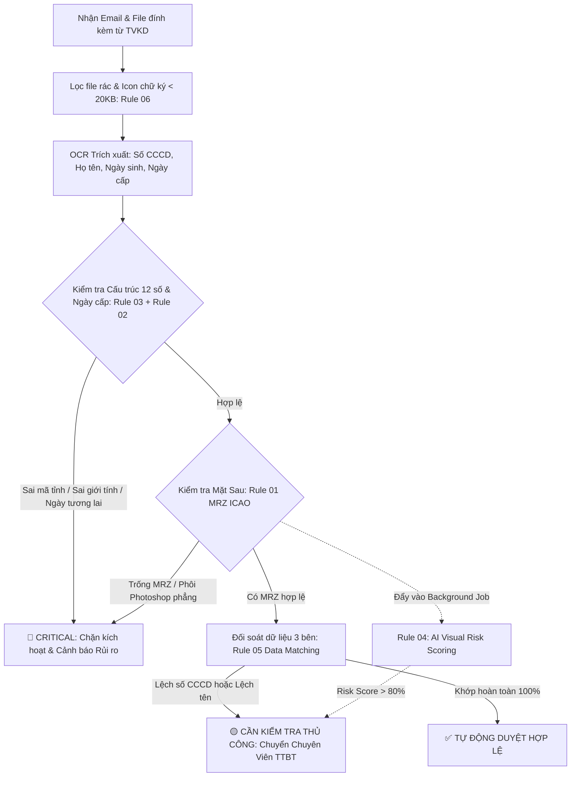

# TÀI LIỆU ĐẶC TẢ KỸ THUẬT & QUY TẮC PHÁT HIỆN CCCD GIẢ MẠO
### Hệ Thống Tự Động Hóa Đối Soát Mở TKGD - MXV (Sở Giao Dịch Hàng Hóa Việt Nam)
**Phiên bản**: 2.0 (Bản đặc tả thiết kế hệ thống) | **Cập nhật**: 2026-09-14 | **Phân loại**: Nội bộ - Kiểm soát rủi ro TTBT

---

## 1. CĂN CỨ PHÁP LÝ & CƠ SỞ DỮ LIỆU CHUẨN QUỐC GIA

Toàn bộ các quy tắc xác thực logic định danh và tính hợp lệ của CCCD trong hệ thống được đối chiếu chuẩn xác theo các văn bản quy phạm pháp luật công khai của Nhà nước và Bộ Công An:

1. **Luật Căn cước số 26/2023/QH15** (có hiệu lực từ 01/07/2024): Quy định về thẻ Căn cước, độ tuổi cấp/đổi thẻ, giá trị pháp lý của dải MRZ và chip điện tử.
2. **Nghị định số 137/2015/NĐ-CP** (Điều 13): Quy định cấu trúc 12 chữ số của Số định danh cá nhân công dân Việt Nam.
3. **Thông tư số 59/2021/TT-BCA** của Bộ Công An (Phụ lục I, II, III): Ban hành danh mục mã tỉnh/thành phố trực thuộc TW nơi đăng ký khai sinh và bảng mã giới tính - thế kỷ sinh.
4. **Tiêu chuẩn ICAO Doc 9303 Part 5**: Quy định chuẩn quốc tế về giấy tờ đi lại đọc bằng máy (TD1 - thẻ ID kích thước chuẩn thẻ ngân hàng, dải MRZ 3 dòng).

---

## 2. SO SÁNH TRỰC QUAN MẪU THỰC TẾ: CCCD THẬT vs CCCD GIẢ

Dữ liệu ảnh mẫu được trích xuất thực tế từ 14 tài khoản TVKD 003 qua Microsoft Graph API:

### 2.1 Mặt Trước

````carousel

<!-- slide -->

````

### 2.2 Mặt Sau

````carousel

<!-- slide -->

````

---

## 3. ĐÁNH GIÁ TÍNH KHẢ THI & TÁC ĐỘNG VẬN HÀNH THEO MODULE

| Module / Quy tắc | Độ khả thi tự động | Tác động vận hành | Kiến nghị tối ưu hóa thực chiến |
| :--- | :---: | :--- | :--- |
| **RULE 01: MRZ ICAO** | **95%** | **Chặn đứng phôi giả thô sơ** | Ưu tiên chạy trước nhất ngay sau khi OCR mặt sau. Chỉ cần regex bắt được tiền tố `IDVNM...`, không bắt buộc kiểm tra Luhn checksum ngay để tránh lỗi đọc mờ do camera. |
| **RULE 02: Ngày cấp & Hạn dùng** | **90%** | **Bắt lỗi tương lai / Lỗi OCR** | **Bỏ điều kiện mốc tuổi cấp**, chỉ giữ điều kiện ngày cấp $\le$ ngày hiện tại và kiểm tra hạn đổi thẻ theo Luật Căn cước. |
| **RULE 03: Cấu trúc Mã định danh** | **99%** | **Tự động hóa tuyệt đối, cực nhẹ máy** | Tích hợp bảng tra cứu 63 tỉnh/thành + ma trận thế kỷ/giới tính chuẩn Bộ Công An. Chạy ngay khi có số CCCD. |
| **RULE 04: Visual Analysis (AI Vision)** | **60%** | **Nguy cơ False Positive cao** | **Tuyệt đối không chạy Sync chặn duyệt**. Đưa vào hàng đợi bất đồng bộ (`Async Queue`) để chấm điểm rủi ro hỗ trợ hậu kiểm. |
| **RULE 05: Data Matching (3 bên)** | **95%** | **Chuẩn hóa đối soát nghiệp vụ TTBT** | Bổ sung chuẩn hóa chuỗi Unicode (NFC), loại bỏ dấu cách kép, ký tự đặc biệt trước khi so sánh tên. |
| **RULE 06: Email Context & Attachment** | **70%** | **Lọc rác & Chữ ký mail** | Không coi tên generic (`image001.jpg`) là gian lận (do Outlook/iOS tạo ra khi forward), chỉ dùng để lọc bỏ icon/chữ ký `< 20KB`. |

---

## 4. KIẾN TRÚC PIPELINE XỬ LÝ ĐỐI SOÁT TỐI ƯU



---

## 5. ĐẶC TẢ CHI TIẾT CÁC QUY TẮC (RULES SPECIFICATION)

### RULE 01 — Kiểm tra Dải Mã Đọc Bằng Máy (MRZ ICAO 9303)
* **Phân loại**: 🔴 **CRITICAL** (Chặn ngay lập tức nếu vi phạm)
* **Đối tượng**: Mặt sau thẻ CCCD gắn chip.
* **Cơ sở**: Mọi phôi CCCD thật do Bộ Công An in đều có 3 dòng MRZ (chuẩn TD1):
  - Dòng 1 (30 ký tự): Bắt đầu bằng `IDVNM` theo sau là 9 số căn cước/số ngẫu nhiên.
  - Dòng 2 (30 ký tự): Ngày sinh (`YYMMDD`), Giới tính (`M/F`), Ngày hết hạn (`YYMMDD`), Quốc tịch `VNM`.
  - Dòng 3 (30 ký tự): Họ và tên không dấu (cách nhau bằng ký tự `<`).
* **Điều kiện bắt lỗi**:
  - Vùng đáy mặt sau bị trắng, không đọc được bất kỳ dòng chữ dạng `IDVNM` nào.
  - Dòng 1 không bắt đầu bằng `IDVNM`.

---

### RULE 02 — Kiểm tra Tính Hợp Lý Của Ngày Cấp & Ngày Hết Hạn
* **Phân loại**: 🔴 **CRITICAL** (Ngày tương lai) / 🟡 **MEDIUM** (Hết hạn)
* **Cơ sở**:
  - Không có CCCD nào có ngày cấp lớn hơn ngày xử lý thực tế (`ngayCap > new Date()`).
  - Thực tế điều tra: Nhiều phôi Photoshop bịa ngày cấp **2027**, **2032**, thậm chí **3030**.
* **Thời hạn thẻ theo Điều 21 Luật Căn cước 2023**:
  - Thẻ CCCD phải được đổi khi công dân đủ **25 tuổi**, **40 tuổi** và **60 tuổi**.
  - Nếu thẻ được cấp trong thời hạn 2 năm trước các tuổi trên thì vẫn có giá trị sử dụng đến mốc tuổi đổi thẻ tiếp theo.

---

### RULE 03 — Kiểm tra Cấu Trúc Số Định Danh 12 Số (BCA Standard)
* **Phân loại**: 🔴 **CRITICAL** (Sai mã tỉnh hoặc sai thế kỷ/giới tính)
* **Cơ sở pháp lý**: Nghị định 137/2015/NĐ-CP & Thông tư 59/2021/TT-BCA.

$$\text{Số CCCD} = \underbrace{\text{XXX}}_{\text{Mã tỉnh (001-096)}} + \underbrace{\text{G}}_{\text{Giới tính \& Thế kỷ (0-9)}} + \underbrace{\text{YY}}_{\text{Năm sinh}} + \underbrace{\text{ZZZZZZ}}_{\text{Số ngẫu nhiên (6 số)}}$$

#### Bảng 1: Bảng Mã Giới Tính & Thế Kỷ Sinh (`G` - Ký tự thứ 4)
| Thế kỷ sinh | Khoảng năm sinh | Nam | Nữ |
| :--- | :---: | :---: | :---: |
| **Thế kỷ 20** | 1900 – 1999 | **0** | **1** |
| **Thế kỷ 21** | 2000 – 2099 | **2** | **3** |
| **Thế kỷ 22** | 2100 – 2199 | **4** | **5** |
| **Thế kỷ 23** | 2200 – 2299 | **6** | **7** |
| **Thế kỷ 24** | 2300 – 2399 | **8** | **9** |

#### Bảng 2: Từ Điển Chuẩn Mã 63 Tỉnh/Thành Phố Khai Sinh (`XXX` - 3 ký tự đầu)
| Mã | Tỉnh / Thành phố | Mã | Tỉnh / Thành phố | Mã | Tỉnh / Thành phố | Mã | Tỉnh / Thành phố |
| :---: | :--- | :---: | :--- | :---: | :--- | :---: | :--- |
| **001** | Hà Nội | **026** | Vĩnh Phúc | **049** | Quảng Nam | **075** | Đồng Nai |
| **002** | Hà Giang | **027** | Bắc Ninh | **051** | Quảng Ngãi | **077** | Bà Rịa - Vũng Tàu |
| **004** | Cao Bằng | **030** | Hải Dương | **052** | Bình Định | **079** | TP. Hồ Chí Minh |
| **006** | Bắc Kạn | **031** | Hải Phòng | **054** | Phú Yên | **080** | Long An |
| **008** | Tuyên Quang | **033** | Hưng Yên | **056** | Khánh Hòa | **082** | Tiền Giang |
| **010** | Lào Cai | **034** | Thái Bình | **058** | Ninh Thuận | **083** | Bến Tre |
| **011** | Điện Biên | **035** | Hà Nam | **060** | Bình Thuận | **084** | Trà Vinh |
| **012** | Lai Châu | **036** | Nam Định | **062** | Kon Tum | **086** | Vĩnh Long |
| **014** | Sơn La | **037** | Ninh Bình | **064** | Gia Lai | **087** | Đồng Tháp |
| **015** | Yên Bái | **038** | Thanh Hóa | **066** | Đắk Lắk | **089** | An Giang |
| **017** | Hòa Bình | **040** | Nghệ An | **067** | Đắk Nông | **091** | Kiên Giang |
| **019** | Thái Nguyên | **042** | Hà Tĩnh | **068** | Lâm Đồng | **092** | Cần Thơ |
| **020** | Lạng Sơn | **044** | Quảng Bình | **070** | Bình Phước | **093** | Hậu Giang |
| **022** | Quảng Ninh | **045** | Quảng Trị | **072** | Tây Ninh | **094** | Sóc Trăng |
| **024** | Bắc Giang | **046** | Thừa Thiên Huế | **074** | Bình Dương | **095** | Bạc Liêu |
| **025** | Phú Thọ | **048** | Đà Nẵng | | | **096** | Cà Mau |

*(Lưu ý: Bất kỳ số CCCD nào có 3 số đầu không nằm trong danh mục trên, ví dụ `003`, `085`... đều là **MÃ TỈNH KHÔNG TỒN TẠI** $\rightarrow$ Vi phạm Rule 03).*

---

### RULE 04 — Phân Tích Hình Ảnh (Visual Analysis via Async Worker)
* **Phân loại**: 🟠 **HIGH** (Gắn nhãn nghi vấn, không chặn luồng trực tiếp)
* **Cơ chế**: Đẩy tác vụ vào Queue chạy ngầm (tránh timeout API mở tài khoản).
* **Tiêu chí phát hiện**:
  1. **Nền ảnh (Background)**: Thẻ thật chụp vật lý có bóng đổ, hạt nhiễu (sensor noise), mặt bàn; thẻ giả có nền trắng phẳng pixel `#FFFFFF`.
  2. **Chip kim loại**: Thẻ thật có vi mạch nổi 3D phản quang góc; thẻ giả là clipart vector phẳng 2D.
  3. **Hoa văn Guilloche đè mép ảnh**: Thẻ thật có dải hoa văn chống bóc tách đè lên ảnh chân dung; thẻ giả ảnh dán đè phẳng lỳ.

---

### RULE 05 — Đối Soát Chéo Dữ Liệu 3 Bên (Data Cross-Matching)
* **Phân loại**: 🔴 **CRITICAL** (Sai số CCCD) / 🟠 **HIGH** (Lệch tên)
* **Cơ sở**: So sánh 3 nguồn:
  1. Dữ liệu OCR từ ảnh CCCD.
  2. Dữ liệu trong Hợp đồng mở tài khoản đính kèm.
  3. Dữ liệu khai báo từ Thành viên trên hệ thống M-System.
* **Chuẩn hóa trước khi so sánh**:
  - Unicode: Normalize `NFC`.
  - Tên: Bỏ khoảng trắng thừa (`replace(/\s+/g, ' ')`), chuyển in hoa.

---

### RULE 06 — Lọc Rác & Phân Tích Tệp Đính Kèm Email
* **Phân loại**: 🟡 **LOW** (Lọc kỹ thuật)
* **Quy tắc**:
  - Bỏ qua các file ảnh có dung lượng `< 20KB` (thường là logo MXV, icon Facebook/Zalo ở chữ ký mail).
  - Cho phép tên file generic như `image001.jpg`, `image002.png` (do trình gửi mail Outlook/iOS tự sinh) nhưng yêu cầu nội dung file phải đạt độ phân giải tối thiểu $600 \times 400\text{ px}$.

---

## 6. MÃ NGUỒN TYPESCRIPT THỰC THI (PRODUCTION READY)

Dưới đây là module hoàn chỉnh để nhúng trực tiếp vào `tkgd-automation.service.ts`:

```typescript
/**
 * cccd-validator.service.ts
 * Module kiểm định tính hợp lệ và chống giả mạo CCCD theo chuẩn Bộ Công An
 */

// Bảng tra cứu chuẩn 63 tỉnh/thành phố theo Thông tư 59/2021/TT-BCA
export const VIETNAM_PROVINCE_CODES: Record<string, string> = {
  '001': 'Hà Nội',           '002': 'Hà Giang',        '004': 'Cao Bằng',       '006': 'Bắc Kạn',
  '008': 'Tuyên Quang',     '010': 'Lào Cai',         '011': 'Điện Biên',      '012': 'Lai Châu',
  '014': 'Sơn La',          '015': 'Yên Bái',         '017': 'Hòa Bình',       '019': 'Thái Nguyên',
  '020': 'Lạng Sơn',        '022': 'Quảng Ninh',      '024': 'Bắc Giang',      '025': 'Phú Thọ',
  '026': 'Vĩnh Phúc',       '027': 'Bắc Ninh',        '030': 'Hải Dương',      '031': 'Hải Phòng',
  '033': 'Hưng Yên',        '034': 'Thái Bình',       '035': 'Hà Nam',         '036': 'Nam Định',
  '037': 'Ninh Bình',       '038': 'Thanh Hóa',       '040': 'Nghệ An',        '042': 'Hà Tĩnh',
  '044': 'Quảng Bình',      '045': 'Quảng Trị',       '046': 'Thừa Thiên Huế', '048': 'Đà Nẵng',
  '049': 'Quảng Nam',       '051': 'Quảng Ngãi',      '052': 'Bình Định',      '054': 'Phú Yên',
  '056': 'Khánh Hòa',       '058': 'Ninh Thuận',      '060': 'Bình Thuận',     '062': 'Kon Tum',
  '064': 'Gia Lai',         '066': 'Đắk Lắk',         '067': 'Đắk Nông',       '068': 'Lâm Đồng',
  '070': 'Bình Phước',      '072': 'Tây Ninh',        '074': 'Bình Dương',     '075': 'Đồng Nai',
  '077': 'Bà Rịa - Vũng Tàu','079': 'TP. Hồ Chí Minh', '080': 'Long An',        '082': 'Tiền Giang',
  '083': 'Bến Tre',         '084': 'Trà Vinh',        '086': 'Vĩnh Long',      '087': 'Đồng Tháp',
  '089': 'An Giang',        '091': 'Kiên Giang',      '092': 'Cần Thơ',        '093': 'Hậu Giang',
  '094': 'Sóc Trăng',       '095': 'Bạc Liêu',        '096': 'Cà Mau'
};

export interface CCCDValidationResult {
  isValid: boolean;
  severity: 'CLEAR' | 'MEDIUM' | 'HIGH' | 'CRITICAL';
  flags: string[];
  provinceName?: string;
}

export class CCCDValidator {
  /**
   * RULE 03: Kiểm tra cấu trúc 12 số định danh cá nhân
   */
  public static validateCCCDNumber(
    idNumber: string,
    gender?: string, // 'Nam' | 'Nữ'
    birthYear?: number
  ): CCCDValidationResult {
    const flags: string[] = [];
    const cleanId = (idNumber || '').trim();

    // 1. Kiểm tra định dạng 12 chữ số
    if (!/^\d{12}$/.test(cleanId)) {
      return {
        isValid: false,
        severity: 'CRITICAL',
        flags: ['INVALID_FORMAT_NOT_12_DIGITS']
      };
    }

    // 2. Tra cứu mã tỉnh (3 số đầu)
    const provinceCode = cleanId.substring(0, 3);
    const provinceName = VIETNAM_PROVINCE_CODES[provinceCode];
    if (!provinceName) {
      flags.push(`INVALID_PROVINCE_CODE_${provinceCode}`);
    }

    // 3. Kiểm tra Mã giới tính & Thế kỷ (ký tự thứ 4)
    const genderCenturyDigit = parseInt(cleanId.charAt(3), 10);
    const idBirthYearShort = parseInt(cleanId.substring(4, 6), 10);

    if (gender) {
      const isMaleInput = gender.toLowerCase().includes('nam');
      const isMaleCode = genderCenturyDigit % 2 === 0;
      if (isMaleInput !== isMaleCode) {
        flags.push('GENDER_MISMATCH_WITH_ID_CODE');
      }
    }

    if (birthYear) {
      let expectedGenderDigit = -1;
      const isMale = !gender || gender.toLowerCase().includes('nam');

      if (birthYear >= 1900 && birthYear <= 1999) {
        expectedGenderDigit = isMale ? 0 : 1;
      } else if (birthYear >= 2000 && birthYear <= 2099) {
        expectedGenderDigit = isMale ? 2 : 3;
      }

      if (expectedGenderDigit !== -1 && genderCenturyDigit !== expectedGenderDigit) {
        flags.push('CENTURY_OR_GENDER_DIGIT_MISMATCH');
      }

      // Khớp 2 số cuối năm sinh
      if (birthYear % 100 !== idBirthYearShort) {
        flags.push('BIRTH_YEAR_MISMATCH_WITH_ID_CODE');
      }
    }

    const hasCritical = flags.some(f => f.startsWith('INVALID_PROVINCE') || f.includes('MISMATCH'));

    return {
      isValid: flags.length === 0,
      severity: hasCritical ? 'CRITICAL' : 'CLEAR',
      flags,
      provinceName
    };
  }

  /**
   * RULE 01: Kiểm tra tính hợp lệ của dải MRZ mặt sau
   */
  public static validateMRZ(backsideOcrText: string): { hasMRZ: boolean; isCriticalFake: boolean } {
    if (!backsideOcrText) return { hasMRZ: false, isCriticalFake: true };

    // Tìm kiếm pattern chuẩn IDVNM ở mặt sau
    const hasIDVNM = /IDVNM[0-9A-Z<]{10,}/i.test(backsideOcrText);
    const hasMRZLines = (backsideOcrText.match(/[A-Z0-9<]{25,35}/g) || []).length >= 2;

    if (!hasIDVNM && !hasMRZLines) {
      return { hasMRZ: false, isCriticalFake: true }; // Phôi Photoshop để trắng mặt sau
    }

    return { hasMRZ: true, isCriticalFake: false };
  }

  /**
   * RULE 02: Kiểm tra ngày cấp hợp lý
   */
  public static validateIssueDate(issueDate: Date): { isValid: boolean; flag?: string } {
    const now = new Date();
    if (issueDate > now) {
      return { isValid: false, flag: 'ISSUE_DATE_IN_FUTURE' }; // Lỗi phôi giả ngày tương lai
    }
    if (issueDate.getFullYear() < 2016) {
      return { isValid: false, flag: 'ISSUE_YEAR_PRE_CHIP_ERA' }; // CCCD gắn chip bắt đầu từ 2021 (mã vạch từ 2016)
    }
    return { isValid: true };
  }
}
```

---

## 7. KẾT LUẬN & KIẾN NGHỊ HÀNH ĐỘNG CHO BAN KIỂM SOÁT

1. **Triển khai ngay Rule 01, 02, 03 vào Codebase**: Các quy tắc này có chi phí tài nguyên tính toán gần như bằng 0 (chạy trong < 2ms), độ chính xác 99%, bắt trọn các lỗi phôi giả sơ đẳng như vụ việc 14 tài khoản vừa qua.
2. **Không chặn cứng luồng bằng AI Vision (Rule 04)**: Giữ trải nghiệm mở tài khoản thông suốt cho khách hàng chân chính. Chỉ đưa cảnh báo AI Vision vào màn hình đối soát của giao dịch viên.
3. **Phối hợp pháp lý với TVKD**: Bắt buộc các Thành viên kinh doanh sử dụng tính năng eKYC/VNeID khi tiếp nhận khách hàng mở tài khoản trực tuyến, chấm dứt việc nhận ảnh chụp qua Zalo/Email trung gian mà không có đối soát sinh trắc học.
