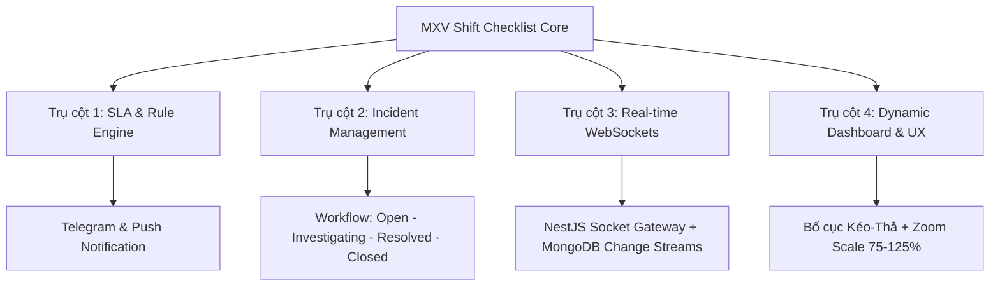
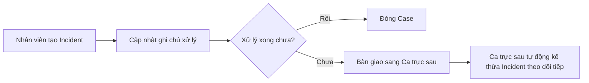

# KẾ HOẠCH PHÁT TRIỂN & MỞ RỘNG HỆ THỐNG MXV SHIFT CHECKLIST
> **Tài liệu Định hướng Kiến trúc & Triển khai Kỹ thuật**
> *Áp dụng các triết lý thiết kế Realtime, SLA Alert, Incident Management và Dynamic Dashboard từ hệ thống Transaction Monitor.*

---

## 1. TỔNG QUAN ĐỊNH HƯỚNG
Mục tiêu là nâng cấp hệ thống **MXV Shift Checklist** từ ứng dụng tích việc tĩnh (Static Checklist) thành **Hệ thống điều hành vận hành thời gian thực (Real-time Operations Engine)**. Điều này giúp:
- **Tự động hóa cảnh báo:** Phát hiện sớm các việc quan trọng sắp trễ hạn (SLA).
- **Quản lý sự cố tích hợp:** Gắn vết lỗi thực tế (Incident) trực tiếp vào từng tác vụ lỗi trong ca trực.
- **Tăng tính cộng tác:** Đồng bộ trạng thái checklist tức thời giữa các nhân sự trực thông qua WebSocket.
- **Tùy biến tối đa:** Cho phép cấu hình Dashboard cá nhân hóa theo từng vai trò (Nhân viên vận hành, Trưởng phòng, Giám đốc ban).

---

## 2. KIẾN TRÚC MỞ RỘNG CHI TIẾT (4 TRỤ CỘT)



---

### TRỤ CỘT 1: CẢNH BÁO DEADLINE & LUẬT VẬN HÀNH (SLA & RULE ENGINE)

#### 1. Mongoose Schema cho SLA Rules
Thiết lập các luật quét tự động để phát hiện các tác vụ bị trễ hạn so với mốc thời gian quy định của phiên giao dịch.

```typescript
// backend/src/schemas/sla-rule.schema.ts
import { Prop, Schema, SchemaFactory } from '@nestjs/mongoose';
import { Document, Types } from 'mongoose';

@Schema({ timestamps: true })
export class SlaRule extends Document {
  @Prop({ required: true, unique: true })
  ruleCode: string; // ví dụ: SLA_OPEN_CRITICAL_WARN

  @Prop({ required: true })
  ruleName: string; // ví dụ: Cảnh báo trễ hạn việc Critical phiên mở cửa

  @Prop({ required: true, enum: ['OPEN', 'DURING', 'CLOSE'] })
  sessionType: string;

  @Prop({ required: true, enum: ['CRITICAL', 'HIGH', 'MEDIUM', 'LOW'] })
  priority: string;

  @Prop({ required: true, default: 15 })
  alertBeforeMinutes: number; // Cảnh báo trước deadline X phút

  @Prop({ required: true, default: true })
  isActive: boolean;

  @Prop({ type: [String], default: ['TELEGRAM', 'PUSH'] })
  channels: string[]; // Các kênh thông báo
}

export const SlaRuleSchema = SchemaFactory.createForClass(SlaRule);
```

#### 2. Công cụ Quét SLA Tự Động (Cron Job / Worker)
Quét định kỳ mỗi phút các ca trực đang hoạt động và gửi cảnh báo nếu phát hiện tác vụ chưa check sắp đến deadline.

```typescript
// backend/src/modules/shifts/sla-monitor.service.ts
import { Injectable } from '@nestjs/common';
import { Cron, CronExpression } from '@nestjs/schedule';
import { InjectModel } from '@nestjs/mongoose';
import { Model } from 'mongoose';
import { ShiftLog } from '../../schemas/shift-log.schema';
import { SlaRule } from '../../schemas/sla-rule.schema';
import { TelegramService } from '../telegram/telegram.service';

@Injectable()
export class SlaMonitorService {
  constructor(
    @InjectModel(ShiftLog.name) private shiftLogModel: Model<ShiftLog>,
    @InjectModel(SlaRule.name) private slaRuleModel: Model<SlaRule>,
    private telegramService: TelegramService,
  ) {}

  @Cron(CronExpression.EVERY_MINUTE)
  async checkPendingSla() {
    const activeShifts = await this.shiftLogModel.find({ status: 'PENDING' });
    const rules = await this.slaRuleModel.find({ isActive: true });

    const now = new Date();
    const currentHourMin = `${String(now.getHours()).padStart(2, '0')}:${String(now.getMinutes()).padStart(2, '0')}`;

    for (const shift of activeShifts) {
      for (const item of shift.details) {
        if (!item.isChecked) {
          // Logic so sánh thời gian hiện tại với deadline của item
          // Nếu vi phạm cấu hình của Rule -> trigger thông báo
          const isViolated = this.evaluateSla(item, currentHourMin, rules);
          if (isViolated) {
            await this.telegramService.sendMessage(
              `⚠️ [SLA ALERT] Tác vụ "${item.taskNameSnapshot}" trong ca trực ngày ${shift.shiftDate} chưa được hoàn thành!`,
            );
          }
        }
      }
    }
  }

  private evaluateSla(item: any, currentTime: string, rules: SlaRule[]): boolean {
    // Triển khai logic tính toán thời gian cụ thể tại đây...
    return false;
  }
}
```

---

### TRỤ CỘT 2: QUẢN LÝ SỰ CỐ CA TRỰC (INCIDENT CASE MANAGEMENT)

Khi một tác vụ vận hành bị thất bại (ví dụ: *Lỗi kết nối cổng FIX Gateway sang MSB*), nhân sự không thể chỉ tích hoàn thành mà phải báo cáo lỗi và theo dõi. Sự cố này sẽ được đóng gói thành một **Incident Case**.

#### 1. Mongoose Schema cho Incident Case

```typescript
// backend/src/schemas/incident-case.schema.ts
import { Prop, Schema, SchemaFactory } from '@nestjs/mongoose';
import { Document, Types } from 'mongoose';

@Schema({ timestamps: true })
export class IncidentCase extends Document {
  @Prop({ required: true, unique: true })
  caseId: string; // ví dụ: INC-20260619-001

  @Prop({ type: Types.ObjectId, ref: 'ShiftLog', required: true })
  shiftLogId: Types.ObjectId;

  @Prop({ required: true })
  taskId: string; // Liên kết với taskId của checklist_templates

  @Prop({ required: true })
  title: string; // Ví dụ: Cổng FIX Gateway MSB mất ping

  @Prop({ required: true })
  description: string;

  @Prop({ type: [String], default: [] })
  evidences: string[]; // Chứa các link ảnh hoặc log file đính kèm

  @Prop({ required: true, enum: ['OPEN', 'INVESTIGATING', 'RESOLVED', 'CLOSED'], default: 'OPEN' })
  status: string;

  @Prop({ type: Types.ObjectId, ref: 'User' })
  assignedTo: Types.ObjectId; // Nhân sự phụ trách xử lý

  @Prop({
    type: [{
      timestamp: { type: Date, default: Date.now },
      note: String,
      updatedBy: { type: Types.ObjectId, ref: 'User' }
    }],
    default: []
  })
  history: Array<{ timestamp: Date; note: string; updatedBy: Types.ObjectId }>;
}

export const IncidentCaseSchema = SchemaFactory.createForClass(IncidentCase);
```

#### 2. Workflow Chuyển Ca (Shift Handover) tích hợp Sự cố
Khi kết thúc ca, nhân viên thực hiện luồng bàn giao sự cố:



---

### TRỤ CỘT 3: ĐỒNG BỘ THỜI GIAN THỰC (REAL-TIME VIA WEBSOCKETS)

Sử dụng WebSocket để khi một nhân viên tích chọn hoàn thành công việc ở máy tính A, màn hình của nhân viên B và Trưởng bộ phận sẽ lập tức cập nhật trạng thái mà không cần tải lại trang.

#### 1. Backend: NestJS Socket Gateway

```typescript
// backend/src/modules/shifts/shifts.gateway.ts
import { WebSocketGateway, WebSocketServer, SubscribeMessage, OnGatewayConnection, OnGatewayDisconnect } from '@nestjs/websockets';
import { Server, Socket } from 'socket.io';
import { UseGuards } from '@nestjs/common';
import { WsJwtGuard } from '../auth/guards/ws-jwt.guard';

@WebSocketGateway({ cors: { origin: '*' } })
export class ShiftsGateway implements OnGatewayConnection, OnGatewayDisconnect {
  @WebSocketServer()
  server: Server;

  handleConnection(client: Socket) {
    console.log(`Client connected: ${client.id}`);
  }

  handleDisconnect(client: Socket) {
    console.log(`Client disconnected: ${client.id}`);
  }

  // Phát tín hiệu khi có cập nhật checklist
  broadcastShiftUpdate(shiftId: string, updatedData: any) {
    this.server.emit(`shift_update_${shiftId}`, updatedData);
  }
}
```

#### 2. Frontend: NextJS React Hook lắng nghe cập nhật realtime

```typescript
// frontend/src/hooks/useRealtimeShift.ts
import { useEffect, useState } from 'react';
import { io } from 'socket.io-client';

export const useRealtimeShift = (shiftId: string, initialDetails: any[]) => {
  const [details, setDetails] = useState(initialDetails);

  useEffect(() => {
    const socket = io(process.env.NEXT_PUBLIC_SOCKET_URL || 'http://localhost:3000');

    socket.on(`shift_update_${shiftId}`, (updatedItem: any) => {
      setDetails((prev) =>
        prev.map((item) => (item.taskId === updatedItem.taskId ? { ...item, ...updatedItem } : item))
      );
    });

    return () => {
      socket.disconnect();
    };
  }, [shiftId]);

  return { details, setDetails };
};
```

---

### TRỤ CỘT 4: DASHBOARD ĐỘNG & TÙY BIẾN GIAO DIỆN (DYNAMIC DASHBOARD & UX)

Để bảo vệ thị lực của đội ngũ vận hành 24/7 và hỗ trợ cấu hình theo chức vụ, hệ thống cần hỗ trợ:
1. **Zoom Scale động:** 9 mức tỉ lệ từ 75% đến 125% lưu trữ vào thiết lập người dùng.
2. **Kéo-thả Widgets:** Cho phép bật/tắt và sắp xếp các Box giám sát.

#### 1. Quản lý Zoom Scale (Frontend Utility)
Áp dụng zoom bằng cách điều chỉnh biến CSS hoặc thuộc tính `zoom` của thẻ `body`.

```typescript
// frontend/src/utils/theme.ts
export const applyZoomScale = (scale: number) => {
  if (typeof document !== 'undefined') {
    const root = document.documentElement;
    // Sử dụng CSS custom property để kiểm soát zoom hoặc scale của container chính
    root.style.setProperty('--app-zoom-scale', `${scale}%`);
  }
};
```

#### 2. Frontend: Tùy chỉnh Layout Dashboard (Kéo-Thả)
Sử dụng thư viện `@hello-pangea/dnd` hoặc `react-grid-layout` để lưu vị trí các Widget.

```typescript
// frontend/src/components/dashboard/CustomizableDashboard.tsx
import React, { useState } from 'react';
import { DragDropContext, Droppable, Draggable } from '@hello-pangea/dnd';

interface Widget {
  id: string;
  title: string;
  component: React.ReactNode;
}

export default function CustomizableDashboard({ initialWidgets }: { initialWidgets: Widget[] }) {
  const [widgets, setWidgets] = useState(initialWidgets);

  const handleOnDragEnd = (result: any) => {
    if (!result.destination) return;
    const items = Array.from(widgets);
    const [reorderedItem] = items.splice(result.source.index, 1);
    items.splice(result.destination.index, 0, reorderedItem);
    setWidgets(items);
    
    // Gọi API PATCH /api/v1/users/settings để lưu layout mới vào MongoDB
    saveLayoutToDatabase(items.map(w => w.id));
  };

  return (
    <DragDropContext onDragEnd={handleOnDragEnd}>
      <Droppable droppableId="widgets-grid" direction="horizontal">
        {(provided) => (
          <div {...provided.droppableProps} ref={provided.innerRef} className="grid grid-cols-1 md:grid-cols-3 gap-4">
            {widgets.map((widget, index) => (
              <Draggable key={widget.id} draggableId={widget.id} index={index}>
                {(provided) => (
                  <div
                    ref={provided.innerRef}
                    {...provided.draggableProps}
                    {...provided.dragHandleProps}
                    className="bg-white/10 backdrop-blur-md border border-white/20 p-5 rounded-2xl shadow-lg"
                  >
                    <h3 className="font-bold text-slate-800 dark:text-white mb-3">{widget.title}</h3>
                    {widget.component}
                  </div>
                )}
              </Draggable>
            ))}
            {provided.placeholder}
          </div>
        )}
      </Droppable>
    </DragDropContext>
  );
}
```

---

## 3. CHECKLIST CÁC BƯỚC TRIỂN KHAI (TASKS)

### Phase 1: Đồng bộ Real-time & Nâng cấp UX
- [ ] Thiết lập WebSocket Gateway tại Backend NestJS.
- [ ] Cập nhật API `/shifts/items/toggle` để phát sự kiện sang Socket Gateway.
- [ ] Xây dựng React Hook `useRealtimeShift` ở Frontend Next.js.
- [ ] Thêm thiết lập Theme (Light/Dark) và Zoom Scale (75% - 125%) lưu trữ vào database.

### Phase 2: Tích hợp Sự Cố (Incident Handover)
- [ ] Tạo Schema `incident_cases` trong MongoDB.
- [ ] Viết API CRUD cho Incident Case (`POST /incidents`, `GET /incidents/:id`, `PATCH /incidents/:id`).
- [ ] Thêm giao diện "Báo cáo sự cố" trực tiếp trên từng Task của màn hình Checklist.
- [ ] Xây dựng logic tự động kế thừa Incident chưa đóng sang ca trực tiếp theo khi tiến hành mở ca mới (`POST /shifts/initialize`).

### Phase 3: SLA Rule Engine & Dynamic Dashboard
- [ ] Tạo Schema `sla_rules` cấu hình deadline & độ ưu tiên của Task.
- [ ] Viết Cron Job quét định kỳ mỗi phút phát hiện trễ hạn.
- [ ] Tích hợp thông báo qua Telegram Bot cho các sự kiện SLA Overdue & Incident New.
- [ ] Thiết kế Dashboard linh hoạt cho phép Kéo-Thả & Bật/Tắt các widget giám sát.

---

## 4. GỢI Ý ĐỊNH HƯỚNG TỐI ƯU HIỆU NĂNG (PERFORMANCE)
1. **Tránh N+1 Query:** Khi truy vấn danh sách `shift_logs`, tránh populate chi tiết từng `IncidentCase` bên trong vòng lặp. Sử dụng MongoDB Aggregation `$lookup` để gộp dữ liệu lỗi vào log tương ứng chỉ với 1 query duy nhất.
2. **Index Chiến Lược:** Tạo index hỗn hợp `{ "shiftDate": -1, "status": 1 }` và `{ "code": 1 }` để các truy vấn danh sách ca trực thực tế đạt độ phức tạp $O(1)$ hoặc $O(\log N)$.
3. **MongoDB Change Streams:** Nếu hệ thống chạy MongoDB Replica Set trên môi trường Production, thay vì gọi thủ công Socket Gateway trong Controller, hãy cho NestJS lắng nghe Change Streams trực tiếp từ Collection `shift_logs` để phát tín hiệu realtime đồng bộ hoàn toàn tự động và an toàn.
