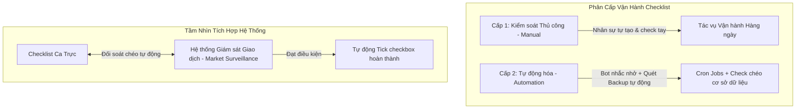
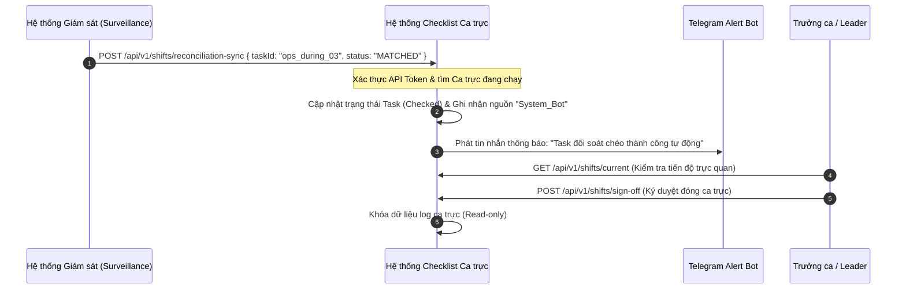

# TÀI LIỆU ĐẶC TẢ YÊU CẦU PHẦN MỀM (SRS)
## HỆ THỐNG SỐ HÓA & TỰ ĐỘNG HÓA CHECKLIST CA TRỰC (MXV SHIFT CHECKLIST)
> **Phiên bản:** v2.0-DRAFT  
> **Tác giả:** Hệ thống BA & Senior Developer (Antigravity)  
> **Ngày lập:** 19/06/2026  
> **Trạng thái:** Sẵn sàng cho triển khai và tích hợp tương lai

---

## 1. GIỚI THIỆU (INTRODUCTION)

### 1.1. Mục đích (Purpose)
Tài liệu này đặc tả chi tiết các yêu cầu nghiệp vụ (Business Requirements), yêu cầu chức năng (Functional Requirements), và thiết kế kỹ thuật (Technical Specifications) để nâng cấp và mở rộng hệ thống **MXV Shift Checklist**. Tài liệu đóng vai trò làm khung tham chiếu (Blueprint) cho đội ngũ phát triển (Developers) và kiểm thử (QA/QC) trong các giai đoạn tiếp theo.

### 1.2. Thuật ngữ và Từ viết tắt (Glossary)
| Thuật ngữ | Định nghĩa |
| :--- | :--- |
| **SLA** | Service Level Agreement - Thời hạn cam kết hoàn thành công việc. |
| **Surveillance System** | Hệ thống Giám sát (được ghi nhận trong nghiệp vụ là *"so pai nừn"* / Giám sát thị trường và giao dịch). |
| **Reconciliation** | Đối soát chéo dữ liệu giữa các hệ thống độc lập. |
| **Shift Handover** | Bàn giao ca trực (bao gồm bàn giao các task chưa hoàn thành và sự cố). |
| **EOD** | End of Day - Hoạt động chốt ngày giao dịch. |
| **Cron Job / Worker** | Tiến trình chạy tự động theo lịch trình thiết lập sẵn trên máy chủ. |

---

## 2. PHÂN TÍCH NGHIỆP VỤ & PHẠM VI HỆ THỐNG

Dựa trên thông tin thu thập nghiệp vụ, hệ thống được cấu trúc theo 2 trục cốt lõi:



### 2.1. Phân cấp Vận hành Checklist
*   **Cấp 1 (Thủ công - Manual):** Cho phép nhân sự tự khai báo các đầu việc phát sinh đột xuất ngoài quy trình chuẩn (Dynamic Tasks). Nhân sự kiểm tra trực quan và tích chọn thủ công (Check tay) kèm ghi chú hoặc bằng chứng.
*   **Cấp 2 (Tự động hóa - Automation):** Hệ thống tự động khởi tạo danh sách việc cần làm theo lịch trực. Tích hợp các con Bot (Telegram/Email/Push) để nhắc nhở dựa trên mốc thời gian (Timetable). Tích hợp các script kiểm tra tự động (ví dụ: *kiểm tra file backup của cơ sở dữ liệu có tồn tại đúng kích thước hay không*) và tự tick nếu đạt yêu cầu.

### 2.2. Nghiệp vụ Tích hợp & Đối soát Chéo (Reconciliation)
*   **Tích hợp với Hệ thống Giám sát Giao dịch (Market Surveillance):** Hai hệ thống hiện tại chạy độc lập nhưng có thiết kế sẵn cổng API/Web hook để trao đổi trạng thái.
*   **Đối soát tự động (Cross-checking):** Thay vì nhân sự phải mở hệ thống Giám sát kiểm tra xem kết quả đối soát khớp chưa rồi mới quay lại Checklist tích tay; hệ thống Checklist sẽ lắng nghe sự kiện từ hệ thống Giám sát (hoặc định kỳ gọi API sang để kiểm tra). Khi dữ liệu khớp hoàn toàn $\rightarrow$ Hệ thống tự động tích checkbox hoàn thành và ghi rõ người cập nhật là `System_Bot`.
*   **Workflow Cấu hình Động (Tương lai):** Bộ phận nghiệp vụ (Business Operations) tự soạn thảo bộ ma trận danh sách đầu việc (Timetable, URL lấy file, đường dẫn dữ liệu, hướng dẫn vận hành). Hệ thống dựa vào cấu hình này để tự động sinh ra các Task tương ứng theo ca mà không cần can thiệp mã nguồn (No-code/Low-code Task Generator).
*   **Quy trình Phê duyệt Cuối Ca (Review & Sign-off):** Để giải quyết vấn đề Người quản lý (Leader/CEO) không nắm bắt được chi tiết ca trực do không còn in giấy tờ kiểm tra; hệ thống triển khai chức năng **Báo cáo tổng hợp ca trực (Shift Summary Report)** và nút **Phê duyệt ca trực (Sign-off)**. Cuối mỗi ca, Trưởng ca phải rà soát, viết nhận xét tổng quát và ký duyệt điện tử để đóng ca hoàn toàn.

---

## 3. YÊU CẦU CHỨC NĂNG CHIT TIẾT (FUNCTIONAL REQUIREMENTS)

### 3.1. Phân hệ Quản lý Lịch biểu & Khởi tạo Tác vụ (Schedule & Task Generator)
*   **REQ-001: Khởi tạo Ca trực tự động (Automated Shift Initialization)**
    *   *Mô tả:* Cứ đến giờ quy định của ca trực (Ca 1: 06h00, Ca 2: 14h00, Ca 3: 22h00), hệ thống sẽ tự động nhân bản (clone) cấu hình template của phòng ban tương ứng để tạo ra `ShiftLog` mới.
    *   *Tác nhân:* Hệ thống (System Engine).
*   **REQ-002: Tự tạo đầu việc thủ công (Ad-hoc Task Creation - Cấp 1)**
    *   *Mô tả:* Trưởng ca hoặc nhân sự vận hành trong ca có quyền tự tạo thêm các tác vụ phát sinh ngoài template tĩnh. Các tác vụ này có nhãn là `Ad-hoc` và phải được phê duyệt trước khi đóng ca.
    *   *Tác nhân:* Nhân viên vận hành (Staff), Trưởng ca (Leader).

### 3.2. Phân hệ Tự động hóa & Kiểm tra Dữ liệu (Automation & Backup Monitor - Cấp 2)
*   **REQ-003: Giám sát Trạng thái Backup dữ liệu (Database Backup Check)**
    *   *Mô tả:* Tích hợp tiến trình tự động quét thư mục lưu trữ Backup hoặc gọi API của DB Cluster. Nếu phát hiện file backup hợp lệ của ngày hôm đó $\rightarrow$ tự động cập nhật trạng thái Task *"Kiểm tra dữ liệu backup"* thành **Thành công** và đính kèm dung lượng file vào trường Note.
    *   *Tác nhân:* Automation Worker.
*   **REQ-004: Trợ lý Bot nhắc nhở & cảnh báo (Telegram Alert Bot)**
    *   *Mô tả:* Bot tự động gửi thông báo nhắc ca trực chuẩn bị làm việc, đưa ra các danh sách Task sắp hết thời hạn SLA, và gửi báo cáo tổng hợp nhanh khi kết thúc ca trực vào nhóm chung.
    *   *Tác nhân:* Telegram Bot.

### 3.3. Phân hệ Tích hợp & Đối soát Chéo (Integration & Reconciliation Engine)
*   **REQ-005: Nhận dữ liệu đối soát tự động (Automatic Reconciliation Sync)**
    *   *Mô tả:* Cung cấp API Endpoint bảo mật `POST /api/v1/shifts/reconciliation-sync` để hệ thống Giám sát giao dịch (Surveillance System) đẩy kết quả khớp lệnh/đối soát lệnh sang. 
    *   *Luồng xử lý:* 
        1. Nhận mã giao dịch hoặc mã phiên đối soát.
        2. Nếu kết quả gửi sang là `MATCHED` (Khớp hoàn toàn) $\rightarrow$ Tìm Task tương ứng trong `ShiftLog` đang mở $\rightarrow$ Tự động tích chọn checkbox $\rightarrow$ Set trạng thái `isChecked = true`, `updatedBy = System_Bot`, và `note = "Tự động đối soát khớp từ hệ thống Giám sát"`.
    *   *Tác nhân:* API Integration.

### 3.4. Phân hệ Phê duyệt & Đánh giá Cuối ca (Shift Handover & Approval Workflow)
*   **REQ-006: Báo cáo Tổng kết Ca trực (Shift Summary Report)**
    *   *Mô tả:* Khi ca trực kết thúc, hệ thống tự động tổng hợp: Tỉ lệ hoàn thành %, Danh sách sự cố phát sinh (Incident), Danh sách task thủ công được tạo thêm, và Nhân sự tham gia trực trực quan hóa dưới dạng Dashboard.
    *   *Tác nhân:* Trưởng ca (Leader), Người quản lý (Manager).
*   **REQ-007: Phê duyệt ký số/xác thực cuối ca (Leader Sign-off)**
    *   *Mô tả:* Trưởng ca thực hiện viết đánh giá chung (Ví dụ: "Hệ thống vận hành ổn định, có 1 sự cố FIX Gateway đã bàn giao ca sau") và bấm nút "Ký Duyệt Kết Thúc Ca". Hành động này khóa toàn bộ dữ liệu của ca trực đó để đảm bảo tính toàn vẹn (Không thể sửa đổi thông tin sau khi duyệt).
    *   *Tác nhân:* Trưởng ca (Leader).

---

## 4. PHÂN TÍCH THIẾT KẾ KỸ THUẬT (TECHNICAL DESIGN)

### 4.1. Kiến trúc luồng dữ liệu đối soát chéo (Sequence Diagram)



### 4.2. Thiết kế Cơ sở dữ liệu MongoDB mở rộng

Để phục vụ các nghiệp vụ tự động hóa và đối soát, cấu trúc Schemas hiện tại cần bổ sung các trường sau:

#### 1. Cập nhật `checklist_templates` (Hỗ trợ cấu hình đường dẫn và thông tin đối soát)
```typescript
// Cấu hình bổ sung trong Task Schema
{
  taskId: string;
  taskName: string;
  priority: string;
  sortOrder: number;
  
  // Các trường phục vụ tự động hóa và đối soát chéo
  isAutomated: boolean; // true nếu task được tự động kiểm tra hoặc nhận dữ liệu ngoài
  automationSource: 'BACKUP_MONITOR' | 'SURVEILLANCE_SYSTEM' | 'MANUAL'; 
  externalTaskId: string; // ID định danh tương ứng ở hệ thống Giám sát/Surveillance
  guidelineUrl: string; // Link URL tài liệu/hướng dẫn nghiệp vụ lấy file ở đâu
}
```

#### 2. Cập nhật `shift_logs` (Hỗ trợ Khóa dữ liệu và Phê duyệt cuối ca)
```typescript
{
  templateId: ObjectId;
  userId: ObjectId;
  shiftDate: string; // YYYY-MM-DD
  status: 'PENDING' | 'COMPLETED' | 'SIGNED_OFF'; // SIGNED_OFF đại diện cho việc đã duyệt khóa sổ
  progressPercentage: number;
  
  // Thông tin phê duyệt cuối ca
  reviewedBy: ObjectId; // ID của Leader thực hiện duyệt cuối ca
  reviewedAt: Date;
  leaderNotes: string; // Nhận xét, đánh giá của Leader
  signatureHash: string; // Mã băm chữ ký điện tử xác thực hành vi duyệt
  
  details: [
    {
      taskId: string;
      taskNameSnapshot: string;
      isChecked: boolean;
      checkedAt: Date;
      updatedBy: ObjectId | string; // Có thể lưu "System_Bot" hoặc User ID
      note: string;
      isAutomatedCheck: boolean; // Tự động tick hay không
    }
  ]
}
```

---

## 5. YÊU CẦU PHI CHỨC NĂNG (NON-FUNCTIONAL REQUIREMENTS)

1.  **Tính Toàn Vẹn & Kháng Đổi (Data Integrity & Immutability):** 
    Khi một ca trực đã được Leader thực hiện `SIGNED_OFF` (Phê duyệt đóng ca), toàn bộ bản ghi `shift_logs` đó phải bị khóa. Phía Backend phải kiểm tra và chặn mọi hành động sửa đổi thông tin của ca trực đã đóng (Trừ phi có quyền khôi phục của Super Admin và được ghi nhận nhật ký hệ thống đầy đủ).
2.  **Độ tin cậy của Automation Jobs (Cron Reliability):**
    Các tiến trình kiểm tra tự động (quét dữ liệu backup, gọi API đối soát chéo) phải chạy độc lập trên các Background Workers để tránh nghẽn luồng xử lý API chính của người dùng. Ghi log chi tiết lỗi nếu kết nối đối soát chéo sang các hệ thống vệ tinh bị gián đoạn.
3.  **Bảo mật API (API Security):**
    Đường dẫn API nhận đồng bộ đối soát `/reconciliation-sync` bắt buộc phải áp dụng cơ chế xác thực thông qua API Key / Token định danh bảo mật và giới hạn IP truy cập (IP Whitelisting) chỉ cho phép hệ thống Giám sát (Surveillance System) gọi tới.

---

## 6. KẾ HOẠCH PHÁT TRIỂN & TIÊU CHÍ NGHIỆM THU (UAT CRITERIA)

| Mã tiêu chí | Mô tả bài thử nghiệm nghiệm thu (UAT Scenario) | Kết quả mong đợi |
| :--- | :--- | :--- |
| **UAT-001** | Kiểm tra khởi tạo ca trực tự động theo giờ cấu hình. | Đến đúng giờ, ca trực được tạo ra chính xác theo template của phòng ban mà không cần bấm nút tạo thủ công. |
| **UAT-002** | Hệ thống Giám sát gửi API đồng bộ kết quả đối soát. | Task tương ứng tự động chuyển sang trạng thái "Đã kiểm tra" và ghi nhận thực hiện bởi `System_Bot`. |
| **UAT-003** | Leader thực hiện Review và duyệt đóng ca trực. | Dữ liệu ca trực bị khóa thành công, không nhân viên nào có thể sửa đổi nội dung đã chốt. |
| **UAT-004** | Backup Job tự động chạy kiểm tra sự tồn tại của file. | File backup được tìm thấy $\rightarrow$ Checkbox *"Kiểm tra dữ liệu backup"* tự động sáng xanh kèm chi tiết kích thước file trong phần note. |
