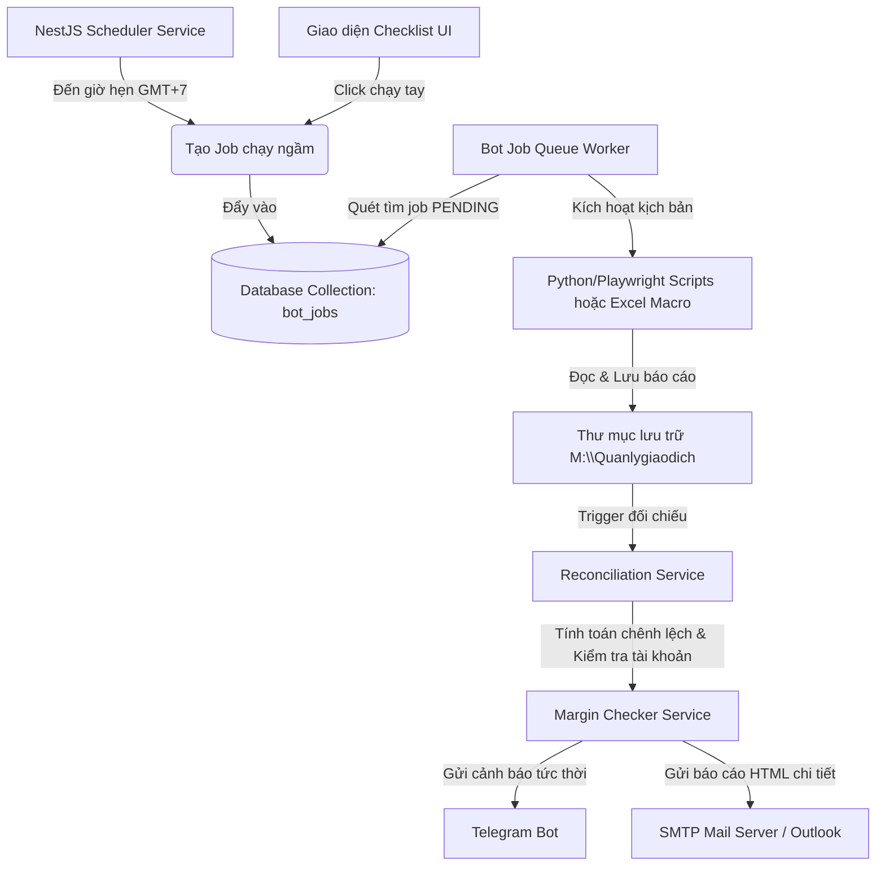

# TÀI LIỆU BÀN GIAO CHI TIẾT
## HỆ THỐNG GIÁM SÁT CA TRỰC & ĐỐI CHIẾU BÁO CÁO TỰ ĐỘNG (MXV SHIFT CHECKLIST)

---

## 1. Giới Thiệu Chung
Hệ thống **MXV Shift Checklist** được phát triển nhằm tự động hóa quy trình giám sát, trực ban và đối chiếu số liệu cuối ngày (Pre-EOD/EOD) cho phòng vận hành giao dịch MXV. Hệ thống thay thế toàn bộ quy trình kiểm tra thủ công, lập lịch chạy bot ngầm, đối chiếu các file báo cáo và tự động gửi báo cáo bàn giao ca qua Telegram/Email.

---

## 2. Kiến Trúc Hệ Thống & Luồng Dữ Liệu

Hệ thống hoạt động theo mô hình **Sự kiện & Hàng đợi công việc (Event-Driven Queue)** tập trung quanh cơ sở dữ liệu MongoDB:



---

## 3. Các Module Cốt Lõi (Backend Services)

### 3.1. Phân Hệ Lập Lịch & Hàng Đợi (`BotJobQueueService` & `SchedulerService`)
* **File**: `backend/src/modules/bot-engine/bot-job-queue.service.ts`
* **Nhiệm vụ**:
  * Định kỳ mỗi phút quét database so sánh thời gian hiện tại theo múi giờ Việt Nam (GMT+7) với giờ hẹn cấu hình của các tác vụ.
  * Tự động đồng bộ và nạp cấu hình mặc định (Smart Seeding) khi khởi chạy mà không ghi đè cấu hình chỉnh sửa của người dùng.
  * Hàng đợi chạy tuần tự (Concurrency = 1) để kiểm soát tài nguyên CPU/RAM khi mở trình duyệt ngầm.

### 3.2. Phân Hệ Đối Chiếu Số Liệu (`ReconciliationService`)
* **File**: `backend/src/modules/reconciliation/reconciliation.service.ts`
* **Nhiệm vụ**:
  * **SOD (Start of Day)**: Đối chiếu số dư tài khoản M-System (`QLTKGD.xlsx`) với CQG Cast (`Accounts_Balances`).
  * **Pre-EOD / EOD Trade & Position**: Khớp chênh lệch số lot giao dịch giữa M-System (`DSGD.xlsx`), Straits CSV, CQG FR, TTTT, và vị thế mở (Open Position).
  * **Negative Margin**: Quét tìm các tài khoản bị âm số dư hoặc âm ký quỹ khả dụng (IMR < 0).

### 3.3. Cổng Gửi Báo Cáo SMTP (`MarginCheckerService`)
* **File**: `backend/src/modules/margin-checker/margin-checker.service.ts`
* **Nhiệm vụ**:
  * Làm trung gian kết nối và xác thực với máy chủ SMTP Mail Server.
  * Đọc cấu hình động `margin_checker_config` để xác định bật/tắt gửi thông báo, danh sách email người nhận (`toEmails`) và Chat ID Telegram cho từng loại báo cáo.

### 3.4. Bàn Giao Ca Trực (`ShiftsService`)
* **File**: `backend/src/modules/shifts/shifts.service.ts`
* **Nhiệm vụ**:
  * Lắng nghe sự kiện chốt ca (`closeShift`). Tự động tính toán tỷ lệ hoàn thành checklist của ca trực, tập hợp các ghi chú vận hành và xuất báo cáo bàn giao ca gửi trực tiếp đến Stakeholders.

### 3.5. Kiểm Toán Hệ Thống (`SystemSettingsService`)
* **File**: `backend/src/modules/system-settings/system-settings.service.ts`
* **Nhiệm vụ**:
  * Lắng nghe bất kỳ thay đổi cấu hình nào trong bảng `settings`. Khi có thay đổi, hệ thống lập tức so sánh giá trị cũ và mới, sau đó gửi email cảnh báo bảo mật (`Security Audit`) đến quản trị viên.

---

## 4. Giao Diện Quản Trị Cấu Hình (Frontend UI)

* **Component**: `frontend/src/app/checklist/components/MarginCheckerModal.tsx`
* Giao diện cung cấp bảng điều khiển trực quan tại tab **Cấu hình** cho phép bật/tắt và quản lý người nhận cho 6 module:

| Tên Module cấu hình | Chức năng báo cáo |
| :--- | :--- |
| **Báo cáo đối chiếu Pre-EOD** | Gửi kết quả khớp lệnh và vị thế lúc 16:30 hàng ngày. |
| **Báo cáo đối chiếu EOD** | Gửi báo cáo đối chiếu số dư đầu ngày lúc 18:00 hàng ngày. |
| **Tài khoản âm ký quỹ** | Gửi danh sách các tài khoản bị âm số dư hoặc âm IMR đầu ngày. |
| **Cảnh báo lỗi Bot ngầm** | Bắn email ngay lập tức khi một bot chạy ngầm bị lỗi vĩnh viễn (Failed). |
| **Báo cáo bàn giao ca trực** | Tự động gửi kết quả checklist ca trực ngay khi nhân sự nhấn đóng ca. |
| **Kiểm toán đổi cấu hình** | Gửi mail ghi nhận lịch sử thay đổi cấu hình hệ thống (SMTP, Thư mục backup...). |

---

## 5. Cấu Trúc Dữ Liệu Database (MongoDB)

### Bảng cấu hình (`settings`):
Lưu trữ thông tin SMTP và cấu hình thông báo của các module dưới dạng JSON blob trong bản ghi có key là `margin_checker_config`.
```json
{
  "smtp": {
    "host": "smtp.outlook.com",
    "port": 587,
    "secure": false,
    "user": "it-support@mxv.vn",
    "pass": "********"
  },
  "modules": {
    "preEodCheck": { "emailEnabled": true, "telegramEnabled": true, "toEmails": ["preeod@mxv.vn"], "telegramChatId": "-100223344" },
    "eodCheck": { "emailEnabled": true, "telegramEnabled": true, "toEmails": ["eod@mxv.vn"], "telegramChatId": "-100223344" },
    "negativeMarginReport": { "emailEnabled": true, "telegramEnabled": true, "toEmails": ["risk@mxv.vn"] },
    "opFailureAlert": { "emailEnabled": true, "telegramEnabled": true, "toEmails": ["it.support@mxv.vn"] },
    "shiftHandoverReport": { "emailEnabled": true, "telegramEnabled": true, "toEmails": ["leaders@mxv.vn"] },
    "securityAudit": { "emailEnabled": true, "telegramEnabled": false, "toEmails": ["admin@mxv.vn"] }
  }
}
```

### Bảng hàng đợi bot (`bot_jobs`):
```typescript
{
  jobType: string;         // RUN_LOT_MACRO, DOWNLOAD_CAST, AUTO_CHECK_SOD, RPA_DOWNLOAD_REPORTS
  status: string;          // PENDING, RUNNING, COMPLETED, FAILED
  attempts: number;        // Số lần đã thử chạy (max = 3)
  payload: Map<string, any>; // Tham số đầu vào (ngày chạy, đường dẫn file...)
  logs: string[];          // Nhật ký ghi log chi tiết lỗi khi chạy
  createdAt: Date;
  updatedAt: Date;
}
```

---

## 6. Hướng Dẫn Vận Hành & Khắc Phục Lỗi

### 1. Bot báo lỗi đỏ trên giao diện Checklist:
* **Nguyên nhân**: File báo cáo chưa được xuất, máy chủ mất mạng, hoặc CQG thay đổi giao diện làm Playwright bị timeout.
* **Cách xử lý**:
  1. Vào database tra cứu collection `bot_jobs` tìm job có trạng thái `FAILED` gần nhất để đọc log chi tiết (`logs`).
  2. Bấm nút **"Chạy lại" (Retry)** trực tiếp trên giao diện checklist để chạy lại bot thủ công mà không cần chờ đến khung giờ tiếp theo.

### 2. Không nhận được Email thông báo:
* **Nguyên nhân**: Thông tin SMTP bị sai hoặc bị tường lửa chặn cổng (port 587/465).
* **Cách xử lý**:
  * Kiểm tra và test SMTP bằng cách thực hiện đổi một cấu hình bất kỳ trong cài đặt hệ thống để trigger email `Security Audit`.
  * Chạy file test kiểm thử tích hợp có sẵn: `npm run test:all-emails` tại thư mục backend để tạo các file preview HTML và kiểm tra luồng gửi mail.
